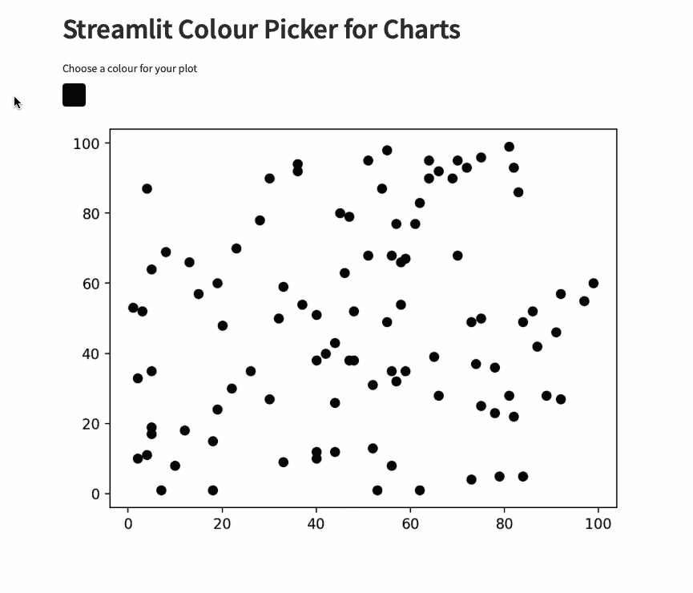
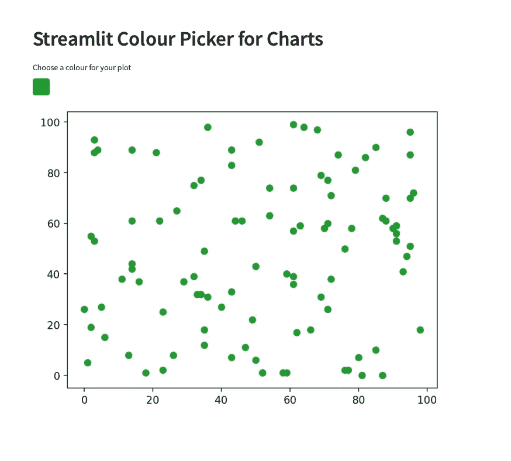

# Streamlit 颜色选择器:在 Streamlit 仪表板上更改图表颜色的简单方法

> 原文：<https://towardsdatascience.com/streamlit-color-picker-widget-an-easy-way-to-change-chart-colours-7929973393ea>

## 为仪表板用户提供更大的灵活性


https://www.pexels.com/photo/person-s-index-finger-977246/斯蒂夫·约翰森摄影:

[Streamlit](https://streamlit.io/) 是一个流行且功能强大的基于 Python 的开源框架，让您可以快速轻松地创建交互式数据科学仪表盘并部署机器学习模型。

Streamlit 的一个有用功能是拾色器工具。这允许您通过让用户选择他们想要的任何颜色而不是使用默认的硬编码颜色来增加您的仪表板的灵活性。

这个简短的教程将向您展示在仪表板中实现 [Streamlit 颜色选择器小部件](https://docs.streamlit.io/library/api-reference/widgets/st.color_picker)有多简单。

如果您是 Streamlit 的新手，那么您可能想看看我以前的 Streamlit 教程，让您有一个良好的开端:

*   [开始使用基于 Streamlit Web 的应用](/getting-started-with-streamlit-web-based-applications-626095135cb8)
*   [创建真正的多页面简化应用——新方式(2022](/creating-true-multi-page-streamlit-apps-the-new-way-2022-b859b3ea2a15)
*   [开始使用 Streamlit:开始使用时需要知道的 5 个功能](/getting-started-with-streamlit-5-functions-you-need-to-know-when-starting-out-b35ed7d872b9)

# 安装 Streamlit

如果您尚未安装 Streamlit 库，可以在终端或命令提示符下使用以下命令。

```
pip install streamlit
```

安装好 Streamlit 之后，我们可以创建一个名为`app.py`的新文件。这是我们添加代码的地方。

# 导入库

第一步是导入多个库: [Streamlit](https://streamlit.io) ， [numpy](https://numpy.org) ，pandas 和 matplotlib。

我们将使用 [numpy](https://numpy.org) 和 [pandas](https://pandas.pydata.org) 来创建一些示例数据，并使用 [matplotlib](https://matplotlib.org) 来生成这些数据的散点图。

```
import streamlit as st
import matplotlib.pyplot as plt
import pandas as pd
import numpy as np
```

# 创建数据

接下来，我们需要以 dataframe 的形式创建一些虚拟数据。

为此，我们首先创建一个由 0 到 100 之间的随机整数组成的 numpy 数组，该数组跨越 100 行和 3 列。这将为我们提供足够的数据来显示在图上。此外，请注意，每次我们使用此功能重新运行应用程序时，数据都会发生变化。如果我们不希望这种情况发生，我们需要添加一行来设置种子。

```
np.random.seed(42)
```

然后，我们将这个数组传递给`pd.DataFrame`，并将字母 A、B 和 C 指定为列名。这使得以后引用这些列变得更加容易。

```
arr_random = np.random.randint(low=0, high=100, size=(100,3)) 

data_to_plot = pd.DataFrame(arr_random, columns=["A","B","C"])
```

# 设置简化页面

下一步是设置我们的 Streamlit 应用程序。对于这个例子，我们将保持它非常基本。

首先，我们将创建一个标题`st.header()`和一个新的变量来存储用户的颜色选择。这个分配给`[st.color_picker()](https://docs.streamlit.io/library/api-reference/widgets/st.color_picker)`。我们需要做的就是传入一个标签名。

```
st.header('Streamlit Colour Picker for Charts')

user_colour = st.color_picker(label='Choose a colour for your plot')
```

要了解更多关于颜色选择器部件的信息，请查看下面的文档页面。

<https://docs.streamlit.io/library/api-reference/widgets/st.color_picker>  

# 设置 Matplotlib 图形

我们现在需要使用 matplotlib 创建我们的图形。这是通过设置`fig`和`ax`变量并将其分配给`plt.subplots()`来实现的。在这个函数中，我们只需要传递 1，1 来表示我们正在创建一个 1 行 1 列的图形。

接下来，我们将调用`ax.scatter`，并将上面创建的`user_colour`变量传递给 c(颜色)参数。

最后，为了让 Streamlit 显示 matplotlib 散点图，我们需要调用`st.pyplot()`并传入`fig`变量。

```
fig, ax = plt.subplots(1,1)
ax.scatter(x=data_to_plot['A'], y=data_to_plot['B'], c=user_colour)

st.pyplot(fig)
```

# 运行 Streamlit 应用

现在基本代码已经写好了，我们可以运行 Streamlit 应用程序了。为此，我们需要在终端中输入以下内容:

```
streamlit run app.py
```

这将在您的默认浏览器中启动 Streamlit。

一旦它启动了，我们将看到我们的颜色选择器工具和 matplotlib 图的基本应用程序。


使用基本的 matplotlib 图形和颜色选择器简化应用程序。图片由作者提供。

要改变颜色，我们需要点击颜色框并选择一种新的颜色。单击颜色选择器框后，图表将会以新的颜色更新。



使用 Streamlit color_picker 更改 matplotlib 点颜色。图片由作者提供。

# 设置默认值以简化拾色器

默认情况下，拾色器将设置为黑色(#000000)。我们可以将自己的十六进制代码传递给`st.color_picker()`函数的值参数。

```
user_colour = st.color_picker(label='Choose a colour for your plot', 
                              value='#1F9A2E')
```

下次启动应用程序时，拾音器的颜色将默认为设置的值。



设置默认颜色后 streamlit 中的 Matplotlib 图形。图片由作者提供。

# 摘要

在这个简短的教程中，我们看到了如何添加一个交互式颜色选择器到我们的 Streamlit 仪表板。这省去了硬编码颜色的麻烦，并允许您为仪表板用户提供更多的灵活性。它实现起来非常简单，可以为你的 Streamlit 作品增加更多的实用性。

*感谢阅读。在你走之前，你一定要订阅我的内容，把我的文章放到你的收件箱里。* [***你可以在这里做！***](https://andymcdonaldgeo.medium.com/subscribe)**或者，您也可以* [***注册我的简讯***](https://fabulous-founder-2965.ck.page/2ca286e572) *免费将更多内容直接发送到您的收件箱。**

*其次，通过注册会员，你可以获得完整的媒介体验，并支持我和其他成千上万的作家。每月只需花费你 5 美元，你就可以接触到所有精彩的媒体文章，也有机会通过写作赚钱。*

**如果你用* [***我的链接***](https://andymcdonaldgeo.medium.com/membership)**报名，你直接用你的一部分费用支持我，不会多花你多少钱。如果你这样做了，非常感谢你的支持***