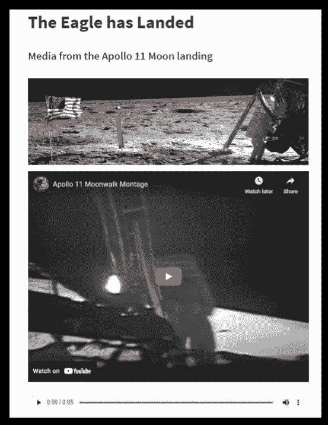
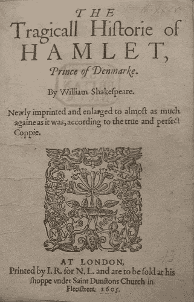

# 从头开始简化:嵌入图像、视频和音频

> 原文：<https://towardsdatascience.com/streamlit-from-scratch-embedding-images-video-and-audio-8b2e8b98fad4>

## Streamlit 旨在帮助数据科学家，但它不仅仅是关于数据，向您的应用程序添加媒体有助于交流您的想法


*公共领域图片，由 NASA 提供*

在本系列的第一部分 [*入门*](/streamlit-from-scratch-getting-started-f4baa7dd6493) 中，我们看到了如何设置 Streamlit 开发环境，以及使用不同类型的文本创建一个简单的 web 应用程序是多么容易。

这一次，我们将看看如何通过不同的媒体(图像、视频和声音)来增强我们的应用程序，同时，我们将了解一些如何布局 Streamlit 应用程序的信息。

我们将创建两个不同的应用程序。第一个将我们从最初的莎士比亚主题向前推进了几个世纪，到 1969 年的登月；这是一个简单的一个图像，一个视频和一个带有少量文本的音频文件的汇编。没有布局，因此每个元素都是一个放在另一个上面。

看起来是这样的:



第二个应用恢复了莎士比亚的主题，也结合了图像、视频和音频，但这一次，采用了分栏布局。它看起来会像这样:


# App 1:老鹰着陆了

1969 年 7 月 16 日上午，阿波罗 11 号的宇航员尼尔·阿姆斯特朗、巴兹·奥德林和迈克尔·科林斯即将从肯尼迪航天中心发射升空。他们的任务是引领历史上最著名的事件之一:首次登月。

在这里，我们将了解如何将该任务中的各种媒体文件整合到 Streamlit 应用程序中。

Streamlit 提供的函数`st.image()`包括图形，`st.video()`用于视频，包括本地或 Youtube 视频，`st.audio()`用于音频，它们都支持各种格式的媒体。

我们将使用的图像显示阿波罗 11 号指挥官尼尔·阿姆斯特朗在月球行走期间在登月舱的设备储存区工作。


*公共领域图片由 NASA 提供*

您可以像这样将它包含在您的 Streamlit 应用程序中:

```
st.image('https://www.nasa.gov/sites/default/files/styles/ubernode_alt_horiz/public/images/464487main_AS11-40-5886_full.jpg',
        caption = "Public domain image, courtesy of NASA")
```

这个视频是关于月球漫步的，以今天的标准来看质量很差，但这并不奇怪，因为它最初是在 1969 年拍摄的！

*2009 年部分恢复的阿波罗 11 号月球漫步的镜头，公共领域，由 NASA 和 Youtube 提供*

```
st.video('https://youtu.be/hxPbnFc7iU8')
```

最后，音频是阿姆斯特朗向休斯顿任务基地发出的著名的“鹰已经着陆”的信息。

*这首歌来自 NASA 的 Soundcloud 频道。*

源文件如下面的`st.audio()`语句所示。

```
st.audio("https://www.nasa.gov/mp3/569462main_eagle_has_landed.mp3")
```

整个代码只有六行，生成了上面显示的应用程序。

以下是完整的代码:

```
import streamlit as st
st.title('The Eagle has Landed')
st.header('Media from the Apollo 11 Moon landing')
st.image('https://www.nasa.gov/sites/default/files/styles/ubernode_alt_horiz/public/images/464487main_AS11-40-5886_full.jpg')
st.video('https://youtu.be/hxPbnFc7iU8')
st.audio("https://www.nasa.gov/mp3/569462main_eagle_has_landed.mp3")
```

# App 2:哈姆雷特的悲剧转变

上次我们离开了莎士比亚的悲剧英雄哈姆雷特，在他著名的独白中考虑是否结束自己的生命。我们将使用一些额外的材料来扩展该应用程序——一个图像、一个视频和一个音频轨道——并将其分为两栏。

我们将使用的图片来自维基媒体，是戏剧《哈姆雷特》的宣传单。



*未知来源，公共领域，通过维基共享*

您可以像这样将它包含在您的 Streamlit 应用程序中:

```
st.image('https://upload.wikimedia.org/wikipedia/commons/d/df/Hamlet.jpg', 
        use_column_width=True,
        caption = "Unknown source, Public domain, via Wikimedia Commons")
```

这个视频是一个滑稽的小品，几个著名的演员试着告诉对方著名的“生存还是毁灭……”台词应该怎么说。出乎意料的是，他们被查尔斯王子抢了风头(当时他是这样的)。

*视频由 PBS 和 Youtube 提供。(如果你在英国，有机会接触到 BBC iPlayer，就去寻找它的原版和更长的版本——它非常有趣。)*

```
st.video('https://youtu.be/sw_zDsAeqrI')
```

最后，音频是柴可夫斯基受戏剧《哈姆雷特》启发创作的音乐作品。这是一个。ogg 文件，不能简单地在这里复制，但你可以在维基媒体网站上找到它:

[https://upload . wikimedia . org/Wikipedia/commons/3/3b/柴可夫斯基-哈姆雷特 _ Op67 _ vs _ Kosma-feuillesmortes . ogg](https://upload.wikimedia.org/wikipedia/commons/3/3b/Tchaikovsky-Hamlet_Op67_vs_Kosma-FeuillesMortes.ogg)—*摘自彼得·伊维奇·柴可夫斯基 1888 年创作的《哈姆雷特 Op. 67》序曲。通过维基媒体进入公共领域*

```
st.audio("https://upload.wikimedia.org/wikipedia/commons/3/3b/Tchaikovsky-Hamlet_Op67_vs_Kosma-FeuillesMortes.ogg")
```

完整的代码比第一个应用程序要长，因为有更多的文本，我们使用了列布局。

我们用行创建两列:

```
col1, col2 =  st.columns(2)
```

对`st.columns`的调用返回一个列的列表，我们将这些列分配给两个变量`col1`和`col2`。我们在`with`语句中使用列——例如，`with col1:`块中的所有代码都将显示在屏幕左侧的一列中。

在下面的代码中，您可以看到我们首先显示了一个标题和一些其他文本。接下来是包含图像的第一列的代码，然后是包含哈姆雷特独白文本和视频的第二列。

在这两列代码之后，我们有更多的文本，后面是音频文件，每个文本都显示在页面的整个宽度上。

完整的代码如下:

哈姆雷特应用程序

Streamlit 中的媒体就是这样。在以后的文章中，我们将探讨如何使用 Streamlit 布局功能来开发一个应用程序，以一种高效和令人愉快的方式整合多个元素。我们还将探索在 Streamlit 应用程序中表示数据的各种方式，从表格到可视化。

感谢您的阅读——我希望您发现它很有用。你会发现所有 Streamlit from Scratch 文章的链接，以及从[*Streamlit from Scratch*](https://alanjones2.github.io/streamlitfromscratch/)网站下载所有代码的链接，包括这段代码。

我的 [Github 页面](/alanjones2.github.io)包含其他文章和代码的链接。

[](https://alan-jones.medium.com/membership) [## 通过我的推荐链接——阿兰·琼斯加入 Medium

### 阅读阿兰·琼斯的每一个故事(以及媒体上成千上万的其他作家)。你的会员费直接支持艾伦…

alan-jones.medium.com](https://alan-jones.medium.com/membership) 

为了跟上我正在做的事情，你也可以订阅我偶尔的免费时事通讯 [Technofile](/technofile.substack.com) 。

## 参考

本文中使用的各种 Streamlit API 参考资料可以在下面找到。

[圣像](https://docs.streamlit.io/library/api-reference/media/st.image)

[st.audio](https://docs.streamlit.io/library/api-reference/media/st.audio)

[圣视频](https://docs.streamlit.io/library/api-reference/media/st.video)

[圣马克降价](https://docs.streamlit.io/library/api-reference/media/st.markdown)

[圣柱](https://docs.streamlit.io/library/api-reference/layout/st.columns)