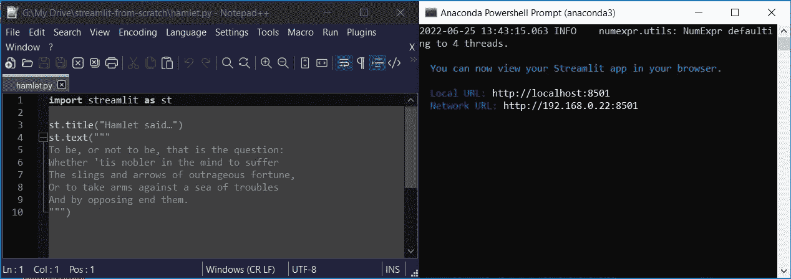
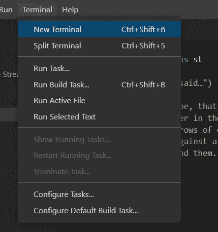
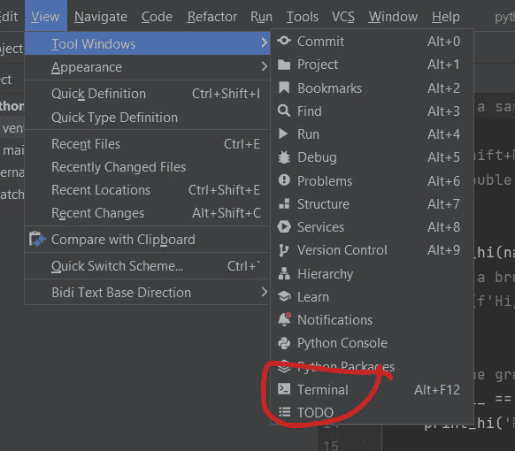
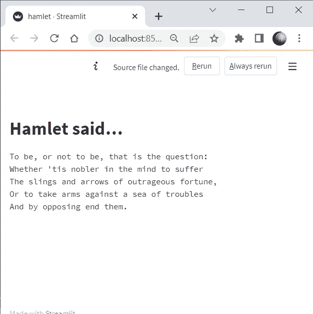

# 从头开始简化:入门

> 原文：<https://towardsdatascience.com/streamlit-from-scratch-getting-started-f4baa7dd6493>

## 寻找您需要的工具以及如何使用它们来创建您的第一个 Python 和 Streamlit 交互式 web 应用程序


Katie Rodriguez 在 [Unsplash](https://unsplash.com?utm_source=medium&utm_medium=referral) 上的照片

Streamlit 是一个用纯 Python 创建简单优雅的 web 应用程序的框架。它主要面向数据科学家和分析师，但也可以用作创建 web 应用程序的通用框架。

不需要 HTML 或 Javascript 知识。事实上，您几乎不需要任何 Python 知识就可以创建一个简单的 web 页面！

这是一系列文章中的第一篇，在这些文章中，我们将发现如何使用 Streamlit 来创建任何东西，从简单的基于文本的网页到复杂的、具有数据可视化的交互式仪表板。

首先，我们看看如何开始，我们需要下载哪些工具(并不多)，以及如何编辑和运行您的第一个 Streamlit 应用程序。

# 入门指南

下面是一个仅包含文本的简单网页的代码:

```
import streamlit as st

st.title("Hamlet said…")
st.text("""
To be, or not to be, that is the question:
Whether 'tis nobler in the mind to suffer
The slings and arrows of outrageous fortune,
Or to take arms against a sea of troubles
And by opposing end them.
""")
```

*清单 1 — hamlet.py*

它看起来像这样:


不是特别令人兴奋，但是它显示了制作一个简单的网页是多么容易。

在这个系列中，我们将做更多的工作，创建交互式的 web 应用程序，包括 Pandas、Plotly 等中的数据可视化。

但是首先，我们需要安装工具。

# 安装 Python 和 Streamlit

我们需要在我们的计算机上安装 Python，当然，也需要 Streamlit。我们还需要一个编辑器来创建我们的应用程序和一个浏览器来运行它们。

获得 Python 的最简单方法之一是安装 Anaconda 发行版。Anaconda 由一个最新版本的 Python 和一大堆库组成。这是一个相当大的安装，但是通过使用 Anaconda，您可以省去以后手动安装这些库的麻烦。主要的替代方法是从他们的网站上安装官方的 Python 发行版。

Python 网站总是包含最新版本的 Python。如果下载 [Anaconda](/anaconda.com) ，可能得不到最新版本。但这并不是一件坏事，因为虽然它可能不是最新的，但你肯定会得到一个与它附带的所有库都兼容的版本。

当 Python 的新版本发布时，库发行版有时需要一段时间才能跟上，所以虽然从[python.org](/python.org)安装会给你最新版本，但 [Anaconda](/anaconda.com) 版本可能是最安全的(当然，你也可以从[python.org](/python.org)获得旧版本)。

因此，请访问 Anaconda 或 Python 网站，下载并安装适合您机器的版本。我不建议安装这两个，除非你想混淆你的操作系统和你自己(它**是有可能安装这两个，如果你行使一些小心，但没有多大意义)。如果你不能决定选择哪一个，选择 Anaconda——这是 Streamlit 的人推荐的。**

无论您选择哪一个，您仍然需要安装 Streamlit。

从命令窗口(如果您已经安装了 Anaconda，请使用它)运行命令:

```
pip install streamlit
```

# 编辑

几乎任何编辑器都适合编写 Streamlit 应用程序。如果你已经是一名 Python 程序员，那么你已经有了自己的最爱——可能是 ide、VSCode 或 PyCharm 中的一个——但是一个简单的通用编辑器，如 **Sublime Text** 或 **Notepad++** 也完全足够了。

当我们运行普通的 Python 程序时，我们发出以下命令:

```
# This won't work with Streamlit
python myprogram.py
```

而 VSCode 和 PyCharm 之类的 ide 在运行 Python 程序时就假设了这一点。然而，运行 Streamlit 应用程序所需的命令是:

```
# This how to run a Streamlit app
streamlit run myprogram.py
```

其结果是，VSCode 或 PyCharm 中的标准“运行”命令不适用于 Streamlit 应用程序。

最简单的方法是在命令窗口中键入正确的命令。这可以是编辑器外部的，比如 Anaconda 提示符，或者是操作系统内置的终端窗口。

如果你使用一个简单的编辑器，比如 Sublime Text 或者 Notepad++这是最好的方法。您可以修改这两个编辑器来添加一个终端窗口(Sublime)或添加一个 commad 来运行您的应用程序(Notepad++ ),但最简单的方法是使用 Anaconda 提示符(或 Powershell 提示符)窗口(如果您安装了 Anaconda ),或者使用您的操作系统的标准终端窗口(如果您安装了标准 Python)。

这里是 Sublime Text 和 Notepad++编辑器与 Anaconda Powershell 提示符并排的屏幕截图。



如果你是一个经验丰富的 Python 程序员，已经安装了你喜欢的 Python 版本并使用 VSCode 或 PyCharm，你可以在你的 IDE 中使用一个终端窗口。在 VSCode 中有一个终端菜单选项，您可以在其中打开一个新的终端



在 PyCharm 中，进入视图菜单，在工具窗口中找到终端选项。



因此，要从这些 ide 中的一个运行您的程序，请在终端窗口中键入 run 命令。

***警告…*** *如果您使用的是标准 Python 安装，最好只使用内置终端。如果您已经安装了 Anaconda，这可能无法很好地与 VSCode 或 PyCharm 一起工作，因为默认终端可能无法找到 Anaconda Python 安装。有很多方法可以解决这个问题，但这超出了我们的讨论范围。如果您正在使用 Anaconda，那么无论您使用哪种编辑器/IDE，使用 Anaconda 提示符来运行您的应用程序可能都是最简单的。*

# 您应该使用哪个编辑器

VSCode 和 Pycharm 是相当复杂的 ide。VSCode 是一个通用工具，可以用插件定制，以支持许多不同的语言。PyCharm 比 VSCode 更有能力，但它致力于 Python 编程。

Sublime Text 使用简单，下载和安装快捷，但不是免费的:你可以下载免费试用版，但需要支付许可费。话虽如此，试用永不过期。

Notepad++的用户界面可能比 Sublime 稍微忙一点，但是它也是一个非常强大的编辑器，并且是完全免费的。

Sublime 和 Notepad++都支持 Python 代码的颜色高亮，这很好。当然，VSCode 和 PyCharm 也是如此。

如果你已经是 VSCode 或者 PyCharm 的用户，那么最好的办法就是继续使用它们，但是如果你没有，那么 Sublime Text 或者 Notepad++可能更容易上手。

我们还需要一个工具来运行 Streamlit 应用程序，那就是 Chrome、Firefox 或 Edge 等浏览器。但我想你已经有一个了。

现在我们有了所有的工具，我们准备创建我们的第一个 Streamlit 应用程序。

# 编辑和运行“你好哈姆雷特”

几十年来,“Hello World”一直是任何人用任何语言编写的第一个传统程序——它只是在屏幕上显示“Hello World”。我第一次接触到它是在 Brian W. Kernighan 和 Dennis M. Ritchie 的《C 编程语言》一书中，该书的第一版于 1978 年出版(尽管我的那本书是 10 年后出版的第二版)。

我们已经看过了我们的第一个节目:哈姆雷特。但它相当于“Hello World ”,因为它只是写一些文本。

我将在这里重复一遍，这样我们就可以浏览一下它是如何工作的解释。

```
import streamlit as st

st.title("Hamlet said…")
st.text("""
To be, or not to be, that is the question:
Whether 'tis nobler in the mind to suffer
The slings and arrows of outrageous fortune,
Or to take arms against a sea of troubles
And by opposing end them.
""")
```

*清单 1 — hamlet.py*

这是你能想到的最简单的 Streamlit 程序之一。它只写两个字符串—一个格式化为标题，另一个格式化为预先格式化的文本。

Python 程序员对第一行很熟悉；它导入了一个 Python 库 Streamlit 库。众所周知，Python 库是一个包含有用函数的代码包，这些函数可以集成到 Python 程序中。在这种情况下，Streamlit 库包含了将简单的 Python 程序转换为 web 应用程序的所有功能，并为我们提供了大量的功能，允许我们构建 web 应用程序并使其看起来不错。

Streamlit 库以名称`st`导入，因此我们从该库中使用的所有函数都以该名称开头。

我们使用两个 Streamlit 函数:`st.title()`用大号粗体格式显示文本，而`st.text()`显示预先格式化的文本。

对于不熟悉 Python 的人来说，有四种引用字符串的方法。我们可以使用单引号或双引号，比如`'To be or not to be...'`，或者`"To be or not to be..."`，但是这些字符串必须都在一行上。或者，我们可以像这样使用三重引号:

```
'''To be or not to be,
   that is the question'''
```

或者

```
"""To be or not to be,
   that is the question"""
```

用三重引号括起来的字符串可以超过一行。

要运行该程序，请键入上面看到的文本，然后在终端中运行

```
streamlit run hamlet.py
```

终端将以类似于以下内容的消息进行响应:


然后，您的默认浏览器将启动 Streamlit 生成的网页。(如果由于某种原因它没有自动启动，那么只需将终端窗口中给出的 URL 剪切并粘贴到浏览器的地址栏中。)

Streamlit 的一个优点是它知道您何时对代码进行了更改。如果您编辑并保存了您的程序，那么网页将显示重新运行应用程序的选项。当您这样做时，将显示新版本。

尝试更改文本，然后保存。在您的浏览器中，您会看到邀请您重新运行该应用程序。



点击*重新运行*按钮，您将看到反映您所做更改的更新网页。

# 更多显示文本的方式

我们已经使用了`st.text()`来显示哈姆雷特的演讲，但是还有其他显示文本的方式。这是哈姆雷特节目的扩展版本。

它使用`st.caption()`在报价下显示小字体标题，然后使用`st.header()`、`st.subheader`和`st.write`显示关于报价的一些评论。

我确信你能猜到这些会做什么。页眉有大而粗的字体，但比标题小；副标题类似，但更小；`st.write`显示“正常”文本。

您应该注意的一点是，与`st.text()`不同，`st.write()`不保留字符串中文本的布局。

```
import streamlit as st

st.title("Hamlet")

st.text("""
To be, or not to be, that is the question:
Whether 'tis nobler in the mind to suffer
The slings and arrows of outrageous fortune,
Or to take arms against a sea of troubles
And by opposing end them.
""")

st.caption("Hamlet by William Shakespeare, Act 3, Scene 1")

st.header("Hamlet's soliloquy")
st.subheader("The famous speech from the 'Nunnery scene'")
st.write("""In the speech, Hamlet considers suicide, but considers     
            that the alternative to his unhappy life might be even
            worse.""")
```

*清单 2 — hamlet2.py*

你可以在下面的截图中看到结果。


为了完整起见，我们还应该提到另外两种显示文本的方式。

对于程序员来说，有`st.code()`。这将显示文本，就像它是程序代码一样。例如:

```
st.code("""
if hamlet == "The Prince of Denmark":
    print("That's our man!")
else:
    print("This is an imposter")
""")
```


Streamlit 中格式化的代码—按作者排序的图像

你可以看到像`if`和`else`这样的词被突出显示为关键词。该块有彩色背景，如果您将光标放在该块上，您将看到一个复制文本的图标。

如果你需要显示像数学公式这样的字符串，你可以使用`st.latex()`，例如

```
st.latex(" \int f^{-1}(x-x_a)\,dx")
```

显示以下内容:


# 降价

Markdown 让我们可以更好地控制文本的格式。你可能很熟悉。正如维基百科所说，“Markdown 是一种使用纯文本编辑器创建格式化文本的轻量级标记语言”。它允许你定义标题，代码块，合并链接等等。它还允许您合并 HTML。

不出所料，在应用程序中整合降价文本的 Streamlit 代码是`st.markdown()`。这里有一个例子:

```
st.markdown("""## This is a third level header
               And this is normal text. 
               *This is emphasized*.
               """)
```

它会这样呈现:

# 这是一个副标题

这是普通文本。*这是强调的*。

我不打算深入 Markdown 语言的细节，因为这里有一个很好的综合指南。

Streamlit 不允许在 Markdown 中嵌入 HTML，除非设置了特定的参数，例如

```
st.markdown("<h3>Header 3</h3>", unsafe_allow_html=True)
```

该参数的目的是向程序员强调，包含 HTML 代码可能是不安全的。

但这意味着我们可以用包含 HTML 的 Markdown 来替换我们的`st.text()`报价，以获得我们想要的格式。

```
st.markdown("""
    "To be, or not to be, that is the question:<br/>
    Whether 'tis nobler in the mind to suffer<br/>
    The slings and arrows of outrageous fortune,<br/>
    Or to take arms against a sea of troubles<br/>
    And by opposing end them."
    """, unsafe_allow_html=True)
```

`<br/>` HTML 标签插入了一个换行符，因此给了我们和以前一样的布局，但是使用了标准字体，而不是`st.text()`使用的 monotype 字体:

生存，还是毁灭，这是一个值得考虑的问题:究竟是忍受命运的无情打击，还是拿起武器去面对无尽的烦恼，并以反抗来结束它们，这两种选择哪个更高尚？"

# 一点互动

Streamlit 通过使用菜单、按钮、滑块等为我们提供了许多与用户交互的方式。我们稍后会更详细地看这些，但是为了让你有个感觉，我们会写一个简单的程序来选择一段莎士比亚的作品来展示。

下面的代码使用一组单选按钮的值来决定显示哪个报价。如果选择“第十二夜”,变量`text`被设置为一个引号，否则，如果选择“哈姆雷特”,变量`text`被设置为不同的引号。

功能`st.radio()`用于选择一个值。它的参数是一个用作提示的字符串，后跟一个用于标记单选按钮的字符串值列表。该函数返回选择的值。

```
import streamlit as st

quote = st.radio("Select a quote from...",('Hamlet', 'Twelfth Night'))

if quote == 'Twelfth Night':
    text = """
    If music be the food of love, play on;
    Give me excess of it, that, surfeiting,
    The appetite may sicken, and so die.
    """
elif quote == "Hamlet":
    text = """
    To be, or not to be, that is the question:
    Whether 'tis nobler in the mind to suffer
    The slings and arrows of outrageous fortune,
    Or to take arms against a sea of troubles
    And by opposing end them.
    """

st.title(quote)
st.text(text)
```

这是它看起来的样子:


当用户选择“哈姆雷特”或“第十二夜”时，整个程序重新运行，以便执行 if 语句并显示适当的引用。

这是 Streamlit 的一个重要方面:每当用户与一个程序交互时，它都将从头开始运行，并重新加载网页。

# 结论

在第一篇文章中，我们已经了解了如何设置编辑和运行 Streamlit 应用程序，以及如何编写显示不同类型文本的应用程序。作为额外的收获，也作为对未来事物的尝试，我们还研究了一些简单的用户交互，允许用户改变程序的行为。

在未来的文章中，我们将看到更多与用户交互的方式，如何显示图像和图表，如何使用列和容器设计和布局 Streamlit 应用程序等等。

感谢您的阅读——我希望您发现它很有用。你会发现所有 Streamlit 从头开始文章的链接和下载所有代码的链接，包括这个，来自 [***Streamlit 从头开始***](https://alanjones2.github.io/streamlitfromscratch/) 网站。

我的 [Github 页面](/alanjones2.github.io)包含其他文章和代码的链接。

[](https://alan-jones.medium.com/membership)  

为了跟上我正在做的事情，你也可以订阅我偶尔的免费时事通讯 [Technofile](/technofile.substack.com) 。

# 笔记

1.  所有图片，除非特别注明，均为作者所有。

2.本文中使用的各种 Streamlit API 参考资料可以在下面找到。

[圣题](https://docs.streamlit.io/library/api-reference/media/st.title)

[st.header](https://docs.streamlit.io/library/api-reference/media/st.header)

[st.subheader](https://docs.streamlit.io/library/api-reference/media/st.subheader)

[圣写](https://docs.streamlit.io/library/api-reference/media/st.write)

[圣文](https://docs.streamlit.io/library/api-reference/layout/st.text)

[st.latext](https://docs.streamlit.io/library/api-reference/layout/st.latext)