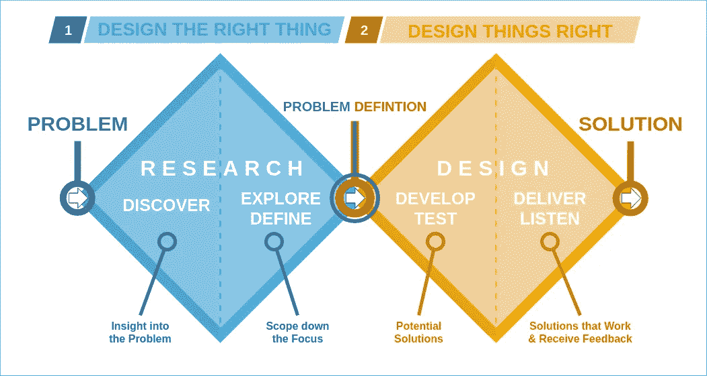

# 构建您的数据科学项目—双菱形模型

> 原文：<https://towardsdatascience.com/structure-your-data-science-project-the-double-diamond-model-3dfbf64e129a>

## 双钻石模型规定了研究和设计阶段的发散和收敛思维。随着高达 85%的数据科学项目失败，结构化设计流程比以往任何时候都更有必要。

巴斯·范·登·埃克霍夫在 [Unsplash](https://unsplash.com?utm_source=medium&utm_medium=referral) 上拍摄的照片

数据科学发生在**编程、数学和商业的复杂交叉点**。众所周知，独角兽是所有这些领域的大师，但实际上，成为一个领域的大师并精通其他领域是你所能期望的最好结果。

数据科学通常也不是单独完成的事情。使用数据和算法解决业务问题，最终结果被转化为见解或工具。项目有**多个涉众**，目标可能相互冲突。

在如此复杂的环境下，失败率相当高也就不足为奇了。事实上，Gartner 估计**60–85%的数据科学项目失败**，从未投入生产。

也许你从经验中认识到以下一些问题:

*   数据科学家**不断调整超参数**以实现增量改进，从未停下来想一想他们预测了什么或为什么。
*   管理者提出**模糊而宽泛的问题定义**，归结为*‘用我们的数据做点什么’*或*‘实现人工智能’*。
*   开发人员交付的模型不符合最终用户的期望，缺乏解决业务问题的实用性。

还有很多问题要列出来，但思路是清晰的。最终，缺乏一致性会导致挫败感，浪费每个相关人员的宝贵时间和资源。

# 双钻石:研究第一，设计第二

通过采用**结构化设计流程**，数据科学项目的成功机会可以大大提高。特别是，应避免以下陷阱:

*   忽略问题导向阶段
*   不听取相关利益相关者及其反馈
*   没有探索不同的解决方案角度就投入设计
*   在没有明确绩效指标的情况下启动项目
*   试图解决一个宽泛或模糊的问题

进入双钻石模型。这个模型源于语言学家 Béla Bánáthy 提出的**发散-收敛模型**，随后由英国设计委员会完善。双菱形将一个项目分为两个阶段(I .研究和 II。设计)，各有两个子阶段:**发现**，**定义**，**开发**，**交付**。

该模型强调了同时运用发散思维和收敛思维的必要性。**发散思维**需要从多个角度仔细评估问题和解决方案设计，旨在获得深入和/或广泛的理解。**聚合思维**需要保持专注并提供合适的解决方案，强调行动和进展。

双钻石模型的可视化。该模型由研究阶段和设计阶段组成，这两个阶段又可分为发散和收敛子阶段[图片来自 Digi-ark 的[维基百科](https://en.wikipedia.org/wiki/Double_Diamond_(design_process_model)#/media/File:Double_diamond.png)

让我们更详细地了解四个子阶段。

*   **发现:**通过与相关的利益相关者交流，以及研究适当的文献和相关的问题设置，对问题形成牢固的理解。
*   **定义:**利用发现过程中获得的洞察力，设定相关的现实问题范围。这个子阶段应该以一个具体的和明确划分的问题定义结束。
*   开发:为问题设计多种解决方案。相关项目和与其他数据科学家的合作有助于使用各种技术处理和解决问题。
*   **交付:**在小范围内测试各种解决方案，反复选择和改进最适合解决问题的解决方案。使用成功标准来指导方法选择。

当然，解决方案设计的确切性质将取决于项目的背景和性质。该方法背后的主要理念是在(I)探索和仔细分析和(ii)批判性选择和定义之间交替进行。不管是什么项目，这种哲学都是适用的，并且有助于以结构化的方式解决问题。

# 分散思维

为了鼓励数据科学项目中的发散思维，以下概念可能是相关的:

*   数据探索(例如，可视化、统计摘要、缺失数据映射)
*   利益相关者访谈(最终用户期望、管理目标、数据可用性、技术限制)
*   头脑风暴(小组讨论、公开讨论)
*   脑力写作(个人反思，稍后讨论)
*   相关问题的文献研究
*   从其他领域的问题中获得灵感
*   重组现有的工具和脚本来解决问题

由 [Unsplash](https://unsplash.com?utm_source=medium&utm_medium=referral) 上的[记者](https://unsplash.com/@perloov?utm_source=medium&utm_medium=referral)拍摄

# 聚合思维

在聚合思维中，以下概念可能适用:

*   从业务角度定义关键绩效指标
*   聚类潜在解决方案方法
*   定义和加权选择标准
*   根据选择标准得出解决方案排名
*   根据相关指标比较小规模解决方案
*   从结构上排除表现不佳的解决方案
*   微调和改进顶级解决方案方法
*   将利益相关者的反馈纳入产品设计
*   映射可用和必需的数据以解决问题

# 又一扇敞开的门？

像双钻石这样的商业模式的问题是，它们乍一看似乎很明显，甚至微不足道。然而，实践一次又一次地证明，项目失败是由于**可避免的问题**。过程模型的价值在于它们为结构化思维提供了一个**框架**，因此减少了犯常见错误的机会。

以下**常见经验**可从模型中得出，适用于大多数数据科学问题:

*   在进入设计阶段之前，留出足够的时间来研究问题。
*   确保利益相关方之间的一致性，包括管理层、数据科学家和最终用户。
*   充分界定问题范围，并在适当的时候转向具体的解决方法。

回答**以下问题**有助于指导设计过程:

*   问题定义是否清晰具体？是否有可衡量的标准来定义成功或失败？
*   在指定的时间框架内解决定义的问题在技术上是否可行？设想的解决方案方法所需的数据是否可用？
*   所有相关的涉众都同意问题定义、绩效指标和选择标准吗？
*   预期的技术解决方案是否解决了最初的业务问题？

如上所述，每个项目和每个环境都是不同的。盲目应用任何模型都不是好主意，双钻石模型也不例外。然而，意识到发散和收敛思维是有价值的，掌握这些过程肯定会提高你的项目的成功率。

# 进一步阅读

Bánáthy，贝拉·h(1996 年)。在不断变化的世界中设计社会系统。斯普林格我们。第十五页，372。【https://link.springer.com/book/10.1007/978-1-4757-9981-1 号

 [## 双菱形(设计过程模型)-维基百科

### 从维基百科，免费的百科跳转到导航跳转到搜索双菱形是一个设计过程的名称…

en.wikipedia.org](https://en.wikipedia.org/wiki/Double_Diamond_%28design_process_model%29)  [## 创新的框架是什么？设计委员会的进化双钻石

### 设计委员会的创新框架帮助全球的设计师和非设计师解决一些最…

www.designcouncil.org.uk](https://www.designcouncil.org.uk/news-opinion/what-framework-innovation-design-councils-evolved-double-diamond)  [## 如何提高数据科学项目的成功率

### 绝大多数数据科学项目注定要失败。但根据布莱斯·马谢尔的说法，它们并不一定如此…

www.techtarget.com](https://www.techtarget.com/searchbusinessanalytics/feature/How-to-increase-the-success-rate-of-data-science-projects#:~:text=In%202016%2C%20Gartner%20estimated%20that,real%20number%20is%20around%2085%25)