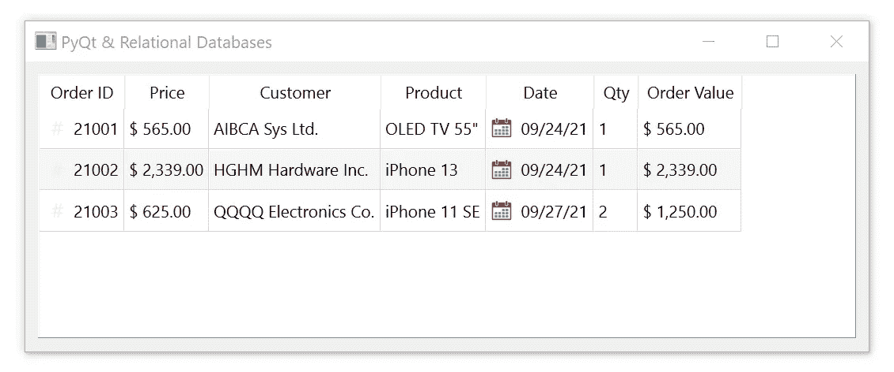
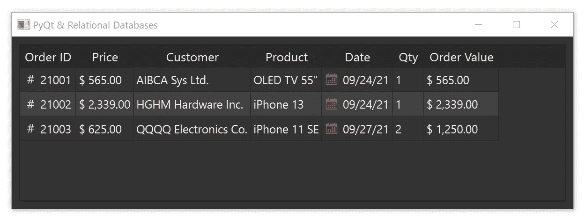

# 像专业人士一样设计您的数据应用

> 原文：<https://towardsdatascience.com/style-your-data-app-like-a-pro-2393861ca3e0>

## 大蟒

# 像专业人士一样设计您的数据应用

## 使用 PyQt 为任何平台设计您的应用程序


在 [Unsplash](https://unsplash.com?utm_source=medium&utm_medium=referral) 上由 [Manuel Pappacena](https://unsplash.com/@manupappa?utm_source=medium&utm_medium=referral) 拍照

你曾经希望你的数据应用仪表板看起来像奔驰著名的 MBUX 仪表板吗？

您知道开发人员使用 Qt 框架来创建其令人惊叹和清晰的设计吗？

你可以做得一样好，甚至更好。你会惊讶于它是多么的不费力。

## Qt 框架

PyQt 是一个非常流行的 Python 绑定，用于 Qt 跨平台 C++框架，可以在 Windows、Linux、Mac OS X 和各种 UNIX 平台上工作，现在可以在 Android 和 iOS 上运行。

Qt 框架的用例超越了桌面应用，从移动设备、MCU、物联网到嵌入式设备。

因此，它的声誉增加，并传播了数百万设备和应用背后的领先独立技术。

此外，Qt 正被用于消费电子、自动化、医疗设备、汽车等许多行业。

举个例子，**奔驰的**名为 **MBUX** 的高级数字驾驶舱 UI 就是用 Qt 打造的。

## 设计我的应用程序

在我们现在生活的数据科学、机器学习(ML)和人工智能(AI)的世界中，数据表示及其风格经常被遗忘或被赋予较低的优先级。

毫不奇怪，数据获取和预处理、不同类型的学习、分类和算法让开发人员非常忙碌。

开发人员可以从几个 web 框架中进行选择，以帮助他们进行数据表示。

web 框架很好，但是对于桌面或者移动范围之外的应用程序，他们不得不寻找替代的解决方案。

这就是 PyQt 派上用场的地方。

有两种基本方法来设计 PyQt 应用程序的样式。首先是使用类似于基维语的 **QML** 语；第二是用类似 CSS 的 **QSS** 语言进行样式化。

由于种种原因，在数据应用的情况下，我更喜欢后者。

## PyQt 和数据库

您可能想知道 PyQt 如何处理数据库。

很好。在所有积极维护的 Python 桌面 GUI 框架中，它最适合处理数据库

要了解 PyQt 在处理数据库方面有多方便，请查看我的 PyQt &关系数据库系列。


斯特凡·梅洛

## PyQt &关系数据库系列

[View list](https://melo-stefan.medium.com/list/pyqt-relational-databases-series-9ded67b27631?source=post_page-----2393861ca3e0--------------------------------)6 stories

它还将帮助您使用本文中作为样式示例的应用程序代码。

## 无样式应用程序

作为一个例子，我们将使用前面提到的 PyQt &关系数据库系列文章中的关系表。

如下图所示。



作者图片

我们可以在枯燥的表格中看到一些格式良好的数据。

你是对的；我同意这一点也不令人兴奋。我们现在就要做点什么。

## 使用 QSS 样式表的样式

我们可以使用样式表定制 Qt 部件。然而，重要的是要认识到 Qt 样式表( **QSS** )对于 Qt 小部件和层叠样式表( **CSS** )对于 HTML 是一样的。

首先，我们将修改现有代码的初始化部分。

```
if __name__ == "__main__": app = QApplication(sys.argv) ***# Open the style sheet file and read it*
    with open('style.qss', 'r') as f:
        style = f.read()** ***# Set the current style sheet*
    app.setStyleSheet(style)** if not createConnection():
        sys.exit(1) form = MainWindow()
    form.show()
    app.exec()
```

就这么简单。我们打开样式表文件来读取它并设置当前样式。总共三行代码(**粗体**)。

Qt 样式表支持各种属性、伪状态和子控件来定制小部件的外观。

不要担心 QSS 语言。如果您至少有级联样式表的基本知识，您将立即知道如何使用 Qt 样式表。

当然，我们需要创建 *style.qss* 文件，经过一些调整后，我们得到以下代码。

```
**QMainWindow {
    background-color: "#222";
    color: "#eee"
}****QWidget {
    background-color: "#333";
    color: "#eee";
    padding: 0px
}****QTableView {
    border: 1px solid "#222";
    padding: 0px;
    font-family: "Segoe UI";
    font-size: 14px;
    alternate-background-color: "#424242"
}****QTableView::item:selected {
    background-color: "#3388ff"
}****QTableView QTableCornerButton::section {
    background-color: "#292929";
    border: 1px;
    padding: 0px
}****QHeaderView, QHeaderView::section {
    background-color: "#292929";
    color: "#eee";
    font-size: 15px;
    border: 1px;
    padding: 0px
}**
```

使用这个数据库专用的模板，并尝试使用不同的属性、状态等。在很短的时间内，您将创建自己的应用程序风格。

## 像专业人士一样的风格

使用 QSS 定制 Qt Widgets 毫不费力，并且完全符合业务逻辑和表示分离的设计模式。



作者图片

为了完整起见，我不得不提到可以使用*“内联”* QSS 语句。它看起来会像这样:

```
MyApp.setStyleSheet("QLineEdit {background-color: grey}")
```

然而，通过将应用程序的样式表放在一个单独的文件中，我们可以保持代码的整洁和业务逻辑的集中。此外，我们可以创建跨许多应用程序的可重用模板。

从 PyQt 4.5 开始，所有平台都完全支持 Qt 样式表。因此，在所有目标平台上保持相同的外观是可能的。

> QSS 语言为你设计应用程序提供了无限的机会。

它支持各种选择器类型、复杂小部件的样式、伪状态、冲突解决、级联、继承等等。

我建议花一些时间阅读 QSS 文档。

虽然您必须稍微研究一下 Qt 文档，并进行一些微调，但最终结果将是值得的。

我期待着听到你的经验，也许看到你惊人的应用风格。

***如果你想阅读更多这样的内容，成为会员:***

[](https://melo-stefan.medium.com/membership)  

***或者你可以订阅我下面的简讯。谢谢你。***