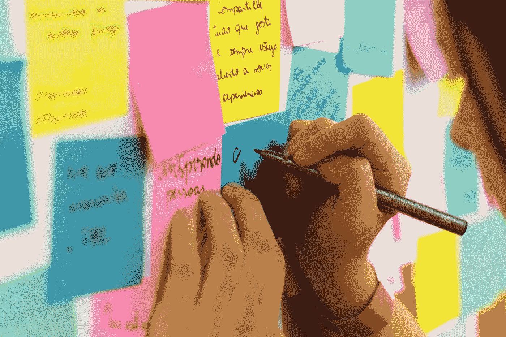
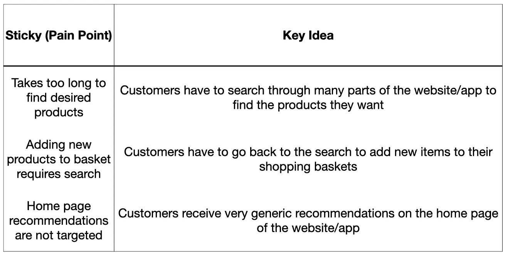
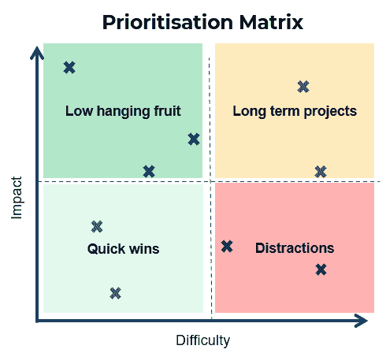

# 成功结合设计思维和数据科学

> 原文：<https://towardsdatascience.com/successful-combining-design-thinking-and-data-science-8ec6b1b7cc8e>

## 想知道如何利用设计思维交付创造真正商业价值的数据科学项目？以下是方法。

照片由[**picjumbo.com**](https://www.pexels.com/@picjumbo-com-55570?utm_content=attributionCopyText&utm_medium=referral&utm_source=pexels)发自 [**像素**](https://www.pexels.com/photo/notebook-beside-the-iphone-on-table-196644/?utm_content=attributionCopyText&utm_medium=referral&utm_source=pexels)

自从 2018 年在德勤咨询公司工作时遇到设计思维，我就迷上了它。我喜欢围绕着重新定义问题以触及其核心，然后快速迭代想法的风气。最重要的是，我喜欢工具和技巧，以一种激励每个人的方式，快速而有创造性地从一个团队中获得广泛的想法。

我也非常喜欢编码、建立模型和解决分析问题。因此，我在 2020 年离开了德勤，回到学校攻读数据科学硕士学位。当我在 2021 年作为一名数据科学家重新进入工作世界时，我不确定我是否能把这种设计思维体验带在身边。幸运的是，我在新工作的几个月内就发现了数据科学项目和设计思维研讨会之间的天然契合。本文概述了设计思维如何以及为什么对您的下一个数据科学项目有价值。然后是如何在数据科学领域实施设计思维研讨会的“内容”。

设计思维过程的步骤；作者图片

当我第一次对数据科学领域感兴趣时，是因为我喜欢统计学、数学和计算机科学这些有序的领域。我的意思是，谁不喜欢提出可以自信地陈述预测有多正确(或错误)的预测呢？然而，在实地工作的真相并不是那么一成不变的。从我的角度来看，最大的挑战包括找到最有价值的问题来解决，并把受到这些挑战影响的人带到旅途中来。现在，我知道很容易看到业务的另一部分，戴上我的数据科学家帽子，说一些类似“哦，这个团队需要的是一个强化学习系统，以优化货架包装商的路径”。然而，业务部门的人员*更清楚他们遇到了什么问题，以及通过解决这些问题，哪些问题对他们最有利。也许他们真正需要的是一个简单的仪表板，显示哪些食品的浪费比例最高。这看起来很简单，但是像这样的工具可以通过减少浪费每周节省数百万美元。在*构思和反馈*部分的末尾，我整理了一个类似咨询的小工具，帮助你在处理业务时轻松找到那些杠杆点。*

设计思维研讨会帮助团队完成上图“设计思维过程的步骤”中设计思维过程的前两个阶段。然后，我们能够根据从研讨会中收集的见解进行构思、原型制作和测试。我们通过理解我们的关键利益相关者的问题来产生共鸣，然后我们深入并进一步定义它们，以便我们真正理解它们。但是，为什么不召开传统的需求定义会议或研讨会呢？主要有两个原因:时间和精力。

根据我的经验，如果你需要把一个或多个业务领域的高管召集到一个会议室，你最好抓紧时间等待。很自然，他们非常忙，每个人都想要一点他们的时间和注意力。当你在他们的日记中找到一个时间段时，如果你能有超过一个小时的时间，那你就非常幸运了。关于设计思维过程，我最喜欢的一点是能够让一群不同的人很快提出想法。虽然我发现一个半小时的研讨会时间有点紧，但这足以让我有足够的了解来开始设计解决方案。房间里的能量是让这些工作室对我有力量的第二个因素。参与者需要迅速提出想法，每个人都可以分享他们的想法。我发现，对大多数人来说，这有助于激发创造力，并在这个过程中提高人们的能量水平。通过使用允许我们在最短的时间内获得最多的想法，同时让人们对我们正在做的事情感到兴奋的流程，我们能够从利益相关者那里创造出一种真正的认同感。让我们深入了解一下这个过程。

照片由 [**布鲁诺**布诺](https://www.pexels.com/@brunogobofoto?utm_content=attributionCopyText&utm_medium=referral&utm_source=pexels)发自[派克斯 ](https://www.pexels.com/photo/person-writing-on-pink-sticky-notes-3854816/?utm_content=attributionCopyText&utm_medium=referral&utm_source=pexels)

## 你需要什么

*   不同颜色的便利贴——足够每个人至少有 15-20 张
*   用于便笺的白板标记。永久性记号笔很可能会造成一些意想不到的永久性损伤，而且细圆珠笔很难辨认，除非你离它们很近
*   每组一张白板，或者两张大号 A2 纸

**你需要谁**

*   与你工作领域相关的关键业务利益相关者——如果要发生什么，你需要管理层的参与
*   两到三个人会真正使用你将提供的工具或见解
*   一名辅导员(可能是你)和数据科学或分析团队的一些成员

# **车间结构**

从我的经验来看，有两种方法对我有效，尽管我鼓励你混合搭配自己的想法。

**挑战识别研讨会**

这种类型的研讨会比第二种类型更广泛，适合于业务涉众知道他们的挑战是什么，但不知道您能为他们做什么的情况。本次研讨会的目的是尽可能了解客户的棘手问题。你**不想带着如何解决这些问题的任何想法离开这个会议。你只是真的想了解他们。**

从简单介绍您的团队开始，并提到今天的重点是了解客户的痛点。我喜欢做一两个简短的 5 分钟“同类最佳”幻灯片，让我看看那些目前正在做出惊人成就的公司，最好是在数据科学领域，在我们的利益相关者工作的领域。尽管我们只是关注痛点并避免解决方案模式，但这些“同类最佳”的示例有助于为研讨会设定一个鼓舞人心的创造性基调。

然后，我为会议制定了规则，大概是这样的:今天的想法是尽可能多地提出想法。我们将分成两到三个小组(下面会详细介绍)，每个人都有一套便笺和一支笔。欢迎您谈论想法，但是如果您有好的想法，您可以写下来并贴在白板/纸上。你不需要得到小组的同意。我们以后可以去掉不好的想法。如果你看到弹出的主题，继续把相似的便利贴放在一起。

然后，我们将研讨会分成两到三个小组，每组四到五人。理想情况下，将高级经理或高管分在不同的小组。让您的团队中的分析师或数据科学家以及将使用您构建的工具的利益相关者很好地混合在一起。对你的团队来说，获得对问题的第一手了解是很重要的。稍后当你做汇报并试图记住便笺上潦草的内容是什么意思时，这也会很有用。将人们分组也有助于通过在房间里一次获得更多想法来加速构思过程——我真的发现研讨会的这一方面是关键的成功因素之一。将人们分成更小的小组也给了参与者更多的空间来交谈和分享想法，增加了组合的多样性。

对我来说，这里一个关键的考虑是我们给构思过程多少结构。我们有没有设计出客户旅程图或其他类型的运营图？或者我们只是提出几个问题来指导这个过程？鉴于你很可能会受到时间的限制，我建议给*一些*类型的作战地图放在参与者面前。这是一个虚构的快递服务公司的例子。

一个虚拟在线零售商的运营步骤的客户之旅；作者图片

像这样的地图的优点是，它允许利益相关者关注业务或客户旅程的特定领域，这总是使其更容易立即找到痛点。当然，要确保你事先与业务利益相关者团队中的某个人一起工作，勾勒出这些客户之旅。你没有时间在车间里做这个。显然，如果参与者分享了一个不在旅程地图上的痛点，或者如果他们只想专注于其中的一两个领域，那也没问题。有了这个就有助于简化流程。

继续巡视各组，看看他们做得如何。提醒他们规则(记下尽可能多的想法)，并向他们提出问题，以便在小组内获得更多的想法。确保你在记录时间，在给小组 25-30 分钟后，停止课程。请每组中的一名成员向教室中的其他人展示他们的主要观点。每组给他们三到五分钟的时间来做这件事。现在也是把类似的帖子放入群组或主题的好时机。这使得该过程的下一部分更简单。

现在是最精彩的部分。希望所有的小组都提出了大量的想法。现在你将投票选出最好的。有一个很好的方法叫做“点投票”，是在德勤介绍给我的，来自优秀的书 [Sprint](https://www.thesprintbook.com/) 。基本上，每个人都有三张[圆点贴纸](https://www.carlyandkin.com/home/2018/11/16/4-simple-dot-sticker-activities)，并被允许为他们喜欢的任何想法投票——这里用便利贴表示。他们可以把所有的帖子放在一个想法上，或者按照他们喜欢的方式把它们分开。不过，没有讨论。给每个人大约三分钟去投票。基于之前的反馈会议，他们应该对不同团队讨论板上的想法有一个相当好的理解。很明显，一些帖子在想法上彼此非常接近，希望这些帖子能被组合在一起。如果是这样的情况，一个粘性主题中的一个粘性得到了所有的投票，或者即使所有的投票都是平均分配的，我会认为所有这些都是对主题的投票。

**预定义问题雕刻工作坊**

这种方法与第一种方法的区别在于，这里业务涉众已经知道他们需要什么。也许这是某种度量，某种客户细分或某种工具。我们遵循与上面相同的步骤，只是在这里没有必要做到“最好”。我们也可以用两个简单的问题来代替旅行地图:

*   我们到底在努力做什么？
*   我们为什么要这么做？

总之，这些问题让房间里的每个人都能理解我们在构建什么，以及我们要用它来做什么。举一个非常以零售为主导的例子，想象你在一家银行工作，你正在为每个客户开发一个“富裕程度评分”。至关重要的是，房间里的每个人都明白什么是富裕。例如，是某人目前有多少钱？这是对他们潜在支出的一种衡量？它是指他们的生活方式，以及他们可能承担的债务和实际支付能力吗？虽然这些都是相似的，但它们并不完全相同，并且将对您如何收集特性和构建指标产生重大影响。定义你试图做的事情将有助于定义你正在开发的指标/分段/度量的含义。理解“为什么”你想要这个指标也是至关重要的。它是我们用来设定战略目标的东西吗？我们使用它来识别交叉销售或追加销售机会吗？这些也会对设计产生影响。

在这种情况下，给每个团队 15 分钟时间回答“是什么”,然后用大约三分钟的时间向更广泛的团队提供反馈。接下来是另一个 15-20 分钟的回答“为什么”的环节，再接下来是对小组的反馈环节。虽然没有必要在这里对这些想法进行投票。如果您所在的机构目前有一个与您在会议中讨论的指标类似的指标，那么了解它与您在会议中讨论的“是什么”和“为什么”相比如何是有价值的。这也有助于了解哪些差距可能需要填补，哪些不需要填补，哪些可以在课程结束后的五分钟内完成。

# **构思和反馈**

你不可能理解利益相关者的关键问题**和**在你的短期研讨会中为他们提出创新的解决方案。正因为如此，我喜欢做以下事情:

*   研讨会结束后(确保在同一天),召集你的团队，做一个汇报。你应该准备一些白板或 A2 纸，里面装满胶粘物。写下每个帖子和/或一组帖子的主要观点。例如，你可以在 Excel 表格中写出便笺，然后将关键信息放在它们旁边。稍后，您可以将它移到 powerpoint 中。上面显示了一个虚拟客户旅程的电子零售商示例，可能如下所示:

一个来自虚拟研讨会的帖子示例，以及伴随这些帖子的关键想法；作者图片

*   您可能需要关键利益相关方澄清您认为研讨会的要点。当你开始思考你所讨论的棘手问题的解决方案时，接触利益相关者，了解他们对你的想法的意见，并了解你可以从哪里获得数据。例如，如果您的利益相关者的一个关键痛点是不知道客户最大的问题是什么，但是他们没有收集任何客户反馈数据，那么在短期内不可能提供解决方案

我会鼓励数据科学团队思考您认为如何能够解决客户的痛点。我坚信应该带着一些你可以提炼的想法回到利益相关者那里，而不是仅仅带着一套精炼的问题陈述回到他们那里。它还允许您的团队使用他们的数据科学专业知识，但要牢记明确的业务目标。

在勾画解决方案时，我鼓励你将解决方案视为产品。也就是说，考虑你的团队可以与涉众共同创造的最终状态，以满足他们在一个或多个领域的客户痛点。比方说，客户的一个关键痛点是在呼叫中心的长时间等待，通常是同样的简单问题。例如，如果你是保险公司，这可能是为了在提交索赔时获得帮助。这里的整个项目可能是“为客户提供自动化帮助”,这当然会被分解成多个步骤。第一步可能是一个简单的基于规则的聊天机器人 MVP，而最后一步可能是一个对话式人工智能。

几乎可以肯定，你会开发出比你的团队在任何合理的时间内都无法完成的更多的“产品”。所以，这是我最喜欢的管理咨询工具之一:2 x 2 矩阵。

项目的优先次序矩阵；作者图片

在这里，我们根据*影响*和*难度*来规划我们的项目。在左上方，我们有“低垂的果实”——这些是容易实现的、有影响力的项目，我们应该立即开始。在左下方，我们有“速赢”——这些很容易实现，但影响力较小。在右上角，我们有“长期项目”——这些非常有价值，但也很难实现；只有在抓住低垂的果实之后，才开始着手这些才有意义。最后，在右下角，我们有“分心”——这些很难实现，没有太多的商业价值。

你决定如何衡量*影响*和*难度*显然取决于你，但是最好有某种适度客观的方法来对这些指标进行评分。例如，您可以在信封背面注明业务影响的货币价值。您还可以包括额外的指标，尽管更难衡量，例如客户体验得分/ NPS 的增加。类似地，难度可以通过你认为项目需要多长时间来衡量，同时考虑资源限制，以及数据获取和清理的难度。您还需要将每个项目分解成一组更小的项目。例如，首先是一个 MVP 来测试这个想法是否可行。第二个可能是 MVP 的功能更强的版本，而第三个可能是产品的最终产品化版本。这些里程碑中的每一个都是潜在的“可以/不可以”的领域，以决定是否在项目上进一步发展。

如果您正在处理一个预定义的问题，这里的过程会稍微简单一些。仍然有必要进行当天的团队汇报，并与团队一起思考如何解决问题。和往常一样，与利益相关者保持联系是至关重要的。然而，优先级步骤不是必需的。尽管你可能会为你正在做的事情制定一个路线图，但你并不真的需要权衡不同的行动路径。

# **原型制作和测试**

如果你已经走上了优先矩阵路线，与关键利益相关者建立一个反馈会议来检查优先矩阵，以及你给项目的分数。由此，您应该能够最终确定矩阵，并决定将哪些项目添加到您团队的中短期路线图中。从唾手可得的果实开始，和你的利益相关者一起决定投入哪个长期项目或容易的胜利。

当谈到考虑迭代构建项目时，我绝对喜欢这篇关于精益数据科学的文章，并且不能比作者更好地表达这个想法。然而，本质上，它是关于构建快速交付价值的东西。这包括测试、失败和反复构建。当您构建优先项目(或预定义项目)时，朝着工具或项目的“足够好”版本努力。将这些交给利益相关者使用，然后接受反馈并对其进行迭代。

# **记分**

最后一点说起来容易做起来难:如果你能跟踪组成你正在构建的大项目的每个子项目的影响，这将使“去/不去”的决定更容易做出。例如，如果构建基于规则的聊天机器人成功地每月帮助 10，000 名客户，那么很明显，推进该项目的下一阶段可能会取得成果。你甚至可以用一个简单的计算来计算 MVP 的货币价值。例如，10，000 名客户 X 3 分钟平均通话时间= 30，000 分钟= 500 小时。如果一个呼叫中心代理的一个小时的工资和基础设施成本是 R200，那么通过这个项目你一个月可以节省 100000。使用更复杂的聊天机器人，你可能会节省更多。衡量一个项目的影响显然是非常具有挑战性的，原因有很多——比如衡量影响需要额外的时间开销——但是这对于理解哪些项目值得追求是必不可少的

# **总结**

这是如何将设计思维和数据科学结合在一起，让您的数据科学团队与业务利益相关者共同创建解决方案的闪电概述。当我发现我可以将我热爱的两件事——“创造性”设计思维和“分析性”数据科学——结合在一个领域时，我欣喜若狂。如果你尝试了，让我知道这对你有什么效果。和所有事情一样，这也是一个反复的过程。找出什么在你的组织中最有效，什么无效。不断尝试新的想法，使这类研讨会更加成功，因为你有助于弥合业务和数据科学社区之间的差距。