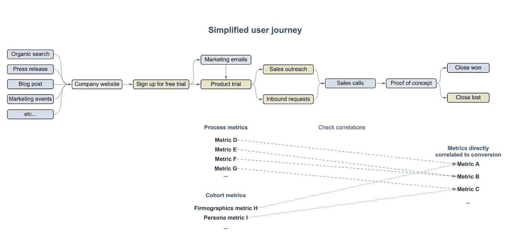

# 增强你的盈利能力——一种引导得分的实用方法

> 原文：<https://towardsdatascience.com/supercharge-your-monetization-a-practical-way-to-lead-scoring-99452db89dec>

## 随着 B2B 公司转向以产品为导向的增长，获得集客线索成为推动收入的关键。但是公司现在面临新的挑战。

随着 B2B 公司转向以产品为导向的增长，获得集客线索成为推动收入的关键。许多公司撰写博客，举办活动，并提供免费试用来产生需求。虽然这些活动增加了流量，但公司现在面临着一个新的挑战，即从人群中区分潜在客户。由于服务潜在客户需要花钱，理想情况下，公司希望专注于最有可能转化的客户。公司渴望找到一种方法来优先考虑他们的销售范围。

领先评分系统是应对这一挑战的有力工具。它从历史交易数据中识别模式，预测销售线索转化概率，并相应地对销售线索进行排序。越来越多的公司希望在内部建立销售线索评分系统，以提高盈利能力。然而，这种努力一般需要几个月的时间。这么长时间的价值远远不理想。因此，在这篇文章中，我想讨论一种实用的方法来建立一个线索评分系统，并在一个月内获得可操作的见解。

图片来自 Unsplash

# 地图用户旅程

为了了解在销售线索评分系统中起作用的因素，让我们首先描绘出端到端的用户旅程。典型 B2B 产品的简化用户旅程如下所示(双击图表放大)。由于销售线索评分系统处理内向销售线索，因此省略了外向销售线索。

作者图片

潜在客户转化前的最后接触点是销售电话和概念验证。我们首先头脑风暴可能与转换相关的指标，并在指标 A、B、C 上形成假设，这些指标描述了概念验证中的用户行为。由于概念验证通常是一个有指导的过程，我们希望了解哪些客户群可能会安排与我们进行销售拜访，以及他们在没有销售指导的情况下会如何表现。因此，我们回到用户之旅，看看潜在客户在产品试用中的表现以及与营销电子邮件的互动。

# 验证关于转换的假设

接下来，我们通过检查指标和转化率之间的相关性来测试假设。假设我们根据指标 H 和 I 对客户进行了细分，我们尝试按群组绘制指标 A、B 和 C。然而，数据点在图上看起来是随机的。因此，我们更进一步，通过将指标 A 和 b 相乘，我们发明了一个参与度指标。下图显示了不同群组中参与度指标的清晰模式。现在，我们可以从统计上检查参与度和转化率之间的相关性。

作者图片

有时，可视化会暴露数据和业务共识之间的不一致。这种错位可能会为商业提供重要的见解。但与此同时，错位可能来自数据质量问题。数据科学家花费超过 50%的项目时间来处理这些问题并不罕见。因此，预计不会从第一次数据可视化中找到任何有意义的模式。

# 预测销售线索转化率或为指标分配权重

找到指标和转化率之间的相关性后，我们就可以预测销售线索转化率，并据此对销售线索进行排名。逻辑回归是一种复杂的转化率预测方法。然而，这种预测需要大量和多维的高质量数据。

如果一家公司刚刚进入市场，或者第一次从事数据科学项目，其数据可能不足以建立预测模型。在这种情况下，更实际的做法是手动为指标分配权重。第一个线索评分模型可能不准确，需要监控和迭代。

# 销售线索评分模型的附带好处

上述工作流程的早期采用者会在一个月内获得可操作的见解。在建立销售线索评分模型时，公司会发现与转化相关的指标，并相应地对功能开发进行优先排序。一些公司确定了不太可能成为付费客户的客户群，并消除了低效率的外联。

当销售线索评分模型指向正确的方向时，销售团队会变得更加乐观，因为他们预约了更多的电话，电话也会变得更加吸引人。从长远来看，销售线索评分模型缩短了管道评审会议，让管理层有更多时间考虑战略性业务决策。

如果你喜欢这个话题，想要更深入的讨论，欢迎联系 [Ivy](https://www.linkedin.com/in/ivylc/) 。要掌握商业策略和分析，请订阅我的时事通讯。下一篇文章再见。