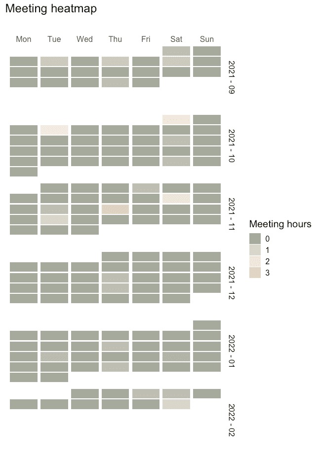

# 超负荷会议生产力分析

> 原文：<https://towardsdatascience.com/supercharged-meeting-productivity-analytics-in-r-a26ec23fd1d5>

## 了解并提高您的投资回报率

[Icons8 团队](https://unsplash.com/@icons8?utm_source=medium&utm_medium=referral)在 [Unsplash](https://unsplash.com?utm_source=medium&utm_medium=referral) 上的照片

# ⌛会议很多

> 我希望我的生活和决定依靠我自己，而不是任何形式的外部力量——以赛亚·伯林

自从 COVID 罢工以来，大多数人的会议日程开始看起来像马克·罗斯科的画；也就是说，一个会议接着一个会议，中间的时间很少。同时，通常很少考虑优化会议以提高效率。我们都太熟悉那些缺乏恰当描述、安排在不方便的时间或者长度不合适的会议邀请了。不要被推来推去，是时候掌控你的时间，提高你的时间投资回报率(ROTI)了。

# 📁什么？

不管你更喜欢谷歌日历，微软 Outlook，还是苹果日历，所有的日历都存储为 ICS 文件。ICS(或 iCalendar)是由互联网工程任务组在 1998 年定义的通用日历文件格式。[1]因此，不管您的具体日历如何，所有分析会议时间的工作都是从 ICS 文件开始的。

# ✨推出“安派”r 系列

到目前为止，读取 ICS 文件一直是一项乏味的任务，需要在质量或速度(有时两者兼而有之)上做出妥协。`**anpai**` R-package 通过利用`Rcpp`来提高速度，同时还提供与`tidyverse`工作流完美集成的开箱即用的分析，从而改变了上述所有情况。

## 装置

要安装`anpai`，确保你已经先安装了`devtools`。从那时起，安装就是在公园里散步。

## 读取 ICS 文件

用`anpai`读取 ICS 文件就像 1，2，3 一样简单。要在 R 中将 ICS 文件转换成现成的数据帧，只需做以下事情:

## 描述性会议统计

在阅读您的 ICS 文件后，`anpai`提供了一些现成的功能来帮助您更深入地了解您的会议日程。如上所述，它们都集成了典型的`tidyverse`工作流元素(特别是管道)。

## 想象你在会议中的时间

除了描述性统计数据，`anpai`还提供了完全可定制的现成可视化数据(通过`ggplot2`)。根据你试图确定的会议时间，从更高层次或更具体的时间角度来看你的日程安排是有意义的。

为了更好地理解一周中不同日子的会议总量，请看下面的`dow_plot()`函数。

使用上面的代码会产生以下图形:

由作者创建

默认情况下，这将对您日历中的所有会议执行所需的聚合；但是，您也可以通过函数的参数指定感兴趣的时间范围。

为了鸟瞰会议负载，请查看由`cal_heatmap()`功能生成的日历热图:

下面是`cal_heatmap()`函数的输出示例。

由作者创建

同样，如果你不喜欢这些颜色或者想改变剧情标题，你需要做的就是在视觉上添加标准的`ggplot2`功能。

## 知道你要做什么，提前计划

计划会议之间的时间和计划会议本身一样重要。微软发布的研究表明，连续开会不利于工作效率。[2]此外，你在两次会议之间有多少时间决定了你在这些休息时间应该专注于哪类任务，以获得最高的工作效率。例如，如果你的休息时间少于 45 分钟，那就没有必要开始一项需要高度集中注意力的任务。

使用`anpai`，您可以使用`plot_breaks()`功能在您的日程表中显示下一整周的会议间隔时间(并根据需要进行调整):

下面是该图的一个示例:

由作者创建

# 🔨结论和贡献

有了`anpai`，您就有了另一个工具来掌控自己的时间，而无需学习新的工作流程理念。如果你热衷于让你的会议更有成效，请随时查看项目的 GitHub 并打开 pull 请求。

*来源:*

[1]互联网社会。(1998 年 11 月)。*互联网日历和日程安排核心对象规范(iCalendar)* 。https://www.ietf.org[。检索于 2022 年 4 月 7 日，发自 https://www.ietf.org/rfc/rfc2445.txt](https://www.ietf.org)

[2]微软研究院。(2021 年 4 月)。研究证明你的大脑需要休息。[https://www.microsoft.com](https://www.microsoft.com/)。检索于 2022 年 4 月 10 日，来自[https://www . Microsoft . com/en-us/work lab/work-trend-index/brain-research](https://www.microsoft.com/en-us/worklab/work-trend-index/brain-research.)