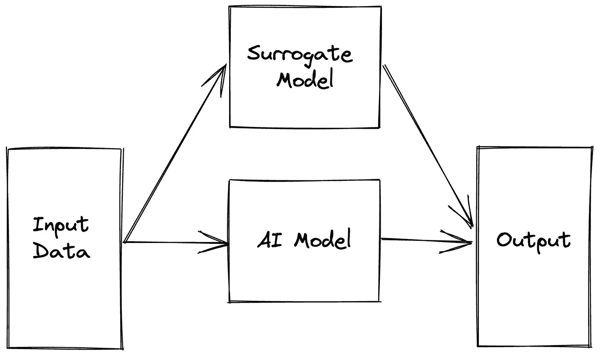
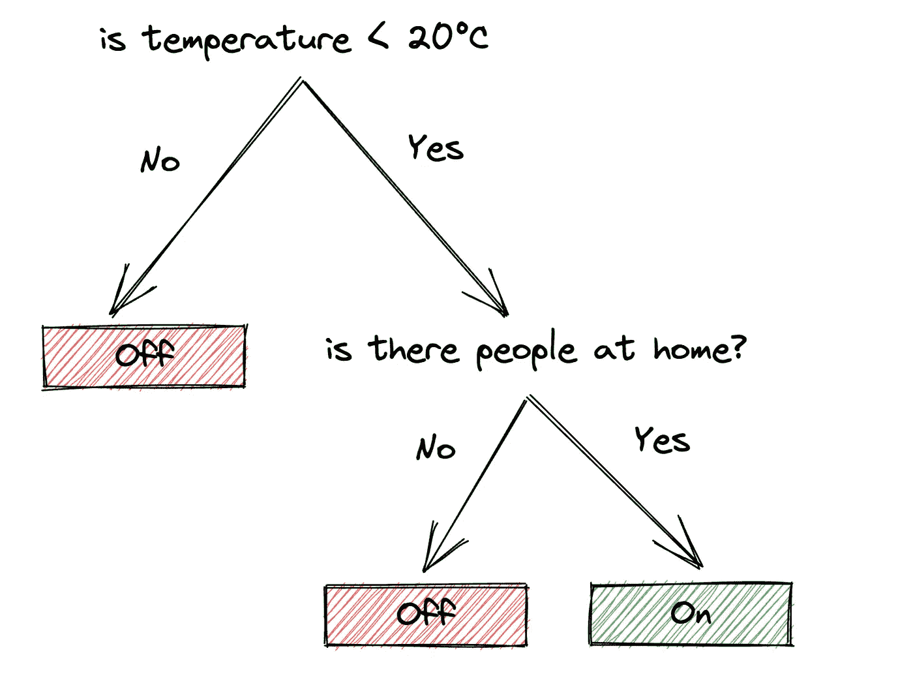

# 代理模型可以帮助 UX 设计师打造更好的人工智能产品

> 原文：<https://towardsdatascience.com/surrogate-models-can-help-ux-designers-build-better-ai-products-d07fb12cbd76>

## 为什么 AI 产品这么难设计

照片由 [DeepMind](https://unsplash.com/@deepmind?utm_source=unsplash&utm_medium=referral&utm_content=creditCopyText) 在 [Unsplash](https://unsplash.com/@deepmind?utm_source=unsplash&utm_medium=referral&utm_content=creditCopyText) 上拍摄

用户体验(UX)工具通过更容易理解用户如何与他们交互来帮助设计师创造更好的产品。然而，很少有专门为人工智能(AI)产品设计的 UX 工具。这是一个问题，因为人工智能产品变得越来越普遍，它们给设计师带来了独特的挑战。

构建人工智能应用很难。你不仅需要很好地理解人工智能算法本身，还需要能够构建用户界面(ui ),允许用户以有意义的方式与人工智能进行交互。不幸的是，没有太多好的工具来为人工智能构建好的用户界面。

在这篇文章中，我们将讨论人工智能产品的 UX 工具的问题。我们将首先解释为什么人工智能产品难以设计，以及为什么现有的 UX 工具不太适合这项任务。

然后我们讨论一种称为代理模型的方法，它有助于更好地理解一个典型的人工智能“黑匣子”，它很难解释，错误也很难预测。

# 为什么 AI 产品设计这么难？

作为一名人工智能开发人员，我会说人工智能产品很难设计，因为它们是复杂的系统，有许多相互作用的部分。这种复杂性使得很难理解用户将如何与产品交互，也很难预测产品在不同情况下的行为。

传统的 UX 工具不太适合设计人工智能产品的任务。它们往往过于简单，没有考虑到人工智能系统各部分之间复杂的相互作用。

人工智能产品面临的最大挑战之一是，它们通常被设计为由非该领域专家使用。这意味着产品需要以简单易懂的方式设计。

# 人工智能产品的 UX 工具的问题

众所周知，人工智能产品的 UX 工具的现状远非理想。为了使使用人工智能产品的体验更加无缝和用户友好，有许多挑战需要解决。

最大的挑战之一是不同 AI 产品之间缺乏集成。这使得用户很难在不同的人工智能产品之间移动，并可能导致支离破碎的用户体验。

另一个挑战是人工智能产品的构建方式缺乏标准化。这使得用户很难理解如何使用不同的人工智能产品，并可能导致令人沮丧的用户体验。

最后，缺乏专门为 AI 产品设计的工装。这可能会使设计师和开发人员难以创建用户友好和易于使用的人工智能产品。

为了应对这些挑战，UX 的设计师和研究人员与人工智能产品团队密切合作是非常重要的。通过与人工智能产品团队合作，UX 的设计师和研究人员可以帮助确保人工智能产品对用户友好。

# 代理模型

打造更好的人工智能产品很难。有许多因素需要考虑，从算法本身到它们被训练的数据，到让人们实际使用它们的界面和用户体验。为了给人工智能产品设计好的 UX，我们不仅需要了解人工智能是如何工作的，还需要了解人们是如何与之交互的。

> 在工程学中，有一种叫做“代理模型”的方法可以帮助更好地理解人工智能的行为。

代理模型是用于近似复杂现实世界模型的数学模型。一般来说，评估代理模型比评估原始模型更便宜，可以用来通过实验优化设计，或了解人工智能如何对一些输入做出反应。

代理模型训练(作者图片)

# 决策图表

决策树是一种监督学习算法，可用于创建代理模型。决策树是一种非参数模型，这意味着它们不对底层数据分布做任何假设。

决定是否激活加热器的决策树示例(图片由作者提供)

决策树是代理建模的流行选择，因为它们易于解释，并且可以处理数值和分类数据。决策树可以很容易地用 [Scikit-learn](https://scikit-learn.org/stable/modules/tree.html#tree-classification) 来训练，让你有能力理解决策过程是如何制定的。

让我们来看看如何用几行代码来训练一个决策树:

在这个例子中，我们有四个数据点称为“X”和给定的输出“Y”来训练模型。数据点有四个维度(例如[0，0，1，1])，每个维度都是二进制的——0 表示否，1 表示是。

一个维度可以是“温度是否< 20 度”另一个维度可以是“家里有人吗？”，另一个“壁炉着火了？”诸如此类。

在这个简单的例子中，我们可能有一个复杂的人工智能系统，它根据几个参数决定何时使用供暖系统，并在训练代理模型后发现，只有两个变量是重要的(温度和是否有人在家)。

> 换句话说，代理模型是一个更简单的模型，它被训练来模仿更复杂的人工智能系统的行为。这个想法是通过理解代理模型的行为来从复杂的人工智能系统中获得洞察力。

# 结论

在过去几年中，新的人工智能产品和服务出现了爆炸式增长。这在很大程度上归功于机器学习和人工智能技术的进步。因此，越来越需要能为这些产品创造用户友好界面的 UX 设计师。

然而，为人工智能设计提出了一个独特的挑战。UX 设计师需要考虑这样一个事实，即人工智能产品通常由不断学习和进化的复杂算法驱动。这意味着用户界面需要足够灵活来适应这些变化。

随着人工智能越来越多地被用于创造和增强产品，对可以帮助设计和测试人工智能产品的 UX 工具的需求也在增长。然而，目前人工智能产品的 UX 工具仍处于早期阶段，很少有专门为人工智能产品设计的工具。

这种专业工具的缺乏对于从事人工智能产品的 UX 设计师来说是一个重大挑战，因为他们经常不得不依赖于并非为人工智能产品而设计的通用工具。

好奇想了解更多关于 Anthony 的工作和项目吗？在[媒体](https://medium.com/@anthonycvn)和 [LinkedIn](https://www.linkedin.com/in/anthonycavin/) 上关注他。