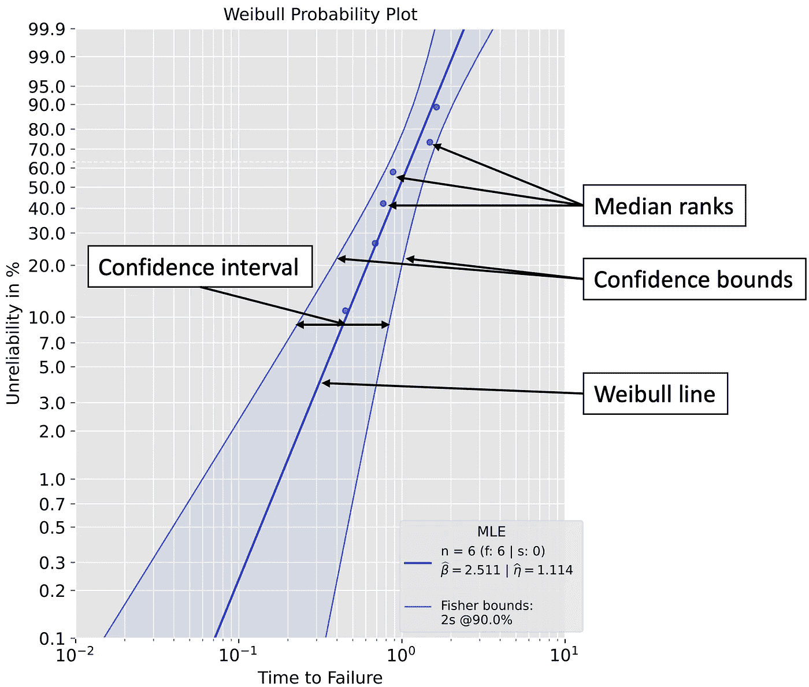
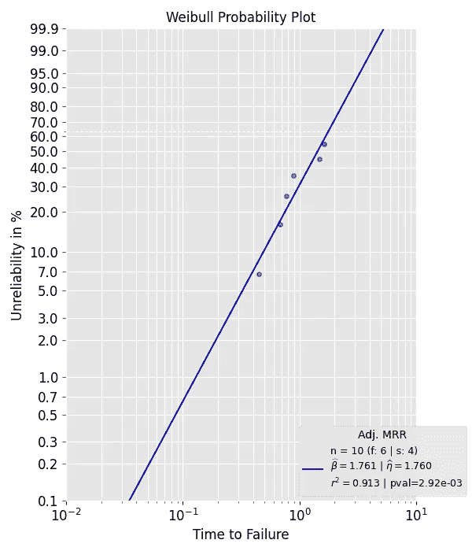
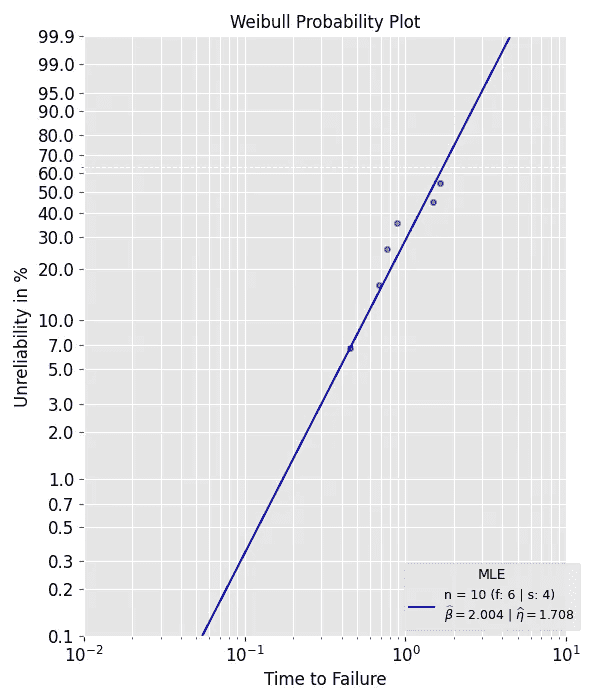
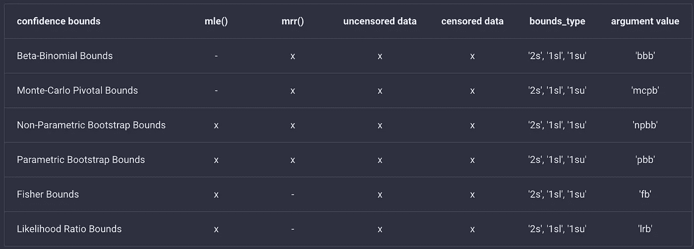
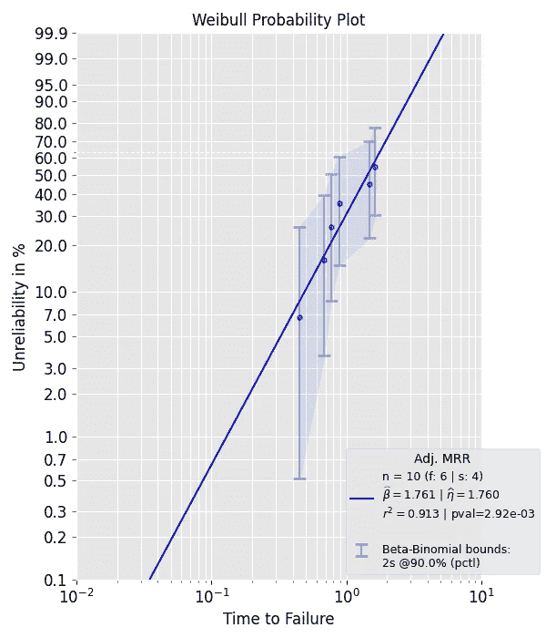
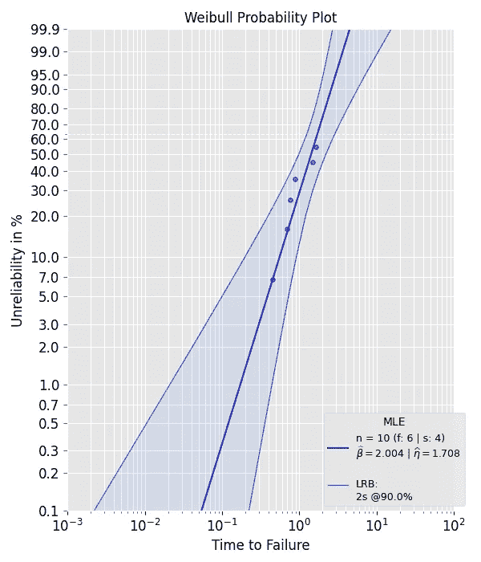
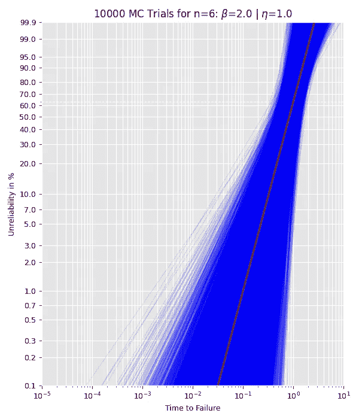
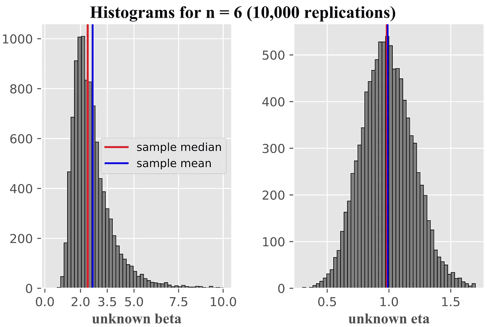
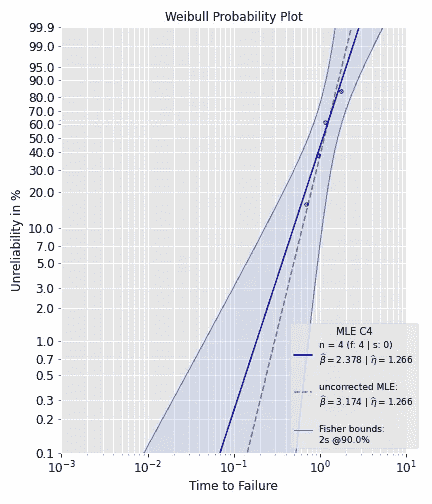
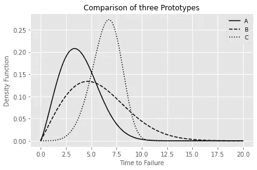

# Python 中的生存分析

> 原文：<https://towardsdatascience.com/survival-analysis-in-python-a-quick-guide-to-the-weibull-analysis-5babd4f137f6>

## 威布尔分析快速指南

威布尔分析因其灵活性和直观性在可靠性工程师中非常流行。本指南将通过示例代码演示威布尔分析的基本概念。为了进行威布尔分析，我们将使用开源 Python 包[](https://pypi.org/project/predictr/)**。**

**

*作者图片*

# *目录*

1.  *[安装和使用 ***预测***](#3bf2)*
2.  *[威布尔图](#2931)*
3.  *[参数估计:MRR vs. MLE](#4837)*
4.  *[置信区间](#c6b3)*
5.  *[偏差修正](#1829)*
6.  *[综合地块](#cc4a)*
7.  *[结论](#d5c4)*

# *安装和使用**和*预测器*和***

*您需要安装 Python 3(版本> 3.5)。如果您是 Python 的新手，只需下载 [anaconda](https://www.anaconda.com/) 并根据 [anaconda 文档](https://docs.anaconda.com/)建立一个虚拟环境，例如将这段代码分别粘贴到终端(macOS，Linux)和命令(Windows)中:*

```
*conda create -n my_env python=3.10*
```

*这段代码用 Python 3.10 创建了一个名为 *my_env* 的新虚拟环境。请随意更改名称和 Python 版本。*

*下一步包括在终端(或命令)中使用 [pip](https://pip.pypa.io/en/stable/) 进行安装预测:*

```
*conda activate my_env
pip install predictr*
```

*为了在您选择的 IDE 或文本编辑器中使用 predictr，只需在 python 文件中导入 *predictr* 模块:*

```
*import predictr*
```

*[***预测***](https://pypi.org/project/predictr/) 有两个类:*分析*用于威布尔分析，而 *PlotAll* 用于详细绘图。关于*预测*的综合文档，包含许多示例，请查看[官方文档](https://tvtoglu.github.io/predictr/)。*

# *威布尔图*

*概率图允许掌握当前数据的概念，并相互比较回归线，即故障模式和故障数据。在威布尔分析中，该图称为威布尔概率图。理解剧情至关重要。通常，情节包括…*

*   *双对数 y 轴(不可靠性)，*
*   *对数 x 轴(无故障时间，例如循环次数)，*
*   *威布尔线(威布尔形状和尺度参数的参数估计)和给定数据的中间等级，*
*   *和置信界限(单侧或双侧)。*

**

*威布尔概率图(图片由作者提供)*

*图例是可选的，但是建议显示以下信息:样本大小 n(=失败次数 f +暂停次数 s)、正在使用的参数估计方法(最大似然估计(MLE)或中值秩回归(MRR)或其他)、实际估计的威布尔参数(β和η)、正在使用的置信界限方法(费希尔界限、似然比界限、Bootstrap 界限、β-二项式界限、蒙特卡罗关键界限等)以及置信水平。*

# *参数估计:MRR 与最大似然估计*

*极大似然估计和 MRR 都可以用来估计威布尔形状和尺度参数。在本教程中，我们认为威布尔位置参数为零，即双参数威布尔分布:*

*   *形状参数β代表威布尔线的斜率，描述了故障模式(->著名的*浴盆曲线**
*   *比例参数η定义为不可靠性为 63.2 %时的 x 轴值*

*假设我们从测试中收集了以下 II 型右删失数据:*

1.  *失败次数:0.4508831，0.68564703，0.76826143，0.88231395，1.48287253，1.62876357(共 6 次失败)*
2.  *停牌:1.62876357，1.62876357，1.62876357，1.62876357(共 4 次停牌)*

*我们的数据被审查，因此我们必须处理暂停。悬架是指在测试过程中没有出现故障的装置。MRR 和 MLE 处理这些信息的方式不同。*

## *维护、修理和更换*

*中位秩回归使用所谓的中位秩和最小二乘法来确定威布尔参数。中间等级是每次故障的不可靠性(或可靠性)估计值(MRR 不能考虑截尾时间，只能考虑暂停的总次数)。更准确地说，MRR 估计是基于单个故障时间的中间等级，而不是实际故障时间值。*

*我们将使用*预测*中的分析类来进行威布尔分析。*

```
*from predictr import Analysis# Data from testing
# Failures and suspensions are lists containing the valuesfailures = [0.4508831,  0.68564703, 0.76826143, 0.88231395, 1.48287253, 1.62876357]
suspensions = [1.62876357, 1.62876357, 1.62876357, 1.62876357]# Weibull Analysis
x = Analysis(*df*=failures, ds=suspensions, *show*=True)
x.mrr()*
```

**

*MRR 给定数据(图片由作者提供)*

## *MLE*

*与 MRR 相比，MLE 考虑实际故障和暂停时间。增加悬架的数量主要增加威布尔尺度参数，形状参数估计没有显著变化。我们对相同的数据执行 MLE(注意:*分析*已经导入):*

```
*# Data from testing
# Failures and suspensions are lists containing the valuesfailures = [0.4508831,  0.68564703, 0.76826143, 0.88231395, 1.48287253, 1.62876357]
suspensions = [1.62876357, 1.62876357, 1.62876357, 1.62876357]# Weibull Analysis
x = Analysis(*df*=failures, ds=suspensions, *show*=True)
x.mle()*
```

**

*给定数据的 MLE(图片由作者提供)*

*统计值被存储为*分析中对象的所谓属性。因此，我们可以打印和/或保存它们。查看 predictr 的官方文档，了解所有对象属性的概况。**

```
*# We are using f-strings
# x and y are the names of the class objects we created (see code above)
# beta and eta are the attributes we want to access and print
# Just type *object*.*attribute to access them
# e.g. for the object x type the following: x.beta or x.eta*print(f'MRR: beta={x.beta:2f}, eta={x.eta:2f}\nMLE: beta={y.beta:2f}, eta={y.eta:2f}\n')# Output
>>> MRR: beta=1.760834, eta=1.759760
    MLE: beta=2.003876, eta=1.707592*
```

# *置信区间*

*仅仅使用点估计是有风险的，特别是当你只有少量测试失败的单元时。假设估计的样本统计量(例如威布尔参数)接近或者甚至等于总体统计量将可能导致错误的安全感。**通常建议**在威布尔分析中使用置信界限方法。通过使用置信区间，我们可以有把握地假设实际真实总体(或基础事实)威布尔线位于该区间内。因此，我们不太可能高估我们系统的可靠性。典型的置信区间是 90%，这意味着置信下限**可以设为 5%，置信上限设为 95%。界限也可以设置为 1%和 91%。如你所见，区间仅由上下界之差定义，不必对称。***

*值得注意的是，有两种界限:*

1.  *故障时间轴上固定不可靠性/可靠性值的界限(例如 R(t)=80%)，例如下限:5000 小时，上限:7000 小时。*
2.  *不可靠性/可靠性轴上的固定故障时间(例如 t= 6000 小时)值的界限，例如下限:R(t)=20%，上限:R(t)=38%。*

*有大量的置信界限方法可供选择。我将很快发表后续媒体文章，介绍在何种情况下选择何种方法。下表列出了 *predictr* 支持的置信界限方法。*

**

*predictr 中支持的置信界限方法概述(图片由作者提供)*

*可以选择双面(2s)和单面(1sl:单面下；1su:单侧上)置信界限。除了β-二项式界限以外，所有方法都使用固定不可靠性/可靠性值的界限。通过更改参数值，可以自定义威布尔分析。*

*让我们对已经使用过的相同数据使用β-二项式界限:*

```
*from predictr import Analysis# Data from testing
failures = [0.4508831,  0.68564703, 0.76826143, 0.88231395, 1.48287253, 1.62876357]
suspensions = [1.62876357, 1.62876357, 1.62876357, 1.62876357]# Weibull Analysis with two-sided bounds and a plot
x = Analysis(*df*=failures, *ds*=suspensions, *show*=True, *bounds*='bbb', *bounds_type*='2s')
x.mrr()*
```

**

*MRR 与贝塔二项式界限(图片由作者提供)*

*现在，让我们进行最大似然估计，并对相同的数据使用双侧似然比界限:*

```
*from predictr import Analysis# Data from testing
failures = [0.4508831,  0.68564703, 0.76826143, 0.88231395, 1.48287253, 1.62876357]
suspensions = [1.62876357, 1.62876357, 1.62876357, 1.62876357]# Weibull Analysis
x = Analysis(*df*=failures, *ds*=suspensions, *show*=True, *bounds*='lrb', *bounds_type*='2s')
x.mle()*
```

**

*具有似然比界限的 MLE(图片由作者提供)*

# *偏差校正*

*小样本量或失败次数会导致有偏差的威布尔参数估计。对于足够小或足够大的样本量，没有明确定义的硬性限制。模拟数据显示，无论使用哪种参数估计和置信界限方法，样本大小等于或大于 20 往往会导致更精确的估计。但在实践中，可靠性工程师经常不得不处理小得多的样本量。因此，偏差校正方法的使用相当普遍。*预测器*支持以下偏差校正方法:*

**

*predictr 中支持的偏差校正方法概述(图片由作者提供)*

> *偏差修正影响威布尔参数的估计以及置信界限。使用偏差修正方法精确估计威布尔参数不会自动产生更精确的置信界限！并非所有的置信界限对偏差修正都同样敏感。关于这个话题的更多信息，你可以查看我关于偏差修正的出版物。*

*为了更好地理解有偏差估计的影响以及偏差修正是如何工作的，让我们进行一个蒙特卡罗(MC)研究。我们将从预先确定的威布尔分布(β =2，η=1，也就是我们的基本事实)中反复抽取**个随机样本**(样本大小 n=6，未经审查)，并对每个样本进行威布尔分析。对于每个样本，生成的威布尔线将绘制在威布尔概率图中。MC 试验次数设置为 10，000 次。所有随机抽取的样本都用蓝线表示，而地面真实颜色设置为红色。*

**

*从图中可以看出，尽管样本来自相同的威布尔分布，但对于 n=6，估计的威布尔参数变化很大。这表明小样本量会产生有偏差的估计。将样本量增加到 40 会降低估计值的偏差(绘制的威布尔线通常更接近实际情况)。这是意料之中的，因为 MLE 是渐近无偏的。*

**

*下图显示了所有 10，000 个估计威布尔参数的直方图。对于小样本量，形状参数往往被高估，并且不是对称分布的(与尺度参数相反)。这就是为什么几乎所有的偏差校正方法只关注形状参数并试图减小它的原因。大多数偏倚校正是从 MC 研究的基础事实和样本均值(或样本中值)之间的差异中得出一个校正因子。请记住，当实际估计值已经被低估时，这些偏差修正可能会错误地向下调整估计值。但总的来说，偏差修正方法应该按照预期的方式发挥作用。*

**

*作者图片*

*在*预测*中， *bcm* 参数设置偏差校正。我们将从双参数威布尔分布中随机抽取一个未经审查的样本，并对估计值进行偏差修正。*

```
*# Needed imports
from scipy.stats import weibull_min
from predictr import Analysis
import numpy as np# Draw one random sample with a set seed for reproducibility np.random.seed*(seed*=42)
sample = np.sort(weibull_min.rvs(2, *loc* = 0, *scale* = 1, *size* = 4))x = Analysis(*df*=sample, *bcm*='c4', *bounds*='fb', *show*=True)
x.mle()*
```

**

*作者图片*

*图例显示了未校正 MLE 的估计值(虚线)。使用 C4 校正，校正后的形状参数估计值为 2.4，更接近地面真实值 2.0。在*预测*中尝试其他偏差校正方法并比较结果！*

# *综合地块*

**PlotAll* 是 *predictr* 中的另一个类，让你创建和保存有洞察力的情节。它使用在*分析中创建的对象及其属性。*以下方法目前集成在 *PlotAll* 中:*

**

*PlotAll 中的方法(图片由作者提供)*

*为了比较两个或多个设计(本例中的原型)，您可以使用 *PlotAll:* 中的 *mult_weibull* 方法*

```
*from predictr import Analysis, PlotAll# Create new objects, e.g. name them prototype_a and prototype_b
failures_a = [0.30481336314657737, 0.5793918872111126, 0.633217732127894, 0.7576700925659532, 0.8394342818048925, 0.9118100898948334, 1.0110147142055477, 1.0180126386295232, 1.3201853093496474, 1.492172669340363]prototype_a = Analysis(*df*=failures_a, *bounds*='lrb', *bounds_type*='2s')
prototype_a.mle()failures_b = [1.8506941739639076, 2.2685555679846954, 2.380993183650987, 2.642404955035375, 2.777082863078587, 2.89527127055147, 2.9099992138728927, 3.1425481097241, 3.3758727398694406, 3.8274990886889997]prototype_b = Analysis(*df*=failures_b, *bounds*='pbb', *bounds_type*='2s')
prototype_b.mle()# Create dictionary with Analysis objects
# Keys will be used in figure legend. Name them as you please.objects = {fr'proto_a: *$\w*idehat*\b*eta*$*={prototype_a.beta:4f} | *$\w*idehat\eta*$*={prototype_a.eta:4f}': prototype_a, fr'proto_b: *$\w*idehat*\b*eta*$*={prototype_b.beta:4f} | *$\w*idehat\eta*$*={prototype_b.eta:4f}': prototype_b}# Use mult_weibull() method
PlotAll(objects).mult_weibull()*
```

**

*作者图片*

*为了绘制密度函数，使用*威布尔 _pdf* 方法:*

```
*from predictr import Analysis, PlotAll# Use analysis for the parameter estimation
failures1 = [3, 3, 3, 3, 3, 3, 4, 4, 9]
failures2 = [3, 3, 5, 6, 6, 4, 9]
failures3 = [5, 6, 6, 6, 7, 9]a = Analysis(df=failures1, bounds='lrb', bounds_type='2s', show = False, unit= 'min')
a.mle()b = Analysis(df=failures1, ds = failures2, bounds='fb', bounds_type='2s', show = False, unit= 'min')
b.mle()c = Analysis(df=failures3, bounds='lrb', bcm='hrbu', bounds_type='2s', show = False, unit= 'min')
c.mle()# Use weibull_pdf method in PlotAll to plot the Weibull pdfs
# beta contains the Weibull shape parameters, which were estimated using Analysis class. Do the same for the Weibull scale parameter eta.
# Cusomize the path directory in order to use this code
PlotAll().weibull_pdf(beta = [a.beta, b.beta, c.beta], eta = [a.eta, b.eta, c.eta], linestyle=['-', '--', ':'], labels = ['A', 'B', 'C'], x_bounds=[0, 20, 100], plot_title = 'Comparison of three Prototypes', x_label='Time to Failure', y_label='Density Function', save=False, color=['black', 'black', 'black'])*
```

**

*作者图片*

*请查看[官方文档](https://tvtoglu.github.io/predictr/classes/)以获取更多示例和代码的详细描述。*

# *结论*

*现在，您可以使用[预测](https://pypi.org/project/predictr/)利用基本统计概念的知识进行自己的威布尔分析。尝试测试数据、参数估计、置信界限和偏差修正的不同组合，以感受相互依赖关系。*

## *参考*

1.  *T.Tevetoglu 和 B. Bertsche，“关于偏差修正的置信界限的覆盖概率”， *2020 年亚太高级可靠性和维护建模国际研讨会*，2020，第 1–6 页，doi:10.1109/APARM。20607.868686866616*
2.  *T.Tevetoglu 和 B. Bertsche，“*偏差修正的威布尔参数估计和对置信界限的影响”*。Esrel2020-PSAM15，2020 doi:10.3850/978–981–14–8593–0 _ 3925-CD。*

## *我希望这个快速指南对你有所帮助。关注我了解更多！您可以在 [github](https://github.com/tvtoglu/predictr) 上或评论中联系我关于*预测*的反馈或功能需求。*