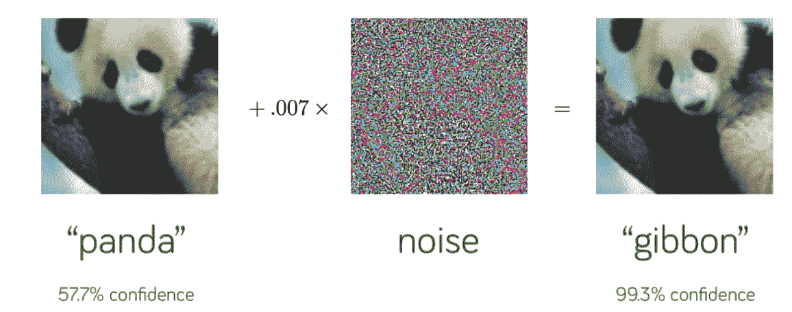
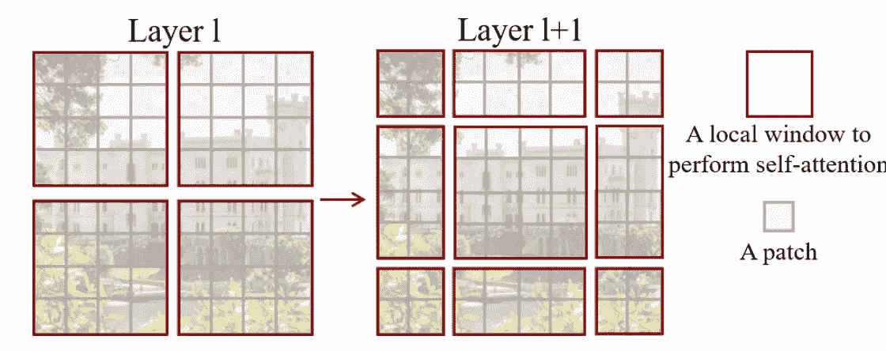
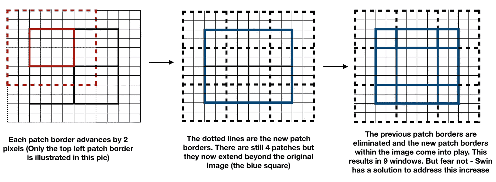
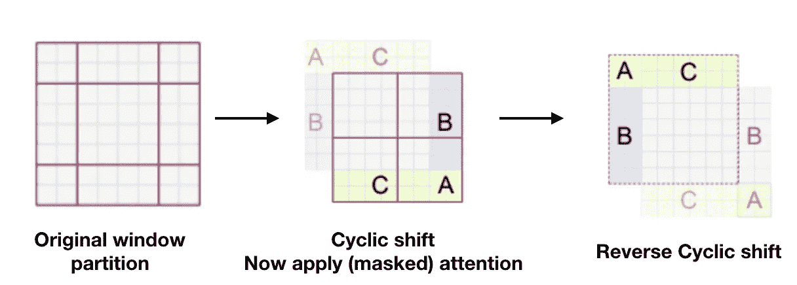
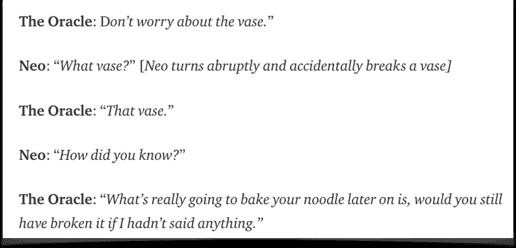
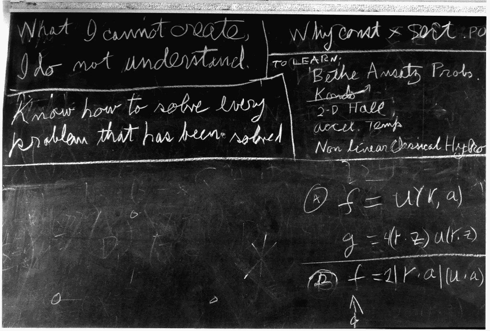

# swin/视觉变形金刚——侵入人眼

> 原文：<https://towardsdatascience.com/swin-vision-transformers-hacking-the-human-eye-4223ba9764c3>

## 一个 ML 架构来统治他们？也许不是…

当计算机视觉遇到 NLP——照片由 [Unsplash](https://unsplash.com/@ratushny?utm_source=unsplash&utm_medium=referral&utm_content=creditCopyText) 上的 [Dmitry Ratushny](https://unsplash.com/@ratushny?utm_source=unsplash&utm_medium=referral&utm_content=creditCopyText) 拍摄

巨型鱿鱼可能拥有动物界历史上最大的眼睛。它们生活在很深的地方，很少被人看到。直到最近几年，人们才开始研究这些美丽的眼睛。鱿鱼和章鱼一样属于*头足类*，是*无脊椎动物*(无脊椎)。这位伟大的老师对这些生物眼睛的一个特殊方面非常着迷。*一般来说，无脊椎动物*没有先进的视觉系统，不像*脊椎动物*有和我们非常相似的眼睛。唯一的例外是头足类动物。它们的眼睛有许多独特的特征——最有趣的是它非常类似于脊椎动物视网膜的结构。

现在，这很有趣，因为它们的视网膜是从脊椎动物*(相隔数百万年)*独立进化**。事实上，自然独立地产生了两个非常复杂的视觉架构，它们彼此非常接近，这本身就令人惊讶，但有一个特殊的不同之处。对光敏感的细胞在内部，完成所有计算的细胞在它们的后面，而不是像人眼那样“从里到外”。这位伟大的老师过去常常以这样的话来结束他的讲座:除了大自然母亲第二次纠正的一个小错误外，*它从一个完全不同的起点汇聚到几乎相同的复杂视觉架构上！***

**第三种视觉架构在 2012 年变得突出——卷积神经网络(CNN)开始年复一年地打破视觉计算的记录。虽然软件的根基早就奠定了，但硬件却花了一段时间才跟上。CNN 的下层从检测边缘和轮廓开始，随后的层学习更复杂的模式，直到最后，最后的层从整体上看图片。脊椎动物的视觉皮层腹侧有点类似<https://www.cs.toronto.edu/~hinton/absps/NatureDeepReview.pdf>*(猴子被研究)——它是由多个信息处理层组成的 LGN-V1-V2-V4-IT 序列的层状通路。当信息流经视觉通路时，学习到的特征变得更加复杂，就像在 CNN 中一样。最有趣的相似之处是接受视野的大小。在这两种情况下，当它聚集了越来越多的图片信息时，它会跨层增加。这在直觉上是有意义的——为了识别像汽车这样的物体，网络必须首先识别简单的特征，如边缘，然后是拐角和轮廓，然后聚合这些特征以形成像车轮、窗户、发动机罩等形状，然后聚合所有这些特征并得出该物体可能是汽车的结论。***

***因此，当利用 CNN 的计算机视觉模型开始在图像分类等任务上实现人类水平的性能时，感觉有点自然。毕竟，CNN 的灵感不正是来自大自然历经亿万年精心进化的视觉架构吗，**！！因此，当 2020 年 10 月，Andrej Karpathy [*在推特*](https://twitter.com/karpathy/status/1312279279741276161?lang=en) 上发布了一篇新的*(当时)*匿名论文时，许多人都感到震惊，该论文表明一种完全不同类型的架构——基于变形金刚的架构——可以被训练成在视觉任务上比 CNN *产生更好的结果*！*****

****这在很多方面都很惊人。让我们首先试着理解为什么变形金刚应该只是**而不是**有它们刚才的行为方式(*当我说变形金刚时，我指的是最初的* [*ViT*](https://arxiv.org/pdf/2010.11929.pdf) *架构，后来特别关注 Swin，这是在撰写本文*时的艺术状态。*对* [*注意*](/create-your-own-custom-attention-layer-understand-all-flavours-2201b5e8be9e) *有一个非常基本的了解是假设。了解变压器在 NLP 中的工作原理会有所帮助，但不是本文大部分内容的先决条件)*****

1.  ****变压器是专门为 NLP 中的神经机器翻译问题而设计的。变压器的每个组件都是出于特定的原因而精心选择的。从直觉上来说，将这种精心设计的手工建筑用于 NMT 的任务，然后将其应用于视觉等完全不同的领域是没有意义的。另一方面，ViT 的研究人员有其他想法。他们似乎特别决定尽可能少地偏离 NLP 变压器。他们甚至将图像视为 1D 序列，并且不将 2D 空间信息包含在输入变压器的 i/p 数据中！****
2.  ****将自我注意力天真地应用到图像上会要求每个像素都注意其他像素。随着成本的二次增加，这种模式是不可扩展的。(*ViT 团队通过使用大小为 16 X 16 的补丁而不是单独的像素来解决这个问题，但稍后会有更多内容*)****
3.  ****更重要的是，通过它的设计，局部性、2D 邻域结构和翻译等价性都融入了 CNN 的每一层。当你看一张你朋友的微笑照片时，不管你的朋友是站在左边还是右边，是站在画面的下半部还是上半部，你都能认出你的朋友。你会认出你的朋友，即使照片的角度不同，光线变暗，或者照片被倒置、缩放等，无论变化如何。这就是不变性。就像你的眼睛一样，CNN 是平移不变的(尽管具有稍微不同的含义的等方差是一个更好的词)。如果他们不是，我们可以花大量的时间训练他们完成一项任务，但是如果图像发生变化，即使是很小的变化，他们最终也会表现不佳。CNN 尊重的另一个方面是*地点*。每个 CNN 操作只考虑图像的局部区域。这在直觉上是有道理的。图像的理解是从聚焦于低水平局部信息的小感受野开始，然后跨层聚集这些信息，直到可以理解完整的图像。对于第一层来说，试图连接图像两个远角之间的像素是没有意义的。*然而，这两个被设计成 CNN 每一层的强大功能几乎都被 transformer 架构抛弃了！*****

****我们看到了 3 个很好的理由来解释为什么变形金刚不应该有这样的行为。然而，ViT 论文取得了 SOTA 成果(截至 2021 年初)。上面第三点是特别强的一点。变压器架构*(几乎)*不做关于局部性或 2D 结构或关于翻译等值的隐含假设。自我关注层从一开始就是全局的(实际上可以看到，模型试图在图像的一部分到远处另一个看似不相关的部分之间建立联系)。****

****SOTA 的结果表明，变压器似乎是非常普通的机器。他们在视觉中工作的原因是因为他们在训练中自动学习这些偏见，即使他们事先没有做任何假设。这使得它们具有多种用途。这让他们变得强大。这就像找到一个能够在任何类型的输入数据上学习任何任务的架构一样，这是一个“真正的人工智能”，听起来有点矛盾。一个架构现在可以用于任何任务组合，无论是图像、文本、时间序列、视频等。现在可以用比以往更多的数据来训练它们。这些体系结构可以将完全不同领域的信息连接起来，并产生前所未有的惊人理解水平。ML 的统一架构现在是可能的，我们可以在未来几年看到这个领域令人兴奋的发展。****

> ****“人工智能程序应该能够处理图像、文本或两者的结合，它应该能够处理数量惊人的数据，进行简单的线性代数运算，或者处理来自不同领域的视频、音频或时间序列数据，并从中挖掘出数据模式；它应该是可扩展的，对攻击有弹性的，并且应该足够通用以在没有任何先验知识的情况下执行。专业化是为了昆虫！”****
> 
> ****— *艾相当于*罗伯特·A·海因莱因笔下的人类[时间足够用来恋爱](https://www.goodreads.com/quotes/12051-a-human-being-should-be-able-to-change-a-diaper)****

****我们花了一些时间为文章的其余部分设置所需的舞台和背景。我们现在先关注一下 ViT，然后再讨论 Swin，也就是现在的 SOTA。接近尾声时，我们重温了变形金刚的一般性质，看看它们可能拥有什么样的潜力。****

## ****ViT 的本质及其如何对抗 CNN 模型:****

****ViT 架构简单明了，因为作者试图尽量不偏离原始的 NLP 转换器架构(编码器部分)。在自然语言处理中，模型接受 1D 单词作为输入。这个模型也是如此。如何将图像转换成 1D 系列？他们是这样做的，将图像分割成 16×16 像素的小块，然后输入到一个线性层，这个线性层将每个小块转换成一个嵌入图像。线性层对所有面片应用相同的权重。位置信息是由模型自身学习的，并且已经显示出非常接近于原始图像中补片的实际位置。为什么 1D 或 2D 关于补片位置的信息不能和补片嵌入一起提供给模型？好吧，作者说这样做没有好处，因为模型无论如何都会自己学习这些信息。****

****类似于 BERT 的类令牌，作者在补丁序列中预先考虑了一个可学习的嵌入。这个类标记作为图像表示的总结。然后附加一个分类头来预测类别。这个分类头是一个简单的 MLP *(在预训练中有一个隐藏层，否则如果微调就没有隐藏层*)。这就是 ViT 的精髓。有一个在更高分辨率下微调训练模型的小程序(最佳实践),但是我们现在不需要关心这个。剩余的 NLP 变换块组件如残差、层名、多头自关注也存在于此，没有重大差异。换句话说，这和 Vaswani 等人最初的 transformer 架构没有什么区别。****

****现在，让我们来了解一下这种模式的工作原理，以及它与 CNN 相比的优势:****

1.  ****因为 ViT 并不是天生设计来寻找局部性或翻译等价性*(至少不是在每一层，但是，不要忘记 MLPs)* ，它需要自己学习这些特性在处理“图像输入”时是很重要的。当然，我们这里说的“图像输入”是从人的角度来说的。对于转换器来说，它们只是嵌入，可能来自单词令牌或图像补丁。另一方面，CNN 在默认情况下被设计为重视局部性和翻译等价性。因此，与 CNN 相比，变压器具有较弱的(感应)偏差。这种差异的结果是，变压器需要更多的数据来学习(这些偏差)并开始良好运行。在较小的数据集上，CNN 打败了变形金刚，但在较大的数据集上，变形金刚的威力开始显现。ViT 报纸上有一个有趣的观察。他们探索了混合模型——基本上，他们不是使用线性投影将补丁转换为嵌入，而是使用卷积来生成特征图，从而利用两种模型的力量。虽然人们可能会直觉地认为卷积局部特征处理可以提高任何数据大小的性能，*但对于更大的模型，这种情况并没有发生。*****
2.  ****让我们来看看另一个有趣的区别，它最初听起来可能与直觉相反。 [*声称*](https://arxiv.org/pdf/2105.07197.pdf) 是说*变形金刚相比 CNN* 更像人类的视觉。让我们分析一下作者是从什么角度做出这一表述的。我们讨论了细胞神经网络是如何工作的，当它从较低水平移动到较高水平时，通过聚集局部信息，增加视觉的接受视野，直到它能够作为一个整体来分析图像。然而，与此相反的报道时不时地出现。例如，一项 [*研究*](https://www.cv-foundation.org/openaccess/content_cvpr_2016/papers/Gatys_Image_Style_Transfer_CVPR_2016_paper.pdf) 表明，即使全局形状结构被破坏(但纹理保持完整)，CNN 也可以继续完美地对图像进行分类。另一些研究表明，细胞神经网络恰恰相反……如果物体的形状被保留，但纹理被打乱，它们就不能有效地发挥作用。一项 [*研究*](https://arxiv.org/pdf/1904.00760.pdf) 表明，在 ***所有*** *层*中具有受限感受野大小的*细胞神经网络能够达到高精确度。所有这些似乎表明，CNN 在进行预测时倾向于给予局部纹理更多的权重。因为它们没有被明确地设计成这样，所以只能假设模型在训练期间一定找到了捷径。从理论上来说，应该可以通过增加数据来迫使模型更努力地训练，以至于仅靠纹理不再足以做出预测，正如这篇<https://arxiv.org/pdf/1811.12231.pdf>*写得非常好的论文中所述。作者从修改一只虎斑猫的纹理开始。对人类来说，它仍然是一只猫，但对 CNN 来说，它变成了一头大象。******

********

****来源:https://arxiv.org/pdf/1811.12231.pdf****

****然后，他们继续表明，如果在合适的数据集上进行训练，标准 CNN 中的纹理偏差可以被克服，并向形状偏差转变。这增加了模型的稳健性。另一方面，*ViTs 似乎默认表现出更高的形状偏差，*没有任何特殊的数据扩充。正是在这种狭窄的背景下，第一篇论文的作者声称 vit 比 CNN 更能模仿人类的视觉——这是一种公平的说法，因为人类也更重视形状而不是质地。变形金刚为什么不走使用纹理而不是形状的懒惰路线是一个有趣的问题。归纳偏差的减少可能在起作用。****

****3.这引发了关于处理“敌对图像”的能力的更大讨论，这些图像已经被精心计算的添加了(在我们看来像是)噪声的图像所改变，这样改变的图像对人类来说看起来是相同的，但被模型完全不同地对待。熊猫的例子是一个经典例子。****

********

****来源:[https://arxiv.org/pdf/1412.6572.pdf](https://arxiv.org/pdf/1412.6572.pdf)****

****这种扭曲也可能出现在自然环境中——在严重的雷暴中，自动驾驶汽车前面的人的轮廓应该比纹理更有分量。*由于其天生的形状偏差倾向，视觉变形器似乎对(某些类型的)图像失真更具内在鲁棒性，尽管没有为此进行过明确的训练*。其他因素是否也在起作用是一个活跃的研究领域。必须记住，对抗性研究主要集中在利用 CNN 的纹理偏见，这是迄今为止的主导模型。具有形状偏差的模型不一定能免受这种攻击。例如，即使有明显的形状偏差，人类的视觉系统也可能被 [*愚弄*](https://spectrum.ieee.org/hacking-the-brain-with-adversarial-images) 。虽然纹理和形状之间的正确平衡可能是关键，但变压器架构可能已经发现了其他秘密成分！****

********

****猫还是狗？原文：<https://arxiv.org/pdf/1802.08195.pdf>——(我觉得)鼻子形状的细微变化会让一切变得不同****

****为什么 NLP 对抗研究还没有被用来使人类交流更有影响力，这是一个相关的问题。也许这与以下事实有关:在视觉中，我们被迫立即对物体的性质做出决定，但这种分类时间限制并没有严格地强加于语言。给推理足够的时间:)>****

****尽管 ViT 变换器有很多优点，但它虽然擅长分类，但在用于语义分割、图像恢复等其他领域时却有很大的局限性。由于它们将输入图像分成固定大小的小块并独立处理每个小块，因此小块边界上的某些信息可能会丢失。更重要的是，他们可能会在需要对斑块内部像素进行精细分析的任务中失败。更新的模型将很快出现来解决这些问题，但似乎使用 CNN 模型作为视觉任务脊椎的趋势似乎最终被打破，基于变压器的架构可能成为新的主干(双关语)。报纸已经准备好沿着这条新路走得更远。****

******随波逐流:**
这里的研究人员将图像分解成*窗口*(不要与继续存在的补丁混淆)。然后，在每个窗口内的所有补丁*之间应用自关注，但在窗口外的*不应用自关注。这一调整带来了巨大的计算改进，尤其是对于大尺寸的图像。但是他们是如何得出全球图景的呢？嗯，这是这篇论文的关键所在——他们使用了一种移位窗口方案来允许*跨窗口注意力连接*。这种转变产生了提供图像的更好的全局表示的分层特征图。最初的 [*论文*](https://arxiv.org/pdf/2103.14030.pdf) 是用简单的语言编写的，相同的内容已经在多个地方被复制，所以为了保持事情简短&有趣，让我们直接拿一个经过训练的 swin(任何模型)来分析它做什么。当一个孩子出生时，父母会花很多时间来考虑如何给他们的爱之劳动命名。让我们考虑名为***swin _ large _ patch 4 _ window 7 _ 224 _ 22k to 1k****的模型。它有一个有趣的名字，透露了许多关于它自己的信息。*******

1.  **很明显，这是一个*大型*版本的模型。它在更多的参数上被训练。对于这个版本，第一阶段的隐藏层的通道号(C)是 192。简单地说，C 是当图像块最初被转换成 1D 令牌时嵌入的大小。因此，每个面片由一个 192 维的嵌入来表示。**
2.  **swin 中的' *S* '代表*的' shift*——也许作者特别想强调这不同于*的' liding* (也更有效率)。我们将很快看到这个*转变*的过程。**
3.  ***Win*’—代表 *win* dows 的概念，它限制了关注度，使模型可扩展，从而使*赢得*竞争。这也可能是一种微妙的方式，将人工智能的最新基准与同一组织的其他知名品牌联系起来。**
4.  ***22k — 1K* :该模型在由 14 mil 图像和 22k 类别标签组成的 *Imagenet-22K* 上训练。然后在 *Imagenet-1K* 上对少量时期进行微调*。*我们之前在 ViT 中见过这种方法。**
5.  ***224:* 这代表输入图像尺寸。这种型号的 3 个通道是 224 x 224**
6.  ***贴片尺寸:4* 。将图像分成小块的概念与 ViT 中的相同。因此，输入图像= 224×224×3 被分成 4×4 大小的小块，即每个小块因此将具有包括 RGB 颜色的 48 像素值。这些像素值中的每一个都是特征。如前所述，这 48 个特征被转换成大小为 C = 192 的 1D 线性嵌入。我们将有 224/4 x 224/4 个这样的补丁。这 3136 个补丁中的每一个都将被转换成具有 192 个维度的对应令牌。到目前为止，我们观察到 swin 没有偏离 ViT 太多。**
7.  ***窗口 7* :在 swin 中，我们安排窗口以非重叠的方式均匀地分割图像。换句话说，224×224 的图像被分成不重叠的窗口，使得每个窗口包含 M×M 个小块。在这个模型中，每个窗口有 7*7=49 个补丁。因此，整个图像总共有 8x8 或 64 个窗口。我们已经讨论过，每个小块都是 4x4 像素。在这种情况下，数学完美地加起来，但是如果没有加起来，并且选择了不能被分解成非重叠窗口的 M，则在角上发生某种填充(右下角的那个)。**
8.  **注意力是在局部完成的——在每个窗口边界内的补丁*内。在我们的例子中，注意力发生在 64 个窗口的 49 个补丁之间。注意力是局部的，即每个补丁只关注其窗口中的 49 个补丁(包括其自身)，因此有 2401 个点积。请注意，在一个窗口中，查询关键字集只有 49 个值，并且没有变化。这个公共密钥集有助于硬件中的存储器访问。对于滑动窗口，情况并非如此。每张幻灯片的查询关键字会有所不同。第二个优点是，由于每个窗口中的补片数量是固定的，因此复杂度与图像大小成线性关系，而不是像 ViT 那样成二次关系。虽然为了简单起见，我们不严格地使用了术语“注意力”,但实际上，这是一个定制的多头自我注意力模块(我们将很快对此进行研究),并且应用了几个这样的模块。在这些区块中，记号的尺寸和数量不会改变。我们已经完成了第一阶段。***
9.  **转变过程现在开始了。它被智能地设计成允许相邻的窗口相互交互。这是通过以一种有趣的方式合并补丁来实现的。由于所有自我注意力的计算都在第 8 步中完成，我们可以*(一段时间)*忘记*窗口*的概念，取而代之的是，只讨论我们在图像中的 56x56 *补丁*。在步骤 8 结束时，这 56*56 个小块中的每一个(总共 3136 个)都以 C=192 维进行编码。现在合并发生了。第一个面片合并层连接每组 2×2 个相邻面片的特征。尺寸因此增加到 4C。现在应用一个线性层，使尺寸缩小到 2C。所有这一切的净效果是补丁(或令牌，这是一个更好的术语)的数量减少了 1/4，嵌入大小增加了一倍。换句话说，每个标记的嵌入大小现在是 2*192，并且我们已经将整个图像的标记数量减少到 28×28(即 784)。**
10.  **现在，自我关注块再次被应用。当然，当我们谈到自我关注时，我们需要带回窗口机制。考虑到当前的大小，我们可以有 4x4，即 16 个窗口，每个窗口有 7x7 个补丁。但是，请注意，现在每个补丁都是原始补丁的两倍。自关注块保持大小，并且在一系列自关注块之后，我们以 28×28 的相同计数结束，即，对于具有 2*192 的嵌入大小的整个图像有 784 个补丁。这是第二阶段。**
11.  **整个过程重复两次，作为“阶段 3”和“阶段 4”，输出分辨率为 H/16 * W/16 和 H/32*W/32，而嵌入大小每次增加 2。对于我们选择的模型，在阶段 4 之后，我们最终得到 224/32*224/32 即 7*7 个令牌，每个令牌的嵌入大小为(192*2)*2*2 即 1536 维。接下来呢？没有下一个，因为我们选择的窗口大小 M = 7*7 个令牌，这就是我们现在剩下的。换档过程结束。图像被分成 49 个记号，每个记号有 1536 个嵌入。**
12.  **Swin 的最后一层是一个简单的(自适应的)平均池，后面跟着一个规范。该图像现在已经成功地转换成一个具有 1536 个嵌入的表示。**
13.  **附上一个简单的分类头，把这 1536 个嵌入转换成正确的类！**

**Swin 的设计之美在于简洁。如上所述，自我注意块不再是二次 w.r.t 图像大小，但全局图像没有丢失。有几个非常好的方面我们需要特别注意:**

*   **当补丁合并发生时，与先前的边界相比，窗口边界自动变宽。每个边界都向前移动了。为了便于说明，作者举了一个简单的例子，即 *M=4* 和一个*小图像，它可以被分成 8*8 个小块，即 64 个小块*。第一个窗口方案(左图)很简单。我们有 4 个窗口，每个窗口有 4*4 个补丁。注意力已经完成，第一阶段已经完成，现在我们进入第二阶段，合并开始发生。我们讨论了合并过程连接每组 2 × 2 相邻面片的特征。当我们现在应用窗口方案时，这导致每个(旧的)窗口边界被向前推进 2 个补丁。新的边框方案显示在右下图中。**

****

**来源:[https://arxiv.org/pdf/2103.14030.pdf](https://arxiv.org/pdf/2103.14030.pdf)**

**也许，合并过程在下图中更容易理解。这就是右上方的**上的图像是如何得到的。****

****

**作者图片**

**虽然没有在原始文件中显示，但必须指出的是，在 2*2 合并补丁后，我们现在在图像上留下了 16 个补丁。**

****

**作者图片**

*   **现在，swin 完成了一项非常重要的优化。这只是一个*优化*，不要将*与上述的合并*过程混淆。为了计算新窗口方案中的注意力，他们不使用填充，而是聪明地重新排列块*，使得他们继续只有 4 个窗口来处理*。窗口内的自我关注现在被计算。然而，由于块的重新排列，一些窗口可能需要*补丁掩码*来确保注意力不会跨越不相关的块。后自我关注计算，区块重新排列。这个小技巧节省了计算能力**

****

**来源:[https://arxiv.org/pdf/2103.14030.pdf](https://arxiv.org/pdf/2103.14030.pdf)**

*   **另一个需要注意的方面是 w.r.t 位置嵌入。像在 ViT 中一样，面片位置信息由模型自身学习，而不是提供给它。他们在计算自我注意时使用相对位置偏差方法来达到这种效果。
    *Attention = soft max(Q . K _ transpose/√d+B)V* 由于这种做法并不唯一，我们就不多讨论了。然而，基本上，直觉是将自我关注的概念延伸到相对距离。由于 Q、K 和 V 具有形状 *< M_square，d >，*上面的相对位置偏差 B 具有形状 *< M_square，M_square >* 。因为我们知道在 M*M 面片窗口(即 7*7 面片窗口)内，一个面片最多可以与另一个面片相距 6 个面片，即整个相对距离范围只能在-6 到+6 到' 0 之间变化，所以他们将一个 13*13 维的小得多的矩阵参数化，并在 B 矩阵中使用这个小矩阵的值。**

## **偏见的回归**

**敏锐的读者可能已经注意到，Swin 变压器带回了一些早先被抛弃的电感偏差。这篇论文本身是不道歉的— *“虽然最近的模型放弃了翻译不变性…，…我们发现鼓励某种翻译不变性的归纳偏差仍然是更可取的”。*毫无疑问，在某些任务的准确性方面，swin 击败了其他模型，但一个关键问题是——*增加了这种偏见(无论在何种有限的程度上)，逆转了之前讨论的与变形金刚相关的一些优势* w.r.t 对对抗性攻击的鲁棒性？现在下结论还为时过早，但似乎已经有 [*与*](https://arxiv.org/pdf/2106.13122.pdf) 相反的证据*。* Swin 似乎在抗损坏性方面表现出色。有趣的是，同一项研究还显示，SWIN-T-SMALL 的形状偏差为 27.43，ALEXNET 为 29.80，参数几乎相同。因此，Swin 模型似乎具有远低于 ViT *的形状偏差，而不会遭受 CNN 模型* w.r.t .由于过度依赖纹理而容易受到(某些类型的)敌对攻击的一些缺点。**

**我们是否偶然发现了形状和质地的完美结合？进一步研究就知道了！但是，即使这些优势不存在，transformer 支持的架构也将继续具有在训练期间组合来自不同领域(文本、图像、甚至时间序列)的令牌的能力。这使他们完全处于不同的级别。**

**为什么大自然坚持盘旋？人工智能模型还没有利用卷积的优势吗？也许通过仔细研究变压器模型，我们能够检查这些因素是什么。但是另一个要考虑的方面是，我们的人工智能模型不成比例地关注于*训练*方面。视网膜视觉最需要为*推理*进行优化。还有一个奇怪的现象，我们进化出的感觉处理形式严重依赖于我们接触到的数据——例如， [*早年只接触到水平边缘的猫在晚年没有能力辨别垂直边缘*](https://computervisionblog.wordpress.com/2013/06/01/cats-and-vision-is-vision-acquired-or-innate/) 。这表明，某种微调甚至训练在我们生命的早期就发生了，现成的模型不是一出生就有的。如果是这样，卷积更节俭，可能是自然的偏好。此外，由于这些连接发生在生命的早期，数据供应不足，卷积再次成为首选解决方案。**

## **兔子洞越来越深**

****关注开始于 2014 年，当时巴赫达瑙等人的一篇 [*论文*](https://arxiv.org/pdf/1409.0473.pdf) 发表。作者通过允许模型自动搜索源句子中与预测目标单词相关的部分，显示了 NMT 结果的巨大改进。在整篇 15 页的论文中，只有一小段使用了“注意”这个词。尽管如此，这个术语还是流行了起来，在接下来的 4 年里，各种改进被引入，最终出现了具有里程碑意义的 2017 年[论文](https://arxiv.org/pdf/1706.03762.pdf)，瓦斯瓦尼等人写道*“注意力是你所需要的一切”。我们提出了一种新的简单网络架构，即 Transformer，它完全基于注意力机制，完全无需递归和卷积*。作者显然指的是 NLP 中使用的卷积，但考虑到接下来 4 年的发展，这个历史性的句子值得重新审视。****

****正如我们所讨论的，变压器已经成为非常通用的架构。一个序列没有特定的顺序进入，一个序列神奇地从输入中提取所有相关的模式。他们有微弱的归纳偏差。他们似乎有一种内在的能力，可以捕捉任何类型的数据中的有用模式，而不考虑领域。它们是可扩展的。它们的性能似乎随着深度而增加。组装它们的组件确保了秩崩溃不容易发生(尽管当时还不知道)。他们能走多远？嗯，ViT 显示了高达 64 层左右的清晰可见的改进。像 [*再关注*](https://arxiv.org/pdf/2103.11886v4.pdf) 这样的技术可以帮助变形金刚走得更深。****

****关于变形金刚的一般性质的第一个暗示(我所经历的)实际上不是来自 ViT 或 vision，而是来自之前的时间序列变形金刚模型。使用变压器解决时间序列问题变得越来越有效，例如 [*流感流行案例*](https://arxiv.org/abs/2001.08317) *，*通过一些调整来处理更长的序列，*尽管它们最初并不是为这个领域设计的*。像 [*RiiD*](https://www.kaggle.com/c/riiid-test-answer-prediction) 或者有趣的呼吸机压力预测 [*竞赛*](https://www.kaggle.com/c/ventilator-pressure-prediction) (一个浅显的英文总结 [*此处*](https://www.kaggle.com/c/ventilator-pressure-prediction/discussion/277882) )等 2020/21 年的 Kaggle 时间序列竞赛都是由变形金刚车型主导的。ViT 和 Swin 的结果只是进一步证实了这一事实。更令人惊讶的是变压器在其他领域的应用，如线性代数计算，如在这篇 [*论文*](https://arxiv.org/pdf/2112.01898.pdf) 中，变压器被训练执行矩阵转置、寻找特征值和向量、奇异值分解和求逆。更重要的是，这些经过训练的模型似乎能够很好地概括出它们的训练分布。****

****Bahdanau 的个人资料页面谈到了他参与开发基于深度学习的 NLP 中使用的"*核心工具*"他现在只需要更新这句话，以包括音频、视频、图像、时间序列和几乎所有的领域——这就是“注意力”的深远影响。****

## *******视幻觉为受控*******

****两周前，卡帕西发了一条有趣的 [*推文*](https://twitter.com/karpathy/status/1468370611797852161) 。他谈到了*如何将* *ML 模型整合*，任何一个领域的改进都可以快速地剪切粘贴到其他领域。但引起我注意的是一条后续的推文。卡帕西说(当谈到变形金刚及其与人类大脑皮层的相似性时)'*也许大自然偶然发现了一个非常相似的强大架构，并以类似的方式复制了它，只是改变了一些细节'。新大脑皮层是人脑中负责感觉、认知和语言等高级功能的部分。它从头到尾都有一个非常相似的结构，并被假设为统一由通用数据处理模块组成，它们之间有一个标准的连接模式。*****

****有理由相信，这种结构体现了一个基本的计算模块*非常通用、通用和灵活*，可以简单地重复组合&用于任何高阶任务。这可能解释了人类如何执行各种形式的感觉处理*我们还没有进化到执行*——盲人可以学习用舌头 [*看东西*](https://www.scientificamerican.com/article/device-lets-blind-see-with-tongues/) ，并且可以学习回声定位，足以[*辨别密度和纹理*](https://www.smithsonianmag.com/innovation/how-does-human-echolocation-work-180965063/) 。这意味着(*如果上述假设为真*)，人脑对于所有高阶功能(包括感知、认知和语言……***)具有相同的“基本电路”，这正是基于变压器的架构的发展方向！然而，我相信大自然并不是偶然发现了这个模型，而是通过进化的设计而产生的。一个更相关的问题是——人类偶然发现了 transformer 架构并意外发现了它的有用性吗？一个更像沃卓斯基式的问题是— *即使我们没有寻找它，我们会发现它吗？********

********

****来源——来自《黑客帝国》电影的对话****

****有趣的是，让我们重温 2017 年 12 月的历史时刻，当时 NLP 的面貌被 Vaswani 和团队永远改变了。他们是否意识到他们的论文会对 NLP 领域之外产生深远的影响？他们论文的结束语非常具有前瞻性——“*我们计划将 Transformer 扩展到涉及文本以外的输入和输出模态的问题，并研究局部的、受限的注意力机制，以有效地处理大型输入和输出* ***，如图像、音频和视频*** ”，但他们真的相信在不到 4 年的时间内这一切都会实现吗？只有研究者自己能说清！****

*****<关于大脑皮层回路的简单英语讨论，我推荐* [*这个*](https://www.lesswrong.com/posts/WFopenhCXyHX3ukw3/how-uniform-is-the-neocortex) *非常有趣的博客和里面的链接。让我用这句话来吊你的胃口——“大脑皮层已经被假设为由实现* ***预测编码*** *的规范微电路组成。大脑皮层学习它接收到的数据的层次结构，并使用这种结构对预测******【未来感觉输入】*** *进行编码，从而产生* ***【受控幻觉】，我们将*** *解释为* *一种* ***直接感知****>***********

> ****“总的来说，我们最不清楚我们的大脑最擅长做什么，……我们更清楚运作不佳的简单过程，而不是运作完美的复杂过程。”——马文·明斯基****

## ****“专精是为了昆虫”？不…****

****很长很长一段时间(整整四年)人们都认为注意力是变形金刚的秘方。然而最近的研究表明，用其他方法(例如 [*、MLP*](https://arxiv.org/pdf/2111.12527.pdf) )来代替代价高昂的自我关注计算是很有可能的。其他精心选择的组件呢，比如 skip 连接、norm 等。我们会看到变形金刚变得更通用(*更高效，因为他们肯定需要在那个场景*中学习更多吗？它们会变得如此通用以至于不再被称为架构，而是开始被称为“*通用数据处理引擎*”吗？一种模式能统治所有人吗？****

****Kaggle 呼吸机压力预测竞赛在许多方面都很有趣。我们讨论过，竞争由大量利用变压器的解决方案主导。然而，比赛的获胜者是一个简单的手工制作的 LSTM [*解决方案*](https://www.kaggle.com/c/ventilator-pressure-prediction/discussion/285256) 。我相信，虽然 transformer 模型继续发展，变得更加通用，并继续一点一点地分享它的秘密，但它将学会与小型、优雅、手工制作的解决方案共存并得到补充，这些解决方案利用了传统架构上漂亮的功能工程！****

********

****来源:[https://digital . archives . Caltech . edu/island ora/object/image % 3a 2545](https://digital.archives.caltech.edu/islandora/object/image%3A2545)。—伟大老师去世那天的黑板—虽然第一句话经常被引用，但我觉得第二句话很迷人！****