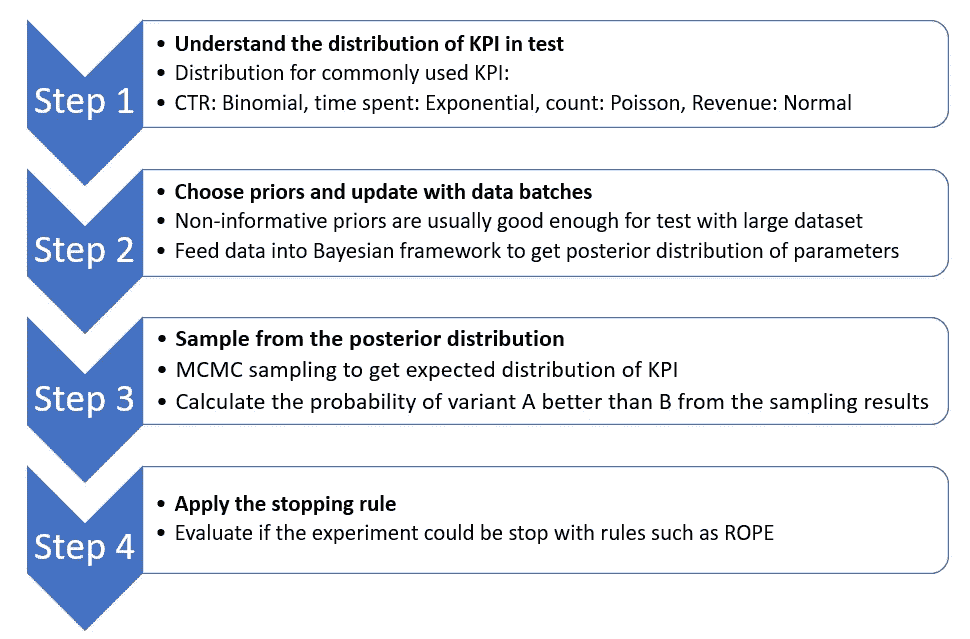
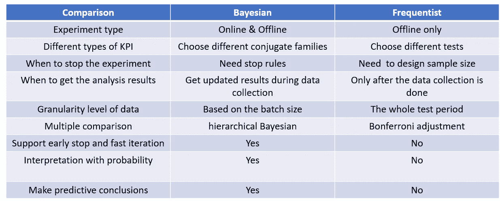

# A/B 测试分析从频率主义方法到贝叶斯方法的转换

> 原文：<https://towardsdatascience.com/switching-from-a-frequentist-approach-to-bayesian-for-a-b-testing-analysis-b5b5eae0ce5e>

## 从技术和业务角度概述两种方法之间的主要差异

卡蒂亚·奥斯丁在 [Unsplash](https://unsplash.com?utm_source=medium&utm_medium=referral) 上拍摄的照片

当分析 A/B 测试结果时，贝叶斯方法可以在许多不同的方面取代传统的频率方法。此外，从实现到解释，贝叶斯方法可能与频率主义方法非常不同。

如果您对从传统的频率主义方法转换到贝叶斯方法感兴趣，该博客从业务角度和技术角度总结了两种方法之间的主要差异。

# 1.理论差异概述

虽然这个博客并不关注 A/B 测试的基础，但是我想提供一个关于使用贝叶斯方法的**分析过程的一般概念:**

作者图片

现在让我们强调一下贝叶斯方法和频率主义方法的一些理论差异。

* **何时分析测试数据**

对于 Frequentist 方法，你需要先通过收集足够的样本来完成实验，然后再分析数据，这就把测试限定为“离线实验”。对于贝叶斯来说，分析可以在收集数据的实验过程中开始。随着新一批数据的到来，贝叶斯分析会提供更新的结果，直到我们得出假设检验的结论。这个过程使得贝叶斯的“在线实验”成为可能，节省了时间和资源。有关更多讨论，请参见下面的第 3 节。

* **测试中 KPI 的数据分布:**

这两种方法都需要了解数据分布。对于 Frequentist，根据您想要测试的 KPI 的分布情况，需要进行不同的测试[Ref。1]:

参考文献。一

对于贝叶斯，不同分布的 KPI 需要不同的共轭族。例如，像 CTR(点击率)这样的 KPI 将使用 Beta-二项式共轭进行更新。我们需要为 Beta 分布设置先验(a 和 b 的参数)，使用收集的数据更新 Bayes 规则，并获得 a 和 b 的更新参数的后验。然后，我们使用 MCMC 从后验分布中采样，并对测试结果进行推断。

* **样本量**

Frequentist 要求在实验前计算样本量。此外，一些测试，如 t-test，有假设，测试组中的样本数需要平衡，以保持假设。作为比较，贝叶斯不需要预先定义的样本大小，并且允许在测试组之间存在一些不平衡的样本大小。

* **测试结果说明**

对于频率主义者，结论可能是“我们拒绝/未能拒绝变量 A 优于 B 的假设”。这个结论是基于对整个测试期间收集的历史数据的观察。
对于贝叶斯来说，结果可以用概率来表示，比如“变体 A 以 98%的概率优于 B”。

# 2.从商业角度看贝叶斯的优势

A/B 测试是帮助做出商业决策的工具。通常，LOB 或业务合作伙伴希望了解并从分析中学习，而不需要了解太多统计数据的细节，如 p 值或 CI。在商业环境下，用贝叶斯方法解释 A/B 测试结果比 Frequentist 有一些天然的优势:

1) **结果用概率更容易理解。**作为一种概率方法，贝叶斯方法提供了一种可能性，即哪种变体比其他的更好。这种概率结果量化了对业务结论的信心，因此与 Frequentist 方法使用的 p 值相比，对于没有统计学背景的人来说更容易理解。

2) **通过在线实验可以实现更快的迭代。**贝叶斯分析支持在线实验中的早期停止，这实现了更快的测试迭代。基于你选择的更新频率，每一批数据进来后结果都会得到更新，不需要等到概率达到 99%才停止测试。

考虑这样一种情况，在运行测试 3 天后，贝叶斯给出了变体 A 优于变体 b 的概率为 80%。当您继续收集数据 2 天以上时，这一概率可能会继续增加到 99%,但如果您已经对 A 以 80%的概率更好的结果感到满意，则不必再等两天。那么测试可以在这里停止，您可以通过快速切换到另一个测试来节省时间和资源。

3) **贝叶斯结果可以用来做预测。**这与 Frequentist 方法有很大不同，frequent ist 方法给出实验期间收集的样本的汇总统计数据。因为这些描述性的统计数据是基于历史观察的，所以你不能对未来看不见的数据做出任何结论。相反，贝叶斯方法从数据中学习参数的分布，并根据观察到的数据给出未观察到的未来值的后验预测分布。因此，你可以做一个类似“变量 A 的 CTR 预计为 12%”的陈述，这是除了假设检验之外从 AB 检验中学习的一个好东西。

当然，贝叶斯并不是一个完美的方法。Frequentist 在估计实验长度方面有其优势。有了设计好的样本量，就有可能根据实验过程中获得的样本数量来估计需要多长时间。至于贝叶斯，很难预测需要多长时间才能得出结论，变体 A 更好的概率是 99%。每天获得更多的样本有助于获得更有信心的结论(随着概率的增加)，但是我们不知道这个特定的实验需要多长时间。然而，根据我的经验和实践，贝叶斯方法通常会给出稳健的结果，而频率主义方法只需要较少的样本。

# 3.从技术角度来看会有什么

有了上面提到的所有优点，我希望你已经对将贝叶斯分析应用到你的 A/B 测试中感兴趣了。所以下一个问题是:实施贝叶斯方法有多困难？答案是，它可能需要更多的考虑:

## 3.1 离线实验或在线实验

首先，你需要弄清楚你更喜欢线下实验还是线上实验:

*   **离线实验:**

您在完成数据收集后开始分析，因此贝叶斯框架只需要用所有收集的数据更新一次。由于贝叶斯没有设计好的样本量，所以你不知道在完成分析后是否需要更多的样本。此外，你可能会花更多的时间收集数据，而贝叶斯可以用更少的数据给你一个结论。

*   **在线实验:**

随着实验的进行，你可以开始分析数据。贝叶斯框架将在实验期间多次运行并更新结果，但是您可以控制它运行的频率以及在您输入数据时的批量大小。在线实验支持快速迭代，因为一旦满足停止规则，您就可以停止实验。

我建议在线实验充分利用贝叶斯方法的优势——比频率主义方法做出更快的决定。

如果你决定使用在线实验，你需要选择多久运行一次分析，因为贝叶斯分批获取数据来更新结果。这种选择是灵活的，比如每天、每两天或每 8 小时更新一次结果，等等。此外，考虑你的业务需求——如果你想迭代得更快，使用高频率更新，这样一旦你达到你想要的结果，你就可以早点停止。它还可能取决于您的数据管道，比如您的数据库更新和获取新数据的频率。

## 3.2 输入数据的粒度级别

您可能需要对数据进行额外的预处理，因为粒度级别不同于 Frequentist 方法。Frequentist 的输入数据将被聚合到用户/ID 级别，因此它分析在测试期间为每个用户/ID 收集的所有数据。然而，在线实验中贝叶斯方法的粒度级别将取决于您执行贝叶斯更新的频率。选择更新频率后，作为预处理步骤，您需要相应地聚合数据。例如，您正在测试 CTR(点击率),更新频率为 24 小时，您将需要计算每天“看到的”事件总数和“点击”事件数，并有一个如下所示的输入数据框:

作者图片

## 3.3 多重比较

当您同时测试多个变量时，您可能会遇到多重比较问题。一个解决方案是使用分层贝叶斯方法。原因类似于将 Bonferroni 调整用于 Frequentist 方法。

## 3.4 优先权的选择

如果你有一个像样的样本量，比如几百个或者更多，那么使用一个非信息先验，因为它不会对你的结果有太大影响。

如果您的数据量很小，除非您非常有信心使用从历史数据中学习到的定制先验，否则非信息先验仍然是一个很好的选择，以避免不适当的先验带来的偏差。

那么什么时候使用你自己的先验呢？如果你有下列情况之一:1)你以前用大量历史数据做过类似的测试，2)你有一个收集的数据几乎不能代表的专家意见，3)你有有限的时间进行测试，并且对结果有一些专家知识和信心。

# 4.摘要

总之，从 Frequentist 转向 Bayesian 有一些考虑和挑战。但是我仍然认为，如果您正在寻找对业务合作伙伴更可解释的结果，或者希望在时间有限的情况下用更多的迭代来测试 fast，那么这些改变是值得的。我希望这篇博客能帮助你理解预期会发生什么，以及使用频率主义方法和贝叶斯方法分析 AB 测试结果的主要区别。感谢您的阅读！

作者图片

## 💖**喜欢这个故事？DS 和 ML 粉丝请随意** [**订阅邮件列表**](https://mingjie-zhao.medium.com/subscribe) **，** [**成为会员**](https://medium.com/@mingjie-zhao/membership) **！**🤩

## 这篇博客最初发表在我的个人网站上。

**参考文献**
1)维基[https://en.wikipedia.org/wiki/A/B_testing](https://en.wikipedia.org/wiki/A/B_testing)