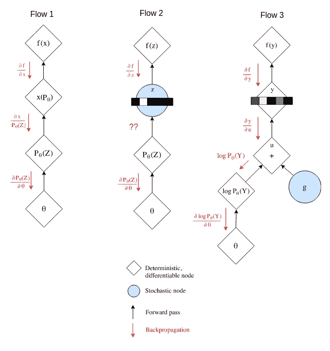
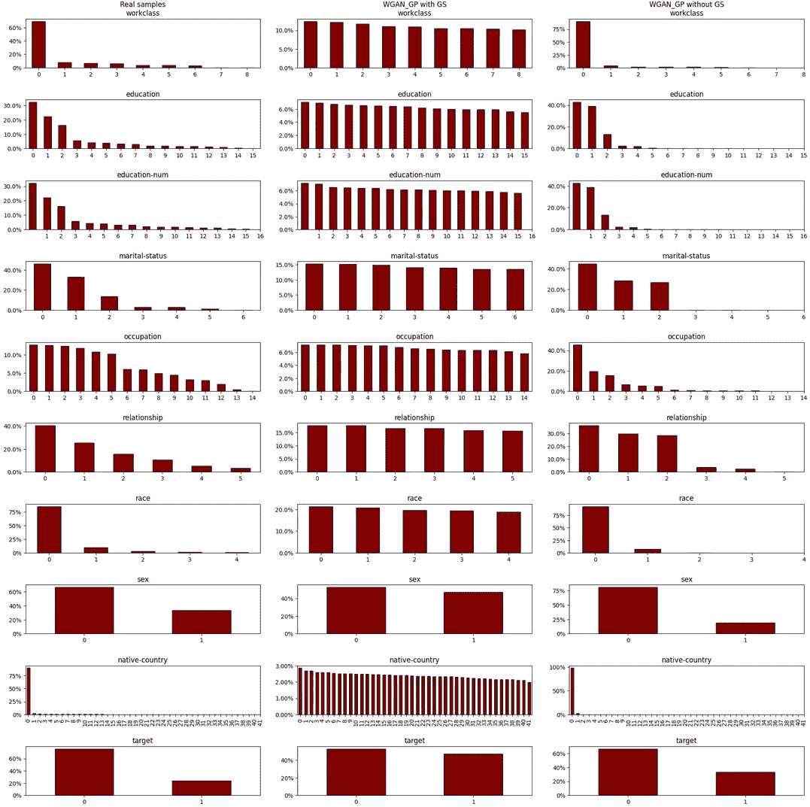

# Gumbel-Softmax 激活的合成数据

> 原文：<https://towardsdatascience.com/synthetic-data-with-gumbel-softmax-activations-49e990168565>

## 高质量分类数据合成实践

由 [Unsplash](https://unsplash.com/s/photos/categories?utm_source=unsplash&utm_medium=referral&utm_content=creditCopyText) 上的 [v2osk](https://unsplash.com/@v2osk?utm_source=unsplash&utm_medium=referral&utm_content=creditCopyText) 拍摄的照片

在分类中，一个中心问题是如何有效地从离散数据格式(分类或顺序特征)中学习。大多数数据集给我们带来了这个问题，所以我想公平地说，几乎所有的数据科学家都在某个时候面临过这个问题，对吗？)。

尽管存在不同的技术可以减轻它，但这是一个需要妥协才能解决的问题。选择留给了数据科学家，无论是否意识到，一个糟糕的选择会对结果产生负面影响。

Gumbel-Softmax 是最近推出的一个非常有趣的激活层，可以帮助我们做到这一点。我写这篇文章是为了演示它试图解决的问题，向您介绍 Gumbel-Softmax 的核心思想，并帮助您使用开源代码在自己的管道中实现它。如题所示，我们将采用数据合成方法，并在 GANs 上进行试验。

我们开始吧！

# 分类特征合成的快速回顾

在日益以数据为中心的[人工智能社区中，合成数据正成为一个热门话题。如果这个话题在某个时候引起了你的注意，那么你可能也听说过不到 10 年前引入的](https://www.deeplearning.ai/wp-content/uploads/2021/06/MLOps-From-Model-centric-to-Data-centric-AI.pdf)[生成对抗网络](https://arxiv.org/abs/1406.2661)，但从那以后在输出质量和应用范围方面取得了很大进展。事实上，有大量跨各种任务的真实合成数据生成示例，例如:

*   [文本到图像](https://arxiv.org/pdf/2104.00567.pdf)
*   [图像风格转换](https://arxiv.org/pdf/1703.10593.pdf)
*   [图形结构化数据](https://arxiv.org/pdf/1805.11973.pdf)
*   [时间序列数据](https://proceedings.neurips.cc/paper/2019/file/c9efe5f26cd17ba6216bbe2a7d26d490-Paper.pdf)

[表格数据](https://arxiv.org/pdf/1811.11264.pdf)合成是另一个有趣的应用，它更加普遍，并且与本文的重点——分类数据密切相关。

在训练合成器之前，我们可以预处理我们的特征。在分类特征的情况下，使用一键编码将离散特征转换为 1 和 0 的稀疏块。将分类特征等符号输入转换为稀疏数组允许神经网络(NN)模型以类似于数字连续特征等非常不同的特征格式来处理数据。

一个例子:

在一次性编码之前，我们的分类数据可能看起来像这样

在应用了一键编码后，我们现在每个类别都有了新的列

GAN 生成器试图从真实数据中合成稀疏分类输入。然而，就像[多层感知器](https://en.wikipedia.org/wiki/Multilayer_perceptron)一样，在没有适当的激活函数的情况下进行预测时，经常输出的是[逻辑](https://en.wikipedia.org/wiki/Logit)，即可能看起来像这样的非归一化概率分布:

logits 输出示例

看看这个。混乱，在这种情况下，我们在寻找二进制输出，不是吗？生成可用的记录需要我们推断出合理的特征值:我们必须以某种方式对逻辑进行采样(例如，使用激活度最高的类)；此外，这看起来像是 GAN 鉴别器识别假样本的潜在标志。我承认我不确定最后一点是否如此简单，但如果鉴别器能够根据*和*的样子(浮点向量而不是单热向量)来区分真实和合成样本，那么它将成为一个完美的鉴别器。完美的鉴别器将使发生器基于[无限最小最大损失](https://developers.google.com/machine-learning/gan/loss)更新其参数(从等式中可以看出，如果鉴别器对真实样本的估计为 1，对虚假样本的估计为 0，将会发生什么)。预期结果？发电机组不可能汇合！

像 Softmax 和 Gumbel-Softmax 这样的激活函数使我们能够将 logits 的输出转换成易于采样的分类分布。以上示例的 Softmax 输出如下所示:

通过应用 Softmax，我们将对数转换为分类分布

现在，让我们更详细地了解一下什么是 Softmax 和 Gumbel-Softmax，以及它们对我们的合成样品的分类特征有何作用！

# Softmax 和 Gumbel-Softmax 激活

Softmax 是一个可微的函数族。正如我们所看到的，他们将一个 logits 数组映射到分类分布，即值在[0，1]范围内且总和为 1 的数组。然而，这些样本无法帮助我们进行梯度下降模型学习，因为它们是从随机过程中获得的(与模型参数无关)。我们的生成器执行的操作需要是可微分的和确定的，以便我们能够将梯度从一端流向另一端。

Gumbel-Softmax (GS)是一种特殊的 Softmax 函数，于 2016 年推出(有趣的事实:巧合的是，它是由两个独立的团队同时提出的)[【1】](https://arxiv.org/abs/1611.00712)[【2】](https://arxiv.org/abs/1611.01144)。它的工作方式类似于 Softmax 的连续逼近。不是直接使用 logits[Gumbel 分布](https://en.wikipedia.org/wiki/Gumbel_distribution)而是在 Softmax 操作之前添加噪声，以便来自生成器的样本成为确定性成分(由分类分布的均值和方差参数化)和随机成分(gum bel 噪声)的组合，这有助于我们在不增加过程偏差的情况下进行采样。

温度参数，通常称为 tau 或 lambda，定义在]0， *inf* 中，作为旋钮来定义 Softmax 的指数运算的基数。这个参数通常保持接近 0。较高的基数接近均匀分布，接近 0 的基数接近真实的分类分布。

下图显示了三个不同的流试图做同样的事情，检索分类样本并计算所有模型参数的可区分损失。

流程 1 —可区分和确定性采样策略(p . e . arg max)；流程 2 —可区分的随机抽样(对分类分布进行抽样)；流程 3——gum bel-soft max 采样，可区分随机和确定性成分。图片作者，改编自[【2】](https://arxiv.org/pdf/1611.01144.pdf)

在流程 1 中，我们使用类似于 *x* 中的 [argmax](https://en.wikipedia.org/wiki/Arg_max) 的[软版本](https://github.com/MWPainter/cvpr2019/blob/master/stitched/soft_argmax.py)的操作来检索单热样本(基本 argmax 是不可微的)。反向传播工作正常，红色操作允许梯度从样本损失流向发生器参数。不方便的部分是，argmax 是一个赢家采取所有功能。最有可能的类别被采样，并且我们的合成样本很有可能永远不会包括少数类。*嘘！*

在流程 2 中，我们没有发现赢家采取所有行为，我们实际上可以根据我们的真实分类分布获得真实的样本。太好了！对吗？不幸的是，不，抽样过程的随机性质将不允许梯度流回我们的模型参数，这意味着没有学习。还有一些替代策略，如直通策略，通过假设采样操作的梯度不变来解决这一问题。这将允许梯度流动，但会有偏差。[【2】](https://arxiv.org/pdf/1611.01144.pdf)有更多关于这个估算器的信息。

流 3 是 Gumbel-Softmax，也许你听说过[重新参数化技巧](https://arxiv.org/pdf/1312.6114.pdf)。在这里，我们可以看到它的巨大应用效果！关键是在 Gumbel 噪声比例保持不变的情况下，通过改变 logit 比例来调整 logit 和 Gumbel 噪声比例。基于对其自身逻辑的信任，模型将倾向于均匀分布(降低比率)或其分类分布的预测(增加比率)。由于节点 *y* 仍然不是一个独热编码向量，我们可以通过两个计算来解决这个问题。我们使用 *y* 在训练时间完成我们的梯度计算图，并在预测时间从中检索分类样本。鉴别器将对这种一热样品进行操作，但梯度将通过 *y* 操作。

现在我们已经看到了 Gumbel-Softmax 激活背后的理论，让我们转向实际部分，分类数据综合！

# 综合分类特征比较

为了生成合成数据，我们将使用 [YData 合成包](https://github.com/ydataai/ydata-synthetic)。在最近的更新中，所有常规数据合成器都引入了 [Gumbel-Softmax 激活](https://github.com/ydataai/ydata-synthetic/blob/dev/src/ydata_synthetic/utils/gumbel_softmax.py)。以下是基本 Gumbel-Softmax 层实现的一个片段:

Gumbel-Softmax 层实现。请注意调用方法的返回:hard_sample 是采样的 one-hot 输出，soft_sample 是 softmax 分类分布

这里我们用两个版本的 [Wasserstein GAN 用梯度惩罚实现](https://github.com/ydataai/ydata-synthetic/blob/feat/pate_methods/src/ydata_synthetic/synthesizers/regular/wgangp/model.py)[【3】](https://arxiv.org/pdf/1704.00028.pdf)。包含 Gumbel-Softmax 的标准版本和不使用它的覆盖版本。这两个版本本质上是相同的，您可以在下面的代码片段中看到:

一个简单的基本合成器覆盖移除了传递的 *activation_info* 参数，这样我们就可以拥有一个没有 Gumbel-Softmax 激活的生成器。也就是说，没有 Gumbel-Softmax 生成器永远不会执行第 12 行。

合成器使用[成人数据集](https://archive.ics.uci.edu/ml/datasets/adult)进行训练，下面您可以看到 workclass 功能的一些生成器样本输出(我只选择了一个功能，因为完整的样本有 120 列):

无 Gumbel-Softmax 激活的生成器工作类特征输出。作者图片

带有 Gumbel-Softmax 激活工作类特征输出的生成器。作者图片

现在让我们来看看原始样本的统计分布，有和没有 GS 实现:

成人分类特征的等级分布条形图。从左至右 1)原始样品，2)带 Gumbel-Softmax 激活的 WGAN-GP，3)不带 Gumbel-Softmax 的 WGAN-GP。作者图片

我希望此时你能对上面的结果得出一些结论。无论如何，以下是我的:

1.  没有一个合成样本能够很好地捕捉分类分布。但是，公平地说，模型或训练条件并没有针对这种情况进行优化，我相信这些变化会有很大的帮助。
2.  带有 Gumbel-Softmax 的合成器产生几乎一致的样本。
3.  没有 Gumbel-Softmax 的合成器产生的样本接近于 winner 的所有行为。

# 包扎

我们总结了一些关键点，这些关键点与我们走过的 Gumbel-Softmax 和分类特征综合理论中的预期一致。

非常欢迎您使用我用来产生结果的示例笔记本，您可以在这里找到它！如果您想尝试增强原始示例，也可以随意克隆或派生该项目并摆弄源代码。调整每个示例的 Gumbel-Softmax 激活的参数*τ*可以帮助我们近似真实的分类分布。

最后一点，如果你想加入一群合成数据爱好者，讨论论文、数据集、模型或解决你在途中发现的一些问题，你也可以加入[合成数据社区](https://syntheticdata.community/)。我和我的同事会很高兴看到你在那里！

这是我在《走向数据科学》中的第一篇文章，感谢您阅读它，我希望您发现它很有用，并且您设法学到了一些新东西。

# 参考资料:

[1] C. J .马迪森，A. Mnih 和 Y. W. Teh，具体分布:离散随机变量的连续松弛(2016)，arXiv

[2] E. Jang，S. Gu，B. Poole，Gumbel-Softmax (2016 年)的分类重新参数化，arXiv

[3]I . gullajani，F. Ahmed，M. Arjovsky，V. Dumoulin，a .库维尔，Wasserstein GANs 的改进培训(2017 年)，arXiv