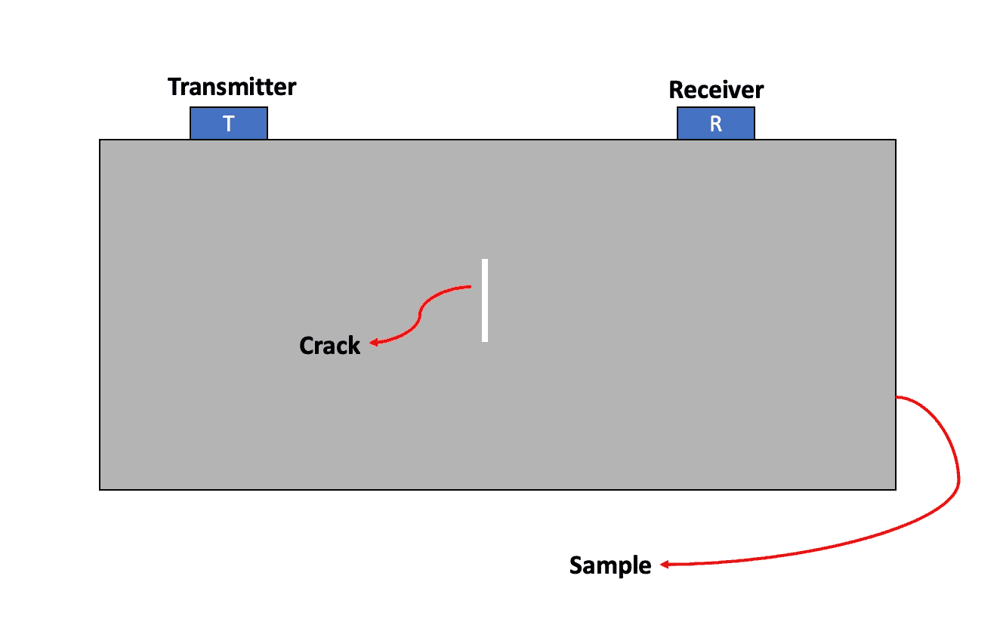
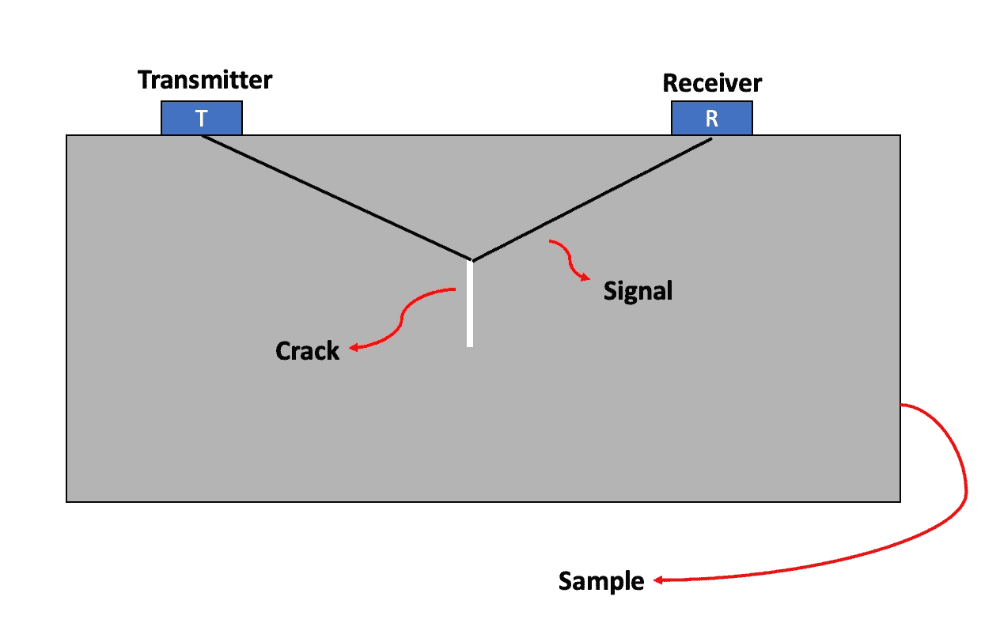
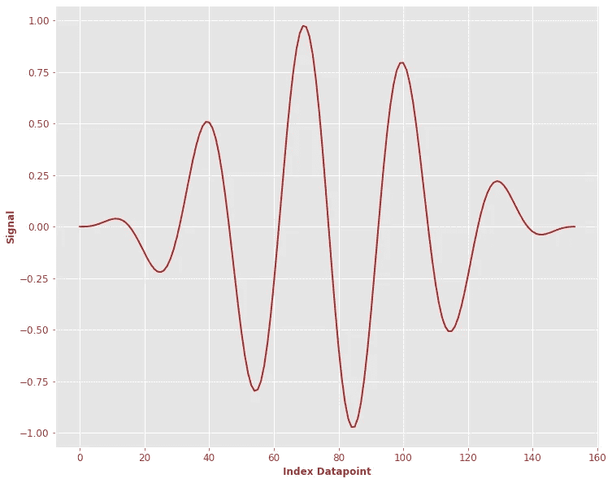

# 使用 Python 为工程师生成合成信号

> 原文：<https://towardsdatascience.com/synthetic-signal-generation-for-engineers-using-python-fee023ad5aec>

## 使用 Python，用几行代码实现信号生成

Clint Bustrillos 在 [Unsplash](https://unsplash.com/s/photos/engineer?utm_source=unsplash&utm_medium=referral&utm_content=creditCopyText) 上的照片

# 1.介绍

想象你的膝盖疼痛。你去看医生，你想知道你的腿是否骨折了。

现在想象一下，医生给你以下的回应:

> “为了了解你的腿是否骨折，让我先折断另一条腿，看看它们看起来是否相似”

我肯定你会马上换医生。:)

尽管如此，这也是我们在工程中最常对组件做的事情！
如果你想测试你的钢笔什么时候会断，你要做的是下面的程序:

1.  你以一种循环的方式给笔施加压力(所谓的**疲劳**)，然后看看多少次循环后你的笔就断了。
2.  你重复一遍。对于趋于无穷大的 N(一个相当大的 N)笔，你记录下你的转折点。
3.  你看一下分布，并试图从中获得一个有洞察力的值(第一、第二、第三四分位数、平均值、标准差、分布拟合……)。

现在…如果你没有笔，只有一个**机翼，你会做同样的事情吗？**好吧，如果你看第二点。你必须让 N 趋向于无穷大的机翼。当然是不可行的。

# 2.非破坏性检查

进行测试时不破坏部件状态的工程分支称为<https://en.wikipedia.org/wiki/Nondestructive_testing>****(NDT)**。**

**NDT 的正式定义(维基百科)如下:**

> ****“无损检测** ( **NDT** )是科学技术工业中用于评估材料、部件或系统性能而不造成损坏的一大类分析技术中的任何一种”**

**这和我们之前描述的差不多。**

**想象一下，你知道有一个样品(组件),它的中间有一个裂缝。像这样:**

****

**作者图片**

**你要做的是使用超声波测量(使用你在图中看到的发射器和接收器)，来估计裂缝的时间、位置和大小。为了做到这一点，你使用一个波的**发射器**(可能是**超声波**)和一个**接收器**，顾名思义，它接收发射器发出的波。**

**事情大概是这样的:**

****

**作者图片(图 1)**

**信号在裂缝的顶端反弹，并从发射器移动到接收器(黑线)。**

**这是测试一种材料(样品)健康状况的极好方法:如果样品中有裂纹，你希望信号的物理特性“通知”你有裂纹。当然，这样做的效用是，如果你不知道一种材料是否有裂纹(顺便说一下，这是事实)，你可以检查信号是否是一个有裂纹的组件的信号。**

**这个时候，你应该很兴奋地想知道信号是什么样子的。让我们一起来看看。**

# **3.解析表达式**

**该信号由一个**音**和一个**脉冲**发出。现在信号的解析表达式很宽泛，但是它依赖于一定数量的参数:**

*   ****信号长度:**发送/接收的信号有多长**
*   ****周期数:**是信号周期性振荡的次数(我保证会更清楚)**
*   ****激励的频率****
*   ****采样频率****

**现在，给定所有这些信息，正如我所说的，我们有我们的**基调:****

****

**作者图片**

**当然， **t(x)** 是我们的音调，N_cycles 是循环的次数，并且:**

****

**作者图片**

**而**突发**的表达式如下:**

****

**作者图片**

**我们知道:**

****

**作者图片**

**其中 L 是信号的长度。我们最后的**音调突发**如下:**

****

**作者图片**

**你可能会问这看起来像什么？大概是这样的:**

****

**作者图片**

**让我们一起用 Python 来构建它:**

# **4.数值实现**

**这是我们使它工作所需的代码:**

1.  **导入库:**

**2.数值实现(带有一些随机默认值):**

**3.情节:)**

# **5.循环数和傅立叶变换**

**正如您在分析表达式中看到的,**周期数**起到了**频率**的作用，顾名思义，它给出了音调突发的起伏次数。**

**让我展示给你看:**

**正如您在左栏中看到的，周期数对应于信号的起伏，而在右栏中，您看到的是傅立叶频谱(幅度)，其峰值就在周期数的右侧。**

# **6.复杂信号**

**现在，我给你看的只是裂缝的顶端反射(图 1)。底部尖端也有它的反射，如果裂纹不是直的，可以产生大量复杂的扫描。您可以使用以下代码轻松创建更复杂的信号(由一系列音调突发组成):**

**让我给你看一些例子:**

# **7.摘要**

**让我们总结一下我们接触到的一些要点。**

1.  **对有裂纹部件的超声波实验输出了一个众所周知的 A 扫描函数，称为**音频脉冲****
2.  **音频脉冲可以有**不同的参数**，这些参数在它出现在 A 扫描上的方式中起着至关重要的作用**
3.  **有时，**多次反射**可以创建一个非常复杂的 A 扫描。**

# **8.结论**

**如果你喜欢这篇文章，你想知道更多关于机器学习的知识，或者你只是想问我一些你可以问的问题:**

**A.在 [**Linkedin**](https://www.linkedin.com/in/pieropaialunga/) 上关注我，我在那里发布我所有的故事
B .订阅我的 [**简讯**](https://piero-paialunga.medium.com/subscribe) 。这会让你了解新的故事，并给你机会发短信给我，让我收到你所有的更正或疑问。
C .成为 [**推荐会员**](https://piero-paialunga.medium.com/membership) ，这样你就不会有任何“本月最大数量的故事”，你可以阅读我(以及成千上万其他机器学习和数据科学顶级作家)写的任何关于最新可用技术的文章。**