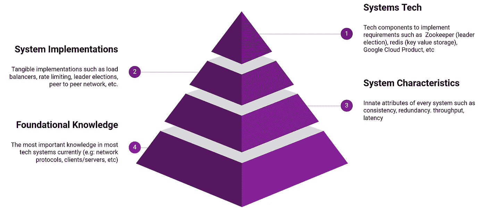

# ML 工程师系统设计速成班

> 原文：<https://towardsdatascience.com/systems-design-crash-course-for-ml-engineers-aafae1cf1890>

## 数据科学家和 ML 工程师的探索

# ML 工程师系统设计速成班

## 促进职业发展的基本系统设计


来源 [Unsplash](https://unsplash.com/photos/21mJd5NUGZU)

# 问题陈述

在大型科技公司，推出 ML 模型是复杂的。你推出的每一个 ML 模型，都会和多个复杂系统交织在一起。在实践中，你需要明白[没有免费的午餐](https://machinelearningmastery.com/no-free-lunch-theorem-for-machine-learning/)，不同的 ML 解决方案需要适应头脑中系统的复杂性。

这意味着，你需要基本的系统设计理解来帮助你实现一个合适的 ML 操作实践。理解系统设计和 ML Ops 最佳实践将极大地帮助你[减少技术债务并可扩展地推出你的模型](/intro-to-ml-ops-tensorflow-extended-tfx-39b6ab1c7dd7)。

在这篇文章中，我想分享一下基于我在大型科技公司工作四年的知识的系统设计基础。这门速成课程旨在解释大型科技公司经常依赖的非常基本的系统。

相信这篇文章会帮助你在工作中产生 10 倍的影响，在系统设计面试中表现出色。

# 目录

*   系统理解基础
*   客户机-服务器体系结构
*   国际电脑互联网地址
*   网络协议
*   储存；储备
*   潜伏
*   有效性
*   对等网络
*   轮询和流式传输
*   限速
*   发布和订阅(发布订阅)
*   下一步是什么

# 系统理解基础



系统理解层级(由作者使用 Google 幻灯片生成)

# 客户端-服务器体系结构:

> 当阿里巴巴说芝麻开门！到互联网的汪洋大海

*   **客户端**是一台与服务器对话的机器。
*   **服务器**是一种监听客户端然后做出响应的机器。

比如用网页浏览器浏览`google.com`的时候。你的网络浏览器不会神奇地渲染`google.com`，而是与服务器`google.com`通信，以理解应该渲染什么。你的网络浏览器(例如:Google Chrome)是客户端**和服务器`google.com`来响应你的请求。**

每个客户端和服务器都有一个 **IP 地址**，表示每台机器的唯一标识符。这由 32 位(IPV 4)或 128 位(IPV 6)确定，例如 127.0.0.1(本地主机)。例如，google.com 有一个 IP 地址(8.8.8.8/8.8.4.4)，您可以在 UNIX 服务器命令中使用`dig <address>` 找到它，或者在 Windows 中安装 [dig 命令。](https://help.dyn.com/how-to-use-binds-dig-tool/)

主机名到 IP 地址的映射存储在类似黄页的名为**域名系统(DNS)** 的中间服务器中。比如你在`google.com`上冲浪，你会输入`google.com`而不是 IP 地址。

此外，每个服务器还监听某个**端口**。当您与其他机器通信时，您需要指定在哪个端口上通信。打个比方，当我们向一个公寓发送邮件时，端口表示邮递员需要敲哪个房间。

您可以运行`nc -l 8081`，它允许您**读写**或**指定服务器**，用符号`nc <IP address/localhost> <port>`作为`nc 127.0.0.1 8081`。这将指定发送数据和监听端口的含义。在大多数情况下，`127.0.0.1`表示 localhost，这是您当前的本地机器地址。

# **IP 地址**

> 我授予你 8.8.8.8 作为谷歌骄傲地接受

简单地说， **IP 地址**是一个互联网协议的地址。当一台机器与其他机器交互时。数据将在 IP 数据包中发送，该数据包在机器之间建立通信块。

一般来说，IP 包含报头和内容，如下所示:


知识产权结构(来源于作者)

# 网络协议

> 机器如何相互通信

**网络协议是两台或多台机器之间达成一致的通信规则。**

一个简单的类比是想象当我们在假期遇见我们的朋友。一见面，我们会说“你好”，坚定地握手，并在挥手告别之前开始一些小的交谈。这些小动作是不成文的协议，启动和结束我们的互动。

类似地，网络协议定义了启动和结束机器交互的惯例。

**一般来说，我们使用 TCP 和 HTTP 作为常见的网络协议:**

*   **传输控制协议** ( **TCP)** 通过跟踪数据包的顺序和准确性，让你可以发送任意长的数据。如果分组数据内容被破坏。TCP 将要求服务器重新发送数据包。
*   **超文本传输协议安全(HTTP)** 在端点上向 TCP 约定添加结构，例如状态代码、方法、业务逻辑(异常/错误)。这使得网络(例如:互联网)内的通信健壮且可维护。它表示带有 HTTP 头和内容的消息。带有 HTTP 的简单消息可以显示如下:

```
method:’POST’
path: ‘/submit’
headers: {
   'content-type': 'application/json',
   'content-length': 30} statusCode: 200
headers:{
},body: '{}
}
```

*   **超文本传输协议安全** ( **HTTPS** )是 HTTP 的扩展，用于[计算机网络](https://en.wikipedia.org/wiki/Secure_communications)上的安全通信。使用[传输层安全](https://en.wikipedia.org/wiki/Transport_Layer_Security) (TLS)或安全套接字层(SSL)对[通信协议](https://en.wikipedia.org/wiki/Communication_protocol)进行加密。这是目前最常用的协议。

# 储存；储备

> 你储存的东西造就了你

每个系统都需要存储器来存储数据。存储的一个例子是存储和检索数据的数据库服务器。这为其他计算机检索和写入数据库创建了连接。

关于存储，有许多重要的因素需要讨论，但总的来说，我们可以总结如下。


关键数据库重要术语(来源于作者)

# 潜伏

> 数据穿过一个系统需要多长时间？

**延迟**是用客户端读取数据或从服务器接收答案所花费的时间来衡量的。

在电子竞技比赛或高频交易等近乎实时的反馈非常重要的系统中，延迟非常重要。

延迟方面的小妥协可能会导致非常差的用户体验，甚至是巨大的收入损失，而其他系统可能会在延迟和准确性之间进行权衡，例如选举投票。

**一般来说，延迟会随着客户端-服务器距离和存储类型的不同而增加:**

*   读取 1 MB 内存= 250 微秒
*   读取 1MB 固态硬盘= 1，000 微秒
*   发送 1 MB 1Gbps 网络= 10，000 微秒
*   发送 1 MB 硬盘= 20，000 微秒
*   数据包 CA → NL → CA = 150，000 微秒

# 有效性

> 不再有会削弱经济的停机事件

**可用性**解释了系统对故障的抵抗能力(容错能力)。

**可用性对于有巨大失败风险的服务非常重要，例如:**

*   **机场控制塔**，飞机依靠方向来协调着陆。
*   用户在酒吧喝酒后依靠拼车应用(例如:优步、Gojek、Grab)在深夜出行？
*   [**云提供商(例如:Google Cloud Product，AWS)**](https://www.zdnet.com/article/google-heres-what-caused-our-big-global-outage/) 数以百万计的企业依靠其服务于核心业务(例如: [Vimeo](https://cloud.google.com/customers/vimeo) )

**一般来说，可用性可以用这个来衡量:**

> 可用性(%) =系统正常运行天数/一年中的天数

例如，如果系统仅运行半年，那么可用性将为 50%。如果一款拼车应用只有一半的使用时间，那么它将永远无法在市场上生存。

## 数九个

大型科技公司通常通过计算 it 拥有的 9 来衡量可用性:

*   [90 %的可用性→1/9](https://en.wikipedia.org/wiki/High_availability)
*   99%的可用性→两个 9
*   [99.9%](https://en.wikipedia.org/wiki/High_availability) [可用性](https://en.wikipedia.org/wiki/High_availability) [→三个九。](https://en.wikipedia.org/wiki/High_availability)

一般来说，大的科技公司保证 4 个 9 是他们服务的黄金标准。达到 4 个 9 的系统称为“高可用性(HA)系统”。云提供商( [GCP](https://cloud.google.com/blog/products/databases/scale-globally-get-four-nines-availability-with-new-cloud-bigtable-capabilities) 、[亚马逊](https://docs.aws.amazon.com/wellarchitected/latest/reliability-pillar/s-99.99-scenario.html))在其服务水平协议(SLA)中对 HA 有最低要求。

这就是为什么大型科技公司需要雇佣有才华的[可靠性工程师](https://careers.google.com/jobs/results/?company=Google&company=YouTube&employment_type=FULL_TIME&gclid=CjwKCAiA5t-OBhByEiwAhR-hm_k40I50kHBdCQRNxGINQijgwYzHWSyaLI8tWA9n-YwXOwJH2AXrcxoCXZEQAvD_BwE&gclsrc=aw.ds&location=Singapore&q=Software%20Engineer&sort_by=relevance&src=Online%2FHouse%20Ads%2FSKWS_Cloud_APAC)和 devops 工程师来保证高可用性标准。没有他们，我们就不会有我们通常认为理所当然的可靠服务！

## 冗余提高可用性

冗余很简单，我们希望通过分发更多的服务器来确保我们的系统没有单点故障。

这意味着您需要创建冗余服务器来满足客户端请求，包括:

*   **被动冗余**，其具有多个组件以继续平稳运行操作。例如，如果一台网飞服务器出现故障，我们可以让其他服务器接管负载。
*   **主动冗余**形成一种结构，当分布式系统出现故障时，多个系统可以协调工作。实现自动化流程编排的一种常见方法是[领导者选举](https://en.wikipedia.org/wiki/Leader_election)。

# 对等网络

> 将大文件部署和传输到大量机器上

**对等网络**是机器的集合(例如:在文件分发系统中),这些机器在它们之间分配工作负载以更快地完成工作负载。

对等网络的思想是将大文件拆分成块发送给对等方(别名:对等网络中的一组机器)。这种交流会产生连锁反应，迅速传播信息。

## 八卦协议

点对点网络协议，用于指示集群中的机器以不协调的方式相互通信，从而在没有中央服务器的情况下传播信息。每个对等体将把消息块映射到拥有它们的对等体运营商。最终，这些消息将在多台机器上传播。

这方面的一个例子是向对等方共享文件块的 torrenting。对等机接管、收集并串成块来下载大文件。

另一个广为人知的例子是优步的[北海巨妖，它每天分发 100 万个气泡。我强烈推荐你读这本书。](https://github.com/uber/kraken)

> 我们最繁忙的北海巨妖生产集群每天分发超过 100 万个 blobs，每天分发 100，000 个，总大小为 1GB 或更大。此外，在生产高峰期，北海巨妖能够在 30 秒内分发 20，000 个 100MB 到 1GB 的 blobs。—北海巨妖工厂


来源于优步北海巨妖 Github。看看数据传播的速度有多快(非灰色)

# 轮询和流式传输

> 听着，你会找到答案的

*   **轮询**每隔一段时间定期获取数据进行更新
*   **流**通过保持两台机器或进程之间的开放连接，监听来自服务器的信息。

**为了说明轮询和流式传输，让我们想象一个聊天服务器。**

> **轮询:**让我们每隔 10 分钟听一次消息
> 
> **流:**每当我们收到响应时，我们就做出反应

在聊天应用中，通常使用流媒体，因为用户体验与消息更新的即时性直接相关。这是因为流打开了一个在套接字中完成的长期连接，套接字是其他机器可以即时通信的门户。如果用户每隔 30 秒才收到消息，他们将不会使用该应用程序。

对于具有固定时间间隔的案例，轮询会更好，以获取每日/每周/每月报告等信息。

# 配置(配置文件)

> 一站式掌控一切

**配置文件**提供了一组对系统至关重要的参数和常量。它通常用 JSON 或 YAML 编写，可以是静态的(硬编码)，也可以是动态的(存在于系统的应用程序代码之外)。

动态配置快；您可以创建一个 UI，通过单击一个按钮来切换它的值，但这是有风险的。例如，Git 和任何其他代码审查系统将不能用于检查系统变更。

在谷歌这样的大公司，有一些团队专门在动态配置的基础上创建审查系统，以使其更加安全。这样，我们可以在受控设置中使用快速动态配置。

# 限速

> 然后，我父亲在他身边坐下，搂着我哥哥的肩膀说:“一只接一只，伙计。一只鸟接一只鸟。”——安妮·拉莫特，[一只接一只](https://www.amazon.com/Bird-Some-Instructions-Writing-Life/dp/0385480016)

**速率限制**限制系统发送或接收的请求数量。它最常用于限制传入请求的数量，以防止垃圾邮件和拒绝服务(DoS)攻击，在这些攻击中，恶意用户试图关闭或破坏系统，使其对用户不可用。

速率限制可以在 IP 地址级别、用户帐户级别或区域级别强制实施，并且可以分层实施，例如每个客户端 1 秒 1 个请求，甚至 10 秒 5 个请求。实现速率限制的一个简单方法是 [Redis](https://redis.io/) (内存中键值存储)。

然而，速率限制并不一定能防止**分布式拒绝服务攻击** ( **DDoS)** ，这种攻击使用许多不同的来源，使得识别共谋更加困难。谢天谢地，[仍然有多种方法来检测恶意线程](https://phoenixnap.com/blog/prevent-ddos-attacks)并防止这种攻击

# 记录和监控

> 记录每一件重要的事情！

## 记录

日志记录记录了每个系统中的重要指标。

存储系统日志(如错误)对将来调试问题很有用。您可以将日志存储为 JSON 格式，并将其存储在数据库中(例如:Google StackDriver)。

## 监视

监控使用日志来管理系统要容易得多。

监控对于了解系统的性能和状态非常重要。举个例子，如果你只是推出一个购买电子书的新推荐。您可能希望收集与您的关键绩效指标(KPI)直接相关的重要见解，例如:

*   比更好的推荐多买多少？
*   消费者根据推荐购买什么类型的书籍

监控会测量一段时间内的数据，因此您知道什么是重要的。我在 Google Data Studio 上发布了一个[教程，你可以马上免费使用它来创建一个令人惊叹的仪表盘。还可以使用 Prometheus、Influx DB 和 Grafana 等工具创建带有警报系统的图表。](/the-basic-of-google-data-studio-72081f247220)


创建电晕跟踪器仪表板(来源于作者)

# 发布订阅(发布订阅)

> 传播和接收主题信息

发布订阅(Pubsub)是一个系统框架，用于设计将大量上下文信息传递给正确的客户端/中介服务器。一般来说，在每个发布订阅系统中有四个重要的实体:1)发布者，2)订阅者，3)主题，4)消息。


非常简单的 pubsub 通信系统(来源于作者)

**该图显示了一个简单的 pubsub 设计:**

*   发布者向主题发布消息
*   每个主题将把消息存储在持久存储器的队列中，并保持消息顺序。每个主题都提供了对消息的不同上下文理解。
*   激活后，订阅者从订阅的主题中提取消息。这意味着，订户 1 将接收关于这两个主题的消息，而订户 2 和 3 仅接收关于软件开发的消息。
*   此外，由于主题存储在持久存储中，因此可以保证消息会分发给订阅者。
*   消息在队列中的存储也意味着无论执行多少次，用户都将提取相同的消息。这意味着 pubsub 系统是幂等的(总是相同的结果)。

有很多工具可以帮助你构建 pubsub 系统，比如:[阿帕奇卡夫卡](https://hazelcast.com/lp/the-hazelcast-and-apache-kafka-transaction-processing-reference-architecture/?utm_campaign=Kafka&utm_source=google&utm_medium=cpc&utm_term=apache%20kafka&utm_content=adgroupid:132766362408%20creative:545441984358%20matchtype:e%20network:g%20device:c%20position:%20placement:&adgroupid=132766362408&creativeid=545441984358&campaignid=14637288712&gclid=CjwKCAiA8bqOBhANEiwA-sIlN_FYskDNtk8L7hFYj0vXG1Lxpw7ieWEszzzR4auxlbzbiJTy3ECp3xoCBUkQAvD_BwE)，[谷歌云 Pubsub](https://cloud.google.com/pubsub/?utm_source=google&utm_medium=cpc&utm_campaign=japac-SG-all-en-dr-bkws-all-all-trial-e-dr-1009882&utm_content=text-ad-none-none-DEV_c-CRE_497236473812-ADGP_Hybrid%20%7C%20BKWS%20-%20EXA%20%7C%20Txt%20~%20Data%20Analytics%20~%20Pub%2FSub_Global%20gap%20analysis-KWID_43700060670671898-aud-970366092687%3Akwd-88544065737&userloc_9072529-network_g&utm_term=KW_google%20cloud%20pubsub&gclid=CjwKCAiA8bqOBhANEiwA-sIlN8ACRMCyc7TqUG4DacXas6WWr7-HzQLrE4hvb-OSwBsKv_mFLGjZzRoCoMgQAvD_BwE&gclsrc=aw.ds)

# 下一步是什么

为了更好地理解你的系统设计技巧，我强烈推荐你阅读多恩·马丁的[系统设计入门。它包括了这里没有提到的其他概念，例如:Map Reduce、API 设计等。](https://github.com/donnemartin/system-design-primer)

如果你想了解更多关于软件工程、面试和职业指导的信息，请随时访问我的以下帖子或在 Linkedin 上联系我[:](https://www.linkedin.com/in/vincenttatan/?originalSubdomain=sg)

[](/write-your-own-amazing-data-science-blogs-8b9c19a4255d)  [](/how-i-cracked-ds-tech-interview-at-google-2aca19d21ea5)  [](/top-5-lessons-to-excel-in-data-analytics-interviews-24f5cf0605d1)  [](/data-analytics-is-hard-here-how-you-can-excel-aa2a99d0fad0)  

感谢 [Albert Bingei](https://medium.com/u/fcf6ad08f12d?source=post_page-----aafae1cf1890--------------------------------) 对本文的评论、阅读和令人兴奋的反馈。

索利·德奥·格洛丽亚

# 关于作者

文森特用 ML @ Google 对抗网络滥用。文森特使用高级数据分析、机器学习和软件工程来保护 Chrome 和 Gmail 用户。

除了在谷歌的工作，Vincent 还是佐治亚理工学院计算机科学硕士校友、三项全能运动员和数据科学媒体的特约作家，该媒体在全球拥有 100 多万观众。

最后，请通过 [**LinkedIn**](http://www.linkedin.com/in/vincenttatan/?source=post_page---------------------------) **，**[**Medium**](https://medium.com/@vincentkernn?source=post_page---------------------------)**或** [**Youtube 频道**](https://www.youtube.com/user/vincelance1/videos?source=post_page---------------------------) 联系文森特