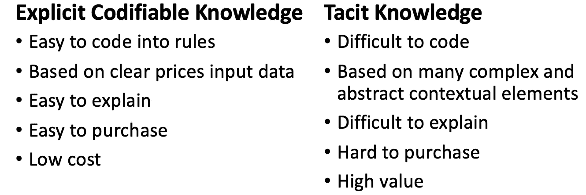
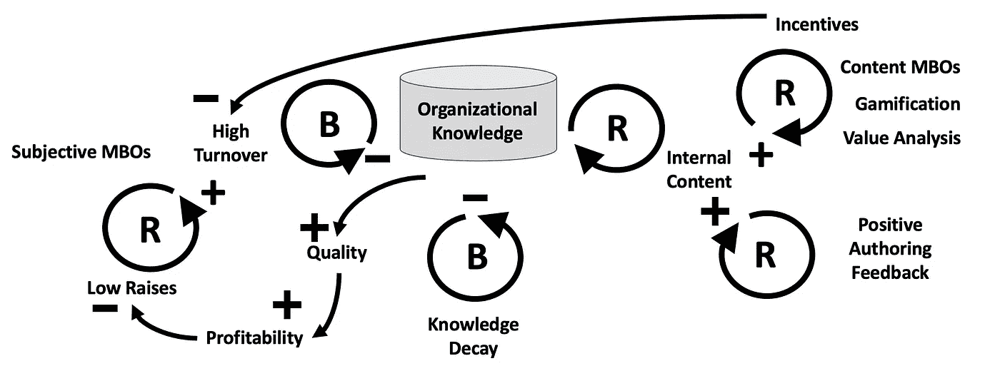

# 知识管理的系统思维

> 原文：<https://towardsdatascience.com/systems-thinking-for-knowledge-management-dff03829cf5c>

## 使用因果循环图来增加组织的集体智慧

图 1:我写作动机的因果循环图包括一个强化循环(R)和一个平衡循环(B)——作者的图片。

这篇博客讲述了我们如何利用[系统思维](https://dmccreary.github.io/graph-systems-thinking/glossary/#systems-thinking)来理解构建组织集体智慧的动力。我们将回顾关键的[因果循环图](https://dmccreary.github.io/graph-systems-thinking/glossary/#causal-loop-diagrams)(CLD)，作为我们用来理解组织知识获取和保留的模型。然后，我们描述如何使用这些模型，并在战略位置应用杠杆，以提高我们组织的集体智慧的成本效益。

我们创建 CLD 是因为我们需要我们周围世界的精确模型。我们需要了解这些模型并与我们的战略规划团队分享，了解我们拥有的杠杆点，以及如何经济高效地改变组织的行为。因果建模有时被认为是困难的，因为因果关系与简单地记录系统间的简单数据流有很大的不同。我希望从小事做起，你可以更熟悉这个强大的工具。

这篇文章追溯到我帮助组织管理知识的热情的根源。许多读者认为我是“知识图表专家”自 2017 年以来，这一直是我的工作重点。然而，这项工作建立在超过 25 年的一般知识管理解决方案架构、组织心理学、内容发布、搜索、数据库和本体设计的工作之上。

知识管理因果模型是许多拥有许多知识工作者的组织中的一个重要原型。在彼得·圣吉所谓的“学习型组织”中，它们是任何系统思维课程的重要组成部分。

# 人才流失危机

图 2:高需求技能带来的高流动率。图像由稳定扩散生成，并由作者编辑。

今天，许多公司都难以管理他们的内部知识。大公司的内部人力资源政策通常会将加薪幅度限制在远低于通胀的水平。外部公司通常会提供远高于通货膨胀率的加薪，以吸引关键的知识型员工。结果，许多领域的高流动率导致知识“走出大门”，造成许多项目的挫折和失败。在许多高科技领域，如软件开发、机器学习、数据科学和知识图表，人员流动率通常在每年 30%以上。随着员工掌握这些有价值的技能，他们看到自己的同事通过跳槽赚了更多的钱。

用新员工替换工人可能会非常昂贵。让新员工熟悉工作的典型成本通常在 5 万至 10 万美元之间。在大公司，有时需要几年时间才能知道各种问题应该联系谁。

那么，我们如何利用系统思维来保留更多这种有价值的知识呢？我们来建立一些**简单的**因果模型吧！我们从一个简单的模型开始，这个模型基于一个博客作者或为内部或开源项目写文档的人。然后，我们将这些模型推广到组织知识管理，并讨论我们可以应用的积极变化的关键杠杆点。

# 内部网黑洞

图 3:内部网漏洞:作者输入内容，但没有得到任何反馈。图像通过稳定扩散并由作者编辑。

让我们从一个简短的心理学讨论开始，为什么人们对他们社区的知识有所贡献。说得具体一点，让我以自己为例。我很幸运能加入一个欣赏我作品的读者群体。我的读者给了我很多反馈。他们在 LinkedIn 上“喜欢”我的文章，在 Medium.com 上给我“鼓掌”，在我的 GitHub repos 上给我“打星”。他们可以添加评论，如果他们喜欢我的工作，他们会为我的 STEM 课程计划和我的在线微型网站和书籍添加新内容。他们分享他们对我所涉及的话题的见解。我喜欢这个反馈，它激励我写更多的东西。

写作和教学也迫使我清晰地思考和组织我的思想。写作需要时间，需要不间断的专注。在当今这个注意力持续 15 秒的滴答驱动的世界里，这是一项罕见的技能。

然而，许多优秀的作家并不为他们公司的内部网站写作。原因之一是**缺乏**内部网站提供的反馈。我曾经被要求为一个内部网站写一篇文章，讨论关于人工智能、机器学习和知识图表的问题。但是在我浏览网站后，我意识到作者没有任何反馈:

1.  没有指标计算我的文章的印象、浏览量或阅读时间。
2.  我不知道谁在读我的内容。
3.  读者无法在文章的网站上添加评论。
4.  没有办法知道什么主题是最受欢迎的，或者其他作者是受欢迎的。
5.  没有办法“喜欢”一篇文章。
6.  我不能去找我的经理说，“看！我影响了数百名同事，其方式与我所在部门的目标一致。
7.  我的经理无法给我制定可衡量的目标，作为我年度绩效评估的一部分，以反映我对组织的影响。
8.  我不能挑战我的同行，看谁能写一篇获得更多浏览量的文章。

写作过程很痛苦。我必须用 MS Word 提交文章，而一个非技术交流人员可能会在几周后将其转换为 HTML。仅仅是把图像放进去就很痛苦。

最糟糕的是，随着内容管理系统的不断变化，我无法保证在我写完文章的几个星期后就能给人们发送一个链接。到处都是断开的链接！我甚至不能在两篇文章之间建立链接，也不能保证链接会在一周内生效。没有组织承诺将知识作为永久的联系。没有[永久链接](https://en.wikipedia.org/wiki/Permalink)或[永久链接](https://en.wikipedia.org/wiki/Persistent_uniform_resource_locator)。

总之，在内部网写作就像把你的内容扔进一个大黑洞。大量的工作和信息进入，但没有信息出来。这是一次真正的负面体验。

我们可以使用图 1 中这篇文章顶部的因果循环图或 CDL 来描述这个反馈系统。这些图表有反馈回路，箭头代表我们可以测量的事物之间的**因果**关系。顶部的图表有一个“库存”，在中心有我的写作量。

# 加固环

图 4:一个积极的反馈循环增强了我写博客的欲望。“R”表示加强，加号表示我写的文章数量的增加——图片由作者提供。

右边的回路连接到正反馈；我得到的反馈促使我写更多。积极的反馈导致更多的写作。字母“R”在这个圆圈的中心，代表一个“强化”的因果循环。“我的写作”旁边的加号表示循环积极地增加了文章的“存储”。这是我在 Medium、LinkedIn、脸书、Twitter 和 GitHub 上遇到的模式。

# 平衡回路

图 5:一个平衡循环，我们没有从读者那里得到反馈。图片由作者提供。

图 1 左侧的循环是当我努力写一篇有见地的文章，却没有得到**反馈的时候。这对我和我的事业都是一种能量消耗。我觉得我在正常工作之外花费的时间受到了惩罚；尽管我知道教育我的同事是我公司的一个重要目标，但我没有证据表明我写的东西被人读过。**

# 负反馈

我们的写作会得到负面反馈吗？是的，有时我们做。但这很罕见。大多数社交媒体网站会将你的评论与你的账户联系起来，也有办法将消极的人从你的同伴群体中剔除。负面反馈往往会打击内容创作者，所以像 YouTube 这样的网站不再向除作者之外的任何人显示“拇指向下”的计数。如果你不同意某人的观点，有时候最好的方法就是忽略他们。

由于这种罕见的情况，我们不在 CDL 中模拟负面反馈，我告诉其他作者试着倾听他们的批评，脸皮厚一点。

# 概括博客因果模型

现在，让我们建立一个更复杂的因果模型，其中包括当拥有重要知识的人离开您的组织时会发生的一些动态。

在向您展示这些模型之前，我们必须强调，并不是所有的知识对一个组织都同样有价值。让我们描述一下对组织有高价值的知识类型。

# 显性可编码知识与隐性知识

图 7:我们需要帮助我们管理高价值知识的模型。两类知识的总结。图片由作者提供。

在我们为知识管理存储建立一个更详细的模型之前，我们需要讨论不同类型的知识以及它们是如何存储在文档和代码中的。

某些类型的知识很容易表达为简单的 IF/THEN/ELSE 规则，这些规则作用于一个简短的明确定义的输入属性列表。我们称之为[显性知识](https://en.wikipedia.org/wiki/Explicit_knowledge)或可编码知识。我们对外显知识有很高的解释力。一旦我们编写了捕获这些知识的声明性业务规则，我们就可以很快地解释我们为什么做出特定的决策。

可编纂的知识通常是低成本的创造和维护。您可以从商业来源购买通用业务规则，并快速将它们集成到您的业务流程中。人工智能和机器学习继续降低将可编码实践纳入信息系统的成本，并将数据映射标准化为这些规则所需的来源。简单的规则不会给组织带来长期的市场竞争优势。

相比之下，有些知识就不那么容易编纂了。我们经常谈论“锁定”在员工大脑中的知识。我们称之为[隐性知识](https://en.wikipedia.org/wiki/Tacit_knowledge)。隐性知识很难表达或提取，因此通过将它写在文档、工作流或代码中甚至用语言表达来传递给其他人更具挑战性。把你的知识放在博客帖子或软件算法中的过程叫做编纂。

隐性知识要求我们理解情境的细节，包括仔细权衡数千个数据点。你通过拥有多年的现实世界经验获得某个领域的隐性知识，你依靠你的直觉和对世界的关系和复杂性的深刻理解。当我们希望一个组织具有竞争力时，我们会努力寻找和保留这些知识。掌握这些知识的人被称为主题专家或 SME。

# 知识管理的因果模型

图 8:什么力量影响组织知识的储存？在这里，我们添加了员工流动和内部内容的影响—图片由作者提供。

图 8 是一个稍微大一点的知识管理因果循环模型，所有的组织知识都在这个模型的中心。在右边，我们将“**我的写作**”存储替换为更一般的“**内部内容**”，它可以是您的员工共享的集体写作和代码。我们还有**积极的创作反馈**，它加强了**内部内容**的存储，这反过来又加强了**组织知识**的总存储。

在左边，我们现在添加高周转率的因果影响。随着拥有大量隐性知识的中小企业离开你的组织，最有价值的知识减少了(注意循环中的负号和“B”)。人员流动率高的原因之一是什么？一是与新的工作机会相比，加薪幅度较低。微薄的加薪是导致高流动率的一个积极的强化因素。

低加薪只是导致高流动率的众多因素之一。微薄的加薪必须与任何行业对这些技能的供给和需求相比较。如果员工必须在特定的地点，薪资必须根据地理位置进行调整。人力资源部门必须持续监控技能的短期供给和需求，并预测组织内子群体的流动率。许多成熟的人力资源部门可以监控职位公告板和薪资调查，如果新员工的工作机会没有被接受，可以调整他们的工作机会。

# 提高知识管理模型的精确度

图 9:将知识衰退、激励、质量和盈利能力包含到您的模型中。图片由作者提供。

既然我们知道了知识管理 CLDs 的基础，我们可以扩展我们的简单模型，以包含其他因素，使我们的模型更加精确。模型的复杂性是有权衡的。即使没有受过系统思维或 CLDs 培训的经理也可以使用简单的模型。但是简单的模型通常不能捕捉自然界的实际动态，也不能揭示我们在分析中寻求的关键杠杆点。永远不要假设一个经理能读懂 CLD 的作品。

在本练习中，我们将把**组织知识**存储(使用数据库图标)放在因果模型的中心。在左侧，您可以模拟所有导致知识库萎缩和过时的因素。在右边，我们将画出增加组织知识和学习的原因。然后你可以问一些关于知识流入和流出组织的原因的问题。

# 知识衰退—文档价值的半衰期

图 10:随着时间的推移，文档变得越来越没有价值。搜索工具可以通过稳定的扩散降低旧的和过时的文档——图像的相关性。

当我们对知识存储进行建模时，我们希望对存储的知识的价值或可操作性进行建模。那张关于 2015 年 Windows 10 漏洞的 PowerPoint 幻灯片，在今天有多大价值？自从我们升级到 Windows 11 后就没怎么用了。但是我们五年前教的那门关于系统思维的课仍然有效！在过去的 30 年里，系统思维的概念没有太大的变化。你明白了。

许多文件在大约一年后失去了一半的价值，而在下一年又失去了一半。过时的文档应该存档，或者在搜索结果中给予较低的相关性排名。你的知识模型必须包括知识的时间性和中小企业清除系统中过时内容的激励计划。

没有什么比让搜索结果充满过时的文档和断开的链接更能让人们远离内部内部网了。能否使用机器学习和 NLP 来预测文档的相关性，并根据主题的半衰期来改变相关性排名？你能获得组织对永久 URL 的承诺吗？

既然我们有了一个更详细的模型来说明知识在组织的社会环境中是如何存在的，我们就可以建立模型来改进强化循环并降低平衡循环的影响。但并不是所有的改变都同样划算。我们需要开始逐项列出我们可以对模型进行的潜在更改，并开始根据影响和成本效益对它们进行排序。成本最低的将是我们的杠杆点。

# 建立自己的知识管理微观战略库

图 11:构建小策略库。通过稳定扩散成像。

在这个分析的最后，我们将收集一组称为我们的知识管理微观策略的小计划，我们可以用它们来增加我们的集体组织知识。我们的目标是找到性价比高的杠杆点！给你重要的知识创造者和维护者高额奖金会鼓励更多的知识共享，但这可能不是你知识管理预算的最佳用途。

这里只是您可能会考虑的最具成本效益的杠杆点的一个示例

1.  鼓励每个人在组织内外的会议上写作和演讲。
2.  重视高质量的内部网搜索。
3.  让知识共享成为所有目标管理的一部分。
4.  给内部文章的作者广泛的反馈，包括有多少人看了他们的文章。
5.  允许读者评论文章并添加相关信息的链接。
6.  让读者能够喜欢文章，并轻松转发给其他人。
7.  让受欢迎的文章在你的内网搜索中获得更高的搜索排名。
8.  让撰写文章和添加简单的格式、链接和图像变得容易。
9.  对相关的深层链接做出组织承诺。书签和文档各部分的链接应该永不中断。
10.  支持快速链接到组织术语和概念的能力。
11.  添加对可读永久链接和 PURLs 的支持。
12.  鼓励向业务术语、概念甚至主题专家分配不会改变的链接和联系信息。
13.  让读者查看有多少高层管理人员真正完成了他们的报告，并阅读第 10 页末尾的结论。

# 结论

我希望这篇文章是对知识管理建模的有价值的介绍。我们使用系统思维和因果循环图来帮助我们理解组织如何使用低成本杠杆点来鼓励员工创造和维护有用的知识。这些微观战略不会在一夜之间把你的知识管理系统变成一个有自我意识的天网。它们是找到帮助你朝着正确方向前进的小步骤的工具。

请留意我关于图系统思考未来的书[原型](https://dmccreary.github.io/graph-systems-thinking/archetypes/)。请给我关于这篇文章或者任何你想看到我讨论的话题的反馈。