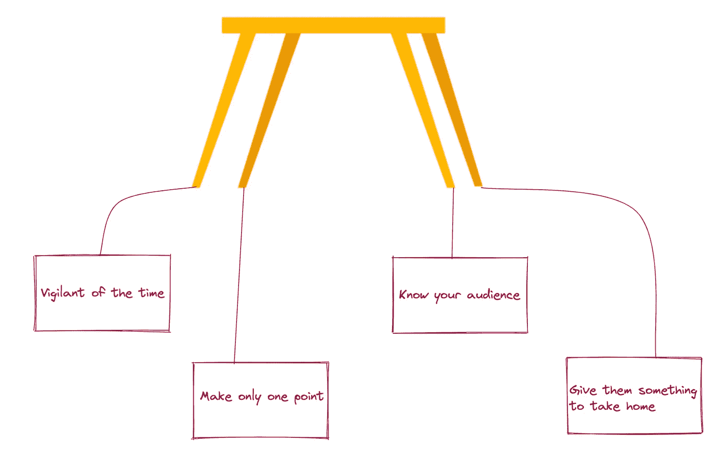

# 数据科学家的餐桌礼仪

> 原文：<https://towardsdatascience.com/table-manners-for-the-data-scientists-7092fd6cd03e>

## 面向客户的数据科学和 ML 咨询的经验教训

计算和技术是关键领域的中心，如数据科学、机器学习、人工智能、AGI、量子系统等，这是一个常见的说法，但事实上，所有这些都已经成为我们生活中的前沿，因为它们影响或可能影响我们思考、生活和执行某些任务的方式。虽然科技是带领我们走向下一次复兴的基石，但它也缠绕着更重要的东西——人类。

图片来源:Unsplash

想想看，你的数据科学，用 python，R，SAS 等编写并部署在 AWS，Azure，GCP 等上的机器学习模型是没有用的，如果人类不能从中获得价值，大多数时候人类也无法从中获得任何价值，如果他们不重视你的复杂作品产生的结果。让别人理解你所做的事情的复杂性是面向客户的工作和事实上的数据科学咨询的重要组成部分；必须让利益相关者和其他与你打交道的重要人物相信，你的复杂模型产生的结果不是徒劳的(一个更花哨的词是 floccinaucinihilipilification ),而是具有现实生活的价值。

不幸的是，在我的经历中，这一点被破坏和严重低估了。大多数数据科学家、经理和面向客户的人偶尔会在理解**期望与交付方面有所欠缺。**一组人认为他们负责综合产品和解决方案，不需要关心这些结果是如何传达的，而另一组人通常会犯错误——误读了房间——并认为房间里的每个人都同样擅长理解会议上讨论的内容。我不是保持一种比你更神圣的精神，因为我已经失败了很多次，特别是在 2014-2019 年期间，但是手腕上的耳光和火的洗礼教会了我一些交易技巧，我一直带在身边，并回头参考，以避免陷入常见的陷阱，并使自己与稳定性、可解释性和可用性的最终目标保持一致。

这些想法、项目和约定中的大部分都是在会议室或大或小的桌子上通过电话进行的；关注正在谈论的内容、关键要点以及各个阶段的期望是迫切而重要的；此外，有时你会成为演讲者，向公众传播你的观点，回答问题，或者向他人解释深奥的概念。是时候让人们参与进来，理解你的想法，并最终说服他们了。

以下实践是我在过去十年为一些主要的咨询公司和初创公司工作时，通过在 ML 领域的实际工作经验所学到和收集的全部内容——任性资本市场、埃森哲、Evalueserve、Intent HQ、Quantplex Labs 一本名为 [*轻率的想法*](https://www.amazon.in/Indiscrete-Thoughts-Modern-Birkhauser-Classics/dp/0817647805/ref=sr_1_1?crid=9VW14JCX1GX&keywords=indiscrete+thoughts&qid=1658779290&sprefix=indiscrete+thogujt%2Caps%2C241&sr=8-1) 的书也有助于明确某些想法并建立我的理解。

# 通用表格规则

作者图片

## 记下时间

这是一般性建议。

如果你为一个会议或演示预留了一个小时，这并不意味着你会占用整个小时；明智地分配它。花在会议上的一个小时应该有时间给你的资料或其他材料、提问和讨论接下来的步骤。

仅仅因为团队制作了各种各样的图表和视觉效果，并不能保证在会议上对它们进行讨论。保留 10 张幻灯片，使每一张都生动有力，并将其余的放在附录中。在 60 分钟的讨论中，30 分钟用于材料，20 分钟用于提问和澄清，10 分钟用于后续步骤。

> 理想情况下，一个小时的会议太长了——冯·诺依曼曾将 53 分钟称为“微世纪”——大约 40 分钟后，大多数人要么在打哈欠，要么在走神，所以 30 分钟或 40 分钟的会议是富有成效的。它还有另一个类似于奇数定价的优势，101 英镑感觉很贵，但 95 英镑感觉还可以(2 比 3 位数心理学)，同样，人们在花一个小时开会前会三思，但 30 分钟的会议可以给你更多的时间。

在一次我认为非常顺利的面试中，我得到的反馈是面试原定了一个小时，但我超时了 10 分钟；在主管/负责人级别，我应该能够在一个小时的时间框架内控制它。真是大开眼界。

简洁和清晰是你的朋友。

## 你的会议/资料应该只强调一点

会议/电子邮件/资料的议程不仅要对你清楚，对所有与会者也要清楚，最好在不同阶段对不同要点进行单独讨论。深入研究数据质量和数据源只会将时间浪费在专门用于制定工作说明书或召开动员会的会议上。

这不是一条经验法则，因为它会不时地被打破，但坚持一次发表一个有力的观点通常是富有成效的，尤其是当观众超过 10 人时。

找到你的一个点，用不同的变化敲打它。如果你的数据质量很差，那么用跨越许多幻灯片的多个图表来举例说明，如果你想显示你的模型是严格的，那么就显示不同的评估指标——你甚至可以综合对你有利且稳定的指标——并显示其他建模方法是如何失败的。

不要试图从广泛的领域中浓缩太多的信息，保持简单。不要太乐观，以为人们会理解并记住你演讲中的每一件事，这就是为什么让演讲生动更重要，这样他们才能把那件事带回家。

## 了解你的听众

有时候，我不得不解释什么是折线图，或者盒状图中的胡须代表什么。了解你正在与之交谈的听众是很重要的；随机森林、美国有线电视新闻网、LSTM 等公司的高管不会喜欢深入研究技术，他们可能会对咨询工作的要点、结果和方向性感兴趣；在与客户团队的工程师和数据科学家的会议中，您应该准备好谈论数据的细微差别、挑战、所用算法的复杂性，以及 MAPE 的 KPI、调整后的 R 平方、转换率等。

你应该知道如何根据你面对的观众来策划和引导你的想法。

此外，根据经验，在 LinkedIn 或任何其他平台上对你要见的人的背景进行二次调查是明智的(只是调查，不要通过每天访问他们的个人资料 10 次来以令人毛骨悚然的方式跟踪他们:P)这肯定有助于了解他们正在经营的领域或过去曾经经营过的领域，所以你可以相应地策划对话或提供可以很好地着陆的相关例子。人们喜欢这样的准备和他人的认可。

数据世界是一个人的世界，也是一个技术世界，人们会欣赏你的背景研究，并会记住(希望是出于好的理由)你的演讲，这有助于吸引他们的注意力。

著名数学家[吉安·罗塔](https://en.wikipedia.org/wiki/Gian-Carlo_Rota)会定期与观众见面，并提及那些不太出名的数学家的作品，从而获得终生的追随者。一般来说，人们会欣赏这样的姿态，这样的做法会让你成为一个有效的顾问。

## 带回家的东西

> 这是被广泛和普遍忽视的最重要的一点。即使一场演讲很棒，很有激励性，引用最好的演讲者的话，如果在最后，你不能从演讲中得到一样东西——一件可以归结为对话本质的东西——那么它就和零一样好，你的努力没有带来任何好处。

如果关键要点是数据质量需要提高，你需要用某些图表来证实它，以及结果是如何受到影响的。如果关键的要点是你需要模型的时间延长，那么模型的复杂性应该被强调以支持你的主张。

这些天，我们不断受到信息的轰炸，注意力持续时间处于历史最低点，这使得人们习惯于让观众记住强有力的外卖。

从故事开始，介绍一些趣闻轶事，用幽默把你正在讨论的事情联系起来，这样总体来说会很好；人们可能不记得你的名字，但他们会记得那些小要点。

# 数据科学家的行动规则表

**场景** —您从客户那里获得了用于分析客户流失的数据，您进行了初步的探索性数据分析，并发现数据质量与最初讨论时的承诺不符，并且缺少许多必需的功能。

**你的目标** —将这个问题告知相关的利益相关者，并询问相关的特征。

**摆桌子—**

1.  邀请相关利益相关者参加 40 分钟的会议；在简短的议程中加入一个简洁而中肯的主题。
2.  综合一个你会用到的故事，讨论它，然后创建一个 5 到 8 个幻灯片，主要展示缺少的数据集和功能。显示放大%缺失数据、弱相关性和显示弱原因的粗略回归的图表。只展示最重要的信息，其余的放在附录中。
3.  说明你的一点——如果用现有数据进行分析，会有什么后果——模型质量会受到影响，结果，模型的方向性会很空洞；或者，如果您已经知道数据质量无法提高，那么—获取数据的路线图以及模型和结果将如何随着时间的推移而改进。也显示时间线视图。

# **坐在餐桌前——如何准备？**

作者图片

## 简洁是朋友

没有人喜欢耐着性子听完 30 张幻灯片的演示文稿。把它定为 10 个并完成它，它能帮助人们在展示的材料上做笔记并集中注意力。作为一名演讲者，你的工作是让观众在现场简单地理解想法，所以不要专注于一叠没完没了的大部头或一系列谈话要点，保持简单，多说话，而不是翻阅许多幻灯片。

## 早期准备阶段和迭代

在重要会议前至少一周开始，写许多草稿。用纸和笔写下你的故事，一旦你对流程感到满意，就把它翻译成卡片。想一想你要制作的所有图表和插图，以及每张幻灯片是如何进入下一张幻灯片的，本质上你是在精心编排一段协调的舞蹈，所以要准备好扮演一个高效且可控的指挥角色。

多次写同一个想法有助于使它具体化和精炼。遵循 Fredrick Riesz 的哲学，在一段时间内多次发布一个想法，并不断改进，在你的情况下，这将是你在笔记本上的材料的类似迭代改进。

此外，听取几个人的意见也无妨，但要确保不要让太多人的目光停留在材料上，因为这可能会适得其反。1.太多烹饪问题 2。人们会认为你缺乏自信(这听起来很滑稽，但这种事已经发生过一次了)。

## 最佳解释——奥卡姆剃刀

Reisz 会在长时间反复讲授和解释同一材料的过程中发展他的思想，帮助他提高和更深入地理解主题，同样，一旦你获得了足够的经验，你也需要选择大多数时候能很好地与观众相处的解释、图表和方法。

寻求别人的指点，如何让某些点通过，如果有你可以借的东西，然后不要脸。

# 风格

## 这一行只有几个窍门

保罗·鄂尔多斯和戴维·希尔伯特会在他们各自的研究和证明中使用惊人相似的方法，以至于许多数学家经常猜测他们所有的证明都可以归结为他们使用的一些技巧。

这可能是真的，但它完成了工作，对于数据科学咨询也是真的。

一旦你参加了足够多的会议和演示，并领导了其中的一些，那么你就会形成自己的风格。这将是你将信息传递给一大群人的蓝图。一旦你确定了你的秘密武器，你需要最大化你的力量——它可以是你讲故事的能力、洞察力、幽默感、获得演出的能力等等。它们将是你的能力范围，你必须围绕它来定义你的谈话。

## 错误是必然会发生的

无论你做什么，最初的草案和计划都会有错误，确保它们不是致命的错误。吉安·罗塔说过:“有两种错误，致命的错误会摧毁你的理论和想法，而偶然的错误有助于测试想法或理论的稳定性和可行性。

确保你的工作中没有任何需要讨论或展示的致命错误；你不想走进死胡同。这就是为什么演习和记下所有可能的问卷有助于对冲你可能遇到的风险。

此外，建立安全边际有助于将致命错误转化为偶然错误；安全边际可以是为更多的时间做计划，或者通知人们前方可能由于各种原因而出现的路障。

但并不是所有的偶然错误都是不好的，它们对输入/细节的改变是有用的，但如果提出的想法和理论仍然成立，那么你就可以知道你的想法/理论的哪一部分不需要再次工作或改变。

# 结语——有效的介绍

一位数学家曾经写道:“一个适当的介绍，总结主题的历史，以一种散漫的方式概述论文的内容，会让论文多一些读者。”

如何在会议中引入主题，如何在邀请与会者的日历中描述议程，如何写一封冷冰冰的电子邮件的主题行，或者如何提供研讨会的课程，都对最终用户有很大的影响。它们都是关于解释一件作品是关于什么的，目的以及为什么接受者会对它感兴趣。

在你的介绍中投入精力可以帮助其他人做出决定，甚至说服他们参与进来。

以上各点并不是一成不变或应被视为真理的详尽无遗的集合，相反，这些点就像任何具有方向性的数学模型一样。

*对大多数人来说，迂腐和挑剔你的方法可能听起来像是一种拖累，但如果它产生了结果，并帮助你准备、专注、执行和交付，那么它是一个更好的交易。*

感谢您的阅读，请[联系](mailto:prashantmdgl9@gmail.com)我。如果您有任何问题需要讨论或争论，我随时欢迎建设性的反馈。