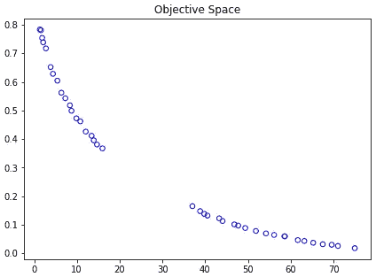

# 让您的优化技能更上一层楼

> 原文：<https://towardsdatascience.com/taking-your-optimization-skills-to-the-next-level-de47a9c51167>


照片由[卢卡斯·莱特纳](https://unsplash.com/@lukasleitner?utm_source=medium&utm_medium=referral)在 [Unsplash](https://unsplash.com?utm_source=medium&utm_medium=referral) 上拍摄

## **软约束、线性化、多目标等**

*如果你是一个优化初学者，我会建议你在回到这篇文章之前，先从* [*为什么*](https://hennie-de-harder.medium.com/why-every-data-scientist-should-learn-mathematical-optimization-3ac102663456) *和* [*如何*](https://hennie-de-harder.medium.com/how-to-handle-optimization-problems-daf97b3c248c) *开始。在这里，当问题比基本的玩具例子复杂一点时，我通过解释常见的实践来提供额外的信息。*

## 读取求解程序进度

通过将`tee=True`加到`opt.solve(model)`上，优化过程中求解器的进程将被打印出来。您还可以通过指定一个`logfile='fn.log'`来选择将日志写入文件。该日志提供了有关运行的信息，对于设置限制很有价值。


古罗比日志。图片作者。

上面你可以看到 Gurobi 运行的输出。这是一个最大化问题。你需要了解的最重要的事情:

*   在每一行之前，你会看到一个 H 或者一个空位。这表明当前最佳解决方案(*现任*)与之前的最佳解决方案相比是否有所改进。
*   *现任*表示当前最佳解决方案。目标的最大值(或最小化问题中的最小值)。
*   *BestBd* 表示目标将达到的最大值。求解者不确定是否有可能达到这个数，但肯定不会超过。
*   *差距*是*现任*和*最佳*之间的百分比差距。由此可见还有多大的提升空间。这是一个重要的值，将在下一节讨论。
*   *时间*显示该行之前的总加工时间。

其他解算器的输出日志看起来不同，但大多数至少显示了当前最佳解、最大最佳解、时间、迭代和节点。

## MIP 差距和时间限制

如果您正在处理具有许多变量和约束的大型优化问题，规划求解可能需要几个小时甚至几天才能得出问题的最优解。大多数公司都希望快速做出决策，所以你需要为求解者设置限制。这就是 MIP 差距和时间限制发挥作用的地方。让我们再看一下日志:


古罗比日志。图片作者。

311 秒后，也就是 5 分钟多一点，求解器做出了最大的改进。此后，改善变得平缓，正如您在下图中看到的:


分钟和差距，5 分钟后改善变得越来越小。

通过与利益相关者交谈和分析日志，您可以根据您的具体问题找到一个合适的时间限制。在时间和性能之间有一个平衡。更长的求解时间意味着更好的性能。对于我们在这里看到的过程，您可能希望将时间限制设置为 600 秒(10 分钟)。如果你使用 Gurobi 和 pyomo，你需要在你的代码中添加`opt.options['TimeLimit'] = 600`。求解器将在 600 秒后停止，并保持最佳解。

您也可以选择设置 MIP 间隙。还记得上一节的差距吗？这显示了改进的空间(现任*的*和*的*之间的差距)。如果您希望求解器在差距低于 1%时停止，您应该在代码中添加`opt.options['MIPGap'] = 0.01`。

最佳做法是设置 MIP 间隙和时间限制。如果满足其中一个条件，求解器将停止并返回当前最佳解。

## 多目标

有时候你的问题无法用一个目标函数来表述。在这种情况下，你必须处理一个多目标。这里的第一步是:试着把你的问题变成一个单一的目标，因为这会让事情变得简单很多。如果你的目标有相同的性质，比如钱，你可以将它们相加或相减，最终得到一个单一的目标。或者你可以尝试用约束来代替一个目标。如果这些方法不起作用，你就面临着多重目标。

多目标意味着多个最佳解决方案，因为你在最小化(或最大化)多个你不容易比较的东西。假设您正在最小化两个目标，所有具有低目标值的组合都是可能的最佳解决方案(蓝点):



具有两个目标和 Pareto 前沿的目标空间示例。图片作者。

每一个更高和更靠右的解都比蓝点更差。这些蓝点被称为帕累托前沿。

如果你必须处理多目标，看看 [pymoo](https://pymoo.org/algorithms/moo/nsga2.html) 框架。

## 绝对值

有时优化问题的目标是尽可能接近某一点。距离是负是正都无所谓，应该越小越好。在这种情况下，最简单的方法是最小化距离的绝对值。但是优化框架不喜欢绝对函数。很难对绝对函数执行标准的优化过程，因为它们不是线性的，也不是连续可微的。


我们应该如何处理绝对值？这其实很简单！我们需要添加两个虚拟变量，并将它们定义为正距离和负距离。如果我们想尽可能接近 30，解决方案看起来像:

```
# set variables
model.x = pyo.Var()
model.posdelta = pyo.Var(bounds=(0, None))
model.negdelta = pyo.Var(bounds=(0, None))# constraint to define the posdelta and negdelta
model.define_deltas = pyo.Constraint(expr= model.x + model.posdelta - model.negdelta == 30)# minimize the delta values in the objective
model.obj = pyo.Objective(expr= model.posdelta + model.negdelta, sense=pyo.minimize)
```

所以如果`model.x`等于 35，`model.negdelta`会是 5，`model.posdelta`会是 0。另一方面，如果`model.x`等于 25，`model.posdelta`等于 5，`model.negdelta`将为 0。通过对`model.posdelta`和`model.negdelta`求和，我们得到`x`和 30°之间的绝对距离。

小心点。如果你不在目标中使用 delta 变量，奇怪的行为就会发生。求解器可以选择使两个变量都大于零。因为 25+10–5 = 30，在这种情况下`model.posdelta`是 10 而`model.negdelta`是 5。因此，请确保将它们添加到目标中，或者添加约束，以确保只有一个变量可以大于零。

[*本文的第三个例子*](https://hennie-de-harder.medium.com/how-to-handle-optimization-problems-daf97b3c248c) *采用了这种技术。*

## 线性化

假设你正在处理一个优化问题，你有两个变量`x1`和`x2`。如果`x1`大于零，`x2`应该等于零。而如果`x2`大于零，`x1`应该等于零。或者更容易表述为:两者中只有一个可能大于零。我们如何指定满足这一点的约束呢？你可能认为这很简单。如果我们把`x1`和`x2`相乘，解应该是零(因为只有两者中至少有一个等于零，才能满足`x1*x2=0`)。但这是个问题。如果我们把两个变量相乘，问题就不再是线性的了。这意味着我们必须处理不好的东西，比如全局和局部最小值等等…

还有别的解决办法吗？

是的有！我们需要添加两个二进制虚拟变量来解决这个问题。如果`x1_dummy`等于零，`x1`等于零，如果`x1_dummy`等于一，`x1`大于零(同样适用于`x2_dummy`和`x2`)。
`M`是`x1`和`x2`(又名大 M)的最高可能值。我们需要添加的约束条件:

```
# only one of the two dummies can be equal to 1
x1_dummy + x2_dummy <= 1# x always smaller than M*dummy, if dummy is 0, variable is 0
x1 <= M*x1_dummy
x2 <= M*x2_dummy
```

现在问题还是线性的，`x1`和`x2`只能有一个大于零。

这只是线性化的一个例子。

## 软约束

你曾经优化过一个没有可能解决的问题吗？当您的边界或约束非常严格，没有解决方案可以满足所有需求时，就会出现这种情况。这可能会令人沮丧，尤其是当一个进程正在等待求解器的答案时。


模型不可行。图片作者。

这个怎么打理？软约束可能是一种可能的解决方案。您可以通过向普通约束添加惩罚变量`x_pen`来扩展约束的边界。

想象你想要`x1+x2 >= 10`。如果将此约束更改为`x1+x2 >= 10-x_pen`，求解器可以灵活选择大于 0 的`x_pen`。这意味着`x1+x2`可能会变得小于 10(所以不要给硬约束增加惩罚)。通过将`x_pen`加到目标函数中，求解器将试图保持`x_pen`尽可能低。

# 结论

我希望这篇文章能帮助你成为一个更好的优化者。这只是冰山一角，但这些问题是常见的，将有助于您更好地理解优化和解决现实生活中的情况。

下次见！

## 有关系的

[](/why-every-data-scientist-should-learn-mathematical-optimization-3ac102663456)  [](/how-to-handle-optimization-problems-daf97b3c248c)  

如果你想在我发表新文章时收到电子邮件，别忘了订阅。