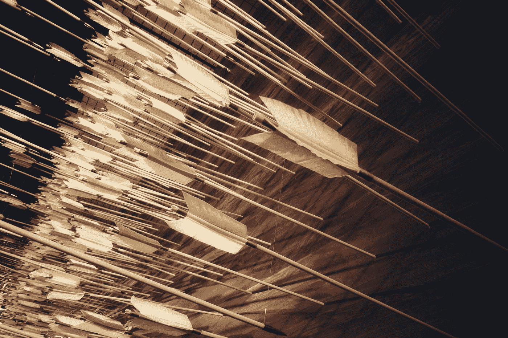
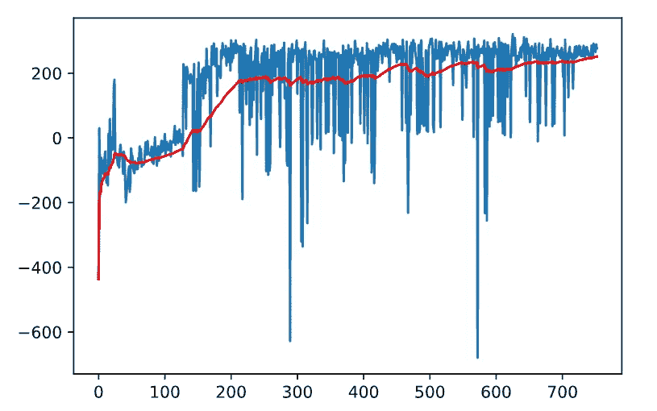
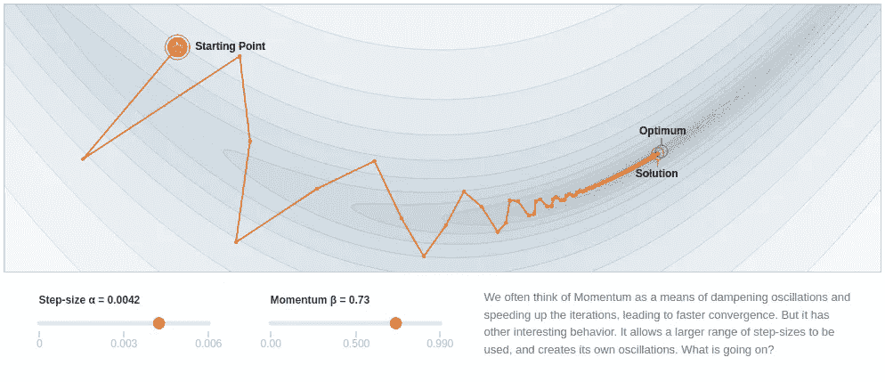

# 目标网络:缓慢而稳定赢得比赛

> 原文：<https://towardsdatascience.com/target-networks-slow-and-steady-wins-the-race-214ed14e97e7>

[附身摄影](https://unsplash.com/@possessedphotography?utm_source=medium&utm_medium=referral)在 [Unsplash](https://unsplash.com?utm_source=medium&utm_medium=referral) 上拍照

强化学习是继监督学习和非监督学习之后的第三个机器学习算法家族。目的是通过互动和学习在一个环境中找到最佳行为。在一个完美的世界中，我们可以有效地测量环境的状态，预测我们每个行动的结果，并知道它们的确切价值。在过去的几十年里，这些问题通过动态编程得到了解决，例如，包括经典的工业机器人。

强化学习的进步使我们能够在随机环境中面对更具挑战性的问题。这些可以具有未知的转移函数和未知的、不稳定的回报函数。现代 RL 算法需要能够学习动作的值和期望结果的轨迹的解决方案。这两个目标紧密相连，一个流行的解决方案通过演员-评论家范式将它们的优化结合在一起。

这个解决方案引发了一系列新的问题:收敛性的稳定性。演员选择批评家认为最好的行动，批评家重视导致最佳回报的行动。这两者交织在一起，相互关联。他们的联系暴露了两个局限性:如果学习太慢，一个政策可能会执行一个有价值的轨迹，但批评家可能不会正确地认识到这一点。如果更新太快，参与者的策略可能会不断变化，永远不会利用其最佳策略。更糟糕的是，这可能导致灾难性的遗忘，行为者忘记了以前的好政策，新的经历慢慢地将代理人从那种行为中推开。

月球着陆器忘记政策，没有目标(蓝色)，有目标(红色)。图片由作者提供。

在应用中，小的动作可能会对以后的轨迹产生重大影响，这两种限制都不会收敛。在双人游戏环境中，比如国际象棋，由于策略的脆弱性，这一点显而易见:设置的移动可能在很长时间后产生回报，序列中的微小变化可能会使其无效。

在过去的几年里，该领域的创新带来了新的解决方案。一些想法专注于数据以平滑梯度下降，特别是体验重放记忆，一个存储最近(s，a，r，s’)转换的缓冲区，使问题更加稳定。ERP 共享随机梯度下降背后的主要动机，通过从训练集中批量学习随机样本，稳定学习。

其他解决方案针对学习本身。目标是继续经历策略中的一些波动，以探索新的行动，但不会产生不必要的影响，如果情况更糟，会使代理偏离最佳策略。

目标网络是被广泛接受的主要创新之一。这个名字可能会令人困惑，因为其他模型既没有试图赶上，也没有从这个网络中学习。相反，它代表代理的冻结副本，不经常更新。目标允许代理从固定策略的经验中学习。它的影响在演员-评论家算法中最为明显，比如 DDPG。批评家通过顺序计算下一个动作来评估下一个状态的值。如果没有 actor 目标，将会使用 actor 模型，而 actor 模型可能已经更新过了，这会导致非常不同的策略。我们可以在最近的 RL 算法家族中找到目标网络，例如 DDPG、SAC、PPO 等等。

动量对梯度下降的影响。Gabriel Goh 于 2017 年制作的[网络演示](https://distill.pub/2017/momentum/)。

我们可以看到目标网络的动态变化，类似于梯度下降中的动量效应，或者太阳和行星在星系中穿行。原始模型每一步都经历更显著的变化，经历新的情况，并且目标网络使用代理所了解的慢慢地改变它的策略。

让我们看看这是如何在强化学习算法中实现的。为了清晰起见，我选择了深度确定性策略梯度算法，它比更现代的解决方案(如软演员-评论家)使用的技巧更少。为了完全公开，下面的要点是从一个人事项目中摘录的，该项目目前还没有开放源代码。这里只给出相关的代码块作为训练执行的例子。首先，让我们专注于创建我们的模型以供使用。

我们已经为学习创造了必要的工具:一个模型和它的目标，一个优化器，和一个相应的损失函数，对于演员和评论家都是如此。我们从相同的配置中创建模型和目标，使用相同的架构和超参数。

演员和评论家的更新过程分为三个步骤:

*   基于一批经验计算模型的损失。
*   使用结果损失获得模型权重的梯度。
*   更新模型权重。

我们为评论家的损失函数传递模型、它的目标和演员的目标。使用 TN 对于预测的连续性和消除演员和评论家学习阶段的相关性是必不可少的。

在计算 critic 损失时，Critic 用于获得当前时间步长的状态-动作值。行动者-批评者目标评估最可能的下一个状态-行动对的价值。其效果是，未来的预期回报应该保持稳定，慢慢收敛到一个最优路径。

损失本身就是批评家对当前状态的价值估计和目标对可达到的回报的预测之间的距离。这种方法意味着批评家的权重有一个缓慢移动的目标，他们可以向这个目标移动。

我们只使用参与者损失函数的实际模型，而不是它们的目标，因为 DDPG 是一种确定性的策略算法，它依赖于噪声和策略变化来进行探索。在其他算法中，如 SAC，我们可以使用评论家的目标来计算损失。

演员损失函数比评论家损失更容易理解。策略被更新以支持批评家认为具有更高价值的行为。

现在我们已经有了损失并更新了模型权重，让我们讨论一下这将如何影响目标。模型更新有两种方式:软更新和硬更新。

硬更新是从模型到目标的架构权重的简单拷贝。软更新更复杂。传统方法需要将目标权重设置为最后 K 步中模型的平均更新权重。这个过程被称为 [Polyak 平均](https://paperswithcode.com/method/polyak-averaging)。Polyak 是一种优化“技巧”，用于稳定梯度下降，向固定方向迈出较小的步伐，而不是在局部最小值附近跳跃。在我们的实现中，我们使用滚动等效。目标的权重显著地影响结果方向，缓慢地改变更新的模型权重。这种收敛遵循与动量类比相同的原理。

我希望这篇文章能帮助你更好地理解这种无所不在的方法！如果你想获得更多这样的文章，请在 [Twitter](https://twitter.com/marc_velay) 或 [LinkedIn](https://www.linkedin.com/in/marc-velay/) 上联系我。

关于强化学习的更多内容，再见！