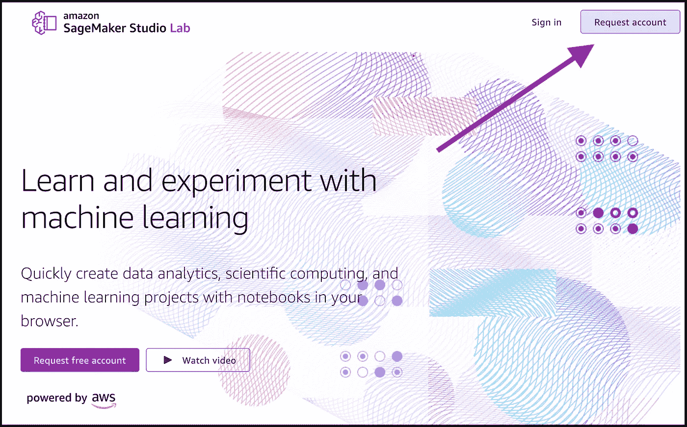
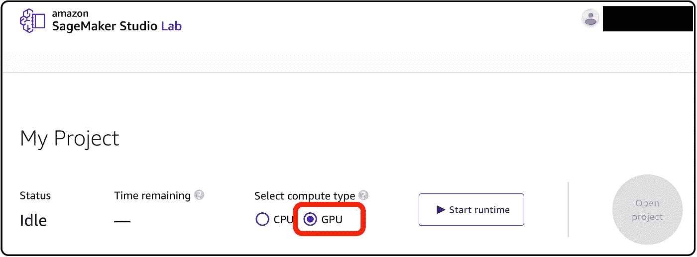
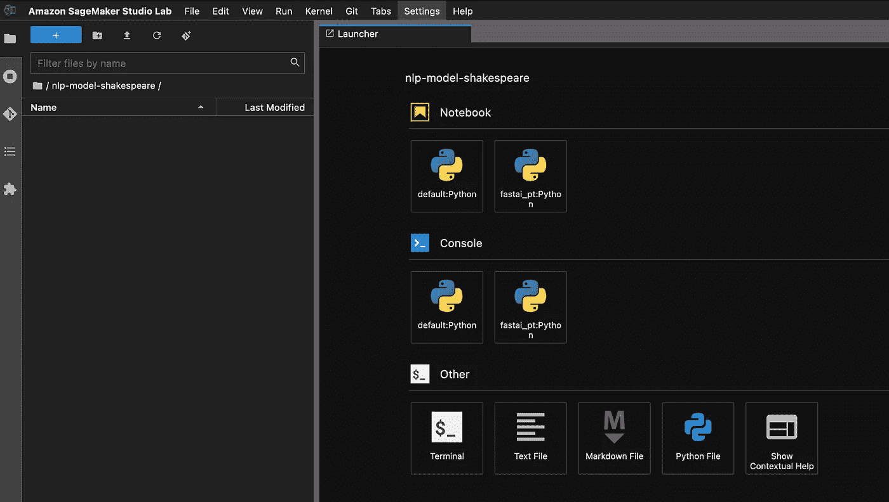
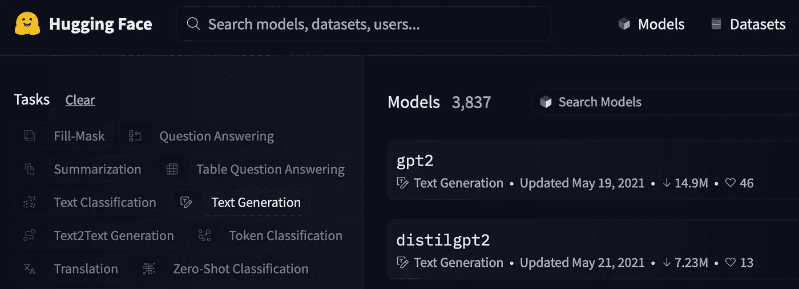
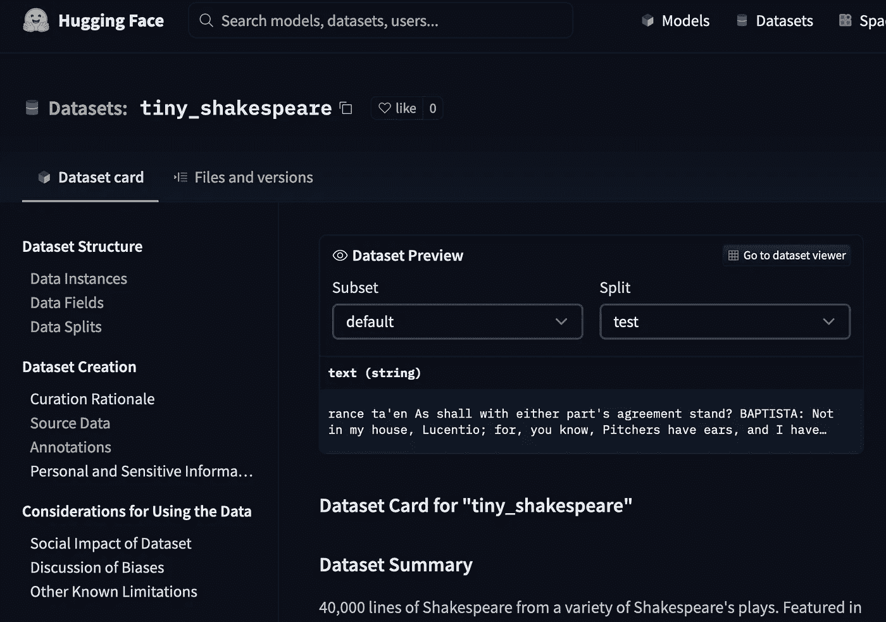
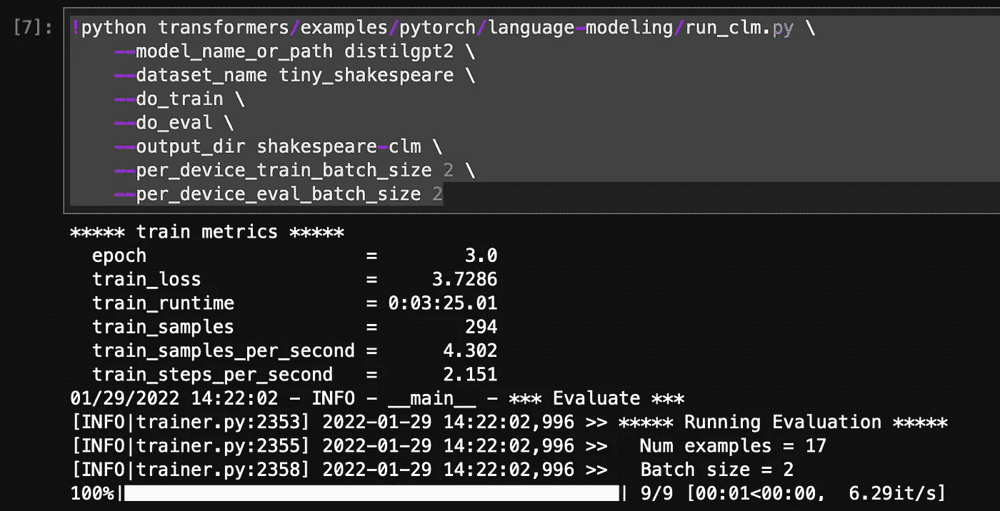

# 免费教一个人工智能模型像莎士比亚一样写作

> 原文：<https://towardsdatascience.com/teach-an-ai-model-to-write-like-shakespeare-for-free-a9e6a307139>

# 免费教一个人工智能模型像莎士比亚一样写作

## 使用 SageMaker Studio Lab 训练您自己的 NLP 模型

照片由[马特·里奇](https://unsplash.com/@voodoojava?utm_source=medium&utm_medium=referral)在 [Unsplash](https://unsplash.com?utm_source=medium&utm_medium=referral) 上拍摄

# 这是怎么回事？

训练机器学习模型已经变得越来越资源密集。例如，今天最先进的自然语言处理(NLP)模型几乎完全是神经网络，需要 GPU 的能力来训练它们。

幸运的是，具有 GPU 能力的可自由访问的开发环境的数量也在增长。2021 年 12 月，AWS 宣布 S [ageMaker Studio Lab](https://studiolab.sagemaker.aws/) 。Studio Lab 是一个基于 web 的 IDE，基于流行的 Jupyter Lab 环境。最棒的是，它还配有免费的 GPU 功能。

在本教程中，我们将利用这个 GPU 来教一个 NLP 模型像莎士比亚一样写作。由于开发了拥抱脸的示例脚本，这样做变得非常容易。事实上，我们只需要一个命令和不到五分钟的时间来训练这个 NLP 模型。

本教程的所有代码都可以在这个 [Github repo](https://github.com/marshmellow77/nlp-model-shakespeare) 中找到。

# Studio Lab 入门

首先，我们需要注册一个账户。我们可以在[网站](https://studiolab.sagemaker.aws/)上这样做，这是一个简单的过程:

作者图片

填写表格后，可能需要几个小时到几天的时间，直到我创建您的帐户。一旦您收到电子邮件，告知您的帐户已准备就绪，您就可以登录并开始使用:

作者图片

在这个菜单中，我们可以选择是用 CPU 还是 GPU 来启动一个项目。因为现代 NLP 模型是基于深度学习的(也就是说，它们是基于神经网络的)，所以我们应该在我们的项目中使用 GPU。选择 GPU 后，我们可以通过单击带有播放符号的按钮来启动运行时。这应该只需要几秒钟。然后，最后，我们可以通过按“打开项目”按钮来打开 Studio Lab 环境。

# 如何教授一个人工智能模型

如前所述，Studio Lab 基于 Jupyter Lab，如果你熟悉 Jupyter Lab，那么这个环境应该看起来很熟悉。左侧是文件浏览器，右侧是启动器，我们可以在其中启动将用于训练 NLP 模型的笔记本:

作者图片

教导人工智能模型以某种风格生成文本需要几件事情:(1)已经知道如何生成文本的预训练模型(2)训练集，在我们的情况下是莎士比亚文本(3)训练脚本。

## 模型

在撰写本文时，Hugging Face 在其模型中心提供了超过 3，800 个可用于文本生成的模型:

作者图片

在本教程中，我们将使用 [*distilgpt2*](https://huggingface.co/distilgpt2) ，它是较小的型号之一，但考虑到它的大小，它的性能还不错。

## 数据集

我们再次回到拥抱脸网站，因为他们提供了一个非常适合我们目的的数据集， [*tiny_shakespeare*](https://huggingface.co/datasets/tiny_shakespeare) :

作者图片

这个数据集包含 40，000 行莎士比亚文本，可以在麻省理工学院许可下使用。

## 培训脚本

最后，我们需要一个培训脚本。这是我们准备文本的地方，因此它可以用来教授一个人工智能模型&我们在这里进行实际的训练。通常这将占用我们大部分的时间，但是我们又一次幸运了:拥抱脸提供了一个我们可以使用的[全功能训练脚本](https://github.com/huggingface/transformers/blob/master/examples/pytorch/language-modeling/run_clm.py)。我们需要做的就是将脚本指向我们想要使用的模型和数据集。

要了解更多关于这些现成的培训脚本，我们可以查看[文档](https://huggingface.co/docs/transformers/examples)。这里我们了解到，为了使用这个脚本，我们需要从源代码安装 transformers 库。如何做到这一点在文档中有详细的解释，并且非常简单:

作者图片

# 开始培训

既然我们已经有了训练模型的所有要素，我们可以只使用一个命令来启动它:

在 Studio Lab 中，训练我们的模型大约需要 3-4 分钟完成:

作者图片

该模型将保存在我们在训练命令中指定的文件夹中(在我的例子中，它被称为 *shakespeare-clm* ，但您可以随意命名)。

# 测试我们的模型

此时，我们可以下载模型，并在任何我们喜欢的地方使用它。但是当我们在工作室的时候，我们应该做一个快速测试来看看训练是否有效。

为此，在我们教它像莎士比亚一样写作之前，我们将首先使用 NLP 模型，并将其输出与我们的莎士比亚模型进行比较。

## 未训练文本生成模型

由于有了[拥抱脸管道 API](https://huggingface.co/docs/transformers/main_classes/pipelines) ，使用这些 NLP 模型生成文本变得非常简单。使用这个 API，我们可以用原始模型生成一些文本，即在我们训练它之前:

作者图片

这段文字看起来像“正常”的文字，而不是真正的莎士比亚风格。让我们试试我们训练过的莎士比亚模型。

## 莎士比亚文本生成模型

与上面类似，我们可以使用管道 API 来为我们的模型生成文本。我们只需要明确地告诉 API 在哪里可以找到我们的模型:

作者图片

用我们的模型生成的文本与第一个模型明显不同。这看起来更像莎士比亚的文本。

# 结论

只用一个命令，几分钟之内，我们就教会了一个人工智能模型像莎士比亚一样写作。由此产生的模型可以下载并在我们喜欢的任何地方使用。

我希望这个教程对你有用——如果你有任何问题，请在评论中联系我们。此外，请继续在其他文本上训练 AI 模型——我很想听听你正在构建的文本生成模型。