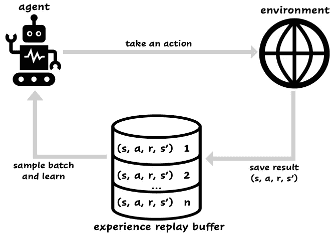
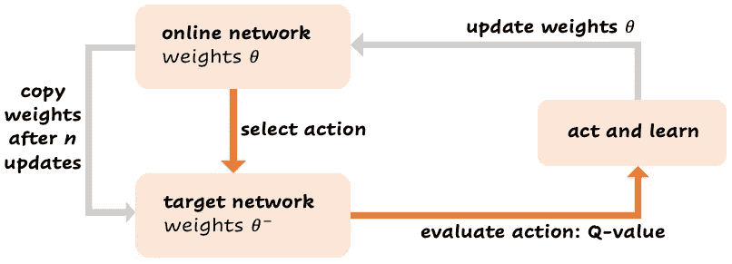
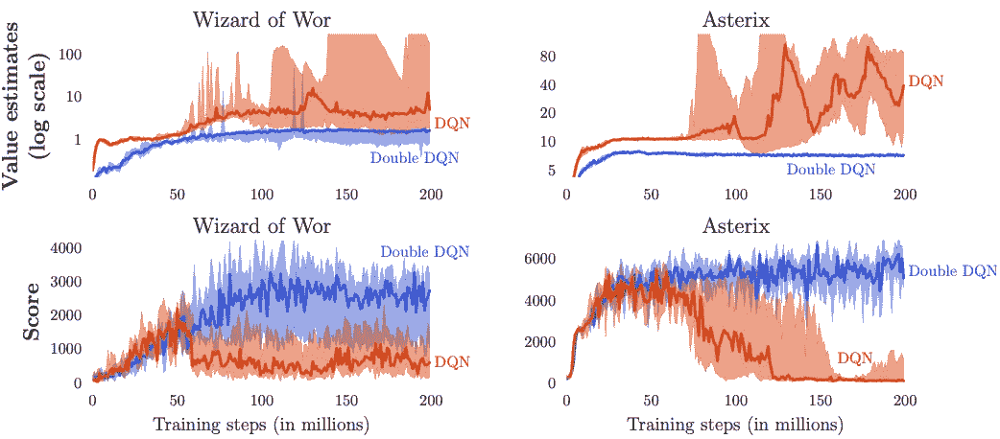
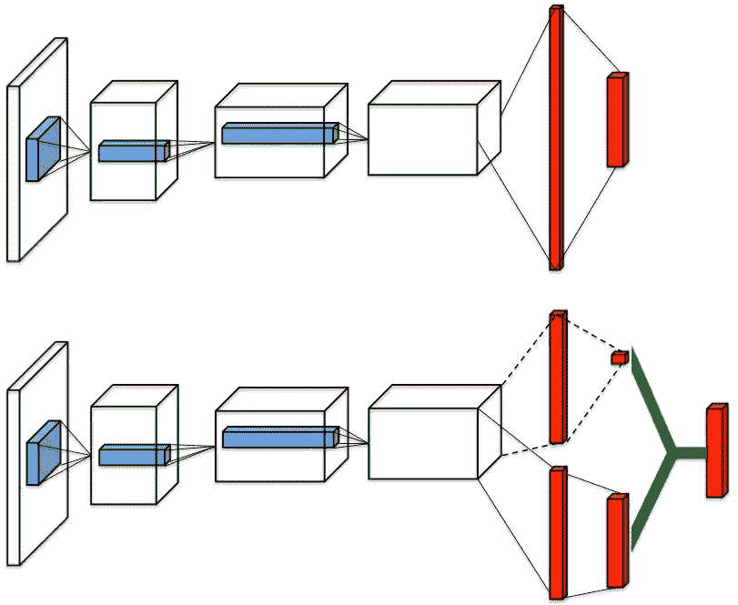
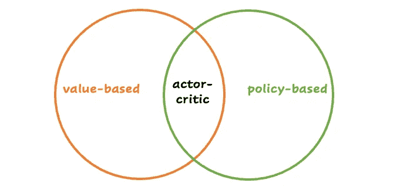
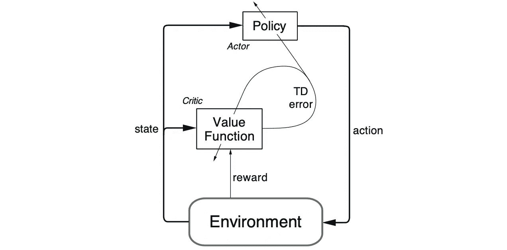
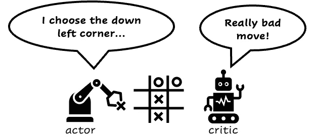
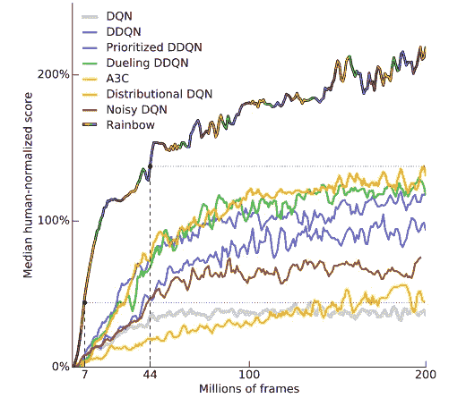

# 提高 DQN 代理性能的技术

> 原文：<https://towardsdatascience.com/techniques-to-improve-the-performance-of-a-dqn-agent-29da8a7a0a7e>

一个玩游戏的机器人。图片由 Dall-E 2 提供。

## 强化学习的挑战以及如何解决它们

**深度强化学习不仅仅是用神经网络代替 Q 表。您需要实现更多的技术来提高代理的性能。没有这些，很难甚至不可能创造出一个性能良好的 RL 代理。**

如果你不熟悉深度 Q 网络(DQN)，我可以推荐[这篇文章](https://www.analyticsvidhya.com/blog/2019/04/introduction-deep-q-learning-python/)。下图总结了这个过程:一个 Q 表被一个神经网络代替，以近似每个状态动作对的 Q 值。使用神经网络而不是 Q 表的原因是因为 Q 表不能很好地扩展。另一个原因是，对于 Q 表，不可能有连续的状态或动作。

Q 学习和深度 Q 学习之间的关系:该表由神经网络代替，其中输入层包含关于状态的信息，输出是每个动作的 Q 值。图片作者。

除了像[围棋](https://www.nature.com/articles/nature16961)、[星际争霸](https://www.deepmind.com/blog/alphastar-grandmaster-level-in-starcraft-ii-using-multi-agent-reinforcement-learning)和 [Dota](https://cdn.openai.com/dota-2.pdf) 这样的成功之外，强化学习还有重大挑战。这里有一篇[很好的博文](https://www.alexirpan.com/2018/02/14/rl-hard.html)详细描述了它们。总结一下:

*   一个强化学习代理需要**许多样本**。这在游戏中不是问题，代理可以一次又一次地玩游戏。但在处理现实生活场景时，这是一个大问题。
*   可能有更简单的方法来实现良好的性能，比如蒙特卡罗树搜索(游戏)或轨迹优化(机器人)。
*   **奖励**可以塑形，也可以延迟。这会影响代理的行为。例如，当代理仅在游戏结束时收到奖励时，很难确定导致奖励的具体行为。当创建带有人工奖励的奖励函数时，代理可以开始表现出[不可预测的](https://www.youtube.com/watch?v=tlOIHko8ySg)。
*   代理可以有**概括问题**。每个雅达利代理商只能玩他们接受培训时玩的游戏。即使在同一个游戏中，也有一般化的问题:如果你训练一个代理人对抗一个完美的玩家，也不能保证它能对抗一个平庸的玩家。
*   最后但同样重要的是:代理的行为可能**不稳定**并且难以重现。因为有大量的超参数，并且没有基本的事实，即使是随机的种子也能区分表现好的和表现差的代理。30%的失败率是可以接受的，这是相当高的！

在接下来的部分，我将描述六种可以提高深度 Q 代理性能的技术。然而，并不是上面解释的所有问题都能得到解决。

> *“监督式学习想要奏效，强化式学习必须强行奏效。”—安德烈·卡帕西*

# 优先体验重放

第一种技术，体验重放，很容易实现。想法很简单，我还没遇到不利用它的深度强化系统。它的工作方式如下:不是在一次经验后直接更新神经网络的权重，而是通过经验重放从过去的经验中随机抽取一批样本，并使用这批样本更新权重。体验回放缓冲区是存储最近转换的内存(一个转换由状态、动作、奖励、下一个状态组成)。通常重放缓冲区有固定的大小。

代理不是直接从一个体验中学习，而是将来自体验重放缓冲区的样本添加到该体验中，并从该批次中学习。图片作者。

经验重放的一个改进版本是优先经验重放，在这里你可以更频繁地重放重要的过渡。跃迁的重要性由它们的 TD 误差的大小来衡量。

## 它解决的问题

自相关是深度强化学习中的一个问题。这意味着当你在连续的样本上训练一个代理时，这些样本是相关的，因为在连续的 Q 值之间有一种关系。通过从体验重放缓冲区中随机抽取样本，这个问题就解决了。

经验重放的另一个优点是以前的经验被有效地利用。代理从相同的经历中学习多次，这加快了学习过程。

## 文学

*   [**重温体验回放的基本原理**](https://proceedings.mlr.press/v119/fedus20a/fedus20a.pdf)本文通过实例和分析对体验回放进行了深入的阐述。
*   [**优先体验重放**](https://arxiv.org/abs/1511.05952)不用从重放缓冲区随机取样，可以选择更频繁地重放重要转场。这个技巧更好的利用了之前的经验，学习效率更高。

# 双深 Q 网络

DQN 的目标是:

选择下一状态的最高 Q 值，并且相同的网络用于动作选择和评估。这可能导致对动作值的高估(下一段将详细介绍)。不使用一个神经网络进行动作选择和评估，可以使用两个神经网络。一个网络称为在线网络，另一个称为目标网络。来自在线网络的权重被缓慢地复制到目标网络，这稳定了学习。对于双 DQN，目标定义为:

在这种情况下，您使用在线网络(权重θ)选择具有最高 Q 值*的动作，并且使用*目标网络*(权重θ-)来估计其值。因为目标网络缓慢地更新 Q 值，所以这些值不会像仅使用在线网络时那样被高估。*

双 Q 学习示意图。使用两个网络，用于行动选择的在线网络和用于评估的目标网络。偶尔会将在线网络的权重慢慢复制到目标网络。图片作者。

## 它解决的问题

强化学习的一个问题是[高估动作值](https://www.ri.cmu.edu/pub_files/pub1/thrun_sebastian_1993_1/thrun_sebastian_1993_1.pdf)。这会导致学习失败。在表格 Q 学习中，Q 值将收敛到它们的真实值。Q 表的缺点是它不可伸缩。对于更复杂的问题，我们需要*近似*Q 值，例如用 DQN。这种近似是一个问题，因为由于一般化，这会在输出产品上产生噪声。噪声会导致 Q 值的系统性高估。在某些情况下，这将导致次优策略。双 DQN 通过分离动作选择和动作评估来解决这个问题。这导致更稳定的学习和结果的改善。

结果很有趣，而且对某些游戏来说是必要的:

来源:[采用双 Q 学习的深度强化学习](https://arxiv.org/pdf/1509.06461.pdf)

最上面一行显示了估计值。您可以在 DQN 的图表中看到峰值，当高估开始时，性能会下降。双 DQN 解决了这个问题，表现相当不错和稳定。

## 文学

*   [**双 Q 学习**](https://proceedings.neurips.cc/paper/2010/file/091d584fced301b442654dd8c23b3fc9-Paper.pdf)原论文关于双 Q 学习(不涉及神经网络)。
*   [**通过深度强化学习进行人类级控制**](https://daiwk.github.io/assets/dqn.pdf)本文阐述了在 DQN 中使用两个神经网络的好处。它没有提到双 Q 学习，但利用了在线和目标网络。
*   [**利用双 Q 学习的深度强化学习**](https://arxiv.org/pdf/1509.06461.pdf)将双 Q 学习应用于 DQNs。本文使用上文中的两个网络，并应用本节中描述的新目标。
*   [**削波双 Q-learning**](https://arxiv.org/pdf/1802.09477.pdf)双 Q-learning 的一个改进就是削波双 Q-learning。它使用两个网络的最小值来避免高估。

# 决斗网络架构

下一个可以提高 DQN 的技术叫做决斗架构。正常 DQN 的第一部分，用(卷积)神经网络学习特征，与之前相同。但是现在，决斗网络不是马上计算 Q 值，而是有两个完全连接的层的独立流。一个流估计状态值，另一个流估计每个动作的*优势*。

行动的优势等于 Q 值减去状态值:

所以优势越高，在那个状态下选择相关动作越好。

最后一步是合并两个流，并输出每个动作的 Q 值。组合步骤是计算 Q 值的正向映射步骤:

您可能期望通过添加状态值和优势来组合 Q 值。这不起作用，论文在第 3 章深入解释了原因。

在下一张图中，在底部您可以看到决斗架构，其中创建并合并了两个流:

来源:[深度强化学习的决斗网络架构](https://arxiv.org/pdf/1511.06581.pdf)

## 它解决的问题

因为决斗架构学习状态的值，所以它可以确定哪些状态是有价值的。这是一个优点，因为不需要了解每个状态的每个动作的效果。

有时候，在有些状态下，你采取什么行动并不重要。在这些状态下，所有的动作都有相似的值，所以你采取的动作无关紧要。在这样的问题中，决斗架构可以在策略评估期间更快地识别正确的动作。

决斗架构与双 DQN 和优先重放相结合，在 Atari 2600 试验床上产生了新的最先进的结果。

## 文学

*   [**用于深度强化学习的决斗网络架构**](https://arxiv.org/pdf/1511.06581.pdf)原论文介绍决斗架构的地方。

# 演员兼评论家

到目前为止，所讨论的方法计算状态-动作对的值，并直接使用这些动作值来确定最佳策略。最佳策略是每个状态下具有最高动作值的动作。处理 RL 问题的另一种方法是直接表示策略。在这种情况下，神经网络输出每个动作的概率。不同的方法分别被称为基于*值的*方法和基于*策略的*方法。

行动者-批评家结合使用基于价值和政策的方法。策略独立于值函数来表示。在演员-评论家中，有两个神经网络:

1.  一个政策网络，即*行动者。*本网络选择行动。
2.  还有一个行动价值观的深度 Q 网，*评论家*。深 Q 网络正常训练，学习代理的经验。

策略网络依赖于由深度 Q 网络估计的动作值。它根据这些操作值更改策略。学习发生在政策上。

演员评论家的建筑。来源:[强化学习:简介](https://web.stanford.edu/class/psych209/Readings/SuttonBartoIPRLBook2ndEd.pdf)

演员-评论家方法并不新鲜，它们已经存在了 40 多年。但改进是有的，2016 年[发表了一篇论文](https://arxiv.org/pdf/1602.01783v2.pdf)，介绍了一种新的有趣的算法。异步方法引入了并行的参与者-学习者来稳定学习。论文中最好的表演方法是结合了异步和演员评论的方法。该算法被称为异步优势行动者-批评家(A3C ),在单个多核 CPU 上训练时，表现优于许多其他 Atari 代理。你可能想知道算法的“优势”部分是做什么的:关键思想是优势用于批评家，而不是动作值。

有趣的事实:几年后，[的研究人员发现，优势演员兼评论家(A2C)比 A3C](https://openai.com/blog/baselines-acktr-a2c/) 表现得更好。A2C 是 A3C 的同步版本。优势部分似乎比异步学习更重要！

## 它解决的问题

基于常规策略的方法，如[增强](https://people.cs.umass.edu/~barto/courses/cs687/williams92simple.pdf)算法，速度很慢。为什么？因为他们必须通过经历多集来估计每个行为的价值，对每个行为的未来贴现回报求和，并将其归一化。在演员-评论家中，评论家给演员指路，这意味着演员可以更快地了解政策。此外，对于基于策略的方法，仅在非常有限的设置中保证收敛。

actor-critic 的其他优点是:因为策略被显式存储，所以需要更少的计算，actor-critic 方法可以学习选择各种动作的最佳概率。

演员和评论家一起玩游戏，他们想打败玩家。图片作者。

## 文学

*   [**演员-评论家算法**](https://papers.nips.cc/paper/1999/file/6449f44a102fde848669bdd9eb6b76fa-Paper.pdf)1999 年的一篇论文分析了一类演员-评论家算法。
*   [**异步深度强化学习方法**](https://arxiv.org/pdf/1602.01783v2.pdf)异步优势优评者(A3C)介绍。
*   [**优势演员兼评论家(A2C)**](https://openai.com/blog/baselines-acktr-a2c/)在这篇帖子中解释了为什么 A2C 比 A3C 更受青睐。
*   [**软优**](https://arxiv.org/pdf/1801.01290.pdf)
    另一种优优变体。它试图在尽可能不可预测的同时获得尽可能多的奖励。这鼓励探索。软演员-评论家已被证明是非常有效的！

# 嘈杂的网络

NoisyNet 为网络权重增加了扰动，以推动探索。这是深度强化学习中一种通用的探索方法。

在 NoisyNet 中，神经网络的参数中加入了噪声。噪音导致不确定性，这给政策制定带来了更多的可变性。决策的更多可变性意味着潜在的更多探索性行动。

来源:[用于探索的嘈杂网络](https://arxiv.org/pdf/1706.10295.pdf)

上图显示的是一个噪声线性图层。Mu 和 sigma 是网络的可学习对象。ε(*w*和 *b* )是噪声变量，并且被添加到权重向量 *w* 和偏差 *b* 中。

## 它解决的问题

大多数探索的方法，像 [epsilon greedy](/solving-multi-armed-bandit-problems-53c73940244a) ，依赖于随机性。在大的状态-动作空间中，以及像神经网络中的函数逼近，没有收敛保证。有一些方法可以更有效地探索环境，比如当代理发现环境中以前没有的部分时给予奖励。这些方法也有其缺陷，因为探索的回报可能会引发不可预测的行为，并且通常不是数据高效的。

NoisyNet 是一种简单的方法，其中网络的权重用于驱动探索。这是一个简单的补充，你可以结合这篇文章中的其他技术。当与 A3C、DQN 和决斗代理结合使用时，NoisyNet 提高了多个雅达利游戏的分数。

## 文学

*   [**嘈杂的网络进行探索**](https://arxiv.org/pdf/1706.10295.pdf)

# 分布式 RL

我要讨论的最后一种技术是分布式强化学习。不使用回报的期望，可以使用强化学习代理收到的随机回报的完整*分布*。

它是如何工作的？分布式强化学习代理试图学习完整的值分布，而不是单个值。分布代理想要最小化预测分布和真实分布之间的差异。用于计算分布之间差异的度量被称为 [Kullback-Leibler 散度](https://en.wikipedia.org/wiki/Kullback–Leibler_divergence)(其他度量也是可能的)。该指标在损失函数中实现。

## 它解决的问题

强化学习的常用方法是对回报的期望建模:价值。每个状态动作组合的值都是一个单一的数字。对于某些问题，这不是正确的方法。如果一个策略是不稳定的，接近完全分布会减轻学习的影响。使用分布可以稳定学习，因为值分布中的多模态得到了保留。

用外行人的话来说，这是有意义的:代理从环境中接收更多的知识(分布而不是单一值)。不利的一面是，学习一个分布比学习一个值需要更长的时间。

分布式强化学习的结果是显著的。DQN，双 DQN，决斗架构和优先重播在一些游戏中表现出色。

## 文学

*   [**强化学习的分布视角**](https://arxiv.org/pdf/1707.06887.pdf)本文解释了价值分布的重要性。

# 结论

当你有一个强化学习用例，并且性能没有预期的高时，你绝对应该尝试这篇文章中的一些技术。大多数技术都很容易实现，尤其是当你已经定义了你的环境(状态、动作和奖励)并且有一个有效的 DQN 代理的时候。所有技术都提高了多个 Atari 游戏的性能，尽管有些技术与其他技术结合使用效果更好，如嘈杂的网络。

有一篇论文综合了这篇博文的所有改进。它被称为 RainbowNet，结果很有趣，正如你在下图中看到的:

来源:[彩虹:结合深度强化学习的改进](https://arxiv.org/pdf/1710.02298.pdf)

## 有关系的

</solving-multi-armed-bandit-problems-53c73940244a>  </why-you-should-add-reinforcement-learning-to-your-data-science-toolbox-f6d4728afe66>  </snake-played-by-a-deep-reinforcement-learning-agent-53f2c4331d36> 