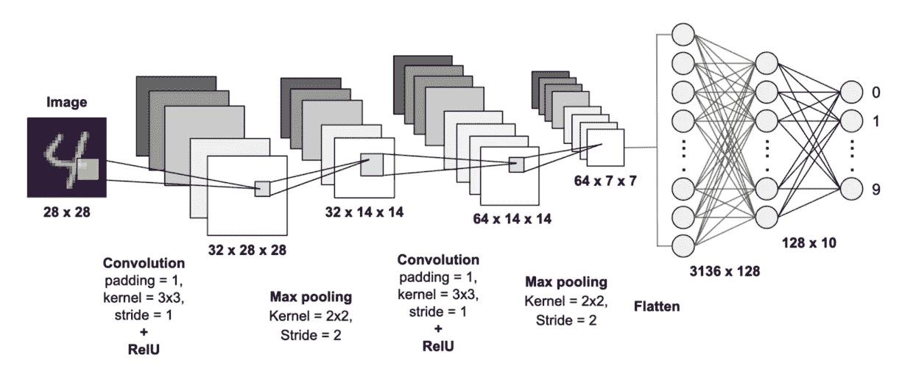

# Tensorflow vs PyTorch 示例

> 原文：<https://towardsdatascience.com/tensorflow-vs-pytorch-by-example-66d37901c663>

## 如何将每个深度学习框架应用于 MNIST 问题

在 20 世纪 90 年代末，机器学习研究人员正在尝试在分层架构中创建人工神经网络的方法，这些网络可以执行简单的计算机视觉任务。机器学习是编写可以从数据中学习的算法的科学。

计算机视觉算法的一个经典基准是它们在 MNIST 数据库上的性能。

这个数据库的名字代表*修改后的国家标准与技术研究院*，由 70000 张手写数字的小图片组成，每张图片都表示为 28x28 像素的灰度色值网格。

一些来自 MNIST 数据库的样本，作者 Josef Steppan，来自维基共享资源。 [CC BY-SA 4.0](https://creativecommons.org/licenses/by-sa/4.0)

每个图像都标有它所代表的数字。该算法面临的挑战是做人类容易做到的事情:看着图片，告诉我们这是什么数字。

Yann Lecun 及其合作者在 1998 年发表的论文向世界介绍了 MNIST 数据库，并表明卷积神经网络(CNN)优于其他技术。LeNet-5 架构的错误率仅为 0.8%。

在此后的几年里，卷积网络仍然是最先进模型中使用的首选技术之一，公布的错误率降至 0.2%左右。

由于在 MNIST 上训练深度学习分类器现在是数据科学家基础培训的一部分，唯一的问题是:我使用什么深度学习框架？

我将向您展示如何使用两个最流行的深度学习框架来解决这个分类问题:PyTorch(由脸书开发)和 Tensorflow(由谷歌开发)。

对于自己的项目应该选择哪个？

归结为个人喜好。试试下面的例子，看看哪个框架对你来说更自然。我看到 PyTorch 经常在学术研究环境中使用，Tensorflow 经常在许多商业应用程序中使用，但是每种都有许多反例。

这两个库都利用了 GPU 加速，有很好的文档，并且有支持它们的大型在线社区。不管怎样，你都会得到很好的照顾。

# 深度学习神经网络架构

卷积神经网络对输入样本进行“核”扫描，然后 [*对所有重叠的单元进行卷积*](https://en.wikipedia.org/wiki/Convolution) 以计算乘积，在我们的例子中是一种平滑的输出图像。这是为网络中单个卷积层的许多内核中的每一个执行的。核可以具有例如增强垂直线或水平线的外观的属性。这为神经网络提供了更多的“特征”来进行预测。

在 MNIST 数据集上训练的典型卷积神经网络结构。

卷积层可以堆叠，因此一组新的核与前一层的输出进行卷积。

可以想象，这种架构会产生大量可调参数。即使很小的 CNN 也可以有上万个参数，这就是为什么只有在更强大的计算机出现后，训练它们才成为可能。GPU 在这方面帮助很大。

在 CNN 的最后几层，通常会看到完全连接的多层感知器执行最终的分类或回归任务。

# 导入和定义

让我们通过导入必要的库并设置我们的常量来了解一些基础知识。

## Pytorch

我试图在张量流中保持它的相似性。

## 张量流

# 加载数据

现在，我们加载 MNIST 数据并将其标准化。通过归一化，我意思是转换它，使得平均每个 28×28 图像具有零平均值和单位标准偏差。

## Pytorch

MNIST 数据驻留在`torchvision.datasets`中。

## 张量流

MNIST 数据驻留在`tensorflow_datasets`中。

# 定义神经网络架构

每个深度学习框架都有自己的方式来定义你试图构建的神经网络架构。这可能需要一些技巧，所以在构建自己的自定义网络时，花时间查看文档是值得的。

## Pytorch

## 张量流

自从`keras`库并入 Tensorflow 后，定义神经网络的任务变得简单多了。Tensorflow 仍然公开底层接口，如果你需要的话，但我个人喜欢`keras`让它变得如此简单。

# 选择优化程序和调度程序

优化器是用于在每批训练数据之后调整数千个参数的算法。有很多算法可以选择。我用的是 AdaDelta，一种自适应随机梯度下降算法。我设定了一个学习率，然后定义了一个调度器来慢慢收缩它。

## Pytorch

## 张量流

# 训练模型

我发现 PyTorch 的方法倾向于强调非常明确的任务定义，而 Tensorflow 倾向于更紧凑的用户友好的定义。通过比较下面的两种方法，可以看出这一点。

## Pytorch

## 张量流

# 保存模型

一旦您训练了您的模型，您可能希望将状态保存为检查点，以便您可以在以后加载它，而不必再次调整数据。PyTorch 和 Tensorflow 都使这变得相当容易。

## Pytorch

## 张量流

# Jupyter 笔记本的完整代码示例

希望这篇教程对你有所帮助。两个模型(非常相似)都达到了大约 99%的精确度。通过下面的链接，你可以在 Jupyter 笔记本上看到这两个例子的完整代码。从那里，你可以在谷歌联合实验室里发布任何一款笔记本。

 [## GitHub-mikhailklassen/CNN _ MNIST:在两个平台上实现相同 CNN 架构的练习…

### 在 PyTorch 和 Tensorflow 中实现相同 CNN 架构的练习。我试着保持…

github.com](https://github.com/mikhailklassen/CNN_MNIST) 

## 感谢

PyTorch 实现基于 PyTorch 开发团队提供的示例，可在 GitHub [这里](https://github.com/pytorch/examples/blob/main/mnist/main.py)获得。我对这段代码做了各种修改，以使它与 Tensorflow 示例相协调，并使它更适合在 Jupyter 笔记本中运行。

对于 Tensorflow 示例，我使用了 [Amy Jang](https://www.kaggle.com/amyjang) 的[关于 Kaggle](https://www.kaggle.com/code/amyjang/tensorflow-mnist-cnn-tutorial/notebook) 的教程，该教程本身借用了 Keras 开发团队的[示例](http://github.com/keras-team/keras/blob/master/examples/mnist_cnn.py)和由 [Yassine Ghouzam](https://www.kaggle.com/yassineghouzam) 编写的[教程](https://www.kaggle.com/code/yassineghouzam/introduction-to-cnn-keras-0-997-top-6/notebook)。为了与 PyTorch 示例保持一致，我再次对这段代码进行了各种修改。