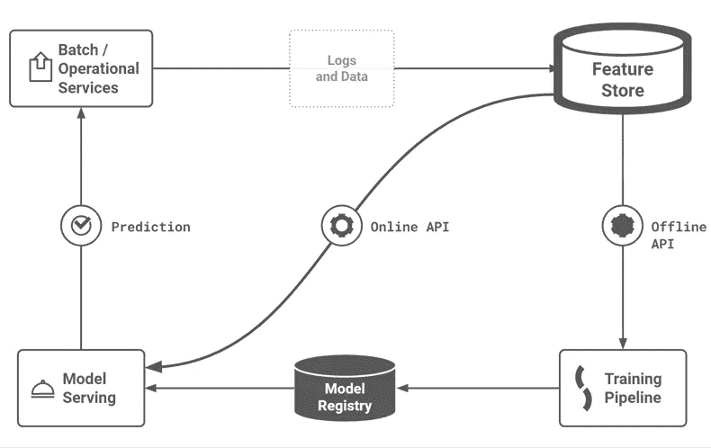
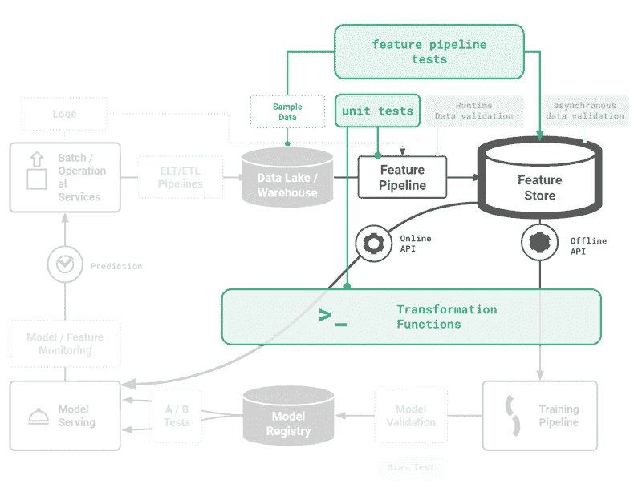

# 使用 pytest 测试功能

> 原文：<https://towardsdatascience.com/testing-features-with-pytest-82765a13a0e7>

## 使用 pytest 测试功能逻辑、转换和功能管道

TL；灾难恢复操作机器学习需要对特征和模型进行离线和在线测试。在本文中，我们将向您展示如何设计、构建和运行特性测试。

本文中示例的源代码可以在 github 的 [**处获得。**](https://github.com/jimdowling/ml-testing)



***图 0。*** *在这个 MLOps 架构中，我们在哪里以及如何测试流水线？*【作者图片】

# 介绍

在 2020 年我们的[**MLOps with a Feature Store 文章**](https://www.hopsworks.ai/post/mlops-with-a-feature-store) 中，我们写道“如果 AI 要嵌入到企业计算系统的 DNA 中，企业必须首先重新调整他们的机器学习(ML)开发流程，将数据工程师、数据科学家和 ML 工程师纳入到一个自动化开发、集成、测试和部署管道中。” **自此，MLOps 成为 ML 平台广泛采用的营销术语，但作为一个开发和运营过程，MLOps 有许多空白需要填补。**

我们坚信，功能管道和训练管道的自动化测试是使用企业数据实现机器学习的必备条件。我们还认为，Python 在要素工程(不仅仅是模型训练)中发挥着巨大的作用，不仅因为它是数据科学的首选语言，还因为使用表格数据的要素工程不仅仅是使用 SQL 计算聚合。

数据仍然需要转换成适当的数字格式，嵌入正在成为一种越来越流行的将高维数据压缩成强大功能的方式——这两者都是 Python 擅长的。为此，**我们在部分 MLOps 生命周期中添加了指南和示例，说明如何使用 pytest** [1]测试您的特性逻辑和特性管道。图 1 显示了(绿色的)本文中涉及的 MLOPs 生命周期的阶段——离线特性测试。



***图一。*** *功能管道是 MLOps 生命周期中的一个关键阶段，可以通过功能逻辑单元测试(pytest)、端到端功能管道测试(pytest)和数据预期测试(great expectations)的组合进行测试。*【作者图片】

# 功能逻辑的单元测试

特性工程的单元测试验证了计算特性的代码正确地实现了单元测试本身定义的规范。单元测试定义在函数上。对于特性工程来说，这意味着如果你想对一个特性进行单元测试，你应该分解你的代码，这样这个特性就可以由一个单独的函数来计算。单元测试应该被设计成保证你写的特性逻辑的不变量、前提条件和后置条件。

有了您的单元测试，如果有人更改了特性逻辑的实现，并且违反了特性规范，您的单元测试应该可以检测到特性逻辑的不完整实现和失败的断言。这将有助于您在错误影响到要素的下游用户之前将其捕获，即数据科学家使用要素创建训练数据，ML 工程师使用要素构建在线(操作)模型的特征向量。

# 将您的功能重构为函数

**对于许多想要开始编写单元测试的数据科学家来说，一个挑战是他们的大部分代码都写在笔记本上。**从软件工程的角度来看，在笔记本上编写功能工程代码并没有什么本质上的错误，尽管有一些直言不讳的批评( [**就像在 Jupyteron 2018**](https://conferences.oreilly.com/jupyter/jup-ny/public/schedule/detail/68282.html) 期间的“我不喜欢笔记本”谈话中)。经常被用来反对笔记本的两个异议——与源代码控制的集成和计划执行——现在有了很好的解决方案。例如，[**NBD ime**](https://nbdime.readthedocs.io/en/latest/)(Jupyter 中的一个插件)可以用来查看笔记本的两个版本之间的差异，并且像 [**Papermill**](https://github.com/nteract/papermill) 和我们自己的 [**Hopsworks**](https://www.hopsworks.ai/) 这样的框架支持笔记本作为作业的调度执行。

然而，如果你不构建你的代码，使你的特性工程逻辑被封装在一个可独立测试的函数中，那么更好的笔记本工具将不会帮助你在里面单元测试特性。

例如，在下面的代码片段中，我们可以看到函数 col_sum 通过对两个输入列 a 和 b 求和来创建新要素:

```
def col_sum(col_1: pd.Series, col_2: pd.Series) -> pd.Series:
    """Compute the sum of column 1 and column 2."""
    return col_1 + col_2
```

这里，特征工程逻辑被封装在一个函数中。您可以使用单元测试来单独测试该功能。如果您想在您的特征工程管道中添加一个新特征，您可以简单地添加另一个函数，比如这个函数。上述函数还包括类型注释。Python 是一种动态类型化的语言，上面代码片段中的类型注释可以帮助您更早地发现错误，如果您传入的值的类型与注释的类型提示不匹配，就会返回运行时错误。例如，如果您传递一个不同于 pd 类型的参数。系列到 col_sum()，你会得到一个错误。显式类型将有助于您更早地发现错误，您应该将它们用于您的特性工程功能。

# pytest

Pytest 是 Python 的一个单元测试框架，主要用于为 API 编写测试。在这里，我们将展示如何使用 pytest 编写(1)由单个函数计算的功能工程代码的单元测试，以及(2)将计算的功能写入功能存储的端到端功能管道。您可以按如下方式安装 pytest:

```
pip install pytest
```

Pytest 建立在 3 个主要概念之上:测试功能、断言和测试设置。在 pytest 中，单元测试既可以写成函数，也可以写成类中的方法。Pytest 有一个命名约定来自动发现测试模块/类/函数。测试类必须命名为“Test*”，测试函数或方法必须命名为“test_*”。

在图 2 中，我们可以看到 pytest 在开发 期间作为离线测试运行 [**，而不是在特性管道已经部署到生产(在线测试)时运行。**](https://realpython.com/pytest-python-testing/)


***图二。*** *Pytest 可用于执行离线特性工程测试:单元测试特性逻辑，单元测试转换功能，端到端测试特性管道(集成测试)。*【作者图片】

# Python 目录结构

将您的测试存储在实际特性工程代码之外的专用目录中的单独文件中通常是一个好主意，因为这将特性工程代码与测试代码分开。以下目录结构是组织特性工程代码和测试的一种流行方式，其中特性工程在*特性*目录中，单元测试在 test_features 目录中:

```
root
┣ features
┃ ┣ transformation_functions.py
┃ ┗ feature_engineering.py
┣ test_features
┃ ┗ test_features.py
┗
```

如果您使用上面的目录结构，但是您没有 setup.py 文件(并且您依赖于将当前目录放在 sys.path 中的默认 Python 行为)，为了运行您的单元测试，您将需要从*根*目录运行以下内容:

```
python -m pytest
```

# 测试方法

你应该从构建测试用例的方法开始，比如 [**安排、行动、断言模式**](https://automationpanda.com/2020/07/07/arrange-act-assert-a-pattern-for-writing-good-tests/) ，它安排输入和目标，作用于目标行为，并断言预期的结果。这是我们在本文的例子中使用的结构。

但是，你怎么知道要考什么，怎么考呢？并非所有功能都需要测试。如果这个特性是你公司的收入来源，那么你应该彻底的测试它，但是如果你的特性是实验性的，那么它可能只需要很少的测试或者不需要测试。

也就是说，我们首选的特性测试方法是一个简单的方法:

1.  用端到端测试测试公共代码路径；
2.  为未测试的代码路径编写单元测试(检查您的测试代码覆盖率)。

这种方法将帮助你开始，但它不是万灵药。例如，假设您编写了一个计算每月聚合的特性，但是您忘记了包含处理闰年的代码。使用这种方法，您将不会看到闰年代码路径没有被测试代码覆盖。只有当你第一次发现 bug 时，你才会修复它，然后你应该编写一个单元测试，以确保你不会出现闰年 bug 再次出现的回归。这将有助于在输入数据中测试更多的边缘情况，并预测边缘情况。

尽管关于测试驱动的开发有不同的思想流派，但是我们不认为测试优先的开发在你试验的时候是有成效的。一个好的开始方式是列出你想测试的内容。然后决定是要离线测试(使用 pytest)还是运行时测试(带有数据验证检查，比如 [**远大前程**](https://greatexpectations.io/) )。如果您可以在离线测试和在线测试之间进行选择，离线测试通常是首选，因为问题可以在开发过程中识别出来，并且离线测试不会增加运行时开销。

# 功能的单元测试

在这个例子中，我们的 web 应用程序使用访问者的 IP 地址生成日志，我们希望添加额外的功能来帮助预测网站访问者。IP 地址记录为 int (4 字节)以节省存储空间。我们的数据科学家希望将该 IP 地址转换为我们的访问者来自的城市，因为她认为这对她的模型具有预测价值。

此代码片段定义了将 32 位数字的 IP 地址转换为字符串表示形式的函数(使用点符号，例如 192.168.0.1)。还有一个函数将字符串化的 IP 地址转换成 IP 地址的 int 表示。最后还有一个ip_str_to_city()函数，将字符串化的 ip 地址转换成分类变量——IP 地址所在的城市。

下面是我们对上述 ip_str_to_city() 特性的单元测试。根据 DbIpCity API，它将四个测试 IP 地址定义为字符串、这些 IP 地址的四个整数表示以及这些 IP 地址的四个城市。

上述三个测试执行以下检查。第一个测试检查 IP 地址是否被正确地转换成 int。第二个测试检查 IP 地址的 int 表示是否被正确地转换回字符串化的 IP 地址。最后，最后一个测试验证字符串化的 IP 地址是否正确地映射到了 cities 数组中的城市名(由 DbIpCity API 生成)。

在 pytest 中，断言检查某个状态是真还是假。如果一个断言在测试方法中失败，那么执行将会停止，测试将会失败，而不会在测试方法中执行更多的代码。然后，Pytest 将继续执行下一个测试方法并运行它的断言。

然后，您可以从根目录运行测试，如下所示:

```
python -m pytest
```

# 对特征逻辑进行了突破性改变

当在我们的特征记录系统中使用 ip_str_to_city 函数时，上面的代码工作得很好，该系统在 web 日志到达时对其进行处理。查找的次数相对较少。然而，当我们网站上的流量增加时，我们注意到我们对 **DbIpCity.get(ip，api_key='free')** 的调用受到速率限制——我们正在调用网络服务。我们还注意到，出于同样的原因，我们不能从数据湖中的博客中回填特性。因此，我们决定使用嵌入式数据库将 IP 地址映射到城市名称。Maxmind 提供了这样一个数据库(免费和商业使用)。我们保持我们的 API 不变，只是改变了实现。

## 什么会出错？

我们的 ip_str_to_city 分类要素的基数发生了变化。发生的情况是 maxmind 数据库的分辨率没有 DbIpCity 的网络服务高。当我们的单元测试运行时，它将第一个 IP 地址映射到‘Stockholm’而不是‘Stockholm(sdermalm)’。我们的新实现中的类别数量比原来的 DBCity 版本中的少。我们的分类变量的分布发生了变化，这意味着我们不应该将新功能实现与旧功能实现创建的训练数据混合在一起。事实上，我们的嵌入式数据库拥有原始 DbIpCity 服务类别的子集，因此如果我们选择不同的 IP 地址进行测试，测试可能已经通过。额外的数据验证测试可能已经识别了数据分布中的变化(但是只在运行时)，但是由于新的实现没有引入任何新的类别，所以不容易识别 bug。

Hopsworks 还支持 [**转换函数**](https://examples.hopsworks.ai/master/featurestore/hsfs/online_transformations/builtin_online_transformations/) ，与我们的特性函数相似，它们也是 Python 函数。转换函数也可以用单元测试来测试。

# 转换函数的单元测试

如果您的要素存储将您的城市名称存储为字符串(这有利于探索性数据分析)，当您想要(1)训练模型和(2)使用模型进行预测(推理)时，仍需要将该字符串转换为数字格式。这里一个潜在的错误来源是当你有单独的系统用于模型训练和模型推断的时候。对于两个不同的系统，您可能会无意中拥有不同的(city-name to int)转换函数实现，因为这两个系统是用不同的编程语言编写的，或者具有不同的代码库。这个问题被称为*训练-发球偏斜*。

**转换函数通过提供一段代码将输入特征值转换为模型用于训练和服务的输出格式，从而防止训练服务偏差。**

对于我们的城市名，我们可以使用内置的 LabelEncoder 转换函数将分类值(城市名)替换为介于 0 和类数减 1 之间的数值。

但是，让我们假设我们还想使用 sample-click-logs.csv 文件中的 click_time datetime 列作为一个特性。我们需要用数字格式对它进行编码。

在下面的代码片段中，我们有一个将美国日期格式的字符串转换成数字时间戳的转换函数。这里的单元测试有助于防止特性实现中任何计划外的变化，比如将日期从 US 格式切换到 ISO 格式。

我们的日期转换函数的单元测试如下所示:

正如您所看到的，我们对转换函数的单元测试与之前的单元测试相同，除了使用了**@ pytest . mark . parameter ize**注释来提供测试用例。

在另一种情况下，我们可以在我们的特性管道中使用单元测试——作为实用的 python 函数，正如我们在这里展示的用于执行特性命名约定的函数。

# 功能命名约定的单元测试

假设您希望特征命名统一，以便不同的团队可以快速理解正在计算的特征及其来源。下游客户端很快就会以编程方式依赖于特性的命名约定，因此命名约定的任何更改都可能会破坏下游客户端。可以在运行时检查名称是否遵循正确的格式，但是在编排的特性管道中，用函数静态地强制使用正确的特性名称更有意义。然后，可以用单元测试来验证您的命名约定，以便在开发过程中检测到对命名约定的任何未计划的更改。

在下面的代码片段中，我们提供了两个函数来定义(1)特性组名和(2)特性名。

这是一个单元测试，以确保在 pytest 运行时，对特性组或特性命名约定的任何更改都被识别出来。

我们的特性名称的单元测试几乎与上面的代码相同，为了简洁起见，这里省略了。

现在，我们已经看了 pytest 的单元测试，让我们看一下 pytest 为功能管道运行集成或端到端测试。

# 特征管线的 Pytest

**功能管道是一种程序，可以按计划运行或连续运行，从一些数据源读取新的输入数据，使用该输入数据计算功能，并将功能写入功能存储。**功能管道的一个更技术性的描述是，它是一个从一个或多个数据源读取数据的程序，然后编排输入数据的功能工程步骤的数据流图的执行，包括数据验证、聚合和转换。最后，它将工程特征(输出数据帧(Pandas 或 Spark))写入特征组。

我们可以使用 pytest 端到端地测试功能管道。功能管道测试验证您的管道是否端到端正常工作，它是否正确地将不同的步骤连接在一起，例如读取和处理数据、功能工程，以及将功能写入功能存储。一个简单的功能管道测试读取一些样本数据，设计功能，写入功能存储，然后验证它从功能存储读取的数据是否与写入的数据相同，以及写入的行数是否符合预期。

与单元测试相比，功能管道测试运行速度较慢，因为它们需要连接到服务并处理一些样本数据。它们还需要数据和基础设施。您将需要一些样本数据和一个“dev”(开发)特性库。在 Hopsworks 中，您可以为每个开发人员创建一个新的私有项目，其中每个项目都有开发人员自己的私有特性存储。在这个例子中，我们包括一些点击日志样本数据( **sample-clicks.csv** )。您可能需要对生产数据进行二次抽样甚至匿名，以便为您的管道创建样本数据。样本数据应该代表管道的生产数据。

我们的特征管道在这里写入了我们之前计算的特征(ip 地址和城市名):

这里，我们编写一个简单的端到端测试，对编写的特性执行行数验证。特征管线将样本数据读入 Pandas 数据帧，计算数据帧中的一些特征，将数据帧写入特征存储的特征组，然后将数据作为数据帧从特征存储读回，验证原始数据帧中的行数是否等于从特征存储读回的数据帧中的行数。我们可以在离线功能存储和在线功能存储上执行此测试，因为行可能会写入这两个存储。在本例中，我们只验证写入在线商店的行数:

您可以看到，首先运行 init_fs 函数来设置测试，首先删除 clicks 功能组(如果存在)，然后创建它，最后将样本数据读入 Pandas 数据帧。然后对特征组和数据帧进行测试。

# Jupyter 笔记本电脑的 Pytest

你也可以 [**使用 pytest 在你的 Jupyter 笔记本**](https://semaphoreci.com/blog/test-jupyter-notebooks-with-pytest-and-nbmake) 中测试你的特征工程代码，前提是你(1)将你的特征工程代码重构为函数，并且(2)在运行 pytest 之前将你的笔记本转换为 python 文件。幸运的是， [**nbmake**](https://github.com/treebeardtech/nbmake) 使您能够轻松地将笔记本转换成 Python 文件，从而使您能够运行 pytest:

```
pip install nbmake
```

在我们的 github 代码库中，我们有一个 Jupyter 笔记本，它具有与前面相同的特性工程源代码，用于在 string/int 格式之间转换 IP 地址，以及将 IP 地址映射到其源城市名称。同一笔记本还包含了特性管道代码，这样 [**管道所需的所有代码都在一个文件**](https://github.com/jimdowling/ml-testing/blob/main/notebooks/feature_engineering.ipynb) 中。这里，我们展示了 pytest 程序(用 Python 编写)来测试我们的笔记本:

代码首先使用 nbconvert 将笔记本转换为 python 文件，然后执行 Python 程序，如果运行笔记本时出现错误，则断言 False。也可以在 Jupyter 笔记本中运行测试，方法是取消注释并使用以下命令运行单元:

```
!cd .. && pytest notebook-tests
```

一些 [**其他测试笔记本的好技巧**](https://semaphoreci.com/blog/test-jupyter-notebooks-with-pytest-and-nbmake) 都补充一下:

*   [**pytest-xdist**](https://pypi.org/project/pytest-xdist/) 用笔记本加速 pytest，因为你可以在你的服务器上的许多工作器(CPU)上并行运行测试。
*   使用 [**nbstripout**](https://github.com/kynan/nbstripout) 清除笔记本输出数据—在将笔记本提交到源代码版本控制系统之前执行此操作；
*   使用 [**查看 NB**](https://www.reviewnb.com/) 查看拉取请求中的笔记本。

# 摘要

在本文中，我们介绍了 pytest 如何用于执行功能逻辑的单元测试、转换功能的单元测试以及功能管道的端到端测试。在接下来的文章中，**我们将讨论如何在不同的环境中通过持续集成测试从开发环境转移到生产环境，以及如何使用 Great Expectations 为特性管道添加运行时数据验证。**

**‍**