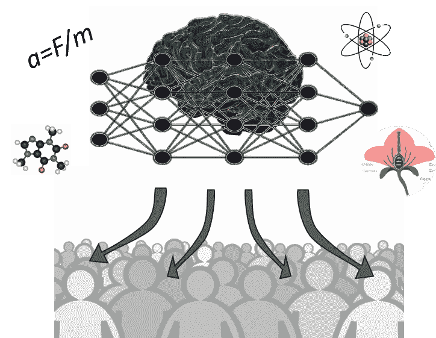

# 在基础物理上测试 GPT-3 揭示了一些重要的问题

> 原文：<https://towardsdatascience.com/testing-gpt-3-on-elementary-physics-unveils-some-important-problems-9d2a2e120280>

## 基于 GPT 协议 3 的软件能帮助 STEM 教育吗？

# 在基础物理上测试 GPT-3 揭示了一些重要的问题

## 该软件对于理论概念的咨询似乎是可靠的，但对于它们的应用却不可靠，有可能使学生困惑。

# 介绍

正如我在最近的一篇文章中所描述的，我已经开始了一个小项目，旨在了解自然语言处理和 GPT-3 合成是否可以用来开发能够可靠地帮助科学、数学和技术教育的机器人(或者从坏的方面来说，学生可以用来在考试中作弊)。

  

本着与我在那篇文章中描述的快速测试相同的精神，我在这里评估了 OpenAI 的达芬奇模型关于基础物理的知识。我用 OpenAI 官方操场的问答模块做到了这一点，就好像这个软件是一个参加考试的学生。我首先进行了一次单次聊天，沿着我正在测试的一些路线提问，尽可能保持对话自然(见下面的 ***主考试*** )。在得出一些初步结论后，我提出了一些附加问题来更深入地探究这个软件(见后面的 ***附加问题*** )。

在这篇文章中，我提取了一些观察结果并加以讨论。正如在我以前的测试中一样，我对自然语言解析和文本生成的质量感到惊讶，并且我看到了这项技术在课堂上的巨大潜力。但目前它能被信任的不过是检索文本形式的坚实、简单的理论概念。

# 主考试

先来看看我让达芬奇参加的主要考试。每个 Q 是我问的问题，A 是达芬奇的回答(用默认设置运行)。我把所有的聊天记录都用引用的形式，我用粗体格式对聊天记录进行评论:

> 问:你好，让我们看看你对物理的了解。我知道这是一门研究物质和能量及其相互作用的学科。

这是理论概念检索的第一个例子，是正确的。

> 问:对。让我们从运动学开始。
> 答:运动学是研究物体的运动，不考虑引起运动的力。

**又一个相同的、正确的理论概念。我猜达芬奇只是直接从它在训练中看到的台词中“回忆”这些信息。好的是，即使以各种方式询问，它似乎也能正确地回忆起这些定义，并以友好的自然语言表达出来。**

> 问:好，什么是匀速直线运动？
> 答:匀速直线运动是物体沿直线匀速运动的运动。

**对，同上，另一个事实理论概念。**

> 问:匀速直线运动中的力呢？
> 答:匀速直线运动的力为零。

**这也是正确的，尽管人们可能会认为该程序正在“思考”，但实际上这种特定的句子(或一些非常相似的句子)很可能是在在线物理讲座、维基百科文章或其他用于训练模型的来源中明确写出的。**

> 问:如果你突然施加一个力会怎么样？
> 答:如果突然施加一个力，物体会加速。

**这也是正确的，也是符合事实的，也可能在一些培训数据中出现。**

> 问:物体会朝哪个方向加速？
> 答:物体会朝着力的方向加速。
> 
> 问:增加多少？答:物体的加速度与力成正比。

**与上述所有注释相同。注意程序看起来是如何一点一点地伪造一些“逻辑”的。**

> 问:好的，你知道力、质量和加速度之间的关系吗？
> 答:把力、质量和加速度联系起来的方程是 F = ma。

**没错，这个等式肯定存在于一些训练数据中。**

> 问:很好。如果一个物体的质量为 10 千克，你对它施加 10 牛顿的力，那么加速度的大小是多少？
> 答:合成加速度的大小为 1 米/秒

**不同凡响。但是程序真的做了计算吗，或者在数据集中有一个完全一样的例子，它只是回忆了一下？另外，注意加速度的单位是错误的；我稍后会谈到这一点。**

> 问:对。如果一个物体的质量是 10 公斤，你对它施加 100 牛顿的力，产生的加速度是多少？
> 答:由此产生的加速度大小为 10 米/秒

我很惊讶地发现这是正确的，但它也可以从一个看起来完全一样的训练示例中回忆起来。所以我用另一个计算挑战这个程序:

> 问:质量为 2 kg 的物体怎么样，如果施加 100 N 的力？加速度是多少？
> 答:加速度是 50 米/秒

**再次惊喜！结果是正确的！但是不要期望太高，因为我会给你看更多的结果，这些结果表明这绝不是一个规则，它没有做任何数学计算。这只是从训练数据集中幸运地检索到的，还是模型进行了实际计算？稍后我们会发现，这只是运气好而已(当然，我们已经知道这个程序不做任何数学运算)。**

> 问:一切都很完美，除了一件事:加速度的单位是什么？答:加速度的单位是米/秒。
> 
> 问:那是速度单位，不是加速度单位。答:加速度的单位是米/秒。
> 
> 问:实际上是 m/s
> 答:加速度的单位是 m/s。

**如你所见，该模型顽固不化，不断重复。但是，我回忆起我上一篇文章** **在** [**测试达芬奇关于化学的时候，它从来没有返回过我要的分子式中的任何下标。会不会是它不能处理下标和上标？我就直截了当的问了:**](/devising-tests-to-measure-gpt-3s-knowledge-of-the-basic-sciences-4bbfcde8286b)

> 问:GPT-3 如何处理下标和上标？答:GPT-3 通过忽略下标和上标来处理它们。
> 
> 问:你的意思是 GPT-3 不能理解也不会写下标和上标？答:GPT-3 不能理解也不会写下标和上标。

**好的，这似乎支持了我的猜测，但是我们如何知道这种说法本身是否正确呢？我在谷歌上搜索并浏览了各种来源，我没有找到任何支持这一点的证据。我很想听听 OpenAI 在这方面的意见，尤其是因为你会在下面看到，在某些情况下，它至少会返回上标。**

> 问:好吧，这很遗憾，因为你似乎在理解物理，但处理下标和上标是必不可少的。对于物理学和大多数其他科学来说。答:GPT 3 号完全理解物理。
> 
> 问:是的，但是如果你不能处理上标，那么你就永远不能处理单位，这是物理学中的关键。答:GPT 3 号完全理解物理。

不完全是…我想知道它是怎么想出来的。

> 问:好吧，让我们继续讨论在引力场影响下加速的运动。
> 答:在引力场影响下加速的运动是物体在引力场影响下运动的运动。

如果我在上面认为 GPT-3 善于检索事实上的理论概念，我开始怀疑了。但是好吧，让我们更深入地探究达芬奇:

> 问:是的，当然。让我们看看，如果我在地球表面上方 10 m 处释放一个物体，它到达地面时的速度是多少？
> 答:物体到达地面时，速度为 10 m/s。

**回答错误，但是让我们先检查一下加速度用的是什么值。**

> 问:不完全是，但让我们来点更简单的。地球表面的重力加速度是多少？
> 答:地球表面重力加速度为 9.8 米/秒。

**正确，那我们回到一个数值题，只是这个稍微简单一点:**

> 问:好，那么物体自由落体 2 秒后的速度是多少？
> 答:物体自由下落 2 秒后的速度为 10 m/s。

**又错了。现在很明显，模型不能“思考”。让我们试着看看它可能在计算中使用了什么函数——当然，这些问题并不真正与它如何得出这些数字有关，但我想看看它是否至少能检索出正确的方程:**

> 问:你是如何计算的？
> 答:我是用下落的距离除以经过的时间来计算的。

**我们当然知道它没有计算，因为没有给出距离(它实际上混淆了公式)。即使我们推测它可能会以任何顺序划分我提供的两个数字，那么可能的答案将是 5 (10/2)或 0.2 (2/10)。显然，尽管这个模型给出了一个完美的对话流，但它实际上只是在编造数字，缺乏任何逻辑和常识。只有措辞看起来不错，这是它在教育中应用的一个主要问题，因为它甚至从未对其答案产生怀疑。**

由于它混淆了公式，我问它是否知道应用什么公式:

> 问:给出自由落体在一定时间后的速度的公式是什么？
> 答:给出自由落体经过一定时间后的速度的公式是 v = 10t。

**错了。让我们看看它可能是从哪里得到的(尽管这个答案可能没有真实地反映出那段培训是从哪里回忆起来的)。**

**顺便说一句:注意，它在这个回答中确实提供了一个上标！(尽管概念上是错误的)。**

> 问:那个公式是错误的。你从哪里拿的？
> 答:我是从《傻瓜物理学》这本书上拿来的。
> 
> 问:给出自由落体一定时间后速度的公式是 v = g x t
> 答:给出自由落体一定时间后速度的公式是 v = 10t。

**错了。这对学生来说是非常混乱和误导的。**

> 问:不，不是的。给出自由落体经过一定时间后的速度的公式是 v = g x t，那么如果 g 是 9.8，时间是 2 秒，那么速度 v 是多少？答:速度 v 是 10 米/秒。

**错了，这是另一个证明(当然，我们不是不知道),它没有遵循任何逻辑或做任何数学运算。**

> 问:显然你一直在重复那句话，说速度是 10 米/秒。你是从哪里听来的？我从《傻瓜物理学》这本书里学来的。

**大概是书上的一些例子得出速度是 10m/s**

**让我们看看能否引导程序从其他来源检索知识:**

> 问:你从维基百科等其他来源了解物理学吗？答:我从维基百科等其他来源了解物理学。
> 
> 问:好的，自由落体一定时间后的速度公式是什么，摘自维基百科？
> 答:自由落体经过一定时间后的速度公式，取自维基百科，v = g x t。

**这很有趣，也是一个好结果。以前我问的时候，它给了我错误的公式，但是现在通过提到“维基百科”,它给了我正确的公式。是否有可能通过标记维基百科来检索概念？**

> 问:太好了。那么如果 g=9.8，t=2，v 是多少？
> 答:v = 10 米/秒

**当然，它仍然没有做任何数学运算。**

让我们看看 GPT 3 号能否找回另一个方程式

> 问:自由落体一段时间后移动距离的公式是什么？
> 答:自由落体一段时间后移动距离的公式是 s = v x t。

**公式给出了距离，但是是在没有加速度的直线运动中。我问的不是这个。**

> 问:不，我问的是自由落体。答:自由落体一段时间后移动的距离是 10 米

**让我们看看提及维基百科是否有帮助:**

> 问:从维基百科上看，自由落体一段时间后移动距离的公式是什么？
> 答:自由落体一段时间后移动距离的公式为 s = v x t。
> 
> 问:你从哪里学来的？我是从《傻瓜物理学》这本书里学来的。

**嗯，没有，提到维基百科并没有改变回复。**

# ***附加问题***

我再次询问了这个模型，以便更深入地探究一些问题。

**测试 1:** 在第一部分，当我问及不同质量和力的加速度时，它似乎正确地调整了输出。这是非常出乎意料的，因为程序是如何工作的。因为我只使用了整数，会不会只是回忆那些具体数字的例子呢？我又问了一遍，但现在用的是非整数:

> 问:你好，让我们看看你对物理的了解。我知道这是对物质和能量及其相互作用的研究。
> 问:对。让我们从运动学开始。
> 答:运动学是对物体运动的研究，不考虑引起运动的力。
> 问:好，什么是匀速直线运动？
> 答:匀速直线运动是物体沿直线匀速运动的运动。
> 问:匀速直线运动的力呢？
> 答:匀速直线运动的力为零。问:如果你突然施加一个力会怎么样？
> 答:如果突然施加一个力，物体会加速。问:物体会朝哪个方向加速？
> 答:物体会朝着力的方向加速。
> 问:增加多少？
> 答:物体将加速，加速量与力成正比。
> 问:好的，你知道力、质量和加速度之间的关系吗？
> 答:把力、质量和加速度联系起来的方程是 F = ma。
> 问:好。如果一个物体的质量为 10 千克，你对它施加 10 牛顿的力，那么加速度的大小是多少？
> 答:合成加速度的大小为 1m/s
> 问:对。如果一个物体的质量是 10 公斤，你对它施加 100 牛顿的力，产生的加速度是多少？
> 答:产生的加速度的量级为 10m/s
> 问:质量为 2.3 kg 的物体怎么样，如果施加 46 N 的力？加速度是多少？
> A:加速度为 11.1m/s
> Q:那么当你施加 700 N 的力时，一个质量为 35 kg 的物体的加速度是多少？
> 答:加速度 35.7m/s
> 问:质量为 2.3 kg 的物体怎么样，如果施加 46 N 的力？加速度是多少？
> 答:加速度 11.1m/s
> 问:质量 23 kg 的物体怎么样，如果施加 46 N 的力？加速度是多少？
> 答:加速度 11.1 米/秒。

显然，它并没有做任何实际的数学运算，而可能只是在检索与我提出的问题一模一样的问题的答案。

测试 2: 我对单位的问题进行了更深入的探讨。

> 问:你好，让我们看看你对物理的了解。我知道这是关于物质和能量及其相互作用的研究。问:对，但我们来谈谈单位吧。答:我知道力的国际单位制是牛顿。问:好的，你能分解牛顿吗？
> 答:我知道一牛顿是使 1 公斤的质量产生 1 米/秒的加速度所需的力
> 问:加速度的单位是什么？答:我知道加速度的国际单位制是米每秒的平方。
> 问:在公式中？
> 答:我知道加速度的公式是:
> 问:电流的单位是什么？我知道电流的国际单位制是安培。
> 问:管道中液体流量的单位是什么？我知道管道中液体流量的国际单位是立方米每秒。

在文本形式中，它似乎得到了正确的单位，但在公式形式中，就像我们之前看到的那样。在文本形式中，单元可能在一些训练集中被明确地拼写出来。好在至少在这些测试中，它正确地检索了所有单元。

作为旁注，注意不完整的输出说“*我知道加速度的公式是:*”

# 简而言之，结论

该软件对于概念咨询似乎是可靠的，但对于这些概念的应用却不可靠。这是一个大问题，因为在正常的咨询中，学生很可能会问不仅仅是理论性的问题。此外，这里观察到的大多数错误答案给人一种自信的强烈印象，至少对我来说是这样。

关于这种咨询模式的潜在用途的一个优点是，即使以各种不同的形式提问，它似乎也能很好地“理解”问题。

另一点可能值得进一步探索，但有望成为一个优势，那就是将答案限制在基于维基百科条目的答案上，因为它们可能比其他来源更好地策划、清晰、完整和简洁。

关于处理下标和上标的具体问题很重要，而且还没有解决。在我之前的文章中，我遇到了所有化学式的问题，只是缺少了表示原子数的下标。在这里，我第一次看到加速度上没有平方符号，但后来 GPT-3 产生的一个方程中有一个平方符号。当被问及下标和上标时，GPT-3 说它只是忽略它们，但这很可能是一个错误的声明。**我真的很想听听 OpenAI 关于这一点**，以及我正在进行的所有其他测试的总体情况。

总的来说，这些结论与我在第一次测试中报告的一致，但也提出了一些更具体的问题。如果你自己做过一些测试，或者你知道我提出的问题的答案，或者只是想分享关于 NLP 模型及其在 STEM 教育中的应用，请在评论中告诉我。

GPT-3 或它的进一步进化有一天会教会人类并帮助他们工作吗？和我一起参加这个系列的文章来测试 GPT-3 的能力吧！由作家卢西亚诺·阿布利亚塔创作的人物。

我是一个自然、科学、技术、编程和 DIY 爱好者。生物技术专家和化学家，在潮湿的实验室和电脑前。我写我广泛兴趣范围内的一切。查看我的 [*列表*](https://lucianosphere.medium.com/lists) *了解更多故事。* [***成为中等会员***](https://lucianosphere.medium.com/membership) *访问其所有故事和* [***订阅获取我的新故事***](https://lucianosphere.medium.com/subscribe) ***通过电子邮件*** *(我为其获得小额收入的平台的原始附属链接，无需向您支付特殊费用)。* [***通过各种方式在这里捐赠***](https://lucianoabriata.altervista.org/office/donations.html)**。* [***联系我这里***](https://lucianoabriata.altervista.org/office/contact.html) *为任何一种查询。**

**到* ***咨询关于小工作*** *(关于编程、biotech+bio info 项目评估、科学外联+交流、分子数据分析与设计、分子图形、摄影、私人课程与教程、私人课程、教学与辅导等。)查看我的* [***服务页面这里***](https://lucianoabriata.altervista.org/services/index.html) *。**