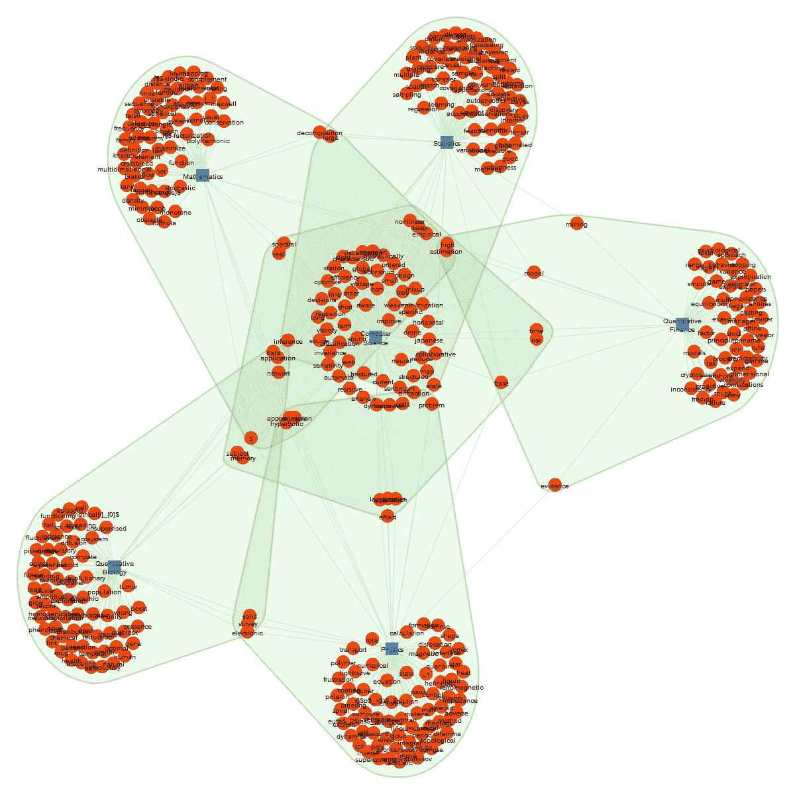
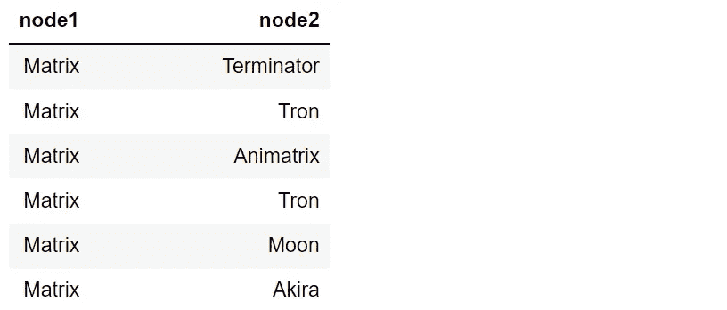
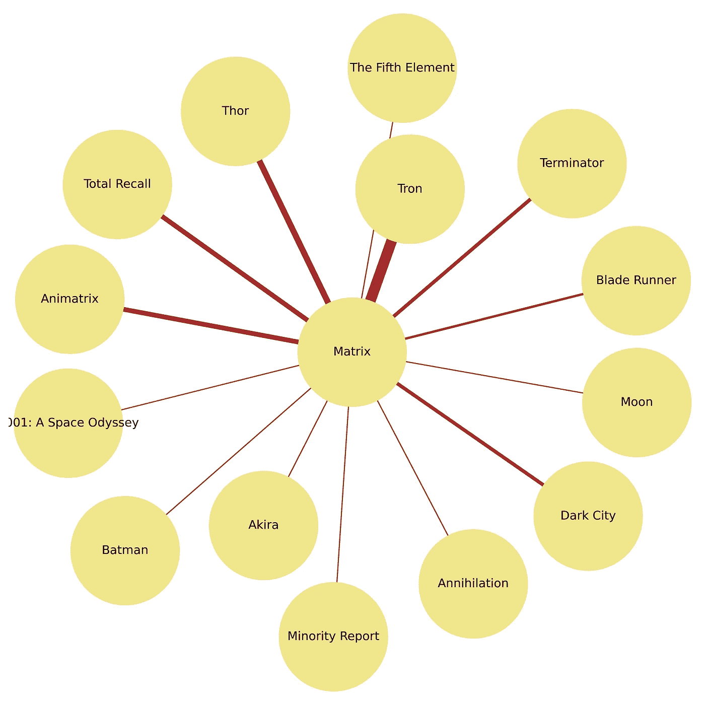

# 文本网络分析:网络构建方法简评

> 原文：<https://towardsdatascience.com/text-network-analysis-a-concise-review-of-network-construction-methods-8e875108f058>

## 从研究问题定义到网络结构估算的简明、有条理的指南。

图一。通过[文本网络](https://textnets.readthedocs.io/en/stable/)绘制文本网络图。作者图片

# 介绍

本文探讨了从文本数据构建网络结构的策略。这是 Python 文本网络分析系列的第二部分。作为一名先修者，请阅读我的开篇文章，这篇文章描述了文本网络分析的主要概念(文章在这里是)。我们将遵循([博尔索姆等人，2021](https://www.nature.com/articles/s43586-021-00055-w.pdf) )定义的步骤，并在前一篇文章中简要介绍。

图二。网络方法中使用的工作流程示意图。改编自[博尔索姆等人，(2021](https://www.nature.com/articles/s43586-021-00055-w.pdf) )。图片由 draw.io

> 定义研究问题之外的进一步步骤取决于我们的数据结构。因此**一开始要问的关键问题**是:**网络模型**的输入是什么？

我们可能会与:

*   未加工的原始数据
*   用节点-边结构清理数据

我们也可以将第一个转换为第二个，并转换原始数据，清理它，并创建节点-边结构。

# **1。从原始文本数据构建网络**

首先，我们先来回答一个问题:

**研究问题**:期刊文章标题中研究领域之间有哪些术语是共享的？

[来自 Kaggle 的 Research Articles Dataset](https://www.kaggle.com/datasets/arashnic/urban-sound?resource=download&select=train_tm) 包含六个主题(计算机科学、数学、物理学、统计学、定量生物学和定量金融学)的期刊文章摘要，是说明 Python 编码的一个很好的选择。这里的数据许可是[这里的](https://creativecommons.org/publicdomain/zero/1.0/)。

它看起来是这样的:

图 3。研究文章数据集中的第一行

**Textnets** 是根据 [Bail 的(2016) PNAS](https://www.pnas.org/doi/full/10.1073/pnas.1607151113) 论文开发的。它同时存在于 [Python](https://textnets.readthedocs.io/en/stable/) 和 [R](https://github.com/cbail/textnets) 实现中。默认情况下，它使用*莱顿算法*在文本数据中进行社区检测。这组算法有助于发现大型复杂网络的结构，并识别出相互连接但与网络其余部分稀疏连接的节点组(参见 [Traag et al .，201](https://www.nature.com/articles/s41598-019-41695-z) 9， [Yang et al .，2016](https://www.nature.com/articles/srep30750%29) )。点击了解更多其他检测算法[。](https://textnets.readthedocs.io/en/stable/advanced.html?highlight=community%20detection#using-alternate-community-detection-algorithms)

## 履行

让我们看看它是如何工作的。首先，我们导入`Textnets`和`Pandas`，并读取数据。设置`index_col='research_field'`以正确绘制图形很重要(参见我的 [GitHub](https://github.com/PetrKorab/Text-Network-Analysis-A-Concise-Review-of-Network-Construction-Methods) 上的完整代码)。接下来，我们从文章标题栏构建语料库。我们使用一个子集来代表每个研究领域的 10 篇文章的标题，以使图解网络更简单。

*Textnets* 然后移除[停用词](https://en.wikipedia.org/wiki/Stop_word)，应用[词干](https://www.geeksforgeeks.org/introduction-to-stemming/)，移除标点符号、数字、URL 等，创建一个文本网络。`mind_docs`指定一个术语必须出现在网络中的最小文档数。

现在，让我们绘制网络图。`show_clusters`选项标记由莱顿检测算法找到的分区。它识别文档术语组，这些术语组似乎构成了文本中同一主题的一部分。

这是我们得到的网:

图 4。通过文本网络的文本网络。作者图片

## 调查的结果

我们可以清楚地区分不止一个研究领域共享的关键词。例如，“时间”和“风险”(定量金融—计算机科学)、“深度”和“实证”(数学—统计—计算机科学)、“主题”和“记忆”(定量生物学—计算机科学)。

这些发现很大程度上取决于样本量。我们拥有的数据集越丰富，我们获得的结果就越精确。**我们可以用很多其他方式画出网络结构，这取决于我们一开始设定的研究问题。**看一下 Textnets 教程[这里](https://textnets.readthedocs.io/en/stable/tutorial.html)。

# 2.从节点-边结构构建网络

照片由[上的](https://unsplash.com?utm_source=medium&utm_medium=referral)[琵琶](https://unsplash.com/@milestogobeforeisleep?utm_source=medium&utm_medium=referral)拍下

我们可以处理具有清晰节点-边结构的数据，这通常涉及清理和预处理。为了探索可能的场景，让我们使用 [IMDb 50K 电影评论](https://www.kaggle.com/datasets/atulanandjha/imdb-50k-movie-reviews-test-your-bert)数据集，其中包含电影评论及其评估的情绪(正面/负面)。这里的数据许可是[这里的](http://www.gnu.org/licenses/lgpl-3.0.html)。

[**NetworkX**](https://networkx.org/documentation/latest/index.html) 是一个用于创建和研究复杂网络的 Python 库。这是一个高度开发的包，包含了广泛的文档，在许多教程和电子书中绘制了网络。该软件包的合著者哈格伯格等人(2008) 提出了内部网络 x 结构。它可以显示各种网络结构；文本数据通常需要一些转换来作为输入。

文本网络通常用于显示文本中的关键词共现(Shim 等人，2015；Krenn 和 Zeilinger，2020，以及许多其他人)。我们将使用相同的方法，作为一个用例，我们对电影评论者与著名的《黑客帝国》电影的关联感兴趣。

该数据由两组 ***节点*** : **被监控的电影片头** ( *矩阵* ) 和一组被选中的**电影片头**组成，评论者可能将这些片头与矩阵**相关联。*边*** 由**同一评论中节点的同现表示。**仅当评论者在同一评论中提到被监控的和相关联的电影标题时，该边缘才存在。

**研究问题**:哪些热门科幻电影主要与《黑客帝国》有关？

**数据**具有以下**结构:**

图 5。数据，“节点-边”示例。作者图片

## **实施**

阅读完数据后，让我们做一些简单的转换和探索步骤，帮助我们理解图表并正确地绘制图表。

1.  **计算边缘尺寸**

为了量化边缘，我们在数据中创建一个单独的列`edge_width`，在`node2`列中包含每个边缘的大小。

2.创建图表并**打印节点和边**以防止可能的误解

3.**绘制网络图**

在简单检查了没有意外错误发生之后，我们继续，将原始的 *G* 图形塑造成[星形图形](https://networkx.org/documentation/latest/reference/generated/networkx.generators.classic.star_graph.html?highlight=star_graph)，将图形的属性保存在`options,`中，并用`matplotlib.`进行绘制

代码绘制了这个漂亮的网络星形图形:

图 6。通过 NetworkX 的文本网络绘图。作者图片

**调查结果:** *电影片名的数据不是很丰富，但网络分析表明，评论者大多将《黑客帝国》与雷神和创联系在一起。在对如此小的数据集进行简短的数据检查后，这似乎是显而易见的。然而，假设您有一个包含大量节点的大型数据集。在这里，网络分析非常有助于描述数据集。*

# 结论

这篇文章不可能对文本网络构建方法提供一个完全详尽的综述。由于互联网上有[多个来源](https://networkx.org/documentation/stable/reference/classes/index.html#)，我省略了各种网络结构的详细概述。相反，它概述了这一领域的几个方法要点。

总而言之，这里有几个可以遵循的提示:

*   首先，明确定义你特定项目中的研究问题。文本网络分析是一种提供答案的实证方法。
*   接下来，看看数据集结构。如果研究问题需要数据转换，就去做。
*   创建的网络可能不是分析的最终输出，而是更复杂研究的对象:图形、机器学习模型、预测等。

完整的代码在我的 GitHub 上。

*本系列的下一篇文章将为简单和更复杂的文本数据分析图表提供更多的启示。最后一篇文章将探索语义网络在预测中的最新应用。* ***保持更新！***

*PS:你可以订阅我的* [*邮件列表*](https://medium.com/subscribe/@petrkorab) *在我每次写新文章的时候得到通知。而如果你还不是中等会员，可以在这里* *加入* [*。*](https://medium.com/@petrkorab/membership)

# 参考

[1]保释，a，C. 2016。结合自然语言处理和网络分析，研究倡导组织如何刺激社交媒体上的对话。 [*《美国科学院院刊》*](https://www.pnas.org/doi/pdf/10.1073/pnas.1607151113) *，*第 113 卷，第 42 期。

[2] Borsboom 等人，2021 年。心理科学中多元数据的网络分析。 [*《自然评论*](https://www.nature.com/articles/s43586-021-00055-w.pdf) ，第 1 卷，第 58 期。

[3]哈格伯格，a .，舒尔特，d .，a .，斯沃特，p .，J. 2008。[使用 NetworkX 探索网络结构、动力学和功能](https://conference.scipy.org/proceedings/SciPy2008/paper_2/)，载于《第七届 Python 科学会议论文集》(SciPy2008)，el Varoquaux、Travis Vaught 和 Jarrod Millman (Eds)，(美国加利福尼亚州帕萨迪纳)，第 11–15 页，2008 年 8 月。

[4]m .克伦，泽林格，2020 年。用语义和神经网络预测研究趋势及其在量子物理中的应用。 [*美国国家科学院院刊*](https://www.pnas.org/doi/10.1073/pnas.1914370116) *，v* ol。117，4 号。

[5]辛姆，j .，帕克，c .，威尔丁，M. 2015。通过语义网络分析识别政策框架:对六个国家核能政策的检查。*《政策科学》，第 48 卷。*

*[6] Traag，V. A .，Waltman，l .，Van Eck，N. J. 2019。从卢万到莱顿:保证良好连接的社区。 [*科学报告*](https://www.nature.com/articles/s41598-019-41695-z) ，第 9 卷，第 5233 号。*

*[7]杨，z .，阿尔杰什海默，r .，特松，C. J. 2016。人工网络社区发现算法的比较分析。 [*科学报告*](https://www.nature.com/articles/srep30750)#auth-Ren_-Algesheimer) ，第 6 卷，第 30750 号。*