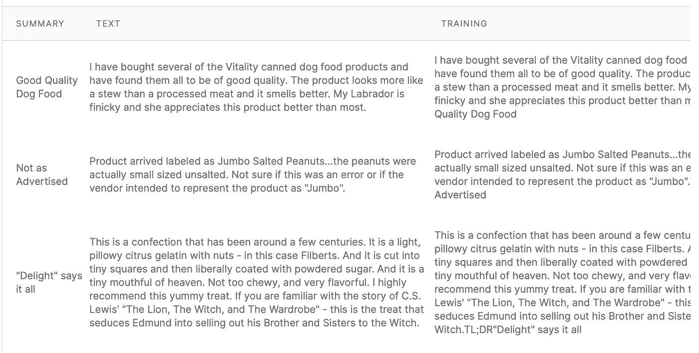
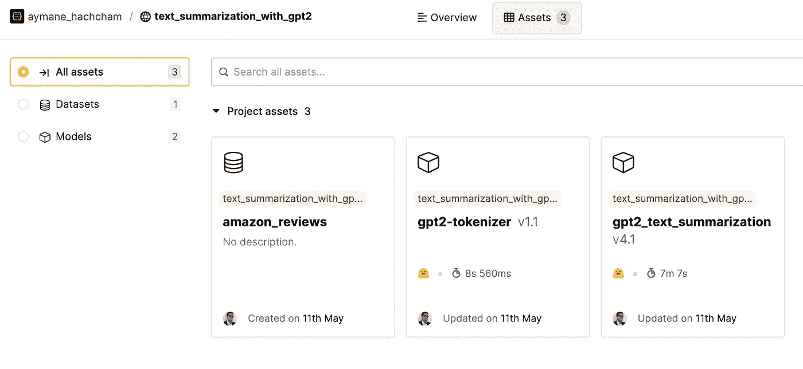

# 基于 GPT2 和人工智能层的文本摘要

> 原文：<https://towardsdatascience.com/text-summarization-with-gpt2-and-layer-ai-599625085d8e>

## 使用拥抱的人脸变形库和人工智能层微调 GPT2 进行文本摘要

照片由 [Aaron Burden](https://unsplash.com/@aaronburden) 在 Unsplash 上拍摄

变形金刚在 2017 年的著名文章[中首次亮相后，很快成为 NLP 中最受欢迎的型号](https://arxiv.org/abs/1706.03762)。以非顺序方式(与 RNNs 相反)分析文本的能力使得大型模型能够被训练。事实证明，注意力机制的引入对于概括文本具有极大的价值。

在深度学习出现之前，以前的 NLP 方法更多的是基于规则的，更简单的(纯统计)机器学习算法被教会在文本中查找单词和短语，当发现这些短语时，会创建特定的回复。

该研究发表后，涌现出无数流行的变形金刚，其中最著名的是**GPT**(***G****generative****P****re-trained****T****transformer*)。 *OpenAI* ，人工智能研究的先驱之一，创造并训练了 GPT 模型。 [GPT-3](https://openai.com/blog/openai-api/) 是最新版本，有 1750 亿个参数。因为这个模型非常复杂，OpenAI 决定不开源它。人们可以在完成漫长的注册过程后通过 API 使用它。

在这篇文章中，我将用一些技术背景来介绍变压器。然后，我们将使用 Layer 来获取预训练版本的 GPT2，以对其进行微调，用于总结目的。我们将使用的数据集由亚马逊评论组成，可以通过以下链接在 Kaggle 中找到:

 [## 用亚马逊评论总结文本

### 使用 Kaggle 笔记本探索和运行机器学习代码|使用来自亚马逊美食评论的数据

www.kaggle.com](https://www.kaggle.com/code/currie32/summarizing-text-with-amazon-reviews/notebook) 

## 概观

1.  变形金刚(电影名)
2.  亚马逊评论数据集
3.  微调 GPT2
4.  评估我们的微调模型
5.  结论

我在本文中包含了最有启发性的代码。这个项目的完整代码库和数据集可以在我的公共 [Colab 笔记本](https://colab.research.google.com/drive/1iDhg8ss-BW0ZpzL-umJhd9XAm7xUlz-g?authuser=2#scrollTo=AY5gYk6U4-l7)或 [Github Repo](https://github.com/aymanehachcham/GPT2_Text_Summarization) 中找到。

 [## GitHub-aymanehachham/gp T2 _ Text _ summary

### 这个项目的重点是微调 GPT2 模型，在公共 Amanzon 评论数据集上执行文本摘要…

github.com](https://github.com/aymanehachcham/GPT2_Text_Summarization)  [## 谷歌联合实验室

### 编辑描述

colab.research.google.com](https://colab.research.google.com/drive/1iDhg8ss-BW0ZpzL-umJhd9XAm7xUlz-g?usp=sharing#scrollTo=rinybKnGJLpY) 

## 快速参观变形金刚图书馆

## 基于注意力的模型

机器学习中的注意力机制是基于我们自己的大脑皮层如何工作的。当我们检查一张图片来描述它时，我们自然会将注意力集中在几个我们知道保存着关键信息的关键地方。我们不会以相同的强度检查图像的每个细节。在处理要分析的复杂数据时，这种方法有助于节省处理资源。

类似地，当口译员将材料从源语言翻译成目标语言时，他们根据以前的经验知道源句子中的哪些单词对应于翻译短语中的哪些术语。

照片由纳迪·博罗迪纳在 Unsplash 上拍摄

## GPT2

GPT 语言模型最初是在 2018 年由 Alec、Jeffrey Wu、Rewon Child、David Luan 在论文“ [*中介绍的，语言模型是无监督的多任务学习器*](https://cdn.openai.com/better-language-models/language_models_are_unsupervised_multitask_learners.pdf)**，其目标是开发一个可以从先前产生的文本中学习的系统。它将能够以这种方式为完成一个短语提供多种选择，节省时间，并增加文本的多样性和语言深度。这一切都完成了，没有任何语法错误。**

*GPT2 架构的主要层是关注层。在不深究其技术细节的情况下，我想列出它的核心特性:*

> *GPT2 使用字节对编码在其词汇表中创建令牌。这意味着标记通常是单词的一部分。*
> 
> *GPT-2 以因果语言建模(CLM)为目标进行训练，因此能够预测序列中的下一个单词。GPT-2 可以利用这种能力创建语法连贯的文本。*
> 
> *GPT-2 生成合成文本样本，以响应用任意输入启动的模型。这个模型就像变色龙一样——它适应条件文本的风格和内容。*

## *亚马逊评论数据集*

*Kaggle 中呈现的数据集的目标是开发一种算法，可以为亚马逊美食评估提供有意义的摘要。这个数据集在 Kaggle 上提供，有超过 500，000 条评论。*

*当顾客在亚马逊上写评论时，他们会创建一个文本评论和一个标题。综述的标题用作数据集中的摘要。*

****样品:****我买过几款活力狗粮罐头，发现质量都不错。这种产品看起来更像炖肉，而不是加工过的肉，而且闻起来更香。我的拉布拉多很挑剔，她比大多数人更喜欢这个产品。**

****总结***:*优质狗粮**

**

*上传到图层的数据集中的样本*

*数据集中有大约 71K 个实例，这足以训练一个 GPT-2 模型。*

*在开始处理阶段之前，我们需要建立与层的连接。我们需要登录并初始化一个项目:*

*然后，我们可以访问图层控制台，初始化我们的项目，并准备好记录我们将使用的数据集和模型。*

**

*从层控制台捕获*

*让我们将数据保存到层:*

*首先，我们通过将 Github repo 克隆到 Colab 中来安装它:*

*我们现在可以这样从层中获取数据:*

## *执行一些数据处理*

*GPT 2 号的多任务处理能力是它最吸引人的特点之一。同时，同一个模型可能在许多任务上被训练。但是，我们必须使用组织文件中概述的相关任务指示器。*

***TL；博士**符号，代表“太冗长；没读过”是总结工作的理想指示词。*

***TL；DR** 符号可以用作填充元素，以缩短评审文本，并向模型指示重要内容到此为止。*

*我们还需要获得句子输入长度的平均值:*

*在我们的例子中，平均长度总计为每句话 73 个单词。我们可以推断，最大长度 100 将涵盖大多数情况，因为单词的平均实例长度是 73。*

*用于处理数据样本的代码可能变得复杂且难以维护；为了更好的可读性和模块化，我们希望数据集代码与模型训练代码分离。因此，我们可以使用 PyTorch Dataset 类作为包装器，它将充当一个紧凑的模块，将文本评论转换为准备用于训练的张量。*

*导入模型后，我们初始化数据集和数据加载器组件，为训练阶段做准备。我们可以从层调用我们的记号赋予器:*

## *微调 GPT2*

*训练过程很简单，因为 GPT2 能够完成多项任务，包括总结、生成和翻译。对于摘要，我们只需要包含数据集的标签作为输入。训练部分包括构建 GPT2 模型并上传到层。*

*培训将完全在层中执行，我们将使用 [f-gpu-small fabric](https://docs.app.layer.ai/docs/reference/fabrics) ，这是一个具有 48 GB 内存的小型 gpu。我们首先从训练循环开始:*

*然后我们用需要的参数建立模型。我们将它上传到层:*

*然后，我们调用“layer.run”函数在层中运行训练:*

*训练开始了。这可能需要很长时间，具体取决于纪元和可用的资源。*

## *评估我们的微调模型*

*一旦您微调了我们的模型，我们现在就可以开始按照各自的方法处理评论:*

*   ***步骤 1** :首先对模型进行评审。*
*   ***第二步**:然后从所有我们有 top-k 选项的评论中，选择一个。*
*   ***第三步**:选择被添加到概要中，当前序列被输入到模型中。*
*   ***步骤 4** :应重复步骤 2 和 3，直到达到 max_length 或产生 EOS 令牌。*

*从模型的所有生成预测中选择前 k 个预测:*

*然后我们定义我们的推理方法:*

*我们现在可以用 3 个示例审查来测试上面的代码，并查看生成的摘要。*

*首先，我们调用来自层的训练模型:*

*我们从测试数据中抽取一些样本:*

*最终结果:*

***点评 1**
文字点评:“*爱这些芯片。味道很好，非常脆，非常容易清理整个 3 盎司。一口气搞定。没有油腻的余味。原味和烧烤口味是我的最爱，但我还没有尝过所有的口味。伟大的产品。**

***相关摘要** : {' *非常好吃！，'喜欢这些薯片！'，'我最喜欢的水壶芯片* '}*

***回顾 2**
文字回顾:“*我们已经很多年没有咸菜了，因为不需要的成分。这个牌子很好吃，不含有害成分。这种情况下也比当地超市*便宜很多*

***关联摘要** : {' *好吃'，'好吃'，'好棒的产品*！'}*

*文字评论:“*这是这一品种的爱好者的最佳英式早餐茶，我试过很多种，包括从英国进口的。经过 20 年的寻找，我找到了最美味的茶的一个非常合理的价格。**

***关联摘要** : {' *妙茶'，'爱喝茶的人最好的茶'，'爱喝茶的人最好的茶* '}*

## *总结想法*

*考虑到我们所做的大量训练，我们目前所取得的成绩已经相当不错了。Layer 简化了导入模型和记号化器的整个过程。记录所有模型工件和数据集的选项也非常有用，因为您可以实时跟踪工作的效果。还有可能分享你的项目，在团队中协作，所以绝对值得。*

*所有代码都托管在上面提到的 [Google Colab](https://colab.research.google.com/drive/1iDhg8ss-BW0ZpzL-umJhd9XAm7xUlz-g?authuser=2#scrollTo=4JObyccnfeZO) 中，请随时查看并自行尝试。*