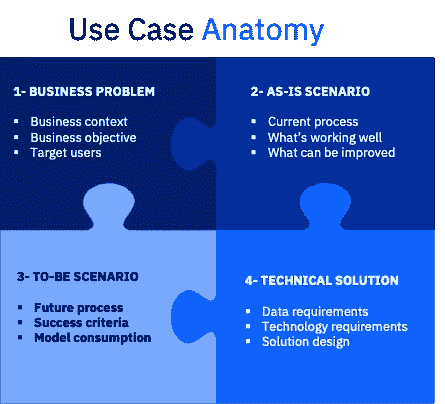

# 剖析数据科学用例

> 原文：<https://towardsdatascience.com/the-anatomy-of-a-data-science-use-case-4fba716eeb5a>

## 在编写任何代码之前，您必须在用例中定义 4 个组件

Joyce McCown 在 [Unsplash](https://unsplash.com?utm_source=medium&utm_medium=referral) 上的照片

您已经准备好为您的公司实现定义的用例。项目启动时，您开始收集数据，应用必要的数据清理和争论，继续训练和微调模型，不断重复，直到达到 92%的准确率。太好了！几周后，好消息是，您的模型最终部署到生产中。然而，三个月后，您接到业务部门的电话，抱怨该模型没有增加任何业务价值…一个准确率为 92%的模型怎么会提供零业务价值呢？

听起来很熟悉？您会惊讶地发现这种情况在企业中发生了多少次。Gartner [估计](https://blogs.gartner.com/andrew_white/2019/01/03/our-top-data-and-analytics-predicts-for-2019/) *“到 2022 年，只有 20%的分析洞察力将带来业务成果”[1]* 。你试着深入分析并排除故障，从技术角度来看，一切都很完美。那么，怎么了？

我在实践中看到的数据科学项目失败的最常见原因是业务和数据科学团队之间的翻译失误。我们都知道我们需要把商业放在第一位，但这说起来容易做起来难。数据科学家通常是喜欢数学和算法的技术人员，但不一定具有行业/领域技能，或者有时没有付出足够的努力来正确理解和定义业务用例。我非常相信麦肯锡最近创造的“分析翻译”这个角色。我强烈建议你[阅读](https://www.mckinsey.com/business-functions/mckinsey-analytics/our-insights/analytics-translator)这个角色的真正含义以及需要的技能。*到 2026 年，麦肯锡全球研究所* [*估计*](https://www.mckinsey.com/business-functions/people-and-organizational-performance/our-insights/five-fifty-lost-in-translation) *仅美国对翻译的需求就可能达到两到四百万。*

每个人都会同意，首先必须正确定义业务用例。这到底意味着什么？用例分析是什么样子的？在开始实施之前，您需要收集哪些关键信息？我相信用例定义必须包括这四个部分:业务问题、现状场景、未来场景和技术解决方案。我将在下面更详细地描述这些组件。为了更好地解释这些概念，我将挑选一个经典的用例:*“客户流失”*。

数据科学用例剖析—图片由作者提供

# 1-业务问题

第一部分是最关键的一部分，因为它指导着整个过程的其余部分。你想解决的业务问题是什么？您需要定义以下内容:

- **商业背景。**首先，也是最重要的一点，您需要了解此使用案例的关键触发因素或采取行动的令人信服的理由。它如何与整体业务战略保持一致？它是由最近的特定业务事件或决策触发的吗？它是更大的人工智能计划或数字化转型计划的一部分吗？

——**商业挑战。**你正面临的业务挑战是什么？尽量具体一点。在我们的客户流失示例中，您需要回答这样的问题:目标是预测谁会流失吗？他们什么时候会搅动？他们为什么要搅拌？如何留住他们？它是否针对特定的客户群？你如何定义客户流失？在哪些产品上？

——**目标用户。**哪种业务功能和用户将会使用您的模式并从中受益？你需要有一份联系人、角色等的清单。最重要的是，从业务角度来看，有一位焦点人物将成为您的支持者/赞助商。在我们的例子中，它可能是诸如保留专家、活动经理、呼叫中心经理、营销专家、CRM 主管等角色。

# **2-** **现状场景**

第二部分是了解企业当前用来应对既定挑战的现有方法。

**当前状态流程。**当前解决这一挑战的流程是什么？你的目标用户完成相关任务的不同步骤是什么？在我们的示例中，您可以问这样的问题:营销团队目前如何设计和执行保留活动？如何选择目标列表？这个过程需要多长时间？

**什么工作做得好。**询问什么工作得好是一个很好的做法，换句话说，当前流程中哪些部分是业务用户感到舒服并且会抵制改变的。在我们的示例中，您可能会听到诸如白盒方法、完全控制选择哪些客户、针对给定场景灵活定制活动等答案。

**有哪些可以改进的地方。**当前流程中有哪些痛点？在这里，你将发现改善现有状况的机会，并证明你所做贡献的附加值。对于我们的客户流失用例，痛点可能是回复率低，每月流失率没有显著下降，手动流程来设计活动。

# **3-** **未来情景**

**未来状态流程。**一旦我们解决了业务用户的痛点，他们会如何看待现有流程的未来？它可以通过自动化一些任务来提高运营效率，例如建立目标客户列表、确定下一个最佳报价以留住客户等。

**模特消费。**必须向业务用户明确设定期望，即他们应该从模型中获得什么样的输出，以及他们将如何使用它。模型期望提供或集成的应用程序是什么？用户需要这些输出的频率如何，例如每月、每周还是每天？例如，一个保留团队可能期望有一个潜在客户的月度目标列表，包括客户 id、客户流失率、主要影响因素、价值细分等。

**成功的标准。**未来情景的预期优势是什么？通常，KPI 在某种程度上与增加收入或客户满意度、提高运营效率或降低风险敞口相关联。

我见过的一个常见错误是数据科学家过于关注模型的技术准确性。虽然这可以给出项目成功的一些指示，但是您需要记住，商业价值最终是最重要的。如果你的模型设计不当，准确性毫无意义！在我们的例子中，商业利益可以是:与对照组相比，客户流失率降低 2 倍**；**将战役响应率提高 3 倍等。有一个基准作为起点是非常有用的，这将允许您展示您相对于基准的提升。

与上述相关的另一个常见错误是，数据科学家致力于某种程度的模型准确性。我强烈反对这样做，因为每个客户数据和业务问题都是不同的。要知道你能期望有多高的精确度，唯一的方法就是根据手头的数据建立一个模型。

# **4-** **技术方案**

一旦业务线验证了业务问题和期望，最后一步就是定义和设计技术解决方案。

**数据要求。**定义数据需求是数据科学项目的关键步骤。有必要召开数据评估研讨会，以了解现有的数据生态系统，并就*【可能】*对用例有用的数据源提出建议。我在这里强调单词*“可能”*，因为即使领域专家可以胡乱猜测，在我们训练模型之前，没有人能够确定哪些数据点会有帮助。此时，列出可能有用的候选数据域就足够了。在我们的例子中，它可以是客户交易、社会人口统计、产品规格、账单、支付、联络中心、CRM。更不用说你最重要的来源是你将用来定义你试图预测的目标变量的数据，例如，流失(假设这是一个监督学习)。此外，请务必询问基准数据，因为这将允许您比较模型。

数据需求是一个更加技术性和复杂的话题，我将专门写一篇博客来专门讨论它。

**技术要求。**构建这个用例需要哪些技术？最基本的，你需要一堆经典的软件和库来收集和准备数据，训练和部署你的模型。如果您正在考虑企业的用例操作化，那么考虑额外的技术是很重要的，比如数据治理和模型生命周期管理。可能还需要一些替代/非人工智能技术，例如，模型输出的后处理、持续开发和持续集成(CI/CD)、通过 RPA 实现某些流程的自动化等。

**解决方案设计。**一旦您确定了技术需求，在您的技术架构师和开发人员的帮助下，您将定义描述拼图的不同部分如何组合在一起的解决方案架构。该架构必须解释模型训练和模型消费的数据管道，一直到将端点与目标应用程序和模型生命周期管理集成。更不用说基础架构规模和解决方案运行的环境了。它会托管在公共云上吗？内部？还是混合云？需要多少个非生产环境？环境之间是逻辑分离还是物理分离？每个解决方案都有不同的规模，但总体而言，这将取决于大量与数据相关的因素(容量、速度等)。)、用户(并发数量、预期使用量)、IT 策略和安全标准等。

# **结论**

现在您已经有了一个定义良好的用例，您需要与 IT 或数据管理团队分享详细的数据需求，然后等待数据供应和工作环境设置完成，这样您就可以开始数据科学的魔法了！好消息是，这一次你会更有信心，如果技术部分做对了，业务用户会很高兴。请记住，这个用例定义是一项正在进行的工作，因此遵循敏捷项目方法并保持业务在循环中发展用例并避免最终出现意外是很重要的。

最后同样重要的一点是，能够用非技术术语解释技术工作的成果，以便业务用户能够清楚地理解和欣赏您提供的价值，这一点我怎么强调都不为过。

我将给你们留下一篇关于[企业设计思维](https://www.ibm.com/design/thinking/)的笔记，它提供了一个框架和一套方法来定义一个用例，所有这些都由业务价值来指导。

# 参考

[1] A. White，[我们的顶级数据和分析预测 2019 年](https://blogs.gartner.com/andrew_white/2019/01/03/our-top-data-and-analytics-predicts-for-2019/)，2019 年，Gartner 博客文章。

[2] N. Henke，J. Levine 和 P. McInerney，[分析翻译:新的必备角色](https://www.mckinsey.com/business-functions/mckinsey-analytics/our-insights/analytics-translator)，2018 年，哈佛商业评论