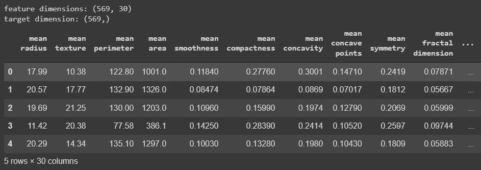
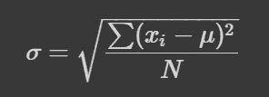
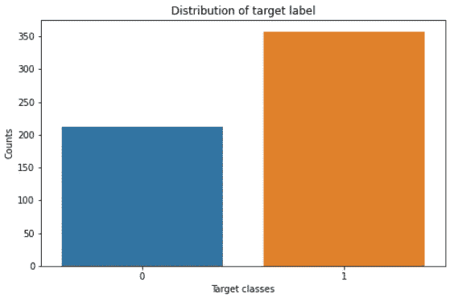
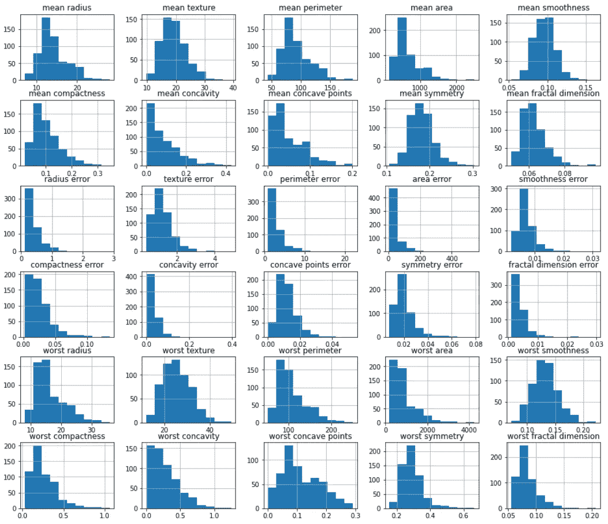
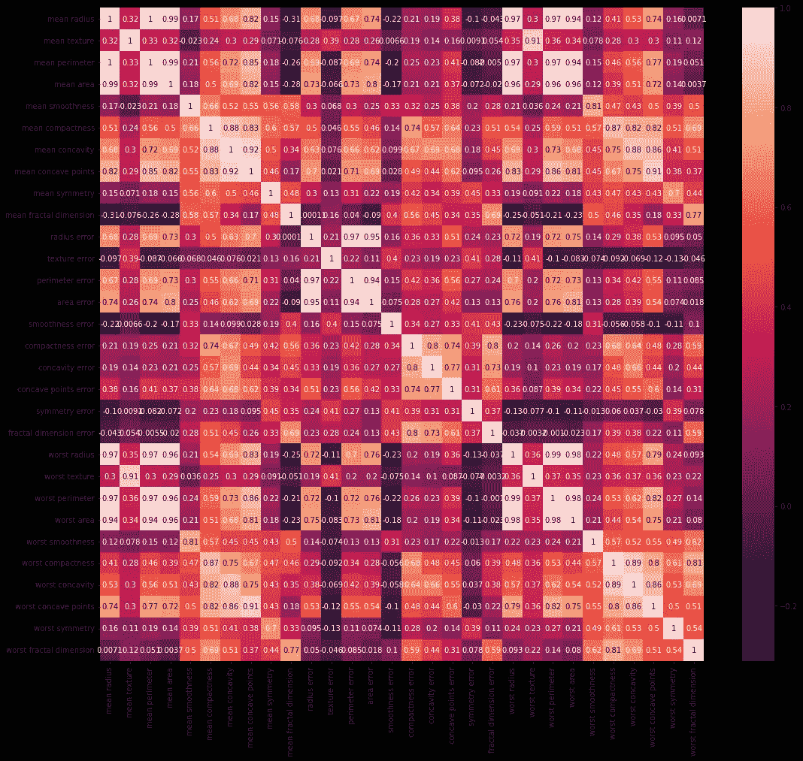

# 基本要点:机器学习的统计学

> 原文：<https://towardsdatascience.com/the-basic-essentials-statistics-for-machine-learning-dd9cfeb0e5ef>

## 提高您与数据交流的能力


贾斯汀·摩根在 [Unsplash](https://unsplash.com?utm_source=medium&utm_medium=referral) 上的照片

如果你处理数据，统计学知识是很重要的。牢牢掌握一些基本概念对你有效沟通的能力大有帮助。您还将了解收集、分析、做出决策以及有效展示从数据中发现的结果的正确方法。

在本文中，我们将使用来自 sklearn 的乳腺癌威斯康星州数据集来涵盖一些基本的统计学概念。这是一个包含 569 个观测值和 30 个要素的分类数据集。

下面我们已经导入了必要的框架，并将数据加载到内存中。

```
**import** pandas **as** pd
**import** seaborn **as** sns
**import** matplotlib.pyplot **as** plt
**from** sklearn.datasets **import** load_breast_cancerX, y = load_breast_cancer(return_X_y=True, as_frame=True)
```

# 基础知识

一旦建立了一个数据集，首先要做的事情之一就是检查它。这个想法是为了收集关于数据是否包含您所期望的内容的信息，但是这个过程也会产生一些见解，您可以在进行数据预处理时将这些见解作为种子保留下来。

首先要理解的是关于数据的事实。这意味着你要清楚地知道:

*   **数据维度—** 知道你有多少数据是很重要的。你拥有的数据量可能是使用哪种机器学习算法的决定因素，或者是你是否删除/添加某些功能的决定因素。
*   **数据类型—** 了解可用数据的类型很重要，因为这将影响我们进行的统计测试的类型。此外，大多数机器学习模型只能处理数字，因此最好事先知道可用数据的类型，以便可以将其转换为适合 ml 算法的格式。
*   **缺失数据—** 这又回到了了解你已有的数据上。数据可能由于各种原因而丢失，但对于大多数机器学习模型来说，必须事先对其进行处理(即插补或删除)。

让我们看看我们的数据及其维度:

```
**print**(f"feature dimensions: {X.shape}\n\
target dimension: {y.shape}")X.head()
```



**注意**:桌子的一部分被切掉了，这样可以清晰地抓图；**作者图片**

熊猫用`None`或`NaN`代表缺失值。我们可以通过在熊猫数据帧上使用`info()`方法来检查缺失值和特征的数据类型。

```
X.info()
```


**所有特征信息；作者图片**

`Non-Null Count`列显示我们的数据集中没有缺失值；我们的数据中有 569 个观察值，数据集中有 569 个非空值。

`Dtype`代表数据类型。该列告诉我们数据集中每个要素的数据类型，我们可以看到它们都是`float64`。

# 描述统计学

统计有两种:**描述性**和**推断性**。

推断统计学指的是从数据中做出推断，例如抽取样本以对总体做出概括。另一方面，描述性统计用于更好地描述数据。

当熟悉一些数据时，利用描述性统计很重要，因为这在推断过程中起着重要作用。

需要注意的一些描述性统计术语有:

## 数数

计数听起来很简单:你拥有的项目或观察的数量。了解计数至关重要。如果你希望正确地评估你的结果，那么你必须清楚地知道在你的数据中有多少项目或观察结果。

## 平均

平均值是这些数字的平均值；计算平均值就像计算观察值的总和并除以它一样简单，但是观察值的数量。


**平均值的公式；作者图片**

这很重要，因为它在计算中考虑了人口中涉及的每一个主体。但是，出于同样的原因，对于发现集中趋势来说，这可能是一种糟糕的测量方法，即，偏态分布中的异常值会对平均值产生影响。

## 标准偏差

标准差衡量一组值的变化量。它的计算方法是将平均值除以数据大小，得到平方差之和的平方根。



**标准差的公式；x_i 是来自总体的每个值，μ是平均值，N 是总体的大小，σ是总体标准差；作者图片**

我们通常将标准偏差与平均值结合使用来总结连续数据，大约 95%的值落在平均值的两个标准偏差范围内。与平均值类似，当数据明显倾斜或存在异常值时，标准差会受到影响。

## 最低限度

最小值是指数据集中的最小值。

## 第 25 百分位

第 25 个百分位数(也称为下四分位数或第一个四分位数)是数据中 25%的值在排列时低于的值。

## 中位数(第 50 百分位)

中位数是一组数值的中间数。它是将上半部分和下半部分分开的值。它的目的是告诉我们数据集的中心值，当数据有偏差或存在异常值时，它比平均值更有用。

## 第 75 百分位

第 75 个百分位数(也称为上四分位数或第三个四分位数)是数据中 75%的值按升序排列时低于的值。

## 最高的

最大值是指数据集中的最大值。

让我们看看如何在数据集中找到这些信息:

```
X.describe()
```


关于数据集中特征的描述性统计；作者图片

你也可以看到在某些圈子里讨论的四分位数范围。这是指第 75 百分位(Q3)和第 25 百分位(Q1)之间的差异。

# 单变量分析

单变量分析可能是统计分析最简单的形式。它包括相互独立地探索数据集的各个要素。

从这种类型的分析中获得的有用信息包括诸如值的范围、集中趋势、偏斜度和组的分布等。我们已经讨论了如何分析值的范围(即最小值、最大值、百分位数和 IQR)，但是我们没有过多地讨论偏斜和分布。

让我们先看看这个类的分布，然后我们会讨论为什么分布是重要的。

```
counts = y.value_counts()plt.subplots(figsize=(8, 5))
sns.barplot(x=counts.index, y=counts.values)
plt.title("Distribution of target label")
plt.xlabel("Target classes")
plt.ylabel("Counts")
plt.show()
```



**分配目标标签；作者图片**

前面我们说过，理解数据中可用的数据类型很重要，因为这影响我们对统计检验的选择:出于同样的原因，我们需要知道数据的分布。

对于分类问题，我们需要知道类的平衡程度。高度不平衡的班级的问题可能需要一些手动处理，以帮助我们的机器学习模型更好地预测少数民族班级。

我们也来看看我们的特征分布。

```
X.hist(figsize=(18, 16))
plt.show()
```



**分布特征；作者图片**

直方图是表示数字数据分布的一种很好的方式；我们可以从上图中发现每个特征的偏斜度。这告诉我们关于平均值的概率分布的不对称性的测量——我们也可以学习特征的模态，即峰值的数量。

理解数据的形状非常重要，因为它告诉我们关于数据的大部分信息在哪里。这也很重要，因为某些模型对我们的数据做出假设，如果我们的数据与这些假设一致，就会产生更好的模型。

我们了解数据偏差的另一种方法如下:

```
X.skew()
```


**五官的歪斜；作者图片**

偏斜值为 0 表示数据完全对称。如果偏斜度大于 1 或小于-1，那么我们有高度偏斜的数据。对于介于-1 比-0.5 和 0.5 比 1 之间的特征，我们会说它们是适度偏斜的。

# 双变量分析

双变量分析是统计分析的第二种最简单的形式。它指的是分析两个变量以确定它们之间的关系。如果两个变量之间有关系，那么就会有相关性。

热图是可视化数据集中关系的一种方式。

```
plt.subplots(figsize=(18, 16))
sns.heatmap(X.corr(), annot=True)
plt.show()
```



**作者图片**

随着对数据中的关系有了更深入的了解，我们可以收集更多关于数据的信息，并知道如果我们知道一个变量的值，预测另一个变量的值在多大程度上变得更容易。

这个列表并不全面，但它是一个很好的入门基础。一旦你已经掌握了这些概念，你可能还想了解其他概念，包括理解峰度、假设检验和置信区间。

*感谢阅读。*

如果你喜欢阅读这样的故事，并希望支持我的写作，可以考虑[成为一名灵媒](https://kurtispykes.medium.com/membership)。每月支付 5 美元，你就可以无限制地阅读媒体上的故事。如果你使用[我的注册链接](https://kurtispykes.medium.com/membership)，我会收到一小笔佣金。

已经是会员了？[订阅](https://kurtispykes.medium.com/subscribe)在我发布时得到通知。

[](https://kurtispykes.medium.com/subscribe) [## 每当 Kurtis Pykes 发表文章时都收到一封电子邮件。

### 每当 Kurtis Pykes 发表文章时都收到一封电子邮件。通过注册，您将创建一个中型帐户，如果您还没有…

kurtispykes.medium.com](https://kurtispykes.medium.com/subscribe)