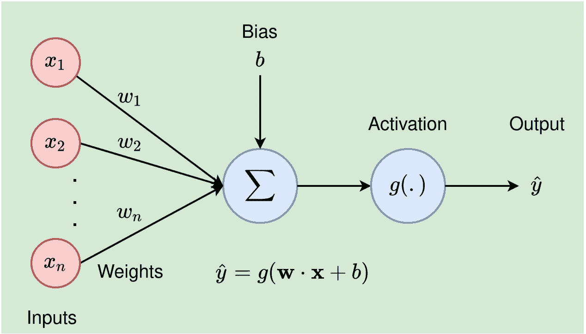
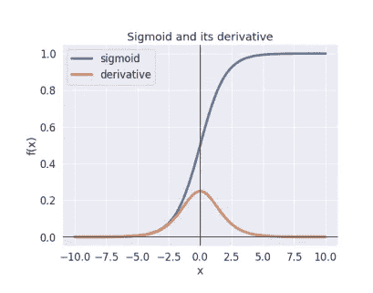

# 神经网络基础(神经网络系列)——第一部分

> 原文：<https://towardsdatascience.com/the-basics-of-neural-networks-neural-network-series-part-1-4419e343b2b>

# 神经网络

人工神经网络(ANN)或简称为神经网络(NN)是称为节点的小单元的互连层，这些节点执行数学运算以检测数据中的模式。神经网络算法是以模拟人类神经元工作方式的方式构建的(我们将在文章的最后一节讨论两者之间的联系)。

# 定义

在我们深入探讨之前，下面是我们在讨论神经网络(NNs)时将使用的关键术语。

1.  **神经元** —这是神经网络的基本构建模块。它接受加权值，执行数学计算并产生输出。它也被称为单元、节点或感知器。
2.  **输入** —这是传递给神经元的数据/值。
3.  **深度神经网络(DNN)** —这是一个具有许多隐藏层(输入(第一)层和输出(最后)层之间的层)的 ANN。
4.  **权重** —这些值解释了任意两个神经元之间连接的强度(重要程度)。
5.  **偏差** —是一个常数值，加到输入值和各自权重的乘积之和上。它用于加速或延迟给定节点的激活。
6.  **激活函数** —用于将非线性现象引入神经网络系统。这个特性将允许网络学习更复杂的模式。

**注:**权值和偏差是 NN 中的可训练参数，即网络通过调整这些参数来学习模式，以获得最佳预测。

# 人工神经元——一个神经元上的数学运算

人工神经元接受输入值(可以是几个)并为其分配权重。在节点内部，对加权输入进行求和，并应用激活函数来获得结果。该节点的输出被传递到其他节点，或者在网络的最后一层的情况下，该输出是网络的总输出。

图 1:一个有 n 个输入值的人工神经元(来源:作者)。

如上图所示，单个神经元执行以下数学运算:

等式 1

在这个等式中，发生了四件事情——输入乘以各自的权重并相加，偏差被加到结果中，然后应用激活函数`g`，使得神经元的输出为`g(**w**·**x**+b)`。

# 神经网络设计

神经网络(NN)是由几个层叠的神经元组成的。对于一个`n`维输入，第一层(也称为输入层)将有`n`个节点，而`t`维最终/输出层将有 `t` 个神经单元。所有中间层都称为隐藏层，网络中的层数决定了模型的深度。下图显示了一个`3–4–4–1` NN。

图 2:一个神经网络，有 3 个输入特征，两个隐藏层，每个层有 4 个节点和一个值输出。节点是密集连接的——每个节点都连接到上一层的所有神经元。每个连接都具有表示任意两个节点之间的连接强度的权重。除了输入层的节点之外，每个节点都执行等式 1 中描述的计算(来源:作者)。

# 简化示例

让我们举一个简单的例子来说明单个神经元是如何工作的。在本例中，我们假设有 3 个输入值，偏差为 0。

图 3:具有 3 个输入值 2、1、-4 和权重分别为 0.8、0.12 和 0.3 的人工神经网络。在这种情况下，偏置设置为 0。

在这个例子中，我们将考虑一个被称为 sigmoid 的常用激活函数，它被定义为(我们将在本系列的下一部分中全面讨论激活函数)

Sigmoid 函数(f(x))及其导数(f'(x))。sigmoid f(x)将任何实数值 x 推入范围(0，1)。这时不要太在意导数。我们以后再讨论。

这是一个 sigmoid 图。注意，对于小于-5 或大于 5 的 x 值，f(x)分别接近 0 和 1。

如前所述，神经元内部正在发生四件事。首先，通过将输入值乘以相应的权重来对输入值进行加权。

第一个操作:输入值被加权。

接下来，对加权输入求和，然后加上偏差，

第二个操作:加权输入和偏差求和

最后，对上述结果应用 sigmoid 激活函数

第三次手术:应用乙状结肠功能。

就是这样。神经元的输出是`0.627`。如果给定的神经元在隐藏层中，则该输出成为下一个神经元的输入。另一方面，如果这个值是最后一层的输出，那么它就可以解释为模型的最终预测(可以看作是给定类的概率)。

**重要提示:**为了简化神经元的数学运算，我们可以使用前两个运算的更紧凑的矩阵形式。在这种情况下，输入值向量和权重向量之间的点积运算将会派上用场。

如前所述，人工神经元(NN 的基本构件)的运行是受人脑工作方式的启发。在下一节中，我们将详细讨论这种关系。

# 生物神经元与人工神经元的联系

生物大脑中的神经系统由两类细胞组成:神经元和神经胶质细胞。神经胶质细胞为神经系统提供支持功能。具体来说，这些细胞的任务是维持体内平衡，形成隔离神经的髓鞘，并参与信号传递。

神经元由细胞体、轴突和树突组成。树突是作为神经元输入的投射。它从其他神经元接收电化学信息，并将它们传播到细胞体。另一方面，轴突是神经元的长延伸，将信息从细胞体传输到其他神经元、腺体和肌肉。轴突以称为轴突小丘的圆锥形投影连接到细胞体。小丘负责将抑制性和兴奋性信号相加，如果总和超过某个阈值，神经元就会发出信号(称为动作电位)。两个神经元在突触处连接。突触位于第一神经元的轴突末梢和第二神经元的树突。

生物神经元(左)和人工神经元(右)。

# 人工神经元

人工神经元(也称为单元或节点)在结构和功能上模仿生物神经元(从广义上讲，见下一个注释)。人工神经元接受几个输入值(与生物神经元中的树突同义)，并为它们分配权重(类似于突触的作用)。在节点内部，对加权输入进行求和，并应用激活函数来获得结果。这种操作与生物神经元中细胞体和轴突小丘的作用相匹配。该节点的输出被传递到其他单元——这种操作模拟了电化学信息从一个神经元传递到另一个神经元或神经系统的其他部分的过程。

注意:在过去的几年里，科学家们开始反对直接描述人工神经网络与生物之间的关系。

> “事实上，就功能和规模而言，人工神经网络与它们的生物对等物并不相似，然而，它们确实受到 BNNs(大脑神经网络)的启发，并且用于描述人工神经网络的几个术语是从神经科学文献中借来的。”——阿格达姆，H.H .和赫拉维，E.J. (2017)。卷积神经网络指南。

我希望这篇文章为神经网络系列的其他部分打下良好的基础。下面是系列文章的下一篇文章。继续读。让我们继续学习**。**

</feed-forward-neural-network-with-example-neural-network-series-part-2-eeca7a081ef5>  

请[以每月 5 美元的价格注册成为 medium 会员](https://medium.com/@kiprono_65591/membership)，这样就可以在 medium 上阅读我和其他作者的所有文章。

你也可以[订阅，以便在我发表文章的时候把我的文章发到你的邮箱](https://medium.com/subscribe/@kiprono_65591)里。

感谢您的阅读！！！