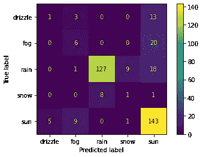

# 机器学习对可再生能源行业的好处

> 原文：<https://towardsdatascience.com/the-benefits-of-machine-learning-for-the-renewable-energy-sector-4315efae588e>

## 使用逻辑回归、非平衡数据集和 l1 归一化的天气预报的个例研究

杰森·黑眼在 [Unsplash](https://unsplash.com?utm_source=medium&utm_medium=referral) 上的照片

我最近参加了一家咨询公司的面试，他们提出了一个迷人的场景:

> 假设这是你工作的第二天，你的主管打电话来请病假。他们要求你代替他们参加与能源部高级官员的会议。如果这些人问你你的机器学习背景如何帮助他们实现目标，你会怎么回答？

嗯，经过思考，我想出了一个我认为相当不错的答案，但在那之后的一周里，我对这个问题思考了很久。我个人相信使用机器学习作为理解现实世界现象的强大工具，而不是作为仅仅获得答案的黑匣子。但是这种观点如何影响现实世界的能源政策呢？当我在过去的一周里听播客和读文章时，我开始有了一些想法。

我在采访中的回答主要来自于最近听到的伍德·麦肯齐关于欧盟在最近的乌克兰危机面前的能源政策的[播客](https://www.woodmac.com/news/opinion/the-energy-gang-podcast-energy-supply-issues/)。听听吧，很有意思。引起我共鸣的一点是，能源政策通常以气候变化争论为中心。这不是一件坏事。问题是气候变化总是一个长期的方法；我们总是在想 50 年后的事情，虽然现在做事情很紧迫，但末日即将来临的感觉太遥远，无法真正刺激严肃的行动。然而，最近的乌克兰危机凸显出能源政策不仅关系到长期气候变化，还关系到迫在眉睫的国家安全问题，特别是在欧盟。随着欧盟试图在短时间内摆脱对俄罗斯天然气的依赖，政策和技术必须快速实施。

这和机器学习有什么关系？我在最近的研究生经历中看到的最常见的一个说法是，机器学习是*快*。我与之互动的一位教授发表了一篇[论文](https://arxiv.org/ftp/arxiv/papers/2007/2007.08538.pdf)，内容是与经典、半经典和量子力学方法相比，用机器学习预测反应速率常数的计算效率。计算上的节省是巨大的。或者，考虑非常复杂的计算流体动力学(CFD)领域，这是飞机设计或天气预报中的一个重要领域。[本文](https://www.pnas.org/doi/10.1073/pnas.2101784118)讲述了另一种创新方法，与标准 CFD 相比，神经网络用于提高流体流动模拟的计算时间。一个快速的谷歌学术搜索会产生无数迷人领域的论文，这些论文都展示了这个概念。

因此，在这个世界上，我们制定能源政策的时间突然变得更加紧迫，机器学习帮助我们快速获得答案*。理想情况下，我们可以通过使用大量可用的原始数据和一个机器学习工程师团队，在不到一年的时间内得到答案，而不是雇佣一个博士团队来研究一个问题 5 年。*

快速的结果很好，但是我们总是会遇到这样的问题:

> 我们真的明白为什么我们会得到这样的结果吗？

我与之互动的另一位教授有一个奇妙的方法，利用机器学习来告知现实世界的解决方案。在开发钙钛矿太阳能电池的过程中，他的团队和合作者执行了一些与[水加速光氧化](https://pubs.acs.org/doi/full/10.1021/jacs.2c00391)相关的复杂物理模型，这对于理解电池的寿命非常重要。但他们并没有就此止步。开发模型后，他们将结果作为特征输入到[之前基于 ML 的退化模型](https://pubs.acs.org/doi/full/10.1021/acsenergylett.0c00164?casa_token=XWNDkzBbKL4AAAAA%3AGMRz6HnsM1SASUyDWtXlPo_55sUOMuYtoxQTRnJBAPbM59S7iOjB4ROvITudR6w5fATsGsgm0yF7B-da)，然后使用 LASSO 回归获得特征重要性。事实证明，该模型选择了他们基于物理学的模型的结果作为一个重要特征，验证了这项工作。由此得到的教训是什么？机器学习实际上是对现实世界理解的强大验证器。如果一个客观的计算算法说一个结果是重要的，没有政治或研究议程的复杂混淆，我们可以在我们的物理理解中更有信心地前进。

我考虑的第三个好处是机器学习原则能够跨多个学科使用。每当我参加机器学习会议或海报会议时，我都会对所涵盖的工程主题的广度和深度感到惊讶。然而，让我真正兴奋的是，我实际上能听懂大部分的演讲！即使我可能不是细胞生物学之类的专家，我也可以去参加关于使用机器学习的主题的演示，我可以确切地看到他们正在试图做什么，并理解为什么他们的结果如此重要。在过去的十年里，机器学习几乎渗透到了每个领域，这肯定是有原因的。

这在可再生能源领域尤为重要。可再生能源是一个广阔的领域，有许多技术需要无缝集成。在制造光伏电池板时，我们在材料科学方面有所顾虑；对电化学感兴趣，以了解性能最佳的电池；需要了解电气工程以设计逆变器和电池充电控制器。然后，我们必须考虑电网互联和能源政策以及其间的一切。现在，我绝不是说机器学习让我们成为所有这些领域的专家。事实上，我非常支持使用机器学习，同时总是涉足真实的物理世界。但是机器学习给我们的优势在于协作。一个领域的专家可以与另一个领域的专家进行讨论，尽管他们可能对另一个领域知之甚少，但仍然可以说共同的语言，甚至可以从对方那里获得如何更有效地完成自己工作的见解！这是一个相当大的协同效应。

我本想把它作为一个随机的想法样本来发表，但是后来意识到一个真实的例子会更有趣！所以我调出了一个数据集，这是我最近在一门数据可视化课程中接触到的。这是西雅图的天气数据，在 [Kaggle](https://www.kaggle.com/datasets/ananthr1/weather-prediction?resource=download) 上向公众开放，在这里我们有温度和风速等指标的每日数据，我们希望预测天气的类型。这是一个非常简单的分类问题，在类似太阳预报的事情中会很有用。我没有在这里重复代码，而是创建了一个 Jupyter 漫游笔记本，并对我正在做的事情进行了降价和评论。可以在我的 [Github 回购](https://github.com/nrlewis929/seattle_weather_classification)上找到。在展示这些优点的同时，我希望你能为自己的学习学到一些技巧！这是混淆矩阵中的结果。它们并不精彩，但我想为此使用一些特定的 ML 模型，这些模型可能不是处理这类问题的最佳模型，但请允许我展示本文中的一些想法。看看能不能得到更好的结果！

预测和实际标签的混淆矩阵。作者的情节

这个例子告诉我们什么？首先，我不是天气建模或预报方面的专家，但只要有一些数据和机器学习，我就可以花一个下午的时间得出一些有趣的结果。我不必花费成百上千个小时来开发 CFD 模型来确定天气。我也不需要在气候学和天气建模领域获得任何特定的培训(尽管也许我只是在西雅图地区生活过一段时间！).此外，我还能够深入了解一些最重要的参数。事实证明，最重要的晴雨预报是……(鼓声)……降雨量。大惊喜？不。但也许在其他应用程序中，你会发现一个惊喜。知道我们的直觉与模型告诉我们的一致总是好的！

以上是我的一些想法。总之，机器学习在帮助我们更好地应对能源挑战方面提供了三个明显的优势:

1.  我们可以很快得到初步的结果*，而不是花费数年在一些甚至可能不起作用的事情上。*
2.  *我们可以利用机器学习来获得更多的见解，或者使用公正的机制来验证直觉。*
3.  *我们可以促进具有共同语言和方法的领域专家之间的跨学科合作。*

*我很好奇你的经历。机器学习方法更快吗？它是否让你对现实世界有了更多的了解，而你可能已经错过了？你会如何回答这个问题？欢迎在 LinkedIn 上与我联系！*