# 咖啡豆不是同质的:筛过的意大利香肠浓缩咖啡

> 原文：<https://towardsdatascience.com/the-coffee-bean-is-not-homogenous-sifted-salami-espresso-5b861bfbfbb7>

## 咖啡数据科学

## 测量进入咖啡豆的研磨粒度的提取率

理解浓缩咖啡的最大障碍是对咖啡豆的理解。通常，我们假设咖啡豆在味道和提取潜力上是同质的。当我开始开发[断奏](https://medium.com/overthinking-life/staccato-espresso-leveling-up-espresso-70b68144f94)镜头时，我曾说过只用大颗粒或小颗粒的咖啡感觉失去了一些味道。除了同质性可能是不正确的以外，我不知道为什么。

在本文中，我研究了不同粒度的萃取率，并做了额外的研究。我把里面的粉末从外面分离出来，这样我可以测量两者的提取率。这应该有助于解释为什么一杯[反过来的断奏](/inside-out-staccato-espresso-f836fddc0bd1)浓缩咖啡比普通的断奏咖啡表现更好。

# 背景

一年前，我研究了不同粒度的的[提取率，那项研究极大地让我了解了提取的极限。随着一些其他的研究，我受到启发，研究同样的东西，筛分粒度。颗粒不会像你想象的那样被提取出来，因为咖啡豆不是同质的。](/measuring-extraction-and-tds-across-coffee-grind-settings-49dfd66d8203?postPublishedType=repub)

大约在去年的同一时间，我发现豆子里面的[和外面的不一样。人们可以筛去粗磨部分，得到里面的细粒。味道测试证实，这些细粒不同于将巨石研磨得更细所产生的细粒。](/fines-in-coffee-grinds-searching-for-a-source-326c3eba2bb4)

在 2021 年的秋天，我练习了[内向外断奏](/inside-out-staccato-espresso-f836fddc0bd1)击球和[懒惰断奏](/the-lazy-staccato-espresso-34aa743bed96)击球，作为利用内线优势的一种方式。两个镜头都很有趣，但当然，更多的处理步骤被添加。除了像“从豆子的相同部分(相同的颗粒大小)提取的粉末应该更均匀”这样含糊不清的说法之外，还不清楚为什么分离粉末会有帮助

# 设备/技术

[意式咖啡机](/taxonomy-of-lever-espresso-machines-f32d111688f1) : [像样的意式咖啡机](/developing-a-decent-profile-for-espresso-c2750bed053f)

[咖啡研磨机](/rok-beats-niche-zero-part-1-7957ec49840d):小生零位

咖啡:[家庭烘焙咖啡](https://rmckeon.medium.com/coffee-roasting-splash-page-780b0c3242ea)，中杯(第一口+ 1 分钟)

镜头准备:[断奏夯实](/staccato-tamping-improving-espresso-without-a-sifter-b22de5db28f6)

[预灌注](/pre-infusion-for-espresso-visual-cues-for-better-espresso-c23b2542152e):无

输液:恒定流量

[过滤篮](https://rmckeon.medium.com/espresso-baskets-and-related-topics-splash-page-ff10f690a738) : 7g VST

其他设备: [Atago TDS 计](/affordable-coffee-solubility-tools-tds-for-espresso-brix-vs-atago-f8367efb5aa4)， [Acaia Pyxis 秤](/data-review-acaia-scale-pyxis-for-espresso-457782bafa5d)， [Kruve 筛](/comparing-kruve-coffee-sifters-new-and-old-677e8b16ec62)， [Fellow 摆振](/the-fellow-shimmy-sifter-a-data-driven-review-8eedc23580f8)

# 实验设计

为了测试成功，需要很好地控制其他变量，即可溶物和 CO2。萃取过程中释放的可溶物和 CO2 气体会影响萃取。为了隔离这些变量，我做了很多用过的咖啡渣。最后它们都结块了，所以我用咖啡筛去除了所有的结块，并且在筛过之后我重新混合了细的和粗的粉末。

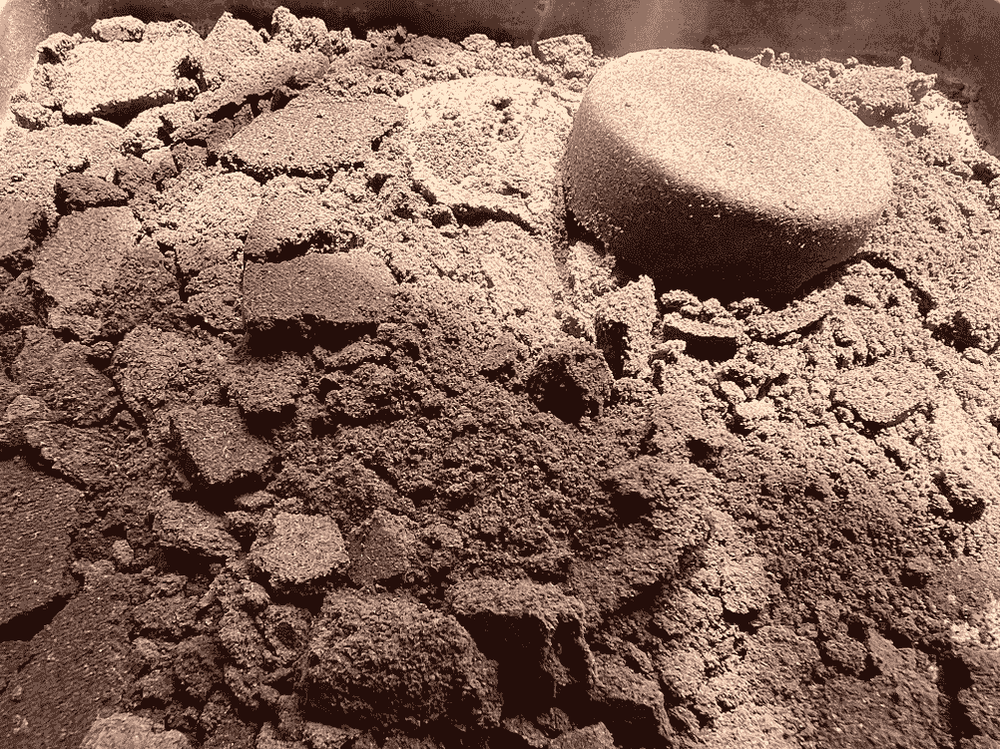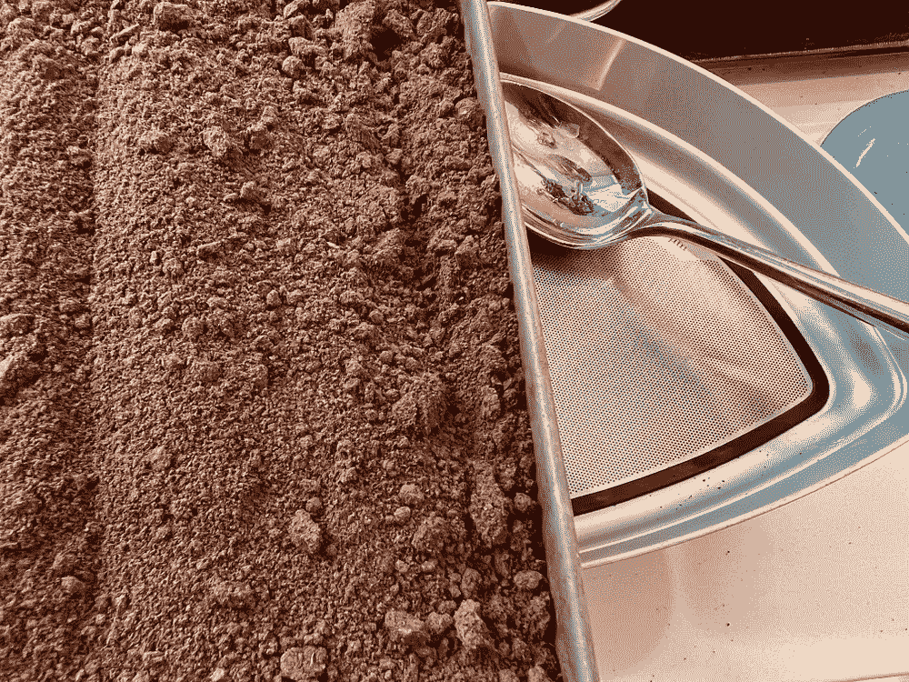

所有图片由作者提供

每一杯咖啡大部分是用过的咖啡渣，其中大约有 11%是筛过的咖啡。我还用了一个 7g 的 VST 篮子，这样我就可以将 1.5g 的新鲜咖啡和 4g 的废咖啡渣混合在一起。在这一层的上面是 8.5 克用过的咖啡，因此篮子里有 14 克咖啡。我用一个金属网筛完成了这个。

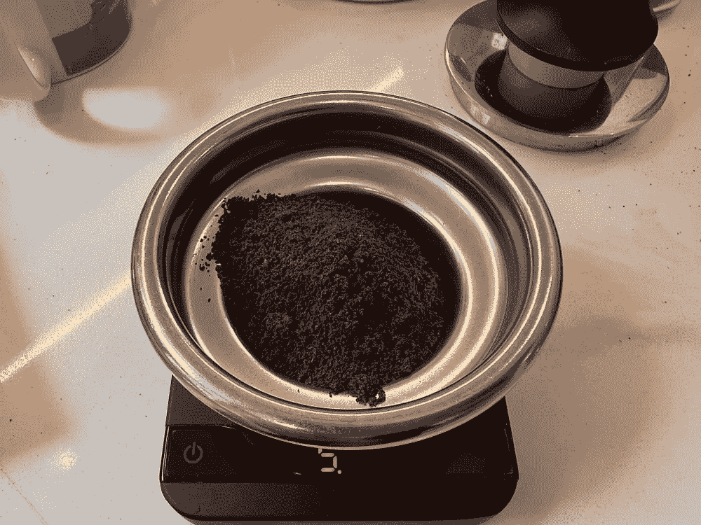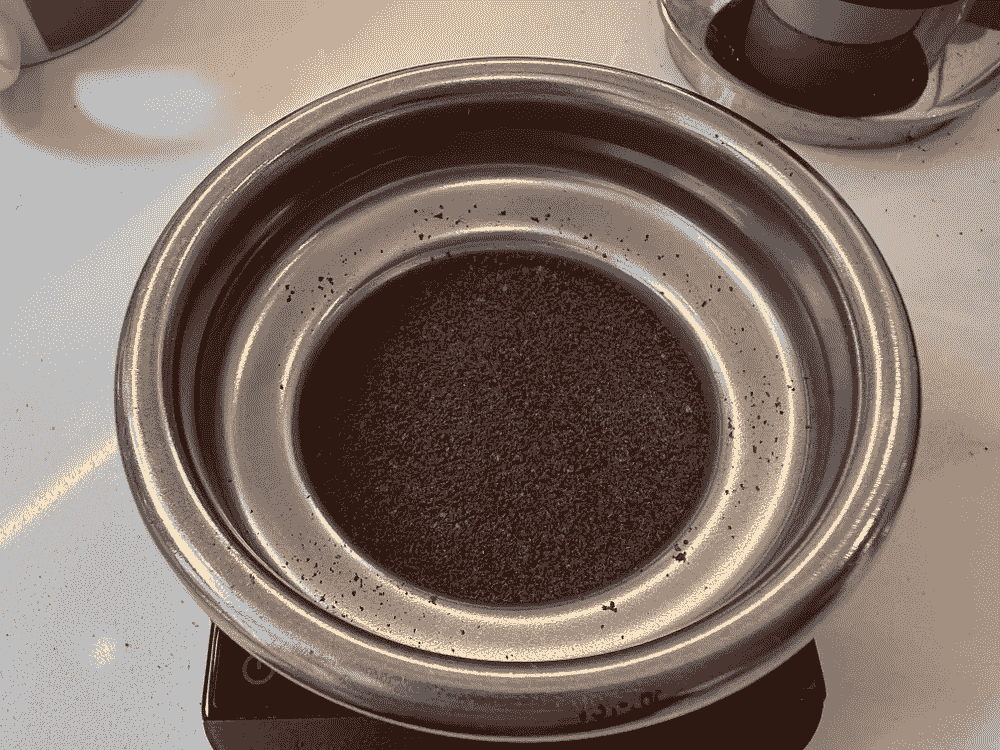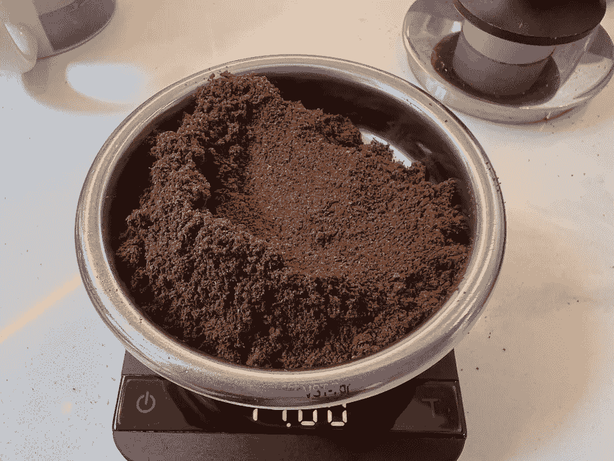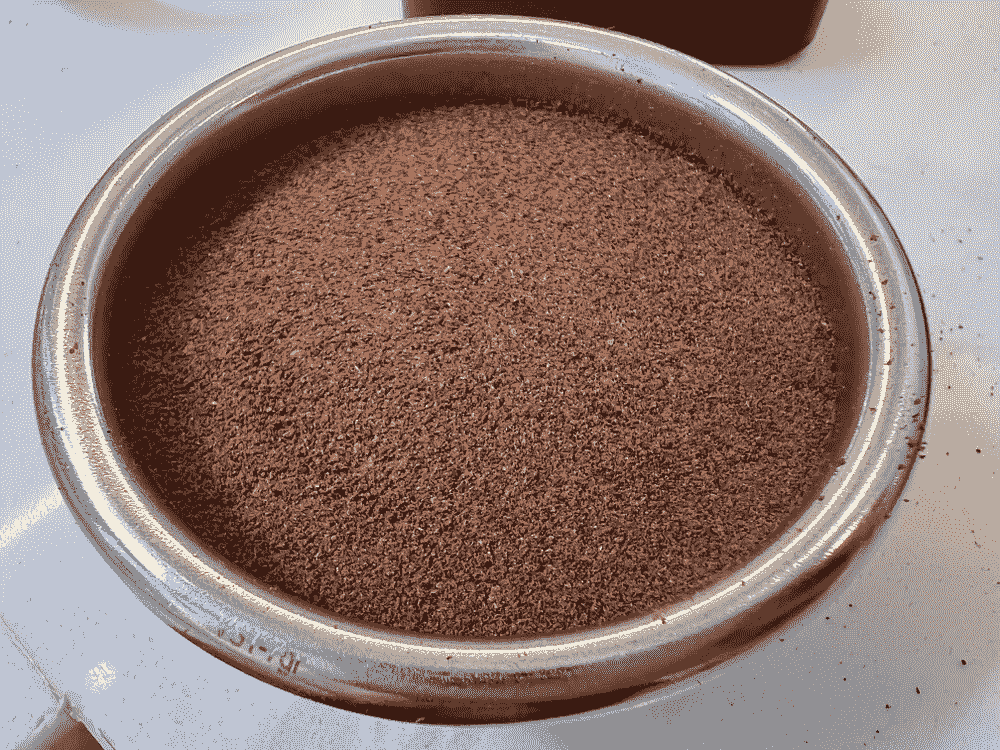

然后，我在像样的浓缩咖啡机上使用恒定流量(4 毫升/秒)作为所有镜头的基准。这忽略了其他优化，如预灌注、压力分布、压力脉动和开花，但这些在以后的时间里会很有趣。

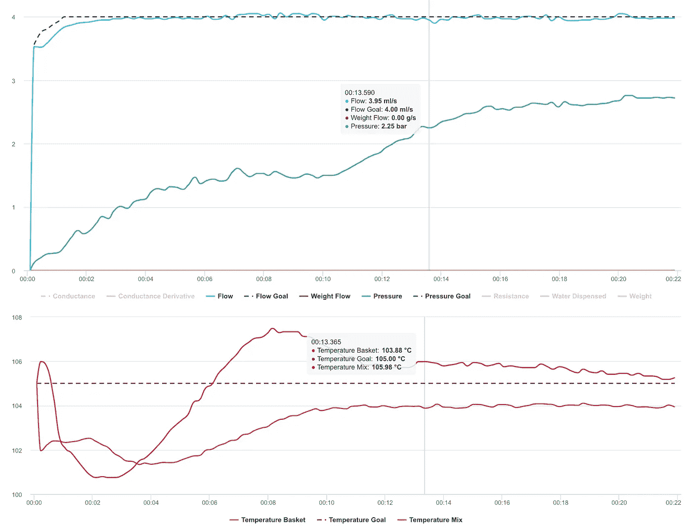

# 性能指标

我使用基于折光率仪的提取率来评估性能。

# 数据

这是我使用两种研磨设置制作不同粒子的路线:

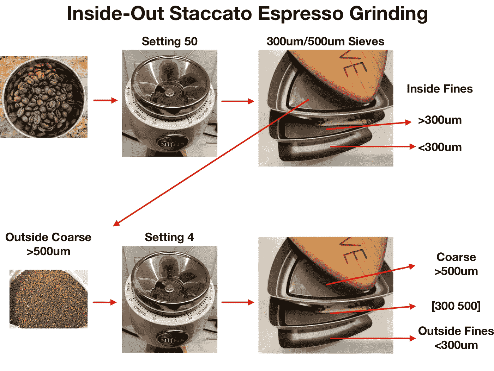

注意，我用 Fellow Shimmy 过滤掉< 300um，因为它更快，然后我用了 500um Kruve 屏幕。该摆振是额定为 200 微米筛选，但因为它使用方孔，它的表现非常接近 Kruve 300um 微米屏幕。

我最终得到了这个分布。

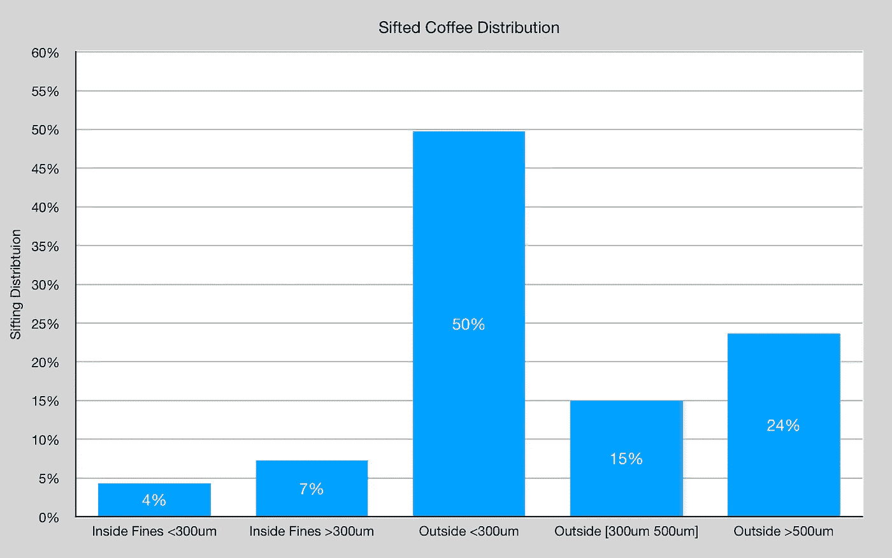

然后，我从每个箱子里取了一些样品，拍了一些意大利香肠。

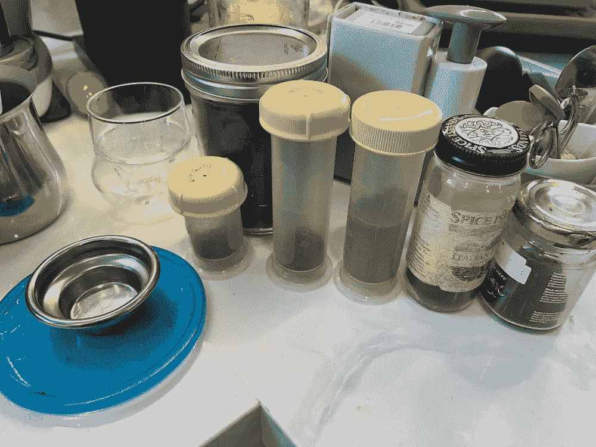

包括对照镜头在内的所有镜头具有 20 秒的拍摄时间，并且所有的分割时间彼此在 1 秒之内。这表明新鲜的粉末没有影响流动，这是本研究的目的。

首先，我提取了一个对照样本来测量从废料中提取了多少。虽然该值不高，但它最终会影响其他测试的 TDS 测量值。我的目标是在输出比率上以 0.5 的间隔从 0.5 到 3，但镜头跑得太快了，很难管理。

对于每一杯意大利腊肠，我通过 2%到 3%的控制来调整 EY。

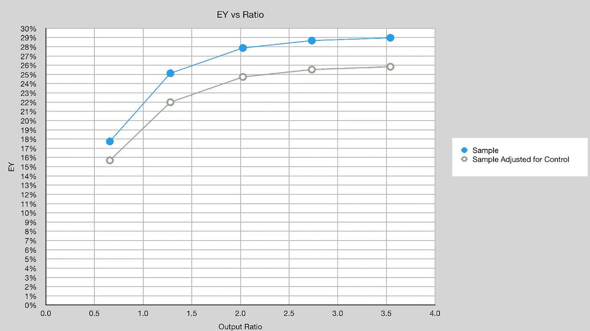

我们来看看最后的结果。在这里，我们可以看到内部的细粒比外部提取得快得多。如果我们假设豆子的内部比外部更脆，这就不足为奇了。

在观察不同大小完全提取的速度时，较细的层几乎立即提取。按 1.5 的比例，大部分都是提取出来的。然而，较粗的颗粒需要更长的时间。这可以解释为什么 Allongé需要 3:1 或更长的比例才能达到最高提取率。

如果先前的筛选分布在具有相同轮廓的圆盘中，我们可以使用该信息来制作理论圆盘。这一理论与来自外部研磨的中档粒子(300um 到 500um)非常匹配。

我将它与两个镜头(常规和断奏)进行了比较，这两个镜头使用了我的常规配置文件。他们的 EY 趋势更高，这仅仅表明使用预灌注、起霜或压力脉冲有助于改善理论。

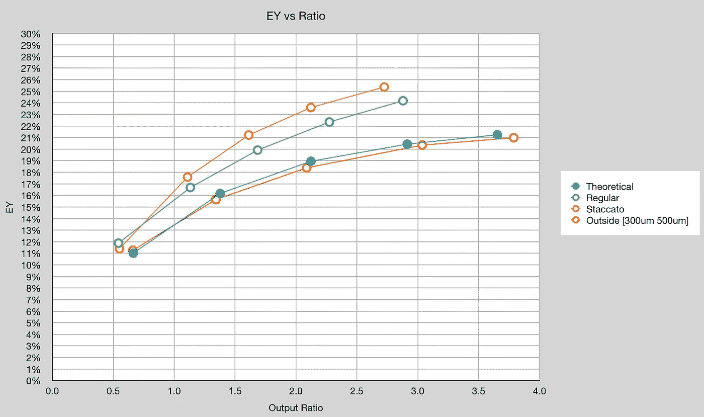

# 对数据的另一种看法

我想改变我查看数据的方式，所以我为每个镜头比率做了一个穿过筛选过的粒子箱的线形图。他们的投篮命中率大致相同，我喜欢这个数据出来的方式。我仍在研究下一步如何利用这些新信息。

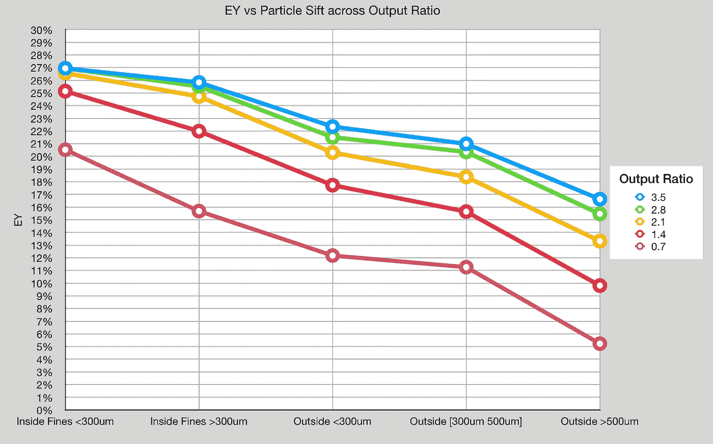

这些数据显示了咖啡是如何不均匀的，并且它有助于给出萃取如何随时间发展的基线。对于不同的温度设置、压力设置和其他考虑因素，该实验可以容易地重复，并且它可以用于帮助更好地表征咖啡。希望这种方法可以被证明对开发更高级的浓缩咖啡镜头轮廓是有用的。

如果你愿意，可以在推特、 [YouTube](https://m.youtube.com/channel/UClgcmAtBMTmVVGANjtntXTw?source=post_page---------------------------) 和 [Instagram](https://www.instagram.com/espressofun/) 上关注我，我会在那里发布不同机器上的浓缩咖啡照片和浓缩咖啡相关的视频。你也可以在 [LinkedIn](https://www.linkedin.com/in/dr-robert-mckeon-aloe-01581595) 上找到我。也可以关注我在[中](https://towardsdatascience.com/@rmckeon/follow)和[订阅](https://rmckeon.medium.com/subscribe)。

# [我的进一步阅读](https://rmckeon.medium.com/story-collection-splash-page-e15025710347):

[我未来的书](https://www.kickstarter.com/projects/espressofun/engineering-better-espresso-data-driven-coffee)

[我的链接](https://rmckeon.medium.com/my-links-5de9eb69c26b?source=your_stories_page----------------------------------------)

[浓缩咖啡系列文章](https://rmckeon.medium.com/a-collection-of-espresso-articles-de8a3abf9917?postPublishedType=repub)

工作和学校故事集