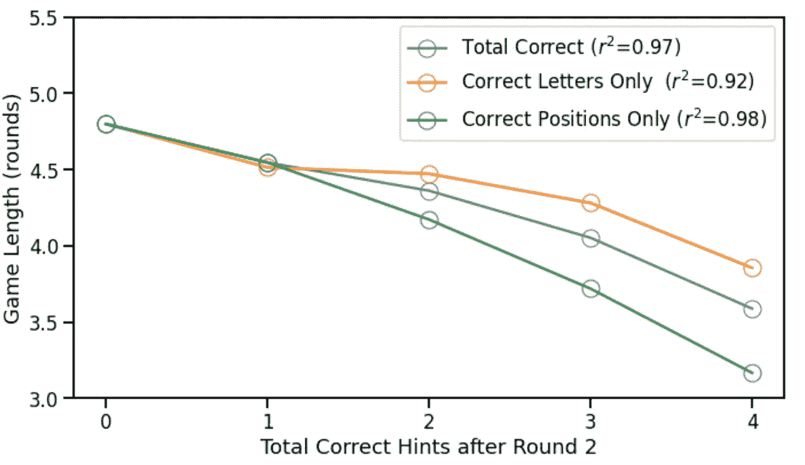
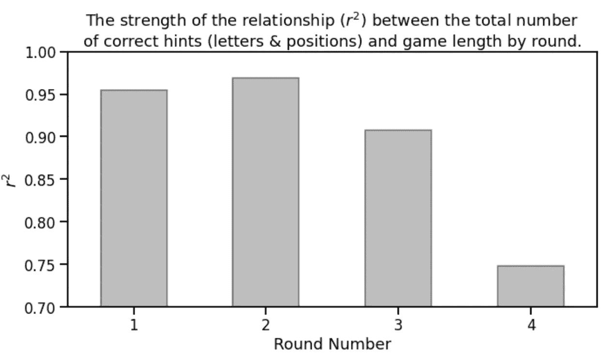
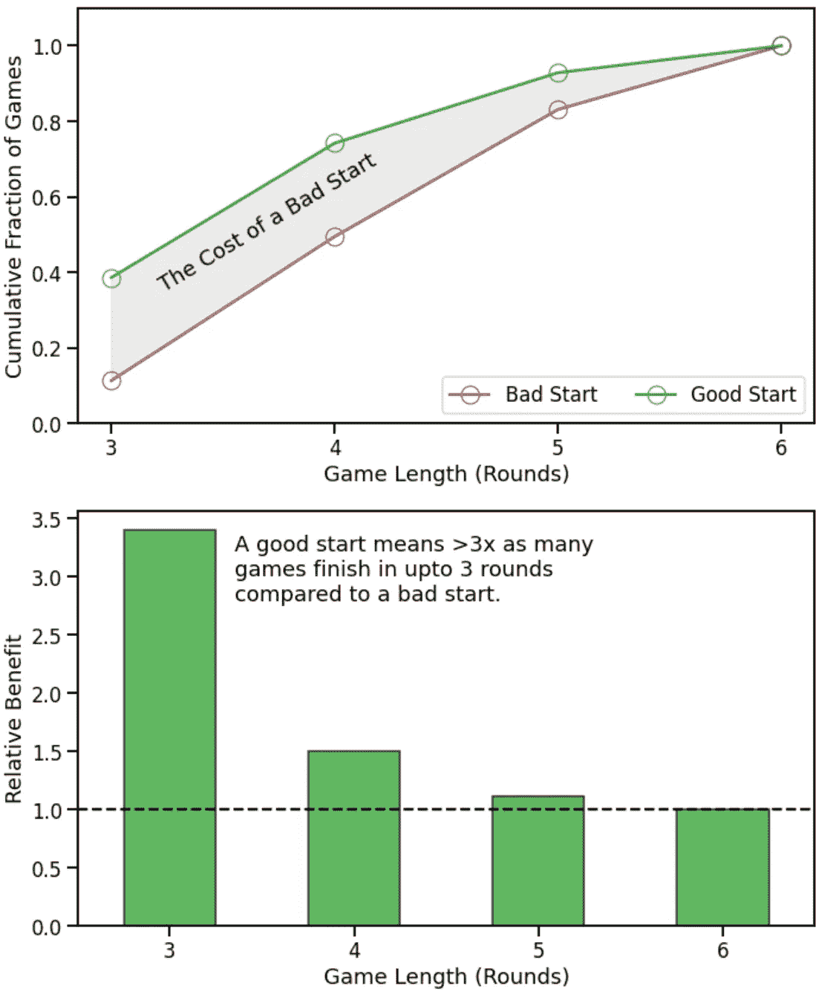

# Wordle 开局不利的代价&如何避免

> 原文：<https://towardsdatascience.com/the-cost-of-a-bad-start-in-wordle-how-to-avoid-it-2cdd63f8d599>

## 在 Twitter 上分享 3M Wordle 游戏的经验教训

照片由[像素](https://www.pexels.com/photo/athletes-running-on-track-and-field-oval-in-grayscale-photography-34514/?utm_content=attributionCopyText&utm_medium=referral&utm_source=pexels)的[皮克斯拜](https://www.pexels.com/@pixabay?utm_content=attributionCopyText&utm_medium=referral&utm_source=pexels)拍摄

在这篇文章中，我将继续分析超过 300 万条 [Wordle](https://www.powerlanguage.co.uk/wordle/) tweets 的数据集——首先在这里介绍——以探索我们可能了解到的人们如何玩似乎每个人现在都在玩的游戏。

虽然已经写了很多关于[玩家开局猜测的重要性的文章，许多](https://www.theguardian.com/games/2022/jan/11/wordle-creator-overwhelmed-by-global-success-of-hit-puzzle)[评论员](https://www.polygon.com/gaming/22884031/wordle-game-tips-best-first-guess-5-letter-words)提供了他们最喜欢的开局词[和一些人，包括我自己，已经使用数据科学的工具来分析](https://www.wired.com/story/best-wordle-tips/)[最佳开局词](/what-i-learned-from-playing-more-than-a-million-games-of-wordle-7b69a40dbfdb)，但是，据我所知，没有人试图*量化*好开局的好处或坏开局的代价，或者在实践中，好开局和坏开局发生的频率我将在本文中尝试这样做，主要发现包括:

1.  在 Wordle 的*早期回合*中猜中的正确字母/位置的数量与游戏长度之间有很强的关系——早期猜中的正确字母/位置越多，游戏越短——这并不令人惊讶。
2.  然而，数据也表明前两轮非常重要:你在第二轮的表现如何是游戏时间长短的最强预测者；这种可预测性在随后的几轮中降低，表明在最初几轮后用于猜测的策略有相当大的可变性。
3.  通过比较开局良好的游戏和开局不佳的游戏，我们可以估算出开局良好的的*收益(或者开局不利的*的*成本* *)。例如，开局良好的游戏比开局不佳的游戏更有可能在 3 轮内结束游戏，但是开局不佳的游戏比开局良好的游戏更有可能在 6 轮内结束游戏。*
4.  Twitter 上分享的足够多的游戏都是糟糕开局的例子(约 18%)，因此有理由建议一些玩家考虑使用更好的开局词。[最佳开局词](/what-i-learned-from-playing-more-than-a-million-games-of-wordle-7b69a40dbfdb)很少与糟糕的开局联系在一起(< 0.5%的游戏)，而绝大多数与良好的开局联系在一起(> 93%的游戏)。

因此，如果玩家希望提高他们的单词游戏，那么一个充满信心的方法是[选择一对更好的开始单词](/what-i-learned-from-playing-more-than-a-million-games-of-wordle-7b69a40dbfdb)，这几乎保证提供一个好的开始，然后在游戏的剩余时间里专注于他们的努力[猜对](/how-to-guess-well-in-wordle-d21167aae444)。

在接下来的内容中，我将正式定义什么是好的和坏的开始，我如何估计它们的成本和收益，讨论这些发现和结论背后的更多细节，并推荐玩家如何在自己的游戏中避免坏的开始。

# Wordle @Twitter

简而言之，Wordle 玩家每天有 6 次机会猜测一个新的目标单词:每天一个单词；每个人得到的单词都一样。每次猜测后，他们被告知哪些字母在目标单词中，是在正确的位置(绿色)还是不正确的位置(黄色)，以及哪些字母不在目标单词中(灰色)。这些提示帮助玩家微调他们的猜测。

一个例子 4 轮游戏的目标词灯。玩家前两次猜测的结果是 3 个正确的字母 jints(黄色的‘T’、‘I’、‘L’)。在第三轮中，玩家正确地猜出“T”的位置，然后继续正确地猜出目标单词。作者 Wordle 截图。

Wordle 的一个独特之处是，玩家可以生成他们日常游戏的图形表示，而不会透露他们的猜测(见下文)，人们在 Twitter 上分享这些已经变得越来越普遍；目前每天有超过 20 万玩家分享他们的游戏。

Twitter 上分享的一个 Wordle 游戏的图片展示示例。图片作者。

由于 Twitter 的[学术许可，我能够使用他们的搜索 API 收集超过 300 万条 Wordle 推文的数据集(从 2021 年 12 月 23 日到 2022 年 1 月 27 日)，这些数据将用于接下来的分析；我将重点关注需要两轮以上才能完成的游戏(97%的游戏)，因为在一轮或两轮内完成更多的是运气而不是技巧，尽管实际上即使我们考虑这些额外的游戏，研究结果也不会有实质性的变化。](https://developer.twitter.com/en/products/twitter-api/academic-research)

# 论良好开端的重要性

为了这篇文章的目的，我将把一场足球比赛分成开始的*(第 1 和第 2 轮)、中间的*(第 3 和第 4 轮)和结束的*(第 5 和第 6 轮)。在这里，我们将重点放在开始，即*开始游戏。玩家从他们的第一场游戏中学到了多少，这对他们游戏的其余部分有什么影响？****

**下图描绘了平均游戏时间与第二轮学习到的正确提示数*的关系；*显示正确提示(正确字母或正确位置)的总数，并分别显示仅正确字母的数量(无正确位置)和仅正确位置的数量(无正确字母)。毫不奇怪，我们可以看到，一般来说，我们获得的正确信息越多，平均游戏时间越短。例如，在前两次猜测中没有学到任何正确信息的游戏(*总正确数= 0* )的平均游戏时长几乎为 5 轮，相比之下，在第 2 轮之前已经学到 3 个正确提示的游戏的平均游戏时长接近 4 轮；正如人们所预料的那样，学习正确的字母位置比学习正确的错位字母更有价值——它可以缩短游戏时间。**

****

**根据玩家第二次猜测后得到的提示数计算的平均游戏时间。作者配图。**

**图例中显示的 *r 平方*值传达了正确提示的数量和平均游戏长度之间的关系强度，我们可以看到，在所有三种情况下，第 2 轮后提示的数量和游戏长度之间都有很强的关系(r- *平方> 0.90* );换句话说，92–98%的游戏长度变化可以用游戏早期学到的提示数量来解释。**

**作为开始游戏独特重要性的进一步证据，下图绘制了平均游戏时间和第 1、2、3、4 轮正确提示总数之间的 *r 平方*值。前两轮的高 *r 平方*值(> 0.95)意味着从这两轮中获得的正确提示的数量特别能预测整个游戏的长度。当我们观察在游戏后期获得的正确提示的数量时，事情就不那么可预测了。**

****

**一轮 *n* 的正确提示数与游戏时长之间的关系强度(r 平方)。作者配图。**

**第二轮享有最高的 *r 平方*值(0.97)，这意味着我们从我们的前两个单词中学到的东西比我们从其他任何一轮中学到的东西都更能告诉我们可能的游戏时长。换句话说，你在第二轮之前的表现如何是游戏时间长短的最强预测因素，甚至与后面几轮相比也是如此。为什么会这样？这可能表明，人们在游戏开始后使用的猜测策略有很大的可变性。**

**这是有道理的，因为许多玩家在前一两轮已经形成了一致的游戏风格——依靠一套首选的起始词——但在第二轮之后，他们试图将自己的猜测与他们收到的暗示相匹配，这可能具有挑战性。一些玩家把他们的努力集中在某些类型的暗示上。一些玩家可能会选择完全满足他们到目前为止收到的所有提示的单词，而其他人可能很难找到这样的单词，因此可能会选择一个折中的单词；例如，玩家可以选择一个单词，该单词与他们所学的正确位置上的字母一致，但是可能使用目标单词中已知不存在的字母。这些不同的方法会对游戏结果产生重大影响；更详细的猜测策略分析见[此处](/how-to-guess-well-in-wordle-d21167aae444)。**

# **好的开始和坏的开始**

**在 Twitter 数据集中，第二轮正确提示的中位数是 2，所以我将使用这个来区分好的开局(第二轮正确提示超过 2 次的游戏)和坏的开局(有<2 correct hints by round two). Based on this definition, 18% of games begin with a bad start, compared to 44% of games, which begin with a good start; this leaves about 38% of games with a *常规*开局的游戏，既不是特别好也不是特别坏)。**

****

**与好的和坏的开始相关联的游戏的分数(条)以及好的和坏的开始的平均游戏长度(线)。作者配图。**

**我们对这些好的和坏的开始之间的区别感兴趣。该图还显示了他们的平均游戏时间，很明显，良好的开局导致游戏时间更短，每场游戏约 4 轮，相比之下，糟糕的开局每场游戏约 4.6 轮。**

# ****糟糕开局的代价****

**我们不考虑游戏的平均时间长度，而是考虑在*到*第 3、4、5 或 6 轮完成的游戏比例。这些好的和坏的开始的结果作为在最多 *n* 轮中结束的游戏的累积分数呈现如下。例如，只有大约 11%开局不利的游戏在最多 3 轮内结束，相比之下，开局有利的游戏有 38%。这两条线之间的阴影区域代表了一个糟糕开端的成本(或者一个良好开端的收益)。对于较早的游戏回合，这个区域更宽，这表明对于这些较短的游戏来说，开局不利的代价更大。**

****

**给定长度的游戏中好的和坏的开局的分数(上图)。一个好的开始相对于一个坏的开始的好处，基于在最多 *n* 轮中成功的游戏的分数(底部)。作者图表。**

**我们可以通过将第*轮到第*轮到第*轮游戏结束的累积分数除以开局不利的相应分数来量化这一收益，从而得到上面的条形图。例如，三轮游戏良好开局的*相对收益*分数几乎是 3.5 (38%/11%)，这意味着与糟糕开局相比，良好开局在*最多*三轮中的完成次数几乎是 3.5 倍。事实上，可以证明，糟糕的开局导致 6 轮比赛的次数是良好开局的两倍多。***

*因此，一个糟糕的开局可能会将一场短时间(3 或 4 轮比赛)的比赛转换为一场更长时间(5 或 6 轮)的比赛，如果玩家希望改善他们的游戏，那么专注于他们的开局比赛是一种重要的方式。*

# *结论*

*对超过 300 万条 Wordle 推文的分析证实，正确字母和位置的数量与游戏长度之间有很大的关系——这并不令人惊讶——但也突显了开局(第 1 轮和第 2 轮)作为游戏长度最佳预测指标的重要性，这是令人惊讶的，至少对我来说是如此。换句话说，一个玩家前两次猜测的好坏很大程度上决定了他们游戏的其余部分将如何展开。*

*实际上，大约 18%在 Twitter 上分享的游戏开局不利，而大约 44%的游戏开局良好。这两种游戏的区别告诉我们一个坏的/好的开始的成本/收益。良好开局的好处是短游戏的比例更高(> 3 倍)，而糟糕开局的代价是长游戏的比例更高(> 2 倍)。*

*虽然，只有 18%的游戏开局很差，但如果我们假设人们不愿意分享他们最差的表现，真实的数字可能会比这更高；一些证据表明，人们分享失败游戏的可能性远低于预期。无论哪种方式，它表明有许多球员可能会受益于一套改进的启动词。例如，在[之前的帖子](/what-i-learned-from-playing-more-than-a-million-games-of-wordle-7b69a40dbfdb)中，我讨论了一项分析，以揭示一对表现优于所有其他备选词的特定首发词，并且根据上述定义，这很少(< 0.5%的游戏)导致糟糕的开局。事实上，这一对启动词估计能让 93%的游戏有一个好的开始；事实上，这些话会让 70%的游戏有一个更好的开局(> 3 个正确的提示)，可以预期，与常规的良好开局相比，这会产生更多的短游戏和更少的长游戏。*

*那么，如果你想提高你的游戏水平，你应该怎么做呢？首先也是最重要的，确定一个[好的开始词对](/what-i-learned-from-playing-more-than-a-million-games-of-wordle-7b69a40dbfdb)，因为这种影响现在已经很明显了，对于许多玩家来说，这是一种尝试过的值得信赖的开始游戏的方式。这也为下一轮严肃的猜测开始时节省了你的精神能量。事实上，在游戏开始后，事情变得越来越不可预测，这表明玩家猜测下一个单词的策略存在很大的可变性。然而，帮助就在眼前，因为这篇[文章](/how-to-guess-well-in-wordle-d21167aae444)包含了一些实用的建议，告诉你应该如何思考你的猜测以及你用来选择下一个单词的各种信息。*

*如果你想更多地了解 Wordle 的数据能告诉我们人们如何玩，以及你如何能更有效地玩，那么看看我最近的帖子:*

*   *[我从玩了一百多万场 Wordle 游戏中学到了什么](/what-i-learned-from-playing-more-than-a-million-games-of-wordle-7b69a40dbfdb)*
*   *[如何在 Wordle 中猜对](/how-to-guess-well-in-wordle-d21167aae444)*
*   *[300 万条 Wordle Tweets 之后:对 Tweets 的分析揭示了关于 Wordle、它的词和它的玩家的什么。](/three-million-wordle-tweets-later-3d3af23bd5c7)*
*   *[峰字和难字](https://medium.com/towards-data-science/peak-wordle-word-difficulty-64907be4c177)*