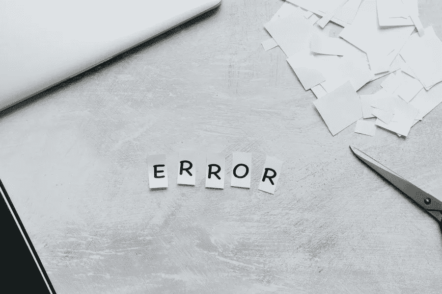
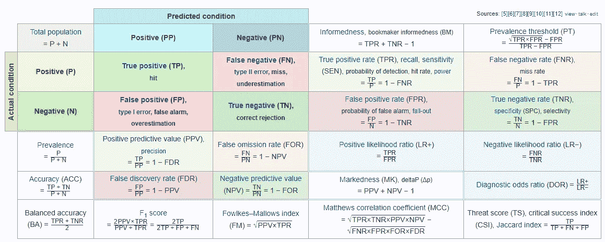

# 犯统计错误的代价

> 原文：<https://towardsdatascience.com/the-cost-of-making-statistical-errors-b8dcb5767e1d>

## 统计数字

## 数据科学家犯统计错误的成本影响指南

当你还是个孩子的时候，你可能读过“喊狼来了的男孩”这个故事。这是一个牧羊人的故事，他曾经谎称看到了狼，并向人们求救，而实际上并没有狼。他反复这样做是为了取乐，但是当真的有狼的时候，他大声呼救却没有人来，因为村民们认为他又在撒谎了。这是一个很受孩子们欢迎的故事，尤其是在道德教育和伦理课上，他们被告知要诚实，不要撒谎，因为这个世界不相信骗子。

来自 Pexels 的 alleksana 的照片:[https://www . Pexels . com/photo/wood-dirty-writing-abstract-4271933/](https://www.pexels.com/photo/wood-dirty-writing-abstract-4271933/)

人类并不总是说谎，有时只是判断和衡量上的错误，这可能会产生严重的后果，并有可能改变企业、社会和环境。网上有很多实用的信息资源，详细解释了统计错误的不同类型，这些错误的原因是什么，以及如何防止这些错误。然而，一个人在生意中所做的每一个决定都有影响。在本文中，我解释了如何确定统计错误的成本影响。

这篇文章概述如下。我们将通过一些例子简要介绍统计中的错误类型。之后，我们定义了机器学习中与错误分析领域相关的一些术语:精确度、召回率和特异性。此后，我们将学习如何通过考虑其经济成本来决定哪个错误对您的业务更有害。我们将通过讨论减少错误的各种方法来结束这篇文章。这是一篇面向实践者和/或初学数据科学家的一般性文章，所以我避免使用数学术语和统计符号。如果你有任何问题，我可以参加讨论。所以，不再拖延，让我们开始吧。

# 统计中的误差类型

我们需要理解的第一件事是误差这个术语。误差是一个量的实际值和确定/收集值之间的差异。误差越大，我们对现实的估计就越低。举个例子，如果外面的实际温度是 21℃，但是我的机器说是 20℃，那么和实际值就有 1℃的差异或者 4.76%的偏差。我们是否可以接受这种误差取决于我们将如何处理这种测量，以及不准确测量的商业成本。统计优化的目标之一是减少我们的模型在各种情况下的误差，以便它足够健壮，可以在许多情况下使用。

# 类型 I:假阳性错误(假警报)

第一类错误，也称为假阳性错误，发生在某些东西实际上不真实或不存在，但被确定为真实或存在的时候。例如，如果我做了 COVID 测试，那么 I 型错误(假阳性错误)会将我识别为阳性，而实际上我不是阳性。另一个例子是在没有火灾时发出火警，这是发出假警报。另一个例子是将某人定罪为罪犯，而事实上他们并不是罪犯，或者在某人没有怀孕的时候测试其是否怀孕。这些都是假阳性的例子。

# 第二类:假阴性错误(失误)

第二类错误，也称为假阴性错误，发生在某事实际上是真实的或存在的，但被确定为不真实或不存在时。例如，如果我做了 COVID 测试，那么第二类错误(假阴性错误)会将我识别为阴性，而实际上我不是阴性。另一个例子是，当真的发生火灾时，不发出火警。另一个例子是宣告某人无罪，而事实上他们是罪犯，或者测试某人是否怀孕，而他们实际上是怀孕了。这些都是假阴性的例子。

前面的例子表明，将某事定义为假阳性或假阴性取决于在那种情况下如何定义“阳性”。例如，如果看到火灾的实例被认为是肯定的，那么当没有火灾时，假肯定将发出假警报。然而，如果看不到火的实例被视为阳性，那么假阳性将是看到火。出于实用目的和理解的简单性，事件的发生被认为是积极的。所以，看到火被认为是积极的。

# 一些重要术语

既然你对假阳性和假阴性这两个术语有了相当的理解，那么在我们讨论统计错误的经济成本之前，让我们再来理解三个术语。从用于商业目的的应用机器学习的角度来看，这些术语很重要。像前面一样，我们将使用现实生活中的例子来回顾这些概念。

假设您在一家金融机构工作，该机构向申请人提供的利率取决于他们过去的信用状况。违约概率较高的人将获得较高的利率，而违约概率较低的人将获得较低的利率。为了简单起见，假设您被要求制作一个模型，将申请人分为高风险或低风险借款人。因为我们有很多人不违约，只有一些人违约，所以我们会有一个不平衡的数据集。因此，我们不能仅仅根据准确性来评估模型的性能，因此我们需要额外的指标来评估性能。

对于这个例子，我们将默认为正。因此，违约的人会被认为是积极的。我们现在将定义和理解回忆或敏感性、特异性和精确性。

# 回忆或敏感度或真阳性率

敏感度或回忆是衡量一个模型能够多好地识别真正的阳性，即高风险借款人。在我们的示例中，true positive 代表识别将违约的借款人的模型，因此给他们一个高风险标签，以便他们的利率高于那些违约风险较低的借款人。如果我们的模型的灵敏度不高，这将转化为更多的人获得低风险评级，从而降低利率，因为模型将无法辨别真正的积极因素，也就是说，识别更多的人将被归类为低风险。从财务角度来说，这对企业来说可能是危险的，因为更多的人会违约，而模型预测这些人是低风险的借款人。因此，在这种情况下，我们的模型应该具有高灵敏度。

# 特异性或真阴性率

专一性是衡量**一个模型能够多好地识别真正的负面因素，即低风险借款人**。在我们的例子中，true negative 代表识别不会违约的借款人的模型，从而给他们一个低风险标签，因此他们的利率比那些违约风险较高的借款人低。如果我们的模型的特异性不高，这将转化为更多的人获得更高的利率，因为模型将无法辨别真正的负面影响，也就是说，识别更多的人将被归类为高风险。从财务角度来说，这可能是好事，因为银行会有更多的收入，但这也可能意味着一些借款人不会借款，因为借款成本太高，这将导致企业失去客户或客户变得沮丧并转向竞争对手。有了数据，人们将能够确定哪个成本更高，失去客户(失去潜在收入)还是从现有客户身上赚更多钱。

# 精确度或阳性预测率

精度是模型识别能力的度量。换句话说，如果你的模型将 500 人确定为违约风险高的人，但实际上，只有 400 人违约(过去的数据)，那么模型的精度是 400/500 = 0.8

在这一点上，值得一提的是，孤立地讨论精确度、召回率或特异性是没有帮助的。您应该知道所有这三个值，然后才能估计该措施的成本。

# 统计错误的经济成本

评估统计错误的成本包括两个步骤。首先是定义你所说的积极。例如，在我们前面的例子中，一个人违约被认为是积极的。第二步是计算假阳性率(假警报率)和假阴性率(漏检率)。如果假阳性率很高，这意味着许多人被评定为高风险，这对业务不利。如果假阴性率很高，这意味着许多人被认为是低风险的，这反过来使企业赔钱。假设我们的模型的假阳性率为 0.2，这意味着在 100 人中，我们的模型将 20 人识别为假阳性，因此 20 名客户将因被标记为可能的高风险借款人而沮丧。但是，如果我们的模型的假阴性率是 0.15，这将意味着 100 个应该是高风险人群的人中有 15 个被归类为低风险人群，从而潜在地导致企业亏损。如果一个普通的违约者给企业造成 50 万印度卢比的损失，那么假阴性率的成本将是每个错误识别的客户 0.15X500000 = 75000。要计算假阳性率和假阴性率，建议找到混淆矩阵，并计算相关值。

来源:混乱矩阵[https://en.wikipedia.org/wiki/Confusion_matrix](https://en.wikipedia.org/wiki/Confusion_matrix)

# 如何减少错误

你永远不可能消除所有的统计误差。有办法减少它们。这些是你可以用来减少统计误差的方法。

1.  第二类误差与统计检验或模型的功效成反比。统计检验的能力可以定义为它辨别现实并因此正确拒绝无效假设的真正能力。这意味着统计检验的功效越高，犯第二类错误的概率就越低。因此，您可以增加测试的能力。这可能涉及成本，因为更大的功率导致更大的样本量，从而导致更高的成本。减少第二类错误导致犯第一类错误的增加。因此，您应该评估犯这些错误的成本影响。
2.  减少 I 型错误的方法之一是最小化显著性水平(当假设为真时拒绝零假设的概率)。由于显著性水平是由研究者选择的，所以该水平是可以改变的。例如，显著性水平可以最小化到 1% (0.01)。这表明有 1%的概率会错误地拒绝零假设(两个变量之间没有差异的假设)。

# 摘要

在本文中，我们讨论了各种类型的错误、它们的原因、成本影响以及减少这些错误的方法。我的信念是，这将有助于你对各种错误的成本估算做出明智的决定。此外，必须理解统计误差只能最小化，而不能完全消除。处理错误的最好方法是继续努力减少错误，并进行额外的检查和平衡(例如，保险)以减少做出错误判断的影响。

*原载于 2022 年 2 月 7 日*[*【https://aayushmalik.substack.com】*](https://aayushmalik.substack.com/p/the-cost-of-making-statistical-errors)*。*