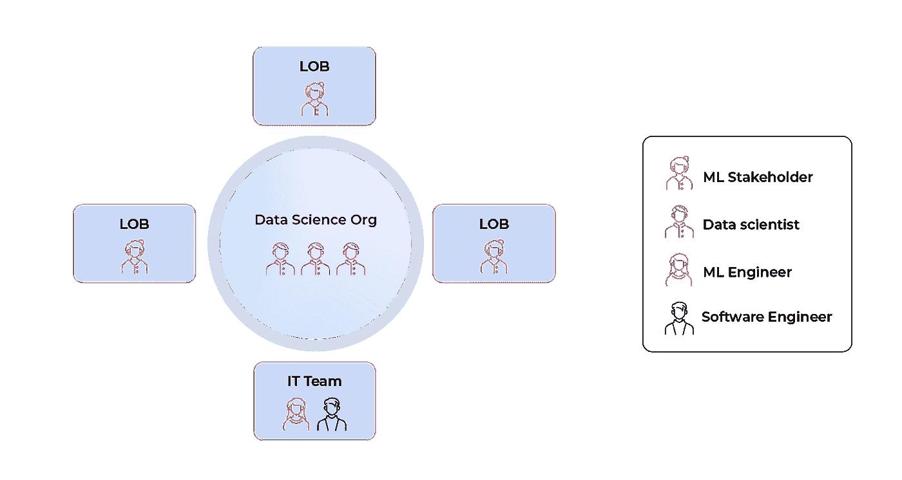

# 中央 ML 的死被大大夸大了

> 原文：<https://towardsdatascience.com/the-death-of-central-ml-is-greatly-exaggerated-1f1626b3a8d4>

作者图片

## 意见

## 先不要对集中式机器学习(ML)团队认输；以下是如何得到它的权利

在过去的十年里，这个行业已经从庆祝“中央 ML 团队”的崛起转向质疑它是否应该存在。我不禁觉得自己在看着罗马燃烧。不一定要这样。

# 为什么抨击中央大联盟越来越流行

随着机器学习操作(MLOps)这一新兴领域继续快速增长，新工具和技术激增，即使在复杂的数据科学家和机器学习(ML)工程师中，混乱和不和谐的可能性也很高。

这一点得到充分展示的一个领域是:关于机器学习组织的理想团队结构的辩论正在升温。在会议和技术社区中，一个主题正在出现:集中化的人工智能团队——曾经在内部被誉为人工智能卓越中心——似乎正在失宠。例如，泰克顿最近发表的一篇关于“为什么集中式机器学习团队会失败”的[博客](https://www.tecton.ai/blog/why-centralized-machine-learning-teams-fail/)主张解散依赖 IT 来生产模型的传统集中式数据科学团队，而是“将数据科学家和数据工程师嵌入使用机器学习的产品团队。”

虽然将机器学习工程师和数据科学家嵌入他们所服务的业务对某些公司来说是值得的——事实上，这是 Meta 和其他公司如[美国柯尔百货公司](https://arize.com/blog/four-crisis-tested-lessons-for-leading-effective-ml-teams/)正在进行的大规模改造[的一部分——但它实际上只是潜在解决方案的一部分，并没有直接解决更大、更有趣的问题，即你是否、何时以及如何仍然可以串联使用中央 ML 团队。](https://ai.facebook.com/blog/building-with-ai-across-all-of-meta/)

这是一个需要回答的重要问题。如果行业不开始讨论如何以及是否以正确的方式集中 ML，它可能会错过解决最大的 ML 和数据问题的优雅解决方案。

为什么要听我说这个话题？我的职业生涯一直在建立和扩大 ML 团队，包括在 Opendoor 和 Twilio。我在有或没有集中式机器学习战略的公司担任数据科学家和 ML 工程师的经历也给了我一个独特的窗口，让我了解这个解决方案发展的痛点。今天，在我在 ML observability 公司 Arize AI 的工作中，我有幸与几十个领先的中央 ML 团队一起工作，并从他们的陷阱和成功中学习。这篇关于如何以正确的方式进行集中式机器学习的文章正是基于这一经历。

# 中心 ML 的工作定义

先做最重要的事情；“中枢 ML”到底是什么？虽然这个术语有些模糊，但通常“中央 ML”团队——也称为“ [ML 平台](https://arize.com/resource/best-practices-for-central-ml-teams-ml-observability/)或“ML 基础设施”团队——是一个平台工程团队，负责为公司的数据科学家设计、构建和管理一套工具。简而言之，它的目的是为 ML 应用程序开发提供一个统一的、标准化的体验。

像其他核心工程团队一样，中央 ML 团队诞生于痛苦——具体来说，是从零开始创建新工具和流程以构建和部署 ML 模型的痛苦过程。通过提供适用于各种用例的工具，central ML 解放了数据科学家，使他们能够快速有效地集成 ML 模型，同时遵守一些标准 MLOps 和软件工程最佳实践，确保模型的质量是可维护的。

# 典型的团队是如何构成的，中央 ML 的替代方案是什么？

中央 ML 团队不是一夜之间出现的；它们随着时间的推移不断进化以满足需求。为了说明为什么会出现这种需求，这里有三个典型的机器学习组织团队结构的组合。

# 结构一:传统方法

作者图片

在这种结构中，数据科学家团队充当内部咨询小组，构建新的 ML 用例并训练模型。然后，他们依靠现有的 IT 或工程团队来生产这些模型，并将其部署到现实世界中。

虽然这在一个有清晰的业务需求和 ML 用例的小组织中是可行的，但是它经常在大范围内受到损害。随着公司的发展，训练新模型的数据科学家和在生产中部署和维护新模型的工程师之间的差距变成了鸿沟，降低了模型速度，影响了模型性能(即训练-服务偏斜)，并导致再训练方案的失败。类似地，最了解产品和客户需求的业务线和 ML 从业者之间的分歧可能意味着很多东西会在翻译中丢失。

# 结构二:分散的 ML

作者图片

在这种结构中，数据科学家和机器学习团队重新组合，并嵌入到各个业务线中，以便于协作。通过与产品经理和业务主管合作，ML 从业者最终能够更好地训练持续推动结果的模型。

然而，这种方法并非没有挑战。为什么？单个团队选择自己的技术可能会导致混乱。每一个新的数据科学模型项目都成为其自身的创业公司，从头开始创建一个新的 ML 公司需要一段时间，尤其是一个跨越从数据准备到模型构建、部署、服务、[监控](https://arize.com/model-monitoring/)和再培训的整个 ML 生命周期的公司。许多人缺乏这样做的技能——例如，一个技术娴熟的数据科学家团队可能拥有选择和培训最佳 ML 模型的专业知识，但缺乏集成这些模型的 MLOps 或软件工程背景——并且大多数人没有能力等待一年或更长时间来生产他们的第一个模型。

这种方法的另一个限制是，它有时会将各个业务部门变成孤岛，每个部门都有不同的工作方式、不同的技术部署和不同的成功标准。由于每个人都被分配到不同的业务部门，组织可能会错过宏观层面的洞察力和规模经济。

# 结构三:中央 ML

作者图片

有[不同的变化](/how-to-organise-your-machine-learning-teams-for-success-199f544afd20)中央 ML 组织的工作。一个这样的结构是集中 ML 混合体，它融合了分散 ML 的优点，同时还提供了一个专门的团队来构建、购买、集成和维护新工具(集中 ML)。许多公司从中央 ML 的平台工程师和嵌入业务线的数据科学家开始，随着时间的推移，向业务线添加更多的机器学习工程师。做得好，这是大多数成熟企业和成熟数据组织的理想团队结构。

当然，它也不是没有挑战(下面会有更多)。

# 中央 ML 的挑战

大规模交付有效的端到端 ML 解决方案非常困难。这里有一些即使是最好的中央 ML 团队也会出错的事情。

**工装锁**

*   *问题:*
*   *解决方案:*中央 ML 绝不应该是独裁。以支持整个组织的 ML 工作为目标，中央 ML 团队可以实现使工具需求与业务目标相一致的过程，并仔细评估权衡。随着新用例的出现，他们也可以灵活地适应。

**路线图上的战斗**

*   *问题:*对于数据科学家来说，在一个专业知识、资源和时间有限的环境中，让他们的项目进入一个中央 ML 团队的路线图是一项挑战。在最坏的情况下，痴迷于技术的 ML 平台工程师可能会建立一个很少有人想要的最先进的功能商店，而不会优先考虑对业务来说可能更紧迫的问题。
*   *解决方案:*混合组织结构，其中数据科学家和机器学习工程师嵌入到业务中，直接与中央 ML 团队合作，通过弥合差距和传播专业知识来帮助克服这一挑战。

**栅栏**

*   *问题:*
*   *解决方案:*最好的 ML 平台团队通过减少任何给定项目对他们的直接依赖来消除障碍，而不是通过面向自助的工具、解决方案和最佳实践来授权利益相关者。

# 中央情报局做得对

没有一个团队是完美的，但是有很多中央 ML 团队做到了这一点。它们有一些共同的特征:

*   他们有一个集中的组件以及客户团队中的独立工程师
*   他们先发制人——通过从业者，为从业者——来预测未来的需求
*   他们了解并寻找克服客户痛点的方法

虽然这些都是需要记住的重要事情，但最佳方法各不相同。

# 组织结构很重要

尤其是随着公司的成长，组织结构真的很重要。合适的 ML 团队会随着时间的推移和公司不同成长阶段的扩大而发展。Meta [例如，将关键的中央 ML 小组](https://www.wsj.com/articles/meta-shakes-up-ai-unit-amid-drive-for-growth-11654546470)转移到产品组织中，可能只是他们收获了构建所需一切的好处——数据科学家可以在低代码环境中部署他们的模型，有效地调整一些配置，并通过简单的工作建立和运行他们的模型。这是每个人的最终目标，但我们如何实现呢？

作者图片

## 创业公司

在这个阶段，团队必须保持斗志昂扬。通常，他们从一个或几个能够一次旋转很多盘的全栈数据科学家开始 ML 之旅。考虑“全栈数据科学家”的一种方式是作为一个数据、ML 和软件工程通才，他既能训练也能部署 ML 模型。这些修补者团队在为公司设计长期 ML 战略的同时，建立起零碎的最小可行产品(MVP)。

## 快速增长的公司和企业

当一家公司快速成长或一家企业第一次投资 ML 时，打好基础至关重要。在引入一大批数据科学家之前，有必要考虑建立一个中央 ML。最终，建立良好的 ML 基础设施，然后提高模型速度比反过来更容易。当数据科学家加入组织并融入每个业务线时，他们会发现自己可以访问干净和维护的数据以及易于使用的工具来执行研究、实验和部署他们的模型。不要犯太晚集中 ML 的错误！

## 成熟的 ML 公司

拥有成熟数据组织和坚实基础设施的大公司现在可以负担得起让员工专业化的奢侈。维持一个庞大的中央 ML 团队，同时在产品团队中嵌入 ML 工程师，与数据科学家一起工作，这创造了一个奇妙的协同效应。数据科学家和机器学习工程师可以专注于他们最擅长的事情——分别训练最先进的 ML 模型和生产它们——而软件工程师和机器学习平台工程师可以专注于构建和维护 ML 基础设施以支持这些工作。

# 人很重要

当然，组织结构本身并不代表一切。为了使中央管理团队取得成功，它需要一个有强有力的声音和远见的领导者，他将在整个公司范围内推动一致的管理团队战略。这位领导者应该:

*   对 ML 基础设施的未来有一个愿景
*   本质上理解请求背后的业务问题和潜在原因
*   对 ML 和 MLOps(不仅仅是软件工程)有深刻的理解
*   不是生活在泡沫中；相反，他们对技术前沿和增加业务价值都充满热情
*   衡量标准是它们是否加速了模型的速度，以及模型是否交付了商业价值

中央 ML 也需要一个独特的团队。ML 平台工程师需要深入了解机器学习的基础知识和/或围绕数据科学建模的核心概念。工程师应该了解他们的观众，知道他们的痛苦；没有这个基础，构建工具来解决这些问题是困难的。

# 你如何建造很重要

中央 ML 团队处理项目的组织文化和心态将影响团队的成功。伟大的中央 ML 团队通常都有一些关键的共同点:

*   他们专注于自动化和标准化。作为真正的工程师，他们希望优化和提高效率和质量。
*   **他们不在筒仓里建造。**他们深入了解使用案例和他们正在处理的数据。他们不是在象牙塔中构建，而是与主题专家一起挖掘数据，并了解业务目标和需求。

# 中央大联盟万岁

让我们开始一个新的对话，而不是取消中央 ML 团队。我们如何让我们的中央 ML 团队成功？中央 ML 的客户讨厌它什么，我们怎么解决？

我很想听听你的经历；请在我们闲散社区的[伸出援手！](https://arize.com/community/)