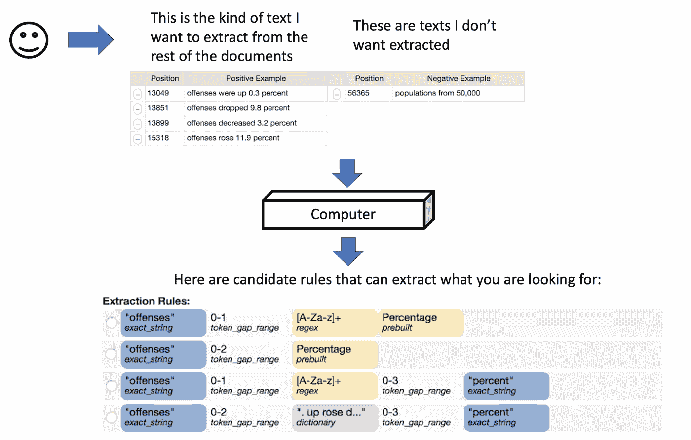
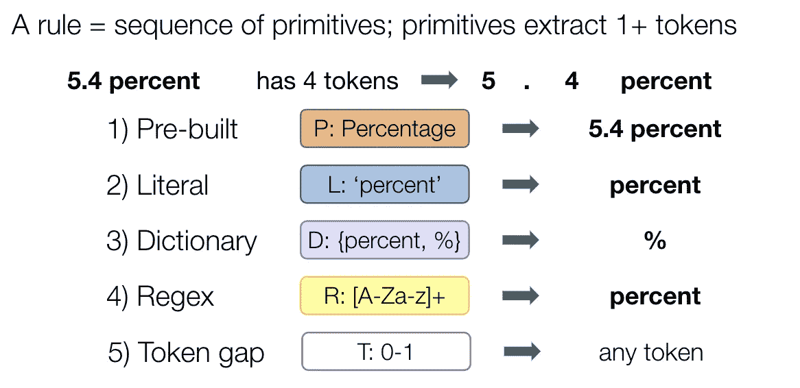
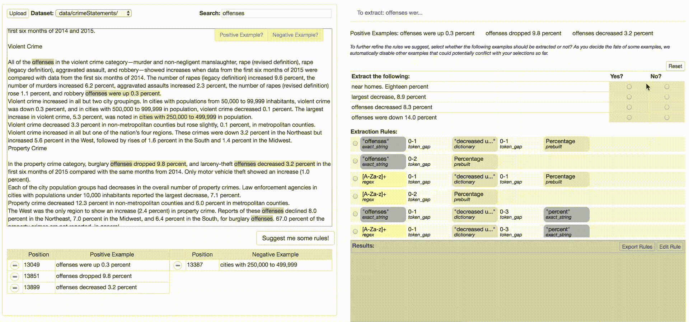
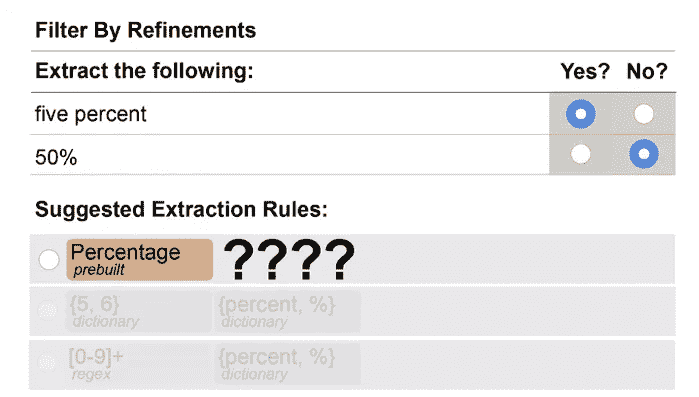
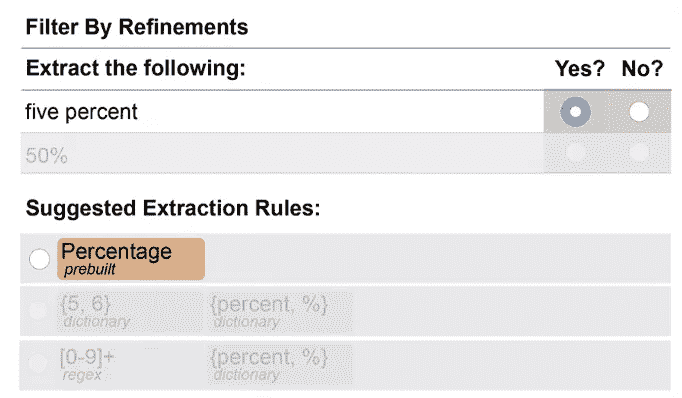

# 文本提取工具的过滤器背后的设计

> 原文：<https://towardsdatascience.com/the-design-behind-a-filter-for-a-text-extraction-tool-b9eb2c9b2e8d>

几年前，我开发了一个名为 SEER 的信息提取(IE)工具，帮助用户从文档中提取数据。例如，调查员希望从 FBI 新闻稿的数据集中提取所有犯罪的增加和减少。

图片作者。

SEER 学习从用户给定的文本高亮示例中自动提取数据。它学习高亮文本中的模式，并生成匹配和提取所需目标文本的*提取规则*。

每一行都是一个提取规则。并且每个抽取规则抽取所有的*正例。*图片作者。

提取规则是正则表达式、字典、字符串、标记间隙和实体的彩色框的序列，在 SEER 中称为预构建。这些彩色框序列描述了文本中要匹配和提取的模式。提取规则的输出被称为*提取*。

图片作者。

然而，SEER 通常会生成几个候选提取规则，因为可能会有大量的规则集匹配所有的正例，并且可以完成任务。用户必须找到并选择这些规则中的哪一个最好地提取所需的提取集合。

用户必须检查每个提取规则，以检查提取是否包含他想要的所有文本。一些规则提取不想要的文本，而一些规则提取想要的文本。图片作者。

工具中设计了过滤器，以帮助用户快速选择最符合其预期提取集的提取规则。如果没有任何过滤器，用户将不得不自己手动分析和比较规则的提取。此外，有许多不同的方式来设计这种滤波器。在本文中，我们将讨论如何为提取规则设计这样一个过滤器。

## 按提取过滤规则

当我们设计过滤器时，我们没有使用标准的搜索栏，用户只需输入一个关键字，然后工具根据关键字过滤规则。按提取的文本过滤规则是有用的，但它仍然会显示提取用户可能实际上不想要的文本的规则。需要有一种方法根据期望的和不期望的提取来过滤规则。

因此，我们要求用户对候选规则提取的文本回答“是”和“否”。我们称这些文本为用户可以接受或拒绝的*细化*。精化是区分和过滤掉规则的提取。

在这里，用户通过接受或拒绝细化来过滤规则。当她回答细化问题时，Seer 也会根据用户的回答将一些细化问题变灰，我们稍后会谈到这一点。图片作者。

## 细化是如何创建的？

让我们简化这个场景。假设该工具学习并生成了以下提取规则:

提取规则显示在左侧，中间显示每个提取规则的提取。最右边是不同的提取。图片作者。

每个规则都有自己的提取集。这些提取中的一些被称为*区分提取*:这是一个由规则子集而不是所有规则捕获的提取。一个区分提取可以被一个或多个规则捕获，只要它不被*所有*规则捕获。

在我们的场景中，不同的抽取是“百分之五”和“百分之五十”。这些提取被至少一个规则捕获，但不是所有规则。

SEER 将这些不同的提取作为过滤器呈现给用户。

提炼基本上是区分提取。图片作者。

## 使用区分提取过滤规则

假设用户选择“否”到“百分之五”。然后 SEER 会过滤掉那些没有抓住“百分之五”的规则。换句话说，SEER 只显示了最后两条规则。如果用户选择“是”到“百分之五”，SEER 只显示预构建的规则。

图片作者。

如果用户选择“是”到“50%”，SEER 只显示第一个和最后一个规则。如果用户选择“否”到“50%”，SEER 只显示第二条规则。

图片作者。

当用户对细化回答“是”和“否”时，SEER 会调整呈现的规则集。

## 防止用户答案冲突

有时，用户可以提供与规则相关联的提取的答案，这些规则也被其他提取捕获。所以 SEER 禁用了一些改进来防止冲突的意图。

如果用户选择“是”到“5%”，但选择“否”到“50%”，这将导致冲突。SEER 不确定是否显示预构建的规则，因为两个提取都出现在该规则中。

图片作者。

为了防止用户意图的冲突，如果精化的规则之前已经被回答或者已经被过滤掉，SEER 将禁用精化。

“50%”选项被禁用，因为 SEER 已经从接受“百分之五”的用户那里知道了答案。图片作者。

因此，如果用户选择“是”到“百分之五”，则“50%”的选择将被禁用。而这是因为 SEER 已经从之前的选择中知道了“50%”选择的答案。这是因为所有“50%”的规则都已经被接受了。

## 结论

在这篇短文中，我将讨论我们如何为提取规则设计过滤器。我们将这些摘录作为用户可以接受或拒绝的细化。有关该工具的更多详细信息，请参见[的论文](https://dl.acm.org/doi/10.1145/3025453.3025540)。