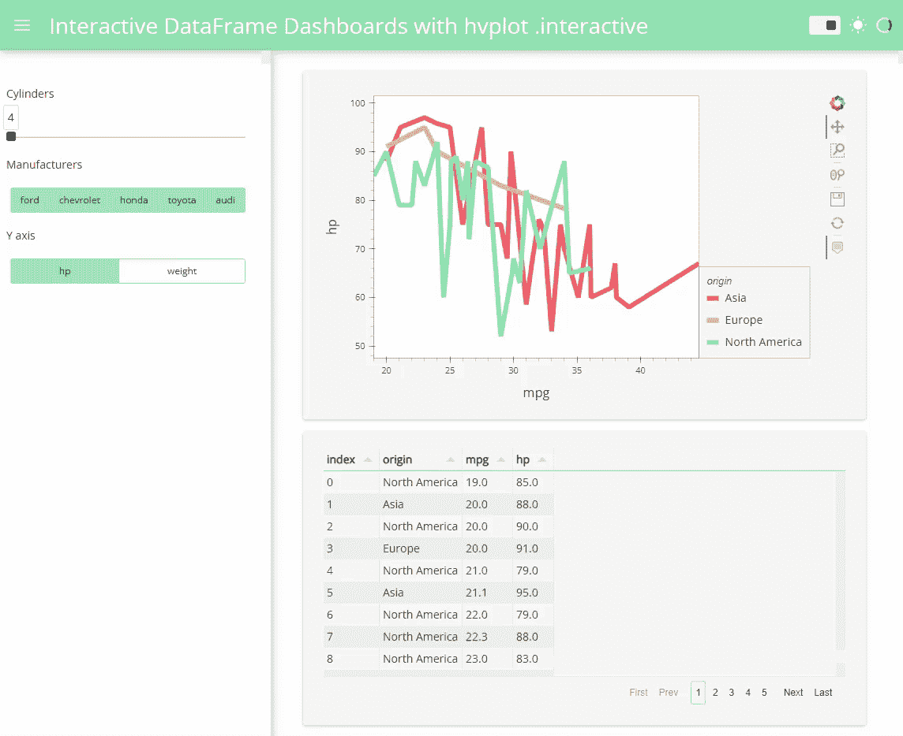
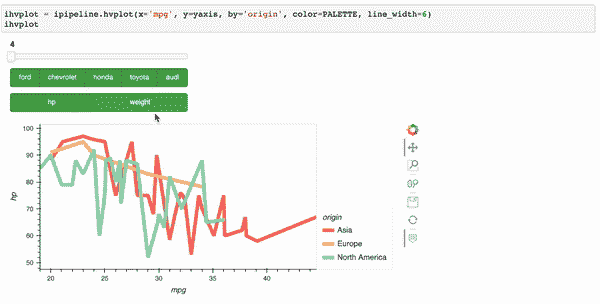

# 用 Python 创建交互式仪表盘的最简单方法

> 原文：<https://towardsdatascience.com/the-easiest-way-to-create-an-interactive-dashboard-in-python-77440f2511d1>

## **使用 hvPlot 将 Pandas 管道变成仪表板。互动**

由[索菲亚·杨](https://sophiamyang.medium.com/)和[马克·斯科夫·麦德森](https://medium.com/@marcskovmadsen)

本文将向您展示用 Python 从任何数据框架创建交互式仪表板的最简单方法。如果你已经知道一些熊猫，你几乎可以立即使用 [hvPlot](https://hvplot.holoviz.org/) 。交互式和[面板](https://panel.holoviz.org/)将您的数据帧处理流水线变成仪表板！只需几行熟悉的代码就可以制作这样一个交互式仪表板:

带 hvplot 的交互式数据框架仪表板。互动(图片由作者提供)

# **什么是 hvPlot？**

hvPlot 是由我的 Anaconda 同事 Philipp Rudiger、Jean-Luc Stevens 和 Jim Bednar 开发的。和大家熟悉的熊猫是一样的。plot() api，但是使用。hvplot()在 web 浏览器中提供丰富的交互式绘图。以我的经验来看，对于熊猫、Dask 和 XArray dataframes 来说，用 Python 创建交互式剧情是最简单的方法。hvPlot 是 HoloViz 生态系统中的七个库之一。如果你想了解更多关于 HoloViz 的知识，可以看看我之前关于[我为什么喜欢 HoloViz](/visualization-and-interactive-dashboard-in-python-c2f2a88b2ba3?sk=c78ed971426bbccb89798759779aa303) 的博文。

# 材料

*   为这篇文章检查我的 [Github](https://github.com/sophiamyang/hvplot_interactive) 回购。
*   查看活页夹上的笔记本和应用程序: [Jupyter 笔记本活页夹](https://mybinder.org/v2/gh/sophiamyang/hvplot_interactive/HEAD?filepath=hvplot_interactive.ipynb)、 [Jupyter 实验室活页夹](https://mybinder.org/v2/gh/sophiamyang/hvplot_interactive/HEAD?urlpath=lab/tree/hvplot_interactive.ipynb)、[面板应用程序](https://mybinder.org/v2/gh/sophiamyang/hvplot_interactive/HEAD?urlpath=panel)或 [Google Colab](https://colab.research.google.com/github/sophiamyang/hvplot_interactive/blob/HEAD/hvplot_interactive.ipynb)

# **设置**

让我们首先在命令行中安装一些包:

然后在您的 Python 文件或笔记本文件中，导入所需的模块:

**从熊猫开始**

让我们首先从熊猫的数据框架开始:

假设您想用下面的 Pandas 数据处理管道来处理这些数据:

如果我们想把`cyl`的值、`mfr`的值和变量`hp`变成我们可以改变和控制的交互式小部件呢？可能吗？是的，有了 hvPlot，这一点都不难。以下是步骤:

*   首先，我们需要用`.interactive()` : `idf = df.interactive()`包装我们的数据帧，这样这个数据帧就变得具有交互性，我们可以在这个数据帧上使用面板小部件。

> ".interactive 存储您的管道(数据上的一系列方法调用或其他表达式)的副本，并在小部件发生变化时动态重放管道。”

*   其次，我们可以定义我们想要使用的面板部件。这里我为圆柱体定义了一个面板部件，为制造商定义了一个部件，为选择 y 轴定义了一个部件。
*   最后，我们可以将原始 Pandas 管道中的值或变量替换为我们刚刚定义的这些小部件。我们将管道的输出定义为 ipipeline:

# **制作互动图和表格**

在绘图时，交互式数据框架 ipipeline 就像普通的熊猫数据框架一样工作。我们可以用正常的。情节方法，或者在这里我尝试了我最喜欢的情节方法。hvplot。神奇的是，我们的情节变得互动！

互动情节(图片由作者提供)

类似于熊猫数据框架，我们的交互式数据框架支持。管道方法，所以我们可以管道一个函数或类，比如`pn.widgets`。制表到这个数据框架中。结果显示一个交互式表格。

互动表格(图片由作者提供)

# **构建仪表板**

现在我们有了一个图、一个表和三个小部件，我们如何将它们排列到一个仪表板中呢？

在这里，我们可以使用`.panel()`从我们的交互管道中创建面板对象，然后使用面板按照我们喜欢的方式来安排事情。在这里，我们将把我们的图和表放入一个`pn.Column`对象，然后使用一个模板将小部件放入一个侧边栏来制作完整的仪表板:

# **部署仪表板**

要将这个仪表板作为 web 服务器启动，我们只需运行`panel serve hvplot_interactive.ipynb`，您的浏览器现在应该会打开一个选项卡，显示本文开头的仪表板。这就够了！

有关如何将仪表板部署到服务器的详细信息，请查看[面板文档](https://panel.holoviz.org/user_guide/Server_Deployment.html)，或者我之前关于将仪表板部署到[谷歌云应用引擎](/deploy-a-python-visualization-panel-app-to-google-cloud-cafe558fe787?sk=98a75bd79e98cba241cc6711e6fc5be5)和[谷歌云运行](/deploy-a-python-visualization-panel-app-to-google-cloud-ii-416e487b44eb?sk=aac35055957ba95641a6947bbb436410)的文章。

# **推荐学习资源**

*   查看官方文档: [hvPlot。和 hvplot.holoviz.org 互动](https://holoviz.org/tutorial/Interactive_Pipelines.html?highlight=interactive)。
*   Philipp Rudiger 展示了 hvPlot。今年 PyData 大会上的互动，下面是[视频](https://www.youtube.com/watch?v=-GcA0SEJaJM)。
*   Marc Skov Madsen 有一个很好的使用 hvPlot .interactive 的例子。

希望你喜欢使用 hvPlot。互动！如果你有问题或者想联系其他 HoloViz 用户，请查看 https://discourse.holoviz.org/。

**确认**:

*   谢谢你的指导和支持！
*   谢谢你[西蒙·霍布罗·汉森](https://github.com/Hoxbro)为我们修复了一个 [bug](https://github.com/holoviz/hvplot/issues/697) 。我们非常感谢你的帮助！

**参考文献:**

[https://www.youtube.com/watch?v=-GcA0SEJaJM](https://www.youtube.com/watch?v=-GcA0SEJaJM)

[https://gist . github . com/MarcSkovMadsen/e 666503 df 2 aa 1d 8d 047 dcb 9555 b5 da 6d](https://gist.github.com/MarcSkovMadsen/e666503df2aa1d8d047dcb9555b5da6d)

[https://holoviz.org/tutorial/Interactive_Pipelines.html?高亮显示=互动](https://holoviz.org/tutorial/Interactive_Pipelines.html?highlight=interactive)

索菲亚·杨和马克·斯科夫·麦德森 2022 年 1 月 14 日

在[媒体](https://sophiamyang.medium.com/)、[推特](https://twitter.com/sophiamyang)、 [Linkedin](https://www.linkedin.com/in/sophiamyang/) 和 [YouTube](https://www.youtube.com/channel/UCruSa8hlUAa3aHQ189oOggQ) :)上关注我