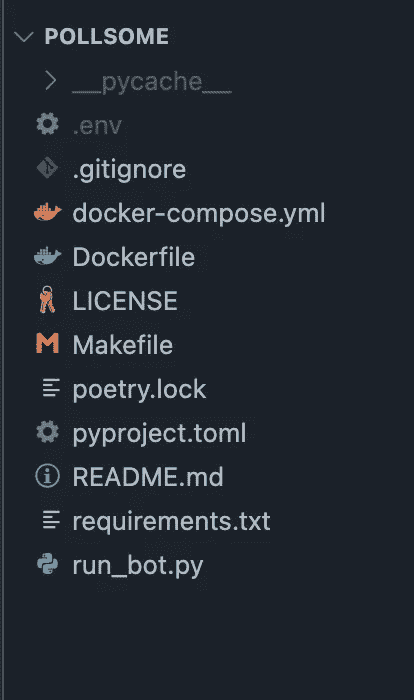
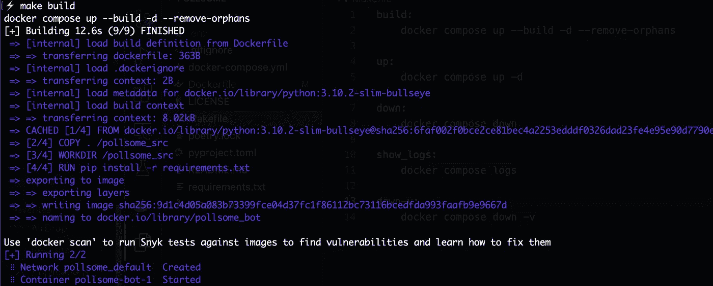

# 使用 Docker Compose 和 GitHub 操作的简单 Python CI/CD 管道

> 原文：<https://towardsdatascience.com/the-easy-python-ci-cd-pipeline-using-docker-compose-and-github-actions-80498f47b341>

## 在 VPS 上持续部署真实世界的项目


由[古伊列梅·斯特卡内拉](https://unsplash.com/@guilhermestecanella?utm_source=medium&utm_medium=referral)在 [Unsplash](https://unsplash.com?utm_source=medium&utm_medium=referral) 拍摄的照片

在远程服务器上管理一个实时项目实际上需要一些领域，我们希望在这些领域减少人工干预，用自动化服务来代替。答:首先，每次我们向 GitHub 库推送新代码时，我们可能需要按顺序执行以下任一操作:

*   对我们的项目进行测试
*   用新版本更新 Docker 映像
*   将带有新建映像的应用程序部署到我们的服务器

与这些过程中的每一个相关联的复杂性本身并不是微不足道的，当您每次都需要按顺序执行它们时，这就变成了一件苦差事。因此，自动化集成和部署在开发人员眼中具有巨大的价值。

在这里，我们看一下用 Docker compose 和 GitHub 动作自动化 CI/CD 管道的简单方法。

# 用 discord.py 和 FastAPI 构建 discord bot

我想在我最近从事的一个项目中展示整个管道，这是一个用 *discord.py* 编写的 discord 机器人，用于在 discord 服务器中引入优雅的轮询服务。

bot 存储库位于[这里](https://github.com/yashprakash13/Pollsome)。以下是我正在处理的项目结构:



项目结构

如果您想跟进，可以在您的虚拟环境中使用以下命令简单地安装该项目的两个主要需求:

```
pip install discord.py fastapi "uvicorn[standard]" python-dotenv
```

`**discord.py**`是允许我们构建 discord 应用程序的主要库。`**FastAPI**`和它的 ASGI 网络服务器`**uvicorn**`将在部署时保持机器人在服务器上存活。最后，`**python-dotenv**`是一个简单的库，它将帮助我们在项目中使用 [*环境变量*](/the-quick-guide-to-using-environment-variables-in-python-d4ec9291619e?source=your_stories_page-------------------------------------) 。

> 注意:如果你正在跟进，你可能想在 [discord 开发者门户](https://discord.com/developers/applications)中制作一个应用程序和一个机器人，并获取它的令牌。
> 我们将在项目根目录下的`**.env**`文件中使用这个令牌，如上图所示。

我们现在快速看一下机器人代码，好吗？

```
import asyncioimport discordfrom dotenv import load_dotenvimport osfrom discord.ext.commands import Botload_dotenv()TOKEN = os.environ.get('DISCORD_TOKEN')
```

我们首先加载环境变量，并使用我们的 dotnev 库访问令牌。

现在，我们将我们的机器人定义如下:

```
intents = discord.Intents.all()bot = Bot(command_prefix='!', help_command=None, intents=intents)
```

**命令前缀**允许我们使用机器人只响应特定的命令。

为了使本文简单，我们只希望机器人做一件事:

*   读取消息中是否输入了特定命令，如果是，则回复它。

接下来，我们想从传入的消息中捕获文本，我们用`**on_message**`函数来完成:

```
@bot.eventasync def on_message(message): # Do not reply to self if message.author == bot.user: return # Do not reply to any other bot if message.author.bot: return    # get the message content msg = message.content.lower() # reply to the ping message if "!ping" in msg: await message.reply("Pong!", mention_author=False)
```

现在让我们把它包装在我们的异步 API 中，好吗？

```
from fastapi import FastAPIapp = FastAPI()@app.get("/")def main(): return "The bot is alive!"# run the bot as a FastAPI async function@app.on_event("startup")async def run(): """ to run the bot as a FastAPI async func """ try:
        asyncio.create_task(bot.start(TOKEN)) except: await bot.logout()
```

现在，使用以下 shell 命令运行 bot:

```
$ uvicorn run_bot:app --reload --port 8443 --host 0.0.0.0
```

服务器运行时，您将看到以下输出:


服务器状态

你应该也能在你的服务器上看到你的机器人上线。

现在，让我们将整个工作流容器化，以便在我们的 VPS 上轻松部署。

# 构建 Docker 设置

现在我们有了一个可用的 API，下一步就是封装我们的应用程序。让我们构建一个 docker 文件来开始这项工作:

```
touch Dockerfile
```

现在，我们想从以下几点开始:

*   下载并安装合适的 Python 版本
*   将我们的项目文件夹复制到容器中，
*   从`**requirements.txt**`安装所有依赖项
*   最后，暴露出需要的端口

让我们将这些行添加到我们的`**Dockerfile**`:

```
FROM python:3.10.2-slim-bullseye# Set environment variablesENV PIP_DISABLE_PIP_VERSION_CHECK 1ENV PYTHONDONTWRITEBYTECODE 1ENV PYTHONUNBUFFERED 1COPY . /pollsome_srcWORKDIR /pollsome_srcRUN pip install -r requirements.txtEXPOSE 8443
```

我们可以在这里停下来，使用 docker build 命令来构建/更新/停止我们的容器，但是我们可以更进一步，为更简单的设置创建一个`**docker-compose**` 文件:

```
touch docker-compose.yml
```

所以我们希望我们的 docker-compose 文件使用 Dockerfile 来执行我们上面提到的所有步骤，并使用 uvicorn 命令运行我们的 API (bot)。

我们这样做:

```
version: "3.9"services: bot: build: . volumes: - .:/pollsome_src ports: - "8443:8443" command: uvicorn run_bot:app --reload --port 8443 --host 0.0.0.0
```

现在，我们可以简单地使用下面的命令来构建一个新的映像，并基于该映像启动一个容器:

```
docker compose up --build -d --remove-orphans
```

如果我们想停止容器，或者显示一些日志，我们可以这样做:

```
docker compose down# anddocker compose logs
```

**可选步骤:**构建一个 **Makefile** ，用于使用更简单、更易于使用的命令执行这些任务集。

```
touch Makefile
```

然后将以下指令插入文件中:

```
build:
    docker compose up --build -d --remove-orphansup:
    docker compose up -ddown:
    docker compose downshow_logs:
    docker compose logs
```

太好了！现在我们已经为我们的 API 建立了完整的基础！

让我们来测试一下:

```
make build
```

您将看到以下输出:



生成输出

要停止容器，请执行以下操作:

```
make down
```


降低输出

最后，提交代码并将其推送到 GitHub 存储库。

# 远程服务器上手动部署

让我们继续在租来的虚拟主机上部署我们的项目。

第一步是 SSH 到您的服务器并克隆存储库。

> 如果你想知道如何用 SSH 在你的远程服务器上设置 GitHub 访问，那么先按照这些指示做[。](https://medium.com/this-code/set-up-github-via-ssh-on-a-remote-server-9348e3855f46?source=your_stories_page-------------------------------------)

```
git clone [git@github.com](mailto:git@github.com):yourusername/repositoryname.git
```

如果您的系统上已经安装了 docker，请输入:

```
make build
```

并看到您的映像构建和容器启动。

**干得好！我现在称之为“部署握手”的第一部分已经结束。现在，我们只想通过外部服务来自动化这个过程。**

# 使用 GitHub 动作自动化部署

现在，我们希望发生以下情况:

*   一旦我们在本地机器上对我们的代码做了新的更改，我们就提交并把它推送到我们的在线 Github 库。
*   这个动作应该执行一个工作流来登录到我们的 VPS，把最新的代码放到 VPS 上，从新代码构建一个新的 Docker 映像，并为它启动一个容器。
*   作为一个清理过程，它还去除了旧的悬挂图像。

为此，我们使用了 **GitHub 动作**。

在我们项目的根目录下，让我们创建一个新文件，如下所示:

```
mkdir -p .github/workflows
touch .github/workflows/main.yml
```

在文件中，首先我们要将工作流命名为:

```
name: Bot CI-CD
```

现在，我们要创建工作流 ***触发器*** 。

触发器定义了这些流程何时执行。还记得我们希望他们将代码推送到主分支吗？我们这么说吧:

```
on:
    # Triggers the workflow on push or pull request events but only for the main branch

    push: branches: [main] pull_request: branches: [main] # Run this workflow manually from the Actions tab on Repo homepage
    workflow_dispatch:
```

顺便说一下，我们可能还想从存储库主页上的 **Actions** 选项卡中手动运行这个工作流。`**workflow_dispatch**`触发器对此有所帮助。

现在，我们要指定一个部署“作业”。为此，我们首先需要在 GitHub 存储库中定义一些环境变量。

转到`**Settings -> Secrets -> Actions**`并添加新的存储库密码。

逐一补充以下秘密:

*   VPS_SSH_HOST —这是您的服务器的主机 IP 地址。
*   VPS_SSH_USERNAME —这是您的 user@ipaddress 登录的用户名。
*   VPS_SSH_SECRET —这是您在服务器上为 GitHub 访问设置的私有 SSH 密钥。
*   VPS_SSH_PORT —这是 SSH 访问的端口号。通常是端口 22。
*   SSH_PASSPHRASE —这是在创建 SSH 密钥期间提供的密码。
*   PROJECT_PATH —这是项目根目录的完整项目路径。例如，`**/home/username/path/to/your/projectrootdirectory**`

现在，我们终于可以在 yaml 文件中指定部署作业了:

```
jobs:
    deploy:
        runs-on: ubuntu-latest
        steps:
            - name: Deploy to VPS
              uses: appleboy/ssh-action@master
              with:
                  # VPS IP
                  host: ${{ secrets.VPS_SSH_HOST }}

                  # VPS username
                  username: ${{ secrets.VPS_SSH_USERNAME }}

                  # SSH key (copy it from your local machine)
                  key: ${{ secrets.VPS_SSH_SECRET }} # SSH port
                  port: ${{ secrets.VPS_SSH_PORT }} # passphrase
                  passphrase: ${{ secrets.SSH_PASSPHRASE }} script: | cd ${{ secrets.PROJECT_PATH }} git pull origin main make down make build echo "Deleting old image(s)..." docker image prune -a -f
```

我们使用`**uses: appleboy/ssh-action@master**` 来指定 SSH 的登录动作。这是 GitHub 为了方便[从这里](https://github.com/appleboy/ssh-action)采取的一个自定义动作。

好了，我们准备好行动了！现在，推动您的存储库来看看魔法吧！

# 结论

好了，这就是我们如何通过使用 Docker 和 GitHub 操作创建 CI/CD 管道来自动化我们项目的集成和部署。

如果你想看一看[库](https://github.com/yashprakash13/Pollsome)，就在这里。

在掌握了这个简单的工作流程之后，您还可以尝试一些事情:创建多个 docker 容器，并使用 Docker Swarm 通过 CI/CD acton 管理它们。在中型或大型项目中，为容器设置自动日志以进行持续监控也是一项很好的任务。

## [别忘了订阅阅读更多来自我。](https://ipom.medium.com/membership)

另外几个故事引起了你的兴趣:

[](https://betterprogramming.pub/the-easy-python-auto-code-formatting-guide-e8300c82797b) [## 简单的 Python 自动代码格式化指南

### 只需设置一次，在提交时编写并自动格式化您的代码——使用这些工具没有任何麻烦。

better 编程. pub](https://betterprogramming.pub/the-easy-python-auto-code-formatting-guide-e8300c82797b) [](/26-github-repositories-to-inspire-your-next-data-science-project-3023c24f4c3c) [## 26 个 GitHub 存储库，激发您的下一个数据科学项目

### 用这个有趣的代码列表开始新的一年，包括库、路线图和项目书签

towardsdatascience.com](/26-github-repositories-to-inspire-your-next-data-science-project-3023c24f4c3c) [](https://medium.com/geekculture/21-vscode-keyboard-shortcuts-you-should-know-1b96a65e9428) [## 你应该知道的 21 个 VSCode 键盘快捷键

### 使用您最喜欢的代码编辑器提高编码效率

medium.com](https://medium.com/geekculture/21-vscode-keyboard-shortcuts-you-should-know-1b96a65e9428)