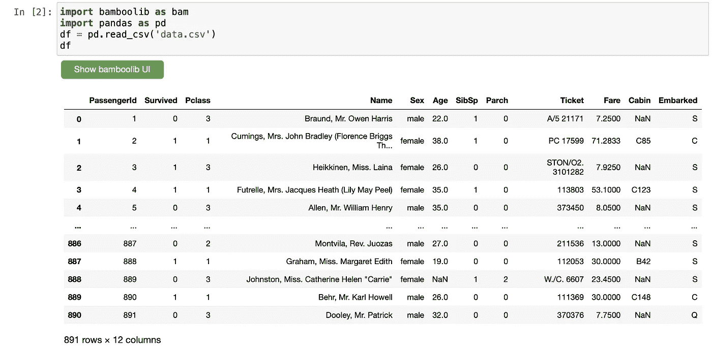
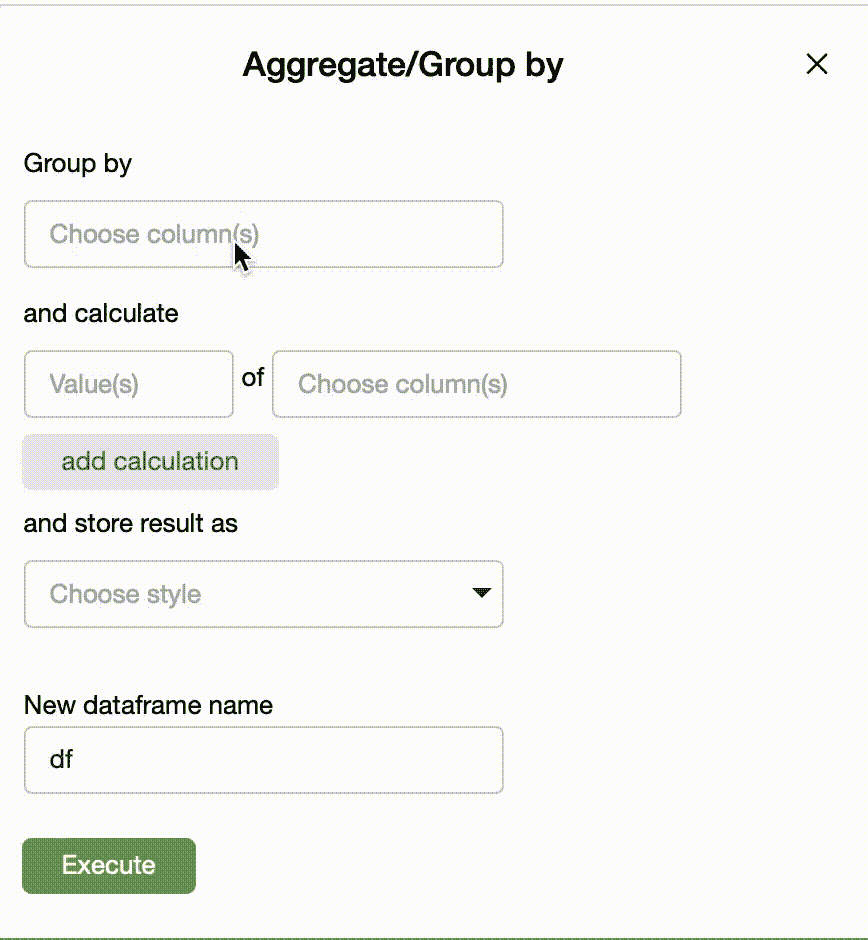
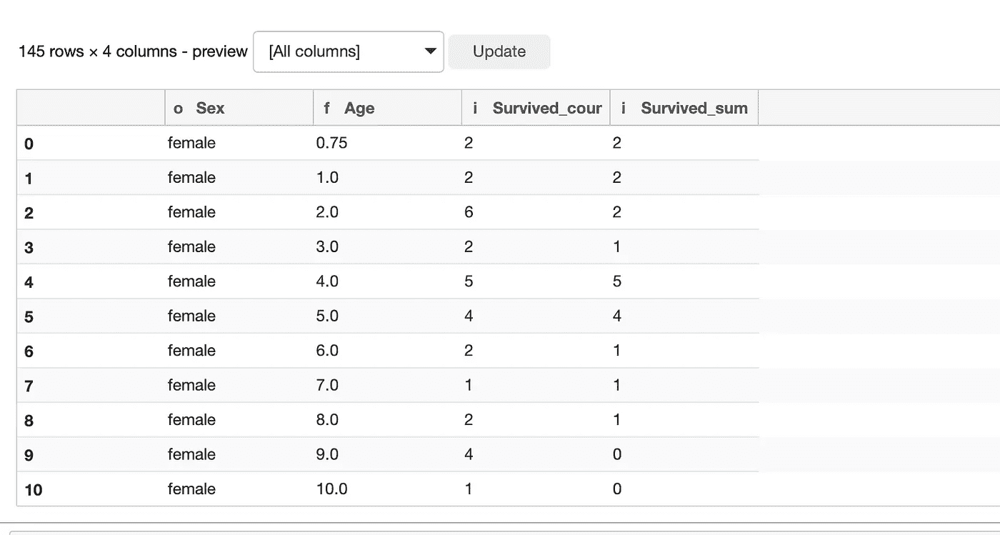
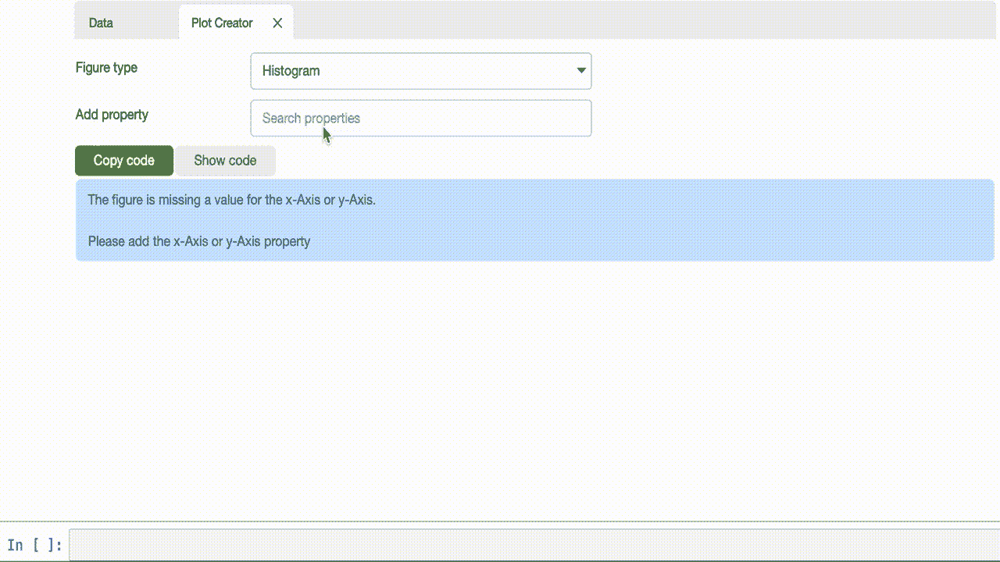

# 进行数据探索的简单方法

> 原文：<https://towardsdatascience.com/the-easy-way-to-do-data-exploration-22b4b8e1dc20>

## 使用 Jupyter 笔记本和 bamboolib Python 库


雅各布·欧文斯在 [Unsplash](https://unsplash.com?utm_source=medium&utm_medium=referral) 上的照片

数据争论、探索、处理，无论你在日常数据科学实践中怎么说，都是这项工作的主要部分之一。同时，这也是工作中最混乱的部分之一！

bamboo lib 库试图移除与数据探索相关的堆积如山的任务，并以一种更方便、游戏化和令人愉快的方式来取代其复杂的机制。

在本教程中，我将向您介绍如何使用 Jupyter notebook 或 Jupyter lab 来设置库及其扩展，并使用它在公共数据集上快速完成一些公共数据探索任务。

我们开始吧！👇

# 使用 Jupyter 设置运行 bamboolib

第一步是创建一个新的虚拟环境并安装必要的软件包。

如果使用`pipenv`，这个过程足够简单:

```
pipenv shell
```

然后你可以安装 Jupyter 和 bamboolib:

```
pipenv install jupyter bamboolib
```

最后，在虚拟环境中，您需要安装 bamboolib 扩展，以便在 Jupyter 环境中运行:

```
python -m bamboolib install_nbextensions
```

我们已经成功设置好了！让我们继续使用 Kaggle 的[泰坦尼克号数据集](https://www.kaggle.com/c/titanic/data)探索图书馆的功能。它是在创造性许可下免费提供的。

通过键入以下命令从`pipenv`环境中运行 jupyter notebook:

```
pipenv run jupyter notebook
```

# 探索 bamboolib UI

当您第一次打开 jupyter 笔记本或 jupyter 实验室环境时，您将读取数据。

考虑第一个单元格中使用的以下代码块:

```
import bamboolib as bam
import pandas as pd
df = pd.read_csv('data.csv')
df
```

您将获得以下输出:



作者图片—测向可视化从这里开始

**注意:**如果您没有看到带有 UI 选项的绿色按钮，请刷新浏览器选项卡，或者在终端中通过简单的 `Ctrl-C`简单地停止笔记本实例并重新运行它。

看到那个按钮了吗？它让你一次点击就能看到唯一值和缺失值的数量！


按作者分类的图片-探索数据框架

像这样:


按作者分类的图片-探索数据框架

那不是很方便吗？

现在，让我们探索另一个大量使用但仍然是数据争论的常见用例:使用熊猫“`**Group-by**`”函数。

由于“`**Survived**`”是我们的标签，我们希望基于该列本身计算聚合，如“总和”。让我们通过选择“**转换列**”空间中的“`**Group-by**`”选项，按“`**Age**`”和“`**Sex**`”列分组。


按作者排序的图像—从可用选项中选择“分组依据”

下面是做这个操作的全过程:



按作者分组的图像-按操作分组

最后，让我们来看看结果:



按作者分组的图像—按结果分组

让我们也执行一些数据可视化:让我们考虑散点图将如何显示关于“`**Age**`”和“`**PClass(the ticket class)**`”列的存活率:

因此，我们的 x 轴现在将有`“**Age"**`列，我们将选择我们的颜色作为标签类`**Survived**`。最后，我们将把这个可视化分成三个不同的子图(称为`**Facet rows**`)，以便可视化每个乘客类别的存活率与年龄的分布(`**PClass**`)。

让我们在这里想象一下整个过程:



按作者分类的图像-直方图绘制操作

结果是:


按作者分类的图像-结果图

这个库的一个最好的特性是，你可以很容易地复制可视化代码或任何数据转换。看到“复制代码”和“显示代码”按钮了吗？是的，就是这些。

您可以像这样查看代码:


按作者分类的图像-结果绘图代码

# 几句临别赠言…

正如您可能已经猜到的那样，这个库使得在简单的按钮点击中执行各种数据转换和可视化变得非常方便。在某种程度上，通过研究从数据转换中获得的现成代码以及库本身的图形，您也可以获得非常有价值的信息。否则，为了快速准备会议，这个图书馆是个不错的选择！

快乐学习:)

我希望您喜欢这篇文章，并从中了解到这个有趣的库。我希望在我的下一部电影中也能看到你。

在那之前，[关注我的媒体页面](https://medium.com/@ipom)，确保订阅后我所有的文章都能直接发到你的收件箱。

## [我还建议成为一名中等会员，以便不要错过我发表的任何数据科学文章。](https://ipom.medium.com/membership/)在此加入👇

[](https://ipom.medium.com/membership/) [## 通过我的推荐链接加入 Medium

### 作为一个媒体会员，你的会员费的一部分会给你阅读的作家，你可以完全接触到每一个故事…

ipom.medium.com](https://ipom.medium.com/membership/) 

我的几篇文章你可能会觉得有趣:

[](/26-github-repositories-to-inspire-your-next-data-science-project-3023c24f4c3c) [## 26 个 GitHub 存储库，激发您的下一个数据科学项目

### 用这个有趣的代码列表开始新的一年，包括库、路线图和项目书签

towardsdatascience.com](/26-github-repositories-to-inspire-your-next-data-science-project-3023c24f4c3c) [](/the-nice-way-to-manage-your-data-science-workflow-7fb92a2ee4a2) [## 管理数据科学工作流的好方法

### 在初学者示例中学习使用 Prefect 构建 ETL 管道

towardsdatascience.com](/the-nice-way-to-manage-your-data-science-workflow-7fb92a2ee4a2)