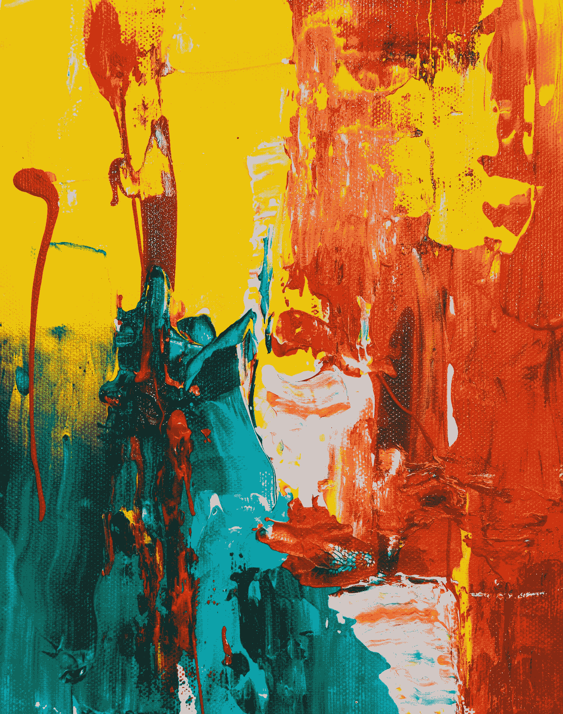

# 人工智能生成图像的新兴世界

> 原文：<https://towardsdatascience.com/the-emerging-world-of-ai-generated-images-48228c697ee9>

## 神经网络如何让人工智能成为艺术家

[斯蒂夫·约翰森](https://unsplash.com/@steve_j?utm_source=medium&utm_medium=referral)在 [Unsplash](https://unsplash.com?utm_source=medium&utm_medium=referral) 上拍照

通常，整个月我都喜欢看一些数据科学方面的新闻，看看有什么变化，或者发现一些我还没有看到的有趣的东西。然而，在过去的一周里，我没有做任何搜索。这次，我的女朋友一直在谈论她最喜欢的几个 YouTubers 用户使用流行的 ai(Dall-E 和 Midjourney)创建图像，或者他们正在要求他们的粉丝创建并发送图像给他们。不管怎样，她一直在谈论这些人工智能如何根据文本提示创建图像。有些成功了，有些却有奇怪的适应。不管怎样，她告诉我这项技术是多么迷人。我们两个都不知道人工智能是如何基于文本创建图像的，所以我认为这是一件有趣的事情。

在本周的文章中，我计划深入研究人工智能如何根据文本提示创建图像。因为技术仍在发展，这将是一个很高的水平，但我认为了解它是如何工作的仍然会很有趣。首先，我想从人工智能如何创建图像以及它可以使用的方法开始。接下来，我们将更详细地看看这些方法。最后，我将列出我对人工智能(特别是 Dall-E)的一些问题的一些答案。所以不再拖延，让我们来谈谈人工智能生成的艺术。

# 人工智能如何被用来创建图像

几十年来，计算机科学家一直在使用机器学习来训练计算机理解世界。计算机通过过滤图像来学习特定物体和物品之间的差异。下一步是学习创建图像。但是人工智能如何创造图像呢？正如你可能猜到的，这是一个复杂的过程。为了生成图像，机器使用两个神经网络。第一神经网络用于基于用户输入的文本创建图像。第二神经网络用参考图像分析生成的图像。通过比较照片，它会创建一个分数来确定生成图像的准确性。分数被发送回原始的 AI 系统，该系统可以返回另一个分数的更改图像。系统将继续对相似性评分，直到生成的图像与对照图像匹配。最终的匹配将是用户看到的生成的图像。

图像生成的一种方法是神经风格转移(NST)。NST 使用一组算法将现有图像重新创建为新的样式。例如，您使用一个输入图像(比如 Marilyn Monroe 的照片)和一个样式图像(比如 Pablo Picasso 的哭泣的女人)。输出将是玛丽莲梦露在哭泣的女人的风格。然而，这使用预先存在的图像来工作，所以它不是真正的人工智能生成的。而是像加了一个滤镜，和 Instagram 的滤镜工作原理很像。要让一个人工智能真正只通过文本提示来创建一个图像，你可以使用一个称为生成式对抗网络(GAN)的人工智能架构。因为 GANs 可能更难解释(至少在我看来)，所以让我们深入了解一下这个架构的更多细节。

# 什么是生成性对抗网络

在人工智能领域，生成对抗网络(GANs)是目前最类似于人类艺术家的东西。在这种类型的模型中，神经网络有两个角色:批评家(或鉴别者)和生成器。如前所述，生成器将负责遵循提示并创建图像。它学习样式和内容，这允许它混合样式或在它们之间插入。然后可以从头开始生成图像。批评家从现存的艺术和图像中学习。这个知识数据库用于与生成器创建的图像进行比较，以确定它是否看起来像是由人类创建的。批评家试图发现这个假图像，然后把它送回娱乐场所。在每一轮中，生成器学习和改进如何欺骗评论家相信艺术是真实的，然后可以用作最终结果。这个过程可以通过许多提示来重复，以获得大量的参考资源。这样，人工智能可以随着每一个条目学习和成长。

为了生成图像，生成器本质上是创建假数据。目标是传递真实的输出。训练发电机的 GAN 部件包括:

*   噪声输入向量
*   生成器网络(将随机输入转换为数据)
*   鉴别器网络(对生成的数据进行分类)
*   发生器损耗(当发生器不能成功欺骗鉴别器时，它将作为一种加强形式来惩罚发生器)

当鉴别器返回一个分数时，反向传播用于在计算权重对输出的影响后，在正确的方向上调整权重。它还可以用来获得可以改变发生器权重的梯度。

接下来，更多关于鉴别器。要确定一个图像是真是假，需要测试数据。测试数据来自两个不同的来源:

*   真实数据图像，即用作正面数据的真实照片或绘画
*   来自发生器的假图像被用作负数据

与生成器因没有欺骗鉴别器而受到处罚一样，鉴别器也因错误地对真实和虚假数据进行分类而受到处罚。它还使用反向传播来衡量鉴频器网络中的鉴频器损耗。

双方都接受了训练，对抗赛开始了。生成器试图欺骗鉴别器，每次尝试都变得更好，鉴别器对真实或虚假数据进行分类，也在每个错误分类的数据点变得更好。

尽管我们还可以了解更多，但在继续之前，让我们快速浏览一下训练 GANs 的步骤:

*   定义问题
*   选择您想要使用的 GAN 架构
*   使用真实数据训练鉴别器
*   使用生成器来创建假数据
*   用假数据训练鉴别器
*   使用鉴别器的输出训练发电机

现在我们对 GANs 有了更多的了解，让我们来看看我所研究的特定 AI 的一些有趣之处。

# 关于人工智能生成图像的更多信息

就像其他机器学习方法一样，机器在最大程度上不受人类干扰的情况下自主学习。这意味着当您看到生成的图像的最终输出时，它可能不是唯一的图像分组。可能还有更多你看不到的，因为它们的分数不够高，生成器无法返回它们。就局限性而言，机器正在自我训练。这意味着数据并不总是准确的。计算机不理解它看到的图像，因为它不能像我们一样“看到”图像。它也不能区分它“应该”或“不应该”创造什么。所以有局限性，但是技术在发展。

然而，一个限制是你的创造力。因为机器不知道它应该或不应该创造什么，它会试图制造你给它的任何东西。所以任何你能想到的提示。现在，它们并不总是看起来“好”，就像 Dall-E 的情况一样。Dall-E 的一些图像确实令人惊叹。但是其他的可能看起来有点恐怖。都是在学习过程中。对于 Midjourney，基于“人”的图像几乎没有那么多。它能创造的风景确实很美，但图像更有“风格”，看起来更像油画而不是照片。

我想知道的最后一个问题是人工智能如何获得如此大量的数据。但答案并不完全清楚。一些人工智能只能访问计算机科学家给他们的东西。其他人工智能使用网络抓取来访问数十亿张照片以供参考。字幕也是在学习过程中被抓取和使用的。这些图片是通过标题来识别的，所以它知道特定图片应该配什么样的标题。这样，文本输入，也就是标题，就可以根据标题“应该”配什么样的图像来生成。

还有很多东西要学，但现在，我想这总结了我的研究。

# 结论

在今天的文章中，我们了解了人工智能如何创建图像。讨论的第一种方法是 NST(神经类型转移)算法。这些算法采用预先存在的图像，并将它们转置成第二输入的样式。我们讨论的第二种方法是用于两个神经网络的 GANs(生成对抗网络)。这些类型的方法使用一个神经网络作为生成器，第二个作为鉴别器。生成器用于基于输入字幕创建图像，而鉴别器将生成的图像分类为真实或伪造。假图像被发送回训练生成器来欺骗鉴别器，当成功欺骗时，最终图像可以显示给请求提示的用户。仍然有很多限制，但是人工智能的世界在过去的几十年里已经发展了很多。我们今天也只看了两种方法，但是还有很多其他的方法。然而，就目前而言，对这两者的研究让这一周变得相当有趣。

我希望你觉得这很有趣，也希望你对人工智能生成的图像世界有所了解。下次见，干杯！

***用我的*** [***每周简讯***](https://crafty-leader-2062.ck.page/8f8bcfb181) ***免费阅读我的所有文章，谢谢！***

***想阅读介质上的所有文章？成为中等*** [***成员***](https://miketechgame.medium.com/membership) ***今天！***

查看我最近的一些文章

<https://miketechgame.medium.com/examining-behavior-driven-development-5db006edfee5>  <https://python.plainenglish.io/medium-has-an-api-605b51037b52>  <https://python.plainenglish.io/the-painful-journey-to-find-a-markdown-editor-15bd1cd370e2>  <https://medium.com/mlearning-ai/a-deeper-dive-into-neural-networks-71b73e7e4364>  </reinforcement-learning-in-data-science-e7805f133d7>  

参考资料:

<https://www.artaigallery.com/pages/what-is-ai-generated-art>  <https://bernardmarr.com/artificial-intelligence-can-now-generate-amazing-images-what-does-this-mean-for-humans/>  <https://www.techtarget.com/searchenterpriseai/definition/generative-adversarial-network-GAN>  <https://www.simplilearn.com/tutorials/deep-learning-tutorial/generative-adversarial-networks-gans>  <https://www.theguardian.com/culture/2022/jun/09/what-exactly-is-ai-generated-art-how-does-it-work-will-it-replace-human-visual-artists> 