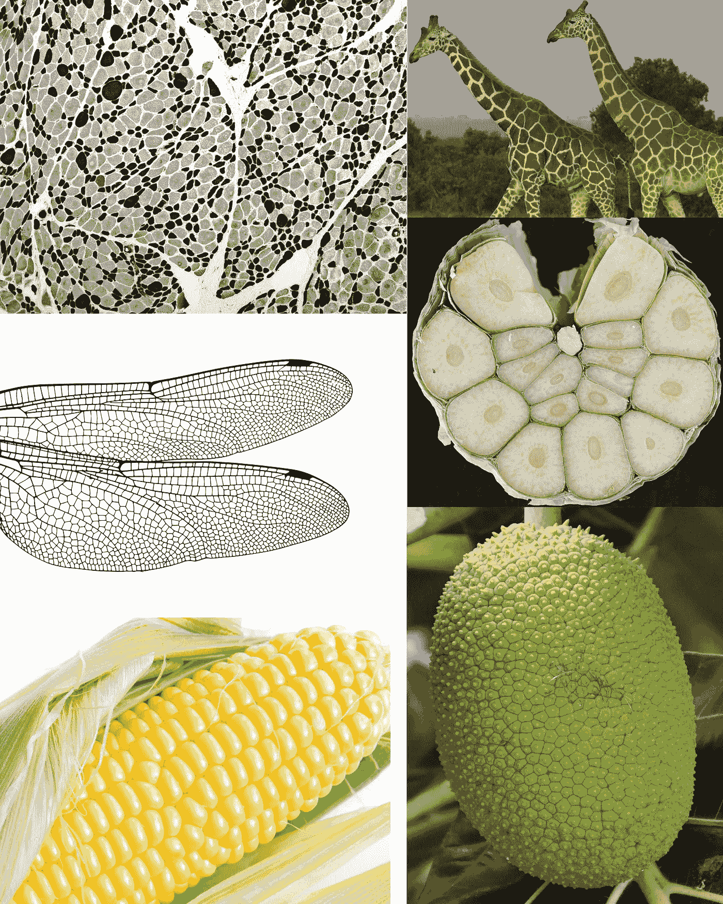
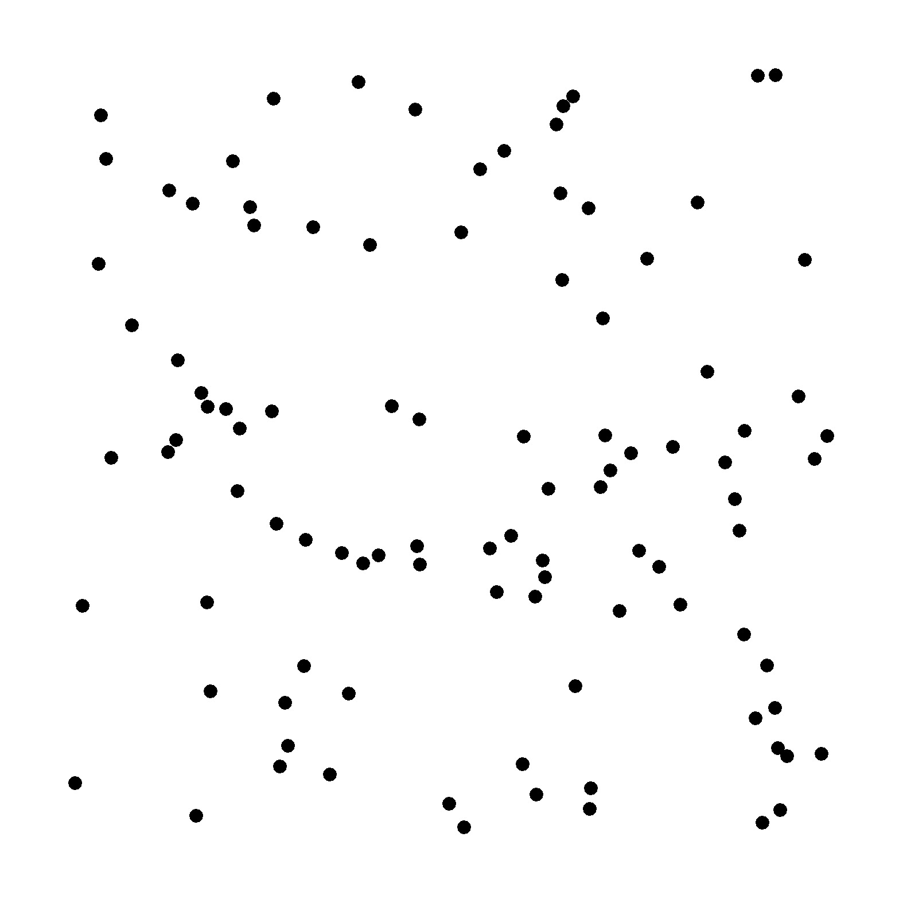
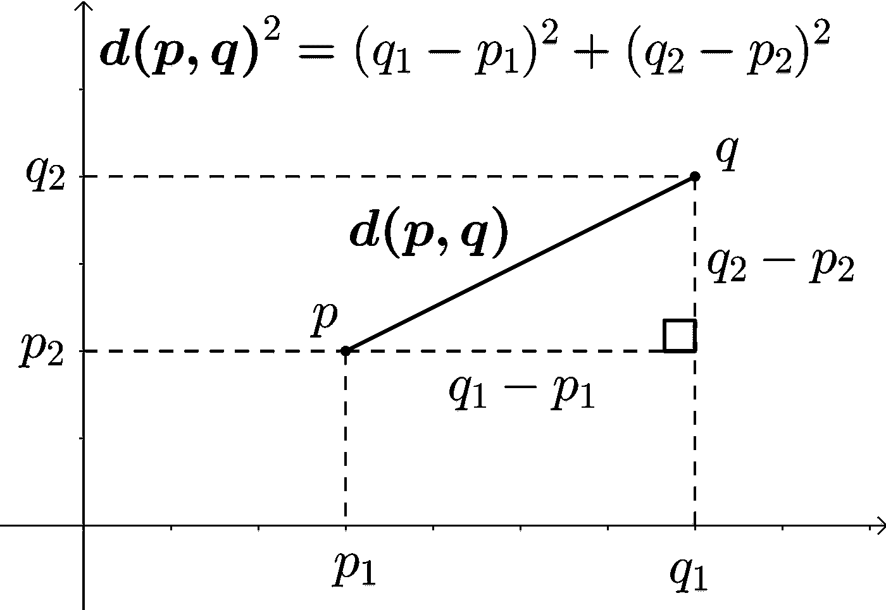
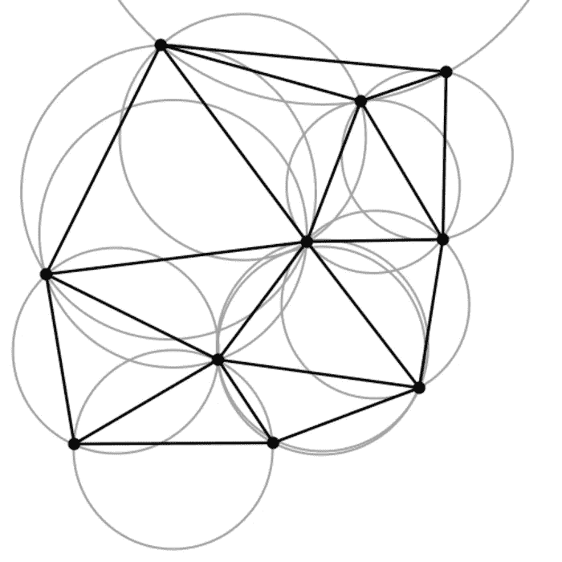
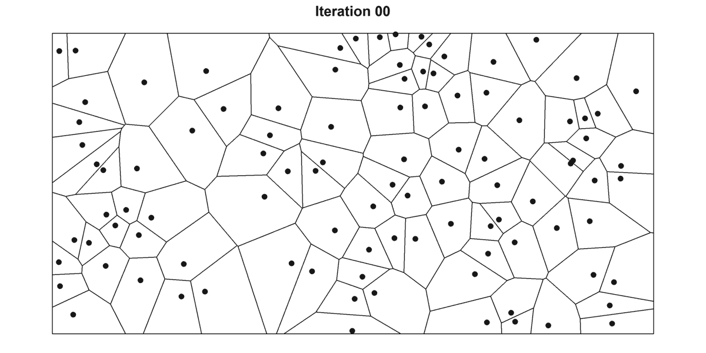
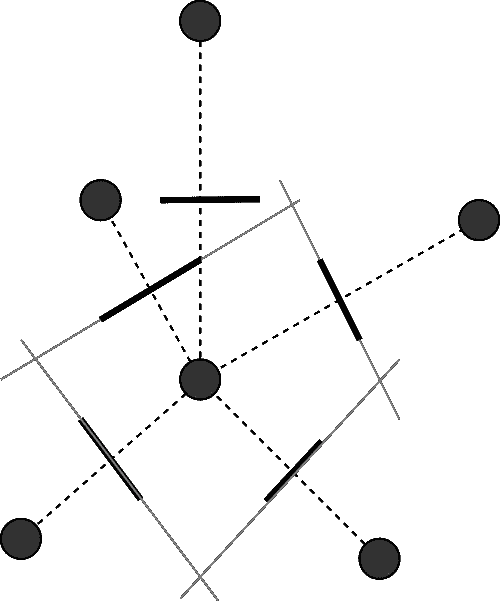
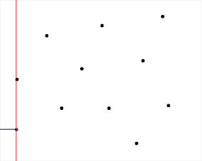

# Voronoi 图的迷人世界

> 原文：<https://towardsdatascience.com/the-fascinating-world-of-voronoi-diagrams-da8fc700fa1b>

## 简单介绍这种普遍存在的模式及其应用

Voronoi 图(也被称为*狄利克雷镶嵌*或*泰森多边形*)在自然界中无处不在。你已经遇到他们成千上万次了，但也许并没有这样称呼它。Voronoi 图是简单的，但是它们具有令人难以置信的性质，已经在从制图学、生物学、计算机科学、统计学、考古学，一直到建筑和艺术的领域中找到应用。

# 什么是 Voronoi 图？

假设你有 *n* 个点分散在一个平面上，这些点的 Voronoi 图将该平面细分为精确的 *n* 个单元，这些单元包围了最接近每个点的平面部分。这会产生一个完全覆盖平面的镶嵌。作为一个例子，在图 1 中，我绘制了 100 个随机点和它们对应的 Voronoi 图。正如您所看到的，每个点都包含在一个单元中，其边界在两个或更多点之间是完全等距的。换句话说，单元中包含的所有区域距离单元中的点比距离任何其他点都近。

图 1: Voronoi 图
来源:作者图片

# Voronoi 图案无处不在

**自然界中的 Voronoi 模式**

Voronoi 图生成的图案是自然界中常见的图案。在图 2 中，我用一些自然产生的类似 Voronoi 的图案做了一个小拼贴。从洋葱皮的微观细胞，到菠萝蜜的外壳和长颈鹿的皮毛。这些图案无处不在！

它们无处不在的第一个原因是它们形成有效的形状。正如我们前面提到的，Voronoi 图完全细化了平面:因此，所有的空间都被利用了。如果你试图在有限的空间里尽可能多地挤压，这是非常方便的——比如在肌肉纤维或蜂箱里。第二，无论什么时候，只要有东西从不同的点以统一的增长率生长，Voronoi 图就是一种自发的模式(见图 3)。例如，这解释了为什么长颈鹿会表现出这样的模式。长颈鹿胚胎有分散分布的黑色素分泌细胞，这是长颈鹿斑点深色色素沉着的原因。在妊娠期间，这些细胞释放黑色素——因此斑点向外辐射。感兴趣的读者可以参考[这篇论文](https://www.iro.umontreal.ca/~poulin/fournier/papers/Walter-2001-ISP/Walter-2001-ISP.pdf)，其中作者使用 Voronoi 图来模拟动物皮毛上斑点的计算机渲染。

图 2: Voronoi 图案在自然界中无处不在。(从左上至右下:一块肌肉的横截面，长颈鹿的皮毛图案，蜻蜓的翅膀，大蒜头，玉米，挂在树上的菠萝蜜。)
来源:[维基](https://en.wikipedia.org/wiki/Skeletal_muscle#/media/File:Denervation_atrophy_-_atp94_-_intermed_mag.jpg)，[尼拉夫·沙阿](https://www.pexels.com/it-it/foto/alberi-animale-fauna-selvatica-mammifero-7320450/)，[卡罗琳娜·格拉博斯卡](https://www.pexels.com/it-it/foto/cibo-insalata-salutare-cena-4022177/)，[斯塔格拉德](https://pixabay.com/vectors/dragonfly-wing-bug-insect-fly-1531038/)，[马里·梅德](https://www.pexels.com/it-it/foto/mais-giallo-547263/)，[阿比·雅各布](https://www.pexels.com/it-it/foto/cibo-foglie-albero-crescita-7789303/)

图 3:从分散的点不断向外生长得到 Voronoi 图
来源:[维基百科](https://en.wikipedia.org/wiki/Voronoi_diagram#/media/File:Voronoi_growth_euclidean.gif)

**建筑艺术中的 Voronoi 图案**

也许是因为它们自发的“自然”外观，或者仅仅是因为它们迷人的随机性，Voronoi 图案被有意地应用在人造结构中。建筑方面的一个例子是 2008 年北京奥运会期间为水上运动而建造的“水立方”。它的天花板和立面上有 Voronoi 图(图 4)。选择 Voronoi 图是因为它们能回忆起泡泡 1。这个类比在晚上非常清晰，整个外墙被蓝色照亮，变得栩栩如生。

图 4:北京水立方
来源:[维基百科](https://en.wikipedia.org/wiki/Beijing_National_Aquatics_Centre)，

但是中国人对沃罗诺图案的欣赏肯定比这座建筑更古老。宋代的关和葛有一种独特的裂纹釉。陶瓷在冷却过程中很容易破裂，但是管和葛的破裂是不同的——它们是故意的。它们因其美学品质而受到追捧。由于它们表面的 Voronoi 状图案，每件作品都是独一无二的。迄今为止，这是模仿最多的瓷器风格之一(图 5)。

图五:关、葛器
来源:[维基](https://en.wikipedia.org/wiki/File:Ge-type_pomegranate-shaped_Zun_(cropped).jpg)，[维基](https://upload.wikimedia.org/wikipedia/commons/1/1d/Bowl%2C_Guan_ware%2C_Hangzhou%2C_Zhejiang_province%2C_China%2C_Southern_Song_dynasty%2C_12th-13th_century_AD%2C_stoneware_with_Guan_glaze_-_Freer_Gallery_of_Art_-_DSC05570.JPG)

Voronoi 图在图形艺术中也很常见，用于创建“抽象”图案。我认为它们是很好的背景图片。例如，我通过生成随机点和构建 Voronoi 图创建了这篇文章的缩略图。然后，我根据每个单元格的点到盒子中随机选择的点的距离给每个单元格着色(图 6)。通过这种方式可以生成无尽的“抽象”背景图像。

图 6:彩色 Voronoi 图
来源:作者图片

# 数学定义和一些有趣的性质

到目前为止，我们已经提出了一个简单的二维 Voronoi 图。然而，相同类型的结构可以推广到 n 维空间。假设 P={p1，p2，…，pm}是我们的 *n* 维空间中的一组 *m* 点。然后，该空间可以被划分为 *m 个* Voronoi 单元 *Vi* ，包含 *Rn* 中比任何其他点更接近 pi 的所有点。

其中函数 *d(x，y)* 给出其两个自变量之间的距离( *a* )。通常，使用欧几里德距离(l2 距离):

然而，可以使用其他距离函数来设计 Voronoi 图。例如，图 7 示出了利用曼哈顿或城市街区距离( *l1* 距离)获得的 Voronoi 图。Manahattan 距离是两点之间的距离，如果你必须遵循规则的网格-例如曼哈顿的城市街区。结果是一个更加“盒状”的芙诺以图。

图 7:欧几里德距离
来源:[维基百科](https://en.wikipedia.org/wiki/Euclidean_distance#/media/File:Euclidean_distance_2d.svg)

图 8:使用欧几里德(左)和曼哈顿(右)距离对同一组点进行 Voronoi 图比较
来源:[维基百科](https://en.wikipedia.org/wiki/File:Manhattan_Voronoi_Diagram.svg)

欧氏距离是 Voronoi 图科学应用中最常见的距离度量。它还具有生成**凸**的 Voronoi 单元的优点。也就是说，如果你在一个单元格内取任意两点，连接这两点的直线将完全位于单元格内。

最后，还应该注意的是，Voronoi 图与 k-最近邻算法(k-NN)紧密相关，k-NN 是一种在分类、回归和聚类问题中非常流行的算法。该算法使用训练数据集中的 *k* 个最接近的示例来进行值预测。由于 Voronoi 图将空间划分为包含与每个种子最近的点的多边形，Voronoi 单元的边精确地对应于简单的 1-最近邻问题的判定边界。

# Delaunay 三角剖分

如果你从 Voronoi 图中取出每一个点，并将其与其相邻单元中的点连接起来，你将获得一个名为 **Delaunay 三角剖分**的图。在数学术语中，Delaunay 三角剖分是 Voronoi 图的[对偶图](https://www.wikiwand.com/en/Dual_graph)。在下图中，Voronoi 图(黑色)和 Delaunay 三角网(灰色)是根据一组点绘制的。

图 9:带有 Delaunay 三角剖分的 Voronoi 图
来源:作者图片

Delaunay 三角剖分就像 Voronoi 图一样神奇。顾名思义，它产生一组连接我们点的三角形。这些三角形是这样的，如果一个人在这些三角形的顶点上画一个圆，圆内将没有其他点(见图 10)。此外，Delaunay 三角剖分还具有最大化三角剖分的三角形中的最小角度的特性。因此，Delaunay 三角剖分倾向于避免带有锐角的三角形。

图 10:构建 Delaunay 三角形，使得没有点落在外接每个三角形的圆内
来源:[维基百科](https://en.wikipedia.org/wiki/File:Delaunay_circumcircles_vectorial.svg)

这些属性使它在从一组点建模表面和物体时非常有用。例如，Delaunay 三角剖分用于为[有限元方法](https://people.eecs.berkeley.edu/~jrs/meshpapers/delnotes.pdf)生成网格，为计算机动画构建 3D 模型，以及在 GIS 分析中建模地形。

# 劳埃德松弛算法

**Llyod 的算法**是一个与 Voronoi 图相关的有用算法。该算法包括在构建 Voronoi 图和寻找每个单元的质心(即质心)之间反复交替(见图 11)。在每次迭代中，该算法将点间隔开，并产生更均匀的 Voronoi 单元。

图 11:劳埃德松弛算法的步骤
来源:作者图片

几次迭代之后，单元将已经具有“更圆”的外观，并且点将更加均匀地分布。下图说明了这一点，在图中，我绘制了一组随机点的劳氏算法的前 30 次迭代。对于每个点，我还记录了它们的起始位置(灰色空心圆)，以便更好地跟踪每个细胞的运动。对于大量的迭代，图趋向于收敛到稳定的 Voronoi 图，其中每个种子也是单元的质心，也称为[质心 Voronoi 图](https://en.wikipedia.org/wiki/Centroidal_Voronoi_tessellation)。有趣的是，在 2D，Voronoi 单元往往会变成六边形，因为它们提供了在平面上包装形状的最有效方式。正如任何建造蜂巢的蜜蜂可以证明的那样，六边形蜂窝有两大优势:1)它们确保蜂窝之间没有空白空间(即镶嵌平面)，2)六边形提供了蜂窝表面和周长之间的最高比率。这个所谓的 [**蜂巢猜想**](https://en.wikipedia.org/wiki/Honeycomb_conjecture) ，数学家们花了两千年才证明。

图 12:劳埃德算法的 30 次迭代
来源:作者图片

在数据科学中，劳埃德算法是 k 均值聚类(T8)的基础，这是最流行的聚类算法之一。k-means 聚类通常通过在空间中取 *k* 个随机“质心”来启动。然后，通过在 1)将数据点分配到最近的“质心”(这相当于为质心构建 Voronoi 图，并检查哪些点在单元内)和 2)通过计算每个单元内点的平均值更新质心(参见图 14)之间交替，将数据点分组到 *k* 簇中。

图 14: k 均值聚类
来源:[维基百科](https://en.wikipedia.org/wiki/File:K-means_convergence.gif)

除了数据科学，劳埃德算法还用于各种应用。例如，它在量化和有损数据压缩算法中非常常见(例如 [Lloyd-Max 算法](http://helmut.knaust.info/presentations/2011/20110106_JMM_DWT.pdf))。这也是非常有用的，只要你想随机点间隔很好。例如，它可以用于从 Delaunay 三角剖分生成平滑网格，用于[抖动](https://en.wikipedia.org/wiki/Dither)图像，或者作为视频游戏中[程序贴图生成](https://en.wikipedia.org/wiki/Procedural_generation)的基础。

# 如何构造 Voronoi 图？

人们可以通过逐个构建每个单元来构建 Voronoi 图。如果延伸连接每个点组合的线段的平分线，就有可能获得 Voronoi 单元的轮廓(图 15)。然而，这种技术效率很低。考虑到有 *0.5*(n-1)n* 个点的组合，这种算法的复杂度会随着点的数量成平方增加。

图 15:Voronoi 单元的构造
来源:作者图片

已经提出了更有效的替代方案。例如，[扫描线算法](https://en.wikipedia.org/wiki/Fortune%27s_algorithm)通过顺序使用二叉查找树和优先级队列操作逐步构建 Voronoi 单元(图 16)。这个算法的详细描述可以在[这里](https://www.ams.org/publicoutreach/feature-column/fcarc-voronoi)找到。另一种构建 Voronoi 图的方法是首先构建 Delaunay 三角剖分。一旦获得三角剖分，延伸三角形边的平分线就得到 Voronoi 图。不需要考虑每一对点就可以得到 Delaunay 三角剖分。例如，一种有效的技术是将点投影到更高维的抛物面上。将凸包重新投影到原始空间会得到 Delaunay 三角剖分。

图 16:扫描线算法
来源:[维基百科](https://en.wikipedia.org/wiki/Fortune%27s_algorithm)

关于计算 Voronoi 图的不同算法及其复杂性的讨论可以在[这里](http://www.cs.tufts.edu/comp/163/notes05/voronoi_handout.pdf)、[这里](https://www.ic.unicamp.br/~rezende/ensino/mo619/Sacristan,%20Voronoi%20Diagrams.pdf)和[这里](https://www.codeproject.com/articles/882739/simple-approach-to-voronoi-diagrams)找到。不断有新的算法被提出来，以提高不同情况下的计算效率(如[严等 2011](https://www.microsoft.com/en-us/research/wp-content/uploads/2016/12/Efficient-Computation-of-Clipped-Voronoi-Diagram-and-Applications.pdf) ，[秦等 2017](https://onlinelibrary.wiley.com/doi/abs/10.1111/cgf.13248) )。也有需要恒定时间来生成近似 Voronoi 图的技术(例如[跳跃洪泛算法](https://fbellelli.com/posts/2021-07-08-the-fascinating-world-of-voronoi-diagrams/Jump%20Flooding%20Algorithm))。

# 附加材料的链接

*   [本文](https://plus.maths.org/content/uncovering-cause-cholera)讲述了约翰·斯诺在 1854 年伦敦霍乱爆发期间如何使用沃罗诺图来展示水泵和霍乱传播之间的联系。
*   Amit Patel 有一个关于游戏开发的博客。我强烈推荐他关于用 Voronoi 图生成程序地图的文章。
*   [David Austin 的这篇文章](https://www.ams.org/publicoutreach/feature-column/fcarc-voronoi)对计算 Voronoi 图的扫描线算法给出了很好的解释。
*   Jason Davies 制作的这张漂亮的地图是基于世界各地机场位置的 Voronoi 图。
*   [*空间镶嵌:Voronoi 图的概念和应用*](https://onlinelibrary.wiley.com/doi/book/10.1002/9780470317013) 是 Voronoi 图的圣经。如果你对 Voronoi 图有任何疑问，你一定会在这里找到答案。
*   来自 Vincent Legat 的这些幻灯片包含了一些针对不同构造算法的漂亮图纸。
*   Voronoi 图常用于森林中的树木建模(如 [Abellanas 等人 2016](https://pommerening.org/wiki/images/a/a4/Vorest.pdf) 、 [Bohler 等人 2018](https://www.sciencedirect.com/science/article/abs/pii/S0925772117300652) )。
*   Voronoi 图也可以用来确定机器人的路径。查看这些文章:[第一条](http://www.cs.columbia.edu/~pblaer/projects/path_planner/)、[第二条](https://gamedevelopment.tutsplus.com/tutorials/how-to-use-voronoi-diagrams-to-control-ai--gamedev-11778)。
*   Voronoi 图有数千种应用。从模拟森林中的树木到规划机器人路径。在这篇文章中，我仅仅触及了皮毛。这些链接包含有趣应用的列表:[链接 1](https://www.ics.uci.edu/~eppstein/gina/voronoi.html) 、[链接 2](https://www.ics.uci.edu/~eppstein/gina/scot.drysdale.html) 、[链接 3](https://en.cnki.com.cn/Article_en/CJFDTotal-GCTX200402022.htm) 、[链接 4](https://ratt.ced.berkeley.edu/readings/read_online/Aurenhammer.%20%20Voronoi%20diagrams.%20%20A%20survey%20of%20a%20fundamental%20geometric%20data%20structure.pdf) 、[链接 5](https://www.sciencedirect.com/topics/physics-and-astronomy/voronoi-diagrams) 。

本文原载[此处](https://fbellelli.com/posts/2021-07-08-the-fascinating-world-of-voronoi-diagrams/):

 