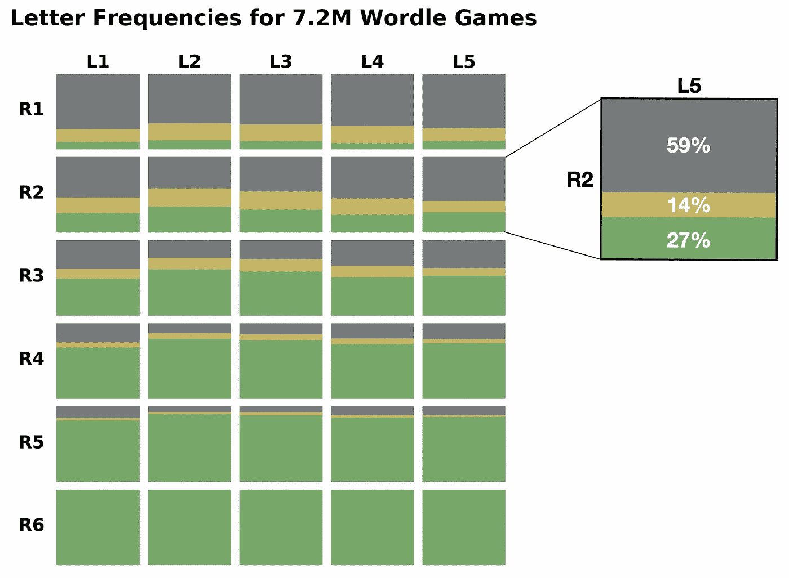
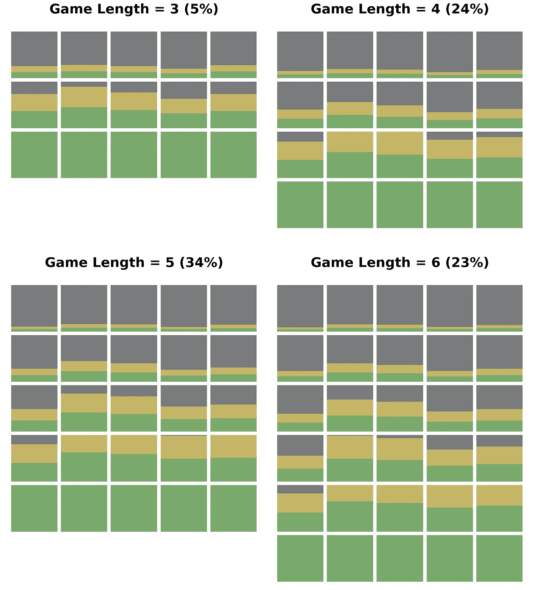
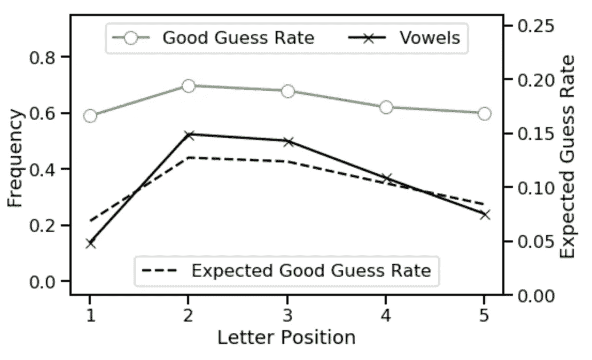

# 第一个字母是 Wordle 中最难猜对的！或者是？

> 原文：<https://towardsdatascience.com/the-first-letter-is-the-hardest-to-guess-correctly-in-wordle-or-is-it-ca033bee086d>

## 对 700 万个单词游戏中字母频率的分析。

图片作者。

上周，[的莫娜·沙拉比](https://monachalabi.com)联系了我，她是一名数据记者，以她的作品《T4》和《卫报》而闻名。莫娜已经看过了我最近的一些文字分析,除了其他事情之外，她还想出了一个自己的新奇的文字问题，她需要我的帮助来回答。Mona 想知道在一个字母接一个字母的基础上，Wordle 的玩家收到绿色或黄色方块(*猜对了*)的频率，因为这可能有助于揭示哪个字母位置最容易或最难获得有用的信息。我认为这是一个非常有趣的问题，我很乐意帮忙；你可以在莫娜最近发表在《卫报》上的文章中了解更多。

我对莫娜的分析是基于截至 2022 年 1 月 31 日发布到 Twitter 上的大约 300 万个(成功的)游戏的初始 Twitter 数据集。数据显示，第一个字母最难猜，第二和第三个字母最容易猜对，最后两个字母介于两者之间。这让我很惊讶。鉴于第一个字母在单词的拼写顺序和发音中的突出地位，我预计它是最容易猜测的——或者至少是从(绿色/黄色反馈)中获得有用信息的；我们的大脑肯定会将最初的符号/声音作为未来回忆的重要索引线索吗？而且像 ICK，ING，ED 这样的词尾不是更有特色吗？这不是应该让开头和结尾的字母更容易猜，而不是更难吗？有些事情对我来说不太合理，所以在这篇文章中，我将使用一个更近的数据集来更深入地探讨这些问题，这个数据集是在 2021 年 12 月 23 日至 2022 年 2 月 16 日期间收集的作为推特分享的>700 万个(成功的)Wordle 游戏。

对于我和 Mona 的工作，我计算了每轮游戏中每个字母位置收到绿色、黄色(猜得好)或灰色(猜得不好)反馈的比例。Mona 将生成的统计数据显示为单独的热图，分别对应绿色、黄色和灰色反馈。下面我提出了一个更紧凑的替代方案，以单个堆叠条形图的形式显示每轮游戏中的每个字母位置。例如，我们可以看到，平均来说，*第 2 轮*中的*最后一个*字母位置(突出显示)有 27%的几率被猜对(绿色)，一个正确的字母(但在错误的位置；黄色)出现的几率为 14%，而在这个位置猜错字母(灰色)的几率约为 59%。

在 Twitter 上分享的 700 万个(成功的)Wordle 游戏中，每封信/每轮游戏反馈的相对比例。作者配图。

正如所料，每轮中每个字母位置的*猜对*(绿色/黄色)的比例都会增加。但是，并非所有字母位置都是平等创建的:

1.  正如 Mona 报道的那样，一个单词的第一个字母是最难获得有用信息的；也就是说，不管哪一轮，第一个字母的绿色和黄色反馈的组合比例最低(猜得好)。
2.  反之，第二个和第三个字母最容易对；直到最后一轮，它们都与最大比例的正确猜测有关。
3.  最后两个字母介于这两个极端之间:它们比第一个字母简单一点，但比第二个和第三个字母更难。

这种方法的一个潜在缺点是，它将不同长度的游戏混在一起，例如，3 轮的短游戏与 6 轮的长游戏混在一起。这意味着早期几轮猜对的比例由短期和长期博弈组成，而后期几轮猜对的比例仅由长期博弈决定。为了解决这个问题，下面的图表展示了相同类型的分析，但是游戏是按长度分组的。

单个字母的比例会发生变化，例如，在短游戏的前几轮中，猜对的比例更大，但相对关系保持不变:第一个字母仍然最难猜对，其次是最后两个字母，而第二个和第三个字母最容易猜对。

发布到 Twitter 的(成功)游戏的每封信/每轮游戏反馈的相对比例，按游戏长度分组。括号中的数字表示 Twitter 数据集中给定长度的游戏的总百分比。作者配图。

为什么会这样？为什么第一个字母最难写对？这感觉与直觉相反，因为单词的开头非常重要，至少在我的猜测中是这样。据推测，这与出现在第一个位置而不是其他位置的字母有关。

最值得注意的是，在每个字母位置的元音频率和观察到的正确猜测率之间有很大的关系。元音作为单词的第一个字母出现*的频率相对较低*(仅占 14%),在最后两个字母位置出现的频率也相对较低(24–36 %),但在第二个和第三个位置出现的*频率要高得多(50%>)。我发现这有点出乎意料，至少在差异的规模方面是如此。虽然我预计元音字母作为第一个字母不太常见，但我没有想到它们会比第二个或第三个字母的情况少 3 倍。*

重要的是，元音的这种频率模式类似于每个字母位置中正确猜测的比例，如下所示。虽然元音和好猜的实际比例不同，但两者的*关系*高度相关(R2 = 0.92)；r2 值为 0.92 表示 92%的正确猜测比例的变化可以用元音比例的变化来解释。

通过字母位置、每个字母位置的元音频率以及基于元音频率的预期猜对率来比较猜对(绿色/黄色反馈)的频率。作者配图。

但是，为什么呢？为什么元音的比例会影响猜对的比例？一个原因与英语中元音和非元音(辅音)的数量有关。只有 5 个元音(A、E、I、O 和 U)，但有 21 个辅音，所以元音有助于显著约束我们的猜测选项。

考虑一下这个，如果 50%的单词在位置二有一个元音，那么这个位置猜对的几率大概是*0.5 *(1/5)+(1–0.5)*(1/21)~ 0.127*。相比之下，位置一(只有 14%的单词有元音)猜对的几率更接近于*0.14 *(1/5)+(1–0.14)*(1/21)~ 0.068*。换句话说，仅仅是偶然，我们猜对立场二的可能性应该是立场一的两倍。对于每个字母位置，这些估计显示为上面的虚线。

当然事情没有这么简单。字母不是偶然出现的——特定的字母组合比其他字母组合更有可能出现(屈，圣，ING，)等。)——玩家不会随意猜测，我们使用我们的英语知识，并根据 Wordle 提供的反馈进行构建。所以毫不奇怪，正确猜测的实际比例与这个简单的近似值有些不同；也就是说，上面的(实际)好猜率明显高于单纯靠运气预测的预期好猜率。

事实上，即使第一个字母是*预期*更难猜，并且在实践中更难猜，玩家对这个字母的表现比预期的要好。例如，虽然字母 1 的预期正确猜测率是字母 2 的一半，但实际上字母 1 的正确猜测率几乎是字母 2 的正确猜测率的 85%。换句话说，第一个字母的实际猜对率比随机预期的要高 50%。按照类似的逻辑，最后一个字母的正确猜测率比预期的要高 30%。

一项对超过 700 万个单词游戏的分析显示，一些字母位置比其他的更难猜对。把第一个字母写对是最难的，接下来的两个字母是最容易的，最后两个字母在中间。

考虑到单词的首字母和尾字母的重要性，乍一看这似乎是违反直觉的，但这可以部分地由字母位置 1、4 和 5 处元音的单词相对较少以及位置 2 和 3 处元音的单词相对较多来解释。事实上，当我们对此进行控制时，我们可以得出结论，玩家在位置 1、4 和 5 的表现比预期的要好，这可能是因为单词的开始和结束的重要性。

如果你想更多地了解 Wordle 的数据能告诉我们人们如何玩，以及你如何能更有效地玩，那么看看我最近的帖子:

*   [我从玩了一百多万场 Wordle](/what-i-learned-from-playing-more-than-a-million-games-of-wordle-7b69a40dbfdb) 游戏中学到了什么
*   [如何在 Wordle 中猜对](/how-to-guess-well-in-wordle-d21167aae444)
*   [300 万条 Wordle Tweets 之后:对 Tweets 的分析揭示了关于 Wordle、它的词和它的玩家的什么。](/three-million-wordle-tweets-later-3d3af23bd5c7)
*   [Wordle 起步不好的代价以及如何避免。](/the-cost-of-a-bad-start-in-wordle-how-to-avoid-it-2cdd63f8d599)
*   [峰字和 y 字难](https://medium.com/towards-data-science/peak-wordle-word-difficulty-64907be4c177)