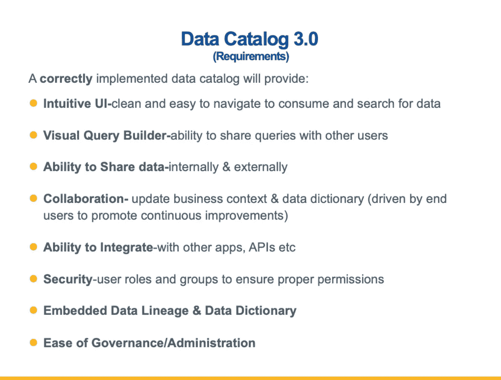
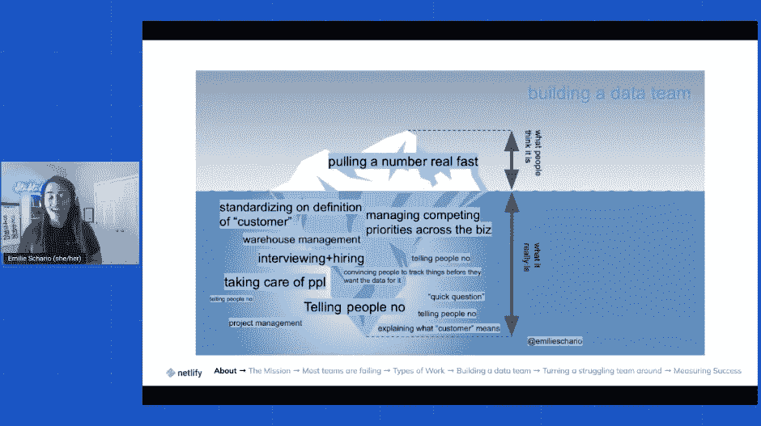

# 2022 年现代数据堆栈的未来

> 原文：<https://towardsdatascience.com/the-future-of-the-modern-data-stack-in-2022-4f4c91bb778f>

## 介绍 2021 年你应该知道的 6 大想法

迈克·科诺诺夫在 [Unsplash](https://unsplash.com/?utm_source=unsplash&utm_medium=referral&utm_content=creditCopyText) 上拍摄的照片

**本文 2023 版出来了！** [**在此阅读。**](/the-future-of-the-modern-data-stack-in-2023-b08c2aed04e2)

随着数据世界因假期而放缓，我有了一些休息时间来回顾和思考过去的一年。我不禁想，哇，这是多么美好的一年啊！

是只有我，还是数据在 2021 年经历了五年的变化？

现在是部分时间，一个月感觉就像一天和一年一样。你眨眨眼，突然就会有一个新的流行词统治数据 Twitter。风险投资资金和疯狂的创业融资的泛滥也是部分原因，它们为今年的数据之火推波助澜。

有了这么多的宣传，很难知道什么趋势会持续下去，什么会像它们出现时一样迅速消失。

这篇博客分解了你应该知道的关于进入 2022 年的现代数据堆栈的六个想法。

你现在可能知道这个术语，即使你不知道它的确切意思。“**数据网格**的想法来自**Thoughtworks 新兴技术主管**扎马克·德格哈尼**2019 年的两篇博客:**

1.  [如何从单一数据湖转移到分布式数据网](https://martinfowler.com/articles/data-monolith-to-mesh.html)
2.  [数据网格原理和逻辑架构](https://martinfowler.com/articles/data-mesh-principles.html)

其核心思想是，通过从集中式数据仓库和湖泊转移到由自助数据和“联合计算治理”驱动的“面向领域的分散数据所有权和架构”，公司可以变得更加数据驱动。

正如你所看到的，数据网格周围的语言变得复杂快速，这就是为什么不缺少"[什么](https://cnr.sh/essays/what-the-heck-data-mesh) [实际上](/what-is-a-data-mesh-and-how-not-to-mesh-it-up-210710bb41e0) [是](https://datakitchen.io/what-is-a-data-mesh/) [一个](https://www.starburst.io/learn/data-fundamentals/what-is-data-mesh/) [数据](https://www.jamesserra.com/archive/2021/02/data-mesh/) [网格](https://datameshlearning.com/intro-to-data-mesh/)？"文章。

自 2019 年以来，数据网格的想法一直在悄悄发展，直到 2021 年突然无处不在。仅在一年内，[**Thoughtworks Technology Radar**](https://www.thoughtworks.com/de-de/radar/techniques/data-mesh)就将 Data Mesh 的状态从“试用”转为“评估”。 [**数据网格学习社区**](https://datameshlearning.com/join-the-community/) 上线，他们的 Slack 小组在 45 天内获得了[1500 个注册](https://datameshlearning.substack.com/p/data-mesh-learning-slack-update-mar)。 [**Zalando**](https://databricks.com/session_na20/data-mesh-in-practice-how-europes-leading-online-platform-for-fashion-goes-beyond-the-data-lake) 开始谈论它如何转移到数据网格。

很快，热门话题就在 Twitter 上传来传去，数据领导者们争论着数据网格是革命性的还是荒谬的。

在 2022 年，我认为我们将会看到大量的平台重塑品牌，并以“终极数据网格平台”的身份提供服务。但问题是，数据网格不是一个现成的平台或服务。这是一个设计概念，其中包含一些精彩的概念，如分布式所有权、基于域的设计、数据可发现性和数据产品运输标准，所有这些都值得在您的组织中尝试实施。

因此，我的建议是:作为数据领导者，重要的是在概念层面坚持首要原则，而不是相信你很快就会在市场上不可避免地看到的炒作。如果一些团队(尤其是较小的团队)可以通过基于 Snowflake 和 dbt 构建的完全集中的数据平台实现数据网格架构，而其他团队将利用相同的原则在复杂的多云环境中整合他们的“数据网格”,我不会感到惊讶。

指标对于评估和推动公司增长至关重要，但多年来一直在挣扎。它们通常被划分到不同的数据工具中，在不同的团队或仪表板中，相同的指标有不同的定义。

2021 年，人们终于开始谈论现代数据堆栈如何解决这个问题。它被称为**度量层**、**度量存储库**、**无头 BI** ，甚至更多的名字我都无法在此列出。

它始于一月份，当时**基础案例**提出了“[无头商业智能](https://basecase.vc/blog/headless-bi)”，一种解决度量问题的新方法。几个月后，来自[模式](https://mode.com/)的 **Benn Stancil** 谈到了当今数据堆栈中的“[缺失指标层](https://benn.substack.com/p/metrics-layer)”。

那是事情真正开始的时候。四天后， [Falkon](https://www.falkon.org/) 的**莫娜·阿克毛**和 **Aakash Kambuj** 发表了关于制作度量标准[一等公民](https://blog.falkon.ai/why-metrics-should-be-a-first-class-citizen-in-a-modern-data-stack-2e8e5cdbdff2)和“[现代度量标准栈](https://blog.falkon.ai/the-7-traits-of-a-modern-metrics-stack-15403d488318)”的文章。

两天后，Airbnb 宣布它已经在建立一个名为 [**Minerva**](https://medium.com/airbnb-engineering/how-airbnb-achieved-metric-consistency-at-scale-f23cc53dea70) 的本土度量平台来解决这个问题。其他知名科技公司很快跟进，包括 LinkedIn 的[统一指标平台](https://engineering.linkedin.com/unified-metrics-platform)，优步的 [uMetric](https://eng.uber.com/umetric/) ，以及 Spotify 在其“[新实验平台](https://engineering.atspotify.com/2020/10/29/spotifys-new-experimentation-platform-part-1/)中的指标目录。

就在我们以为这股热潮已经平息的时候，**德鲁·巴宁** (CPO、 [dbt](https://www.getdbt.com/) 联合创始人)10 月份在 dbtcore 上开了一个 [PR](https://github.com/dbt-labs/dbt-core/issues/4071) 。他暗示 dbt 将在其产品中加入一个度量层，甚至包括 Benn 和 Base Case 的基础博客的链接。PR 爆发了，并重新引发了关于在现代数据堆栈中构建更好的指标层的讨论。

与此同时，一批早期创业公司已经开始争夺这一空间。 [**变身**](https://transform.co/) 大概是目前为止最大牌的了，不过 [**Metriql**](https://metriql.com/blog/introducing-metriql-open-source-metrics-store/) 、 [**Lightdash**](https://www.lightdash.com/) 、 [**Supergrain**](https://www.supergrain.com/blog/introducing-supergrain) 、以及 [**Metlo**](https://blog.metlo.com/announcing-our-metrics-store/) 也在今年推出。一些更大的名字也在指标层竞争，如 **GoodData** 进军 [Headless BI](https://www.gooddata.com/headless-bi/) 。

我对指标层最终成为现实感到非常兴奋。几个月前，来自 Fivetran 的 George Fraser 有一个不受欢迎的观点，即[所有的度量商店都将演变成 BI 工具](https://twitter.com/frasergeorgew/status/1468986410464002053?s=20)。虽然我不完全同意，但我确实相信没有与 BI 紧密集成的度量层不太可能变得普遍。

然而，现有的 BI 工具并没有真正地将外部指标层集成到他们的工具中…这使得这成为一个先有鸡还是先有蛋的问题。独立的度量层将努力鼓励 BI 工具采用它们的框架，并将被迫像多年前[旁观者被迫做的那样构建 BI。](https://twitter.com/frasergeorgew/status/1468993284554969088?s=20)

这就是为什么我对 dbt 宣布进军指标层感到非常兴奋。dbt 已经有足够的分布来鼓励至少现代 BI 工具(例如，预置、模式、Thoughtspot)深度集成到 dbt metrics API 中，这可能会给较大的 BI 玩家带来竞争压力。

我还认为度量层与转换过程如此紧密地交织在一起，以至于直觉上这是有意义的。我的预测是，我们将在 2022 年看到度量在更多的转换工具中成为一等公民。

多年来， **ETL** (提取、转换、加载)是数据团队填充系统的方式。首先，他们从第三方系统中提取数据，对其进行清理，然后将其加载到他们的仓库中。这很好，因为它保持了数据仓库的整洁有序，但这也意味着将数据放入仓库要花费很长时间。有时，数据团队只想将原始数据转储到他们的系统中，以后再处理。

这就是为什么许多公司几年前从 ETL 转移到 ELT(提取、加载、转换)。公司不是首先转换数据，而是将原始数据发送到数据湖中，然后针对特定的用例或问题进行转换。

在 2021 年，我们在这个想法上有了另一个重大的发展— **逆向 ETL** 。这个概念在二月份开始受到关注，当时 Astasia Myers(Quiet Capital 的创始企业合伙人)写了一篇关于反向 ETL 出现的文章。

从那以后，<https://hightouch.io/>**和 [**普查**](https://www.getcensus.com/) (两者都在 2020 年 12 月推出)掀起了一场风暴，因为他们一直在争夺反向 ETL 空间的所有权。人口普查局宣布，它在 2 月份筹集了 1600 万美元的 A 轮融资，并发布了一系列针对 Hightouch 的基准报告。Hightouch 在不到 12 个月的时间里三次加薪，总计 5420 万美元。**

**Hightouch 和 Census 已经主导了今年的反向 ETL 讨论，但是它们并不是这个领域中唯一的两个。其他值得注意的公司有 [**Grouparoo**](https://www.grouparoo.com/) ，[**head up**，](https://www.headsup.ai/)[**Polytomic**](https://techcrunch.com/2021/02/03/polytomic-announces-2-4m-seed-to-move-business-data-where-its-needed/)，[**ruder stack**](https://rudderstack.com/)，以及 [**Workato**](https://www.workato.com/) (他们在 11 月完成了一笔 2 亿美元的 E 轮投资)。 **Seekwell** 甚至在三月份得到了被 Thoughtspot 收购的[。](https://www.businesswire.com/news/home/20210331005210/en/ThoughtSpot-Acquires-SeekWell-to-Operationalize-Analytics-and-Push-Cloud-Data-Insights-to-Business-Apps)**

****

**我对解决现代数据堆栈中“最后一英里”问题的一切都感到非常兴奋。我们现在谈论的更多的是如何在日常运营中使用数据，而不是如何存储数据——这是一个令人难以置信的迹象，表明数据堆栈的基本构建模块(存储、转换等)已经变得多么成熟！**

**我不太确定的是，反向 ETL 是否应该是一个独立的空间，或者只是与一个数据摄取工具相结合，因为管道数据输入和输出的基本功能是如此的相似。像 Hevodata 这样的公司已经开始在同一个产品中提供摄取和反向 ETL 服务，我相信我们很快会在这个领域看到更多的整合(或更深入的走向市场合作)。**

****

**在过去几年中，围绕数据目录的争论是，“它们过时了吗？”很容易认为答案是肯定的。在几篇著名的文章中，Barr Moses 认为[数据目录已经死亡](/data-catalogs-are-dead-long-live-data-discovery-a0dc8d02bd34)，Michael Kaminsky 认为[我们不需要数据字典](https://locallyoptimistic.com/post/data_dictionaries/)。**

**另一方面，关于数据目录和元数据的讨论从来没有这么热烈过。数据星表太多了，以至于我们团队的 Rohan 创造了[thedatacatalog.com](https://thedatacatalog.com)，一个“星表的星表”，感觉既可笑又完全有必要。那么，到底是哪个——数据目录死了还是比以前更强大了？**

**今年，随着两个新概念的产生，数据目录获得了新生——第三代数据目录和活动元数据。**

**2021 年初，我为现代数据栈写了一篇关于[现代元数据的文章。我介绍了我们正在进入第三代数据目录的想法，这是对流行的老式内部数据目录的根本转变。这些新的数据目录围绕多样化的数据资产、“大元数据”、端到端数据可见性和嵌入式协作而构建。](/data-catalog-3-0-modern-metadata-for-the-modern-data-stack-ec621f593dcf)**

**Gartner**今年做出的一项重大举措放大了这一想法——放弃了元数据管理解决方案的魔力象限，代之以活动元数据的市场指南。为此，他们引入了“**活动元数据**”作为数据空间中的一个新类别。****

**有什么区别？老派的数据目录收集元数据，并将它们放入一个孤立的“被动”工具中，也就是传统的数据目录。主动元数据平台充当双向平台，它们不仅将元数据集中到单个存储中，就像一个[元数据湖](https://www.xenonstack.com/blog/metadata-lake-features-and-trends)，还利用“反向元数据”使元数据在日常工作流中可用。**

**自从我们第一次写第三代目录以来，它们已经成为关于什么是现代数据目录的讨论的一部分。我们甚至在 RFP 中看到了这些术语！**

****

***匿名 RPF 的片段。(图片由 Atlan 提供。)***

**与此同时，风险投资公司一直渴望投资这一新领域。随着全面加薪，元数据管理已经增长了一吨——例如**的**的[的 2.5 亿美元系列 G](https://techcrunch.com/2021/11/09/data-intelligence-company-collibra-brings-in-another-250m-to-more-than-double-its-valuation/) 、**的**的[1.1 亿美元系列 D](https://www.businesswire.com/news/home/20210603005254/en/Alation-Announces-110-Million-Series-D-to-Accelerate-Explosive-Growth) ，以及我们的[1600 万美元系列 A](https://techcrunch.com/2021/05/25/atlan-raises-16m-led-by-insight-partners-to-build-a-collaboration-hub-for-data-driven-teams/) at **Atlan** 。像 [**Stemma**](https://techcrunch.com/2021/06/02/stemma-launches-with-4-8m-seed-to-build-managed-data-catalogue/) 和 [**Acryl Data**](https://techcrunch.com/2021/06/23/acryl-data-commercializing-linkedins-metadata-tool-datahub-emerges-from-stealth-with-9m-from-8vc-linkedin-and-insight/) 这样的种子期公司也开始在现有开源项目上构建托管元数据解决方案。**

****

**数据世界将永远是多样化的，而人和工具的多样化将永远导致混乱。我可能有偏见，因为我毕生致力于在元数据领域建立一家公司。但我真的相信，让混乱的现代数据堆栈变得有序的关键在于我们如何使用和利用元数据来创建现代数据体验。**

**[Gartner](https://atlan.com/gartner-active-metadata-press/) 用一句话总结了这一类别的未来:“独立的元数据管理平台将从扩充的数据目录转向元数据‘随处’编排平台。”**

**2.0 代的数据目录是被动的、孤立的，而 3.0 代的数据目录建立在这样一个原则之上，即无论用户何时何地需要，上下文都必须可用。第三代目录将利用元数据来改进 Looker、dbt 和 Slack 等现有工具，而不是强迫用户使用单独的工具，最终实现智能数据管理系统的梦想。**

**虽然 2021 年该领域有大量的活动和资金，但我非常确定我们将在 2022 年看到一个占主导地位的真正的第三代数据目录(也称为[活动元数据平台](/the-anatomy-of-an-active-metadata-platform-13473091ad0d))的崛起。**

****

**随着现代数据堆栈成为主流，数据成为日常运营中更大的一部分，数据团队也在不断发展。他们不再是独立于公司其他部门工作的“IT 人员”。但这就提出了一个问题，数据团队应该如何与公司的其他部门合作？他们经常陷入“**服务陷阱**”——永无止境的问题和创建统计数据的请求，而不是通过数据产生见解和推动影响。**

****

***Emilie Schario 在数据团队工作的真实写照。(图片由 Atlan 转自*[*MDS con 2021*](/modern-data-stack-conference-mdscon-2021-the-top-5-takeaways-you-should-know-fc7ec163dea3)*)。)***

**2021 年， [Amplify Partners](https://amplifypartners.com/) 的 **Emilie Schario** 、 [Meltano](https://meltano.com/) 的 **Taylor Murphy** 和 [Stitch Fix](https://www.stitchfix.com/) 的 **Eric Weber** 谈到了打破数据团队这一陷阱的方法——将**数据团队重新思考为产品团队**。他们首先在一个关于本地乐观的博客上解释了这个想法，随后在会议上发表了精彩的演讲，如:MDS con T21，dbt 联合，以及未来数据。**

**衡量一个产品的标准不是它有多少功能或者工程师能多快地解决问题，而是它满足客户需求的程度。同样，数据产品团队应该以用户(即整个公司的数据消费者)为中心，而不是回答问题或构建仪表板。这允许数据团队关注体验、采用和可重用性，而不是特别的问题或请求。**

**这种对打破服务陷阱和围绕用户重新定位数据团队的关注，今年在数据界引起了共鸣。越来越多的人开始讨论建立“数据产品团队”意味着什么，包括大量关于雇佣谁以及如何设定目标的热门话题。**

****

**在 2021 年所有被炒作的趋势中，这是我最看好的一个。我相信，在未来十年，数据团队将成为组织结构中最重要的团队之一，为经济前沿的现代数据驱动型公司提供动力。**

**然而，现实是今天的数据团队陷入了服务陷阱，并且[他们的数据项目只有 27%是成功的](https://www.capgemini.com/gb-en/resources/cracking-the-data-conundrum-how-successful-companies-make-big-data-operational/)。我认为解决这个问题的关键在于“数据产品”思维模式的概念，其中数据团队专注于为团队的其他成员构建可重用、可复制的资产。这将意味着在用户研究、可扩展性、数据产品运输标准、文档等方面进行投资。**

****

**这个想法来自“**数据宕机**”，蒙特卡洛的**巴尔·摩西**在 2019 年首次谈到这一点时说，“数据宕机是指你的数据不完整、错误、丢失或不准确的时间段”。就是那些你在一个大项目结束后的第二天早上收到的电子邮件，说“嘿，数据看起来不太对…**

**多年来，数据停机已经成为数据团队正常生活的一部分。但现在，随着许多公司在运营的几乎每个方面都依赖数据，当数据停止工作时，这是一个巨大的问题。**

**然而，每个人都只是在问题出现时做出反应，而不是主动预防它们。这就是 [**数据可观察性**](/what-is-data-observability-40b337971e3e) —“监控、跟踪和分类事件以防止停机”的概念的由来。**

**我仍然无法相信数据可观测性这么快就从一个想法变成了现代数据堆栈的关键部分。(最近，它甚至开始被称为“数据可靠性”或“数据可靠性工程”。)**

**这个空间从不存在变成了一批公司的所在地，在 18 个月内总共筹集了 2 亿美元的资金。这包括<https://www.acceldata.io/newsroom/acceldata-raises-35-million-series-b>**[**Anomalo**](https://techcrunch.com/2021/10/28/anomalo-launches-with-33m-series-a-to-find-issues-in-data-sets-automatically/)[**big eye**](https://techcrunch.com/2021/09/23/bigeye-providing-data-quality-automation-closes-second-round-this-year-with-45m/)[**Databand**](https://techcrunch.com/2020/12/01/databand-raises-14-5m-led-by-accel-for-its-data-pipeline-observability-tools/)[**data fold**](https://www.businesswire.com/news/home/20211109005656/en/Datafold-Raises-20M-Series-A-To-Help-Data-Teams-Deliver-Reliable-Products-Faster)[**meta plane**](https://news.ycombinator.com/item?id=29226864)[**Monte**](https://barrmoses.medium.com/monte-carlo-raises-25m-series-b-to-help-companies-achieve-more-reliable-data-abf497368ee1)**[**Carlo**人们甚至开始创建新的“数据观察公司”名单，以帮助跟踪空间。****](https://barrmoses.medium.com/monte-carlo-raises-series-c-brings-funding-to-101m-to-help-companies-trust-their-data-a11f58036896)******

****

**我相信在过去的两年中，数据团队已经意识到提高生产力的工具不是必须的，而是必须的。毕竟，数据专业人员是你有史以来最受欢迎的雇员之一，所以他们不应该浪费时间在排除管道故障上。**

**那么，数据可观测性在未来会成为现代数据堆栈的关键部分吗？绝对的。但是，数据可观测性将继续作为其自身的类别存在，还是将被合并到一个更广泛的类别中(如活动元数据或数据可靠性)？这是我不太确定的。**

**理想情况下，如果您在一个开放平台中拥有所有元数据，您应该能够将它用于各种用例(如数据编目、可观察性、沿袭等等)。我去年在我关于元数据湖的文章中写了这个想法。**

**也就是说，今天，这些领域独立地需要大量的创新。我的感觉是，在我们看到未来几年的整合之前，我们将在 2022 年继续看到分裂。**

****

**有时可能会感觉混乱和疯狂，但今天是数据的黄金时代。**

**在过去的 18 个月里，我们的数据工具呈指数级增长。我们都对现代数据堆栈大惊小怪，这是有充分理由的——它比我们以前拥有的东西好得多。坦率地说，早期的数据堆栈已经支离破碎，而工具方面的这一巨大飞跃正是数据团队所需要的。**

**在我看来，数据世界即将出现的下一个“增量”是[现代数据文化堆栈](/its-time-for-the-modern-data-culture-stack-493036315ed2) —最佳实践、价值观和文化习俗，将帮助我们不同的数据人员有效协作，并在我们处理新的数据堆栈时提高我们的生产力。**

**然而，我们只能在解决了数据问题之后，才能考虑如何更好地处理数据。我们正处于让现代数据堆栈步入正轨的风口浪尖，我们迫不及待地想看看 2022 年会带来哪些新的发展和趋势！**

****还在考虑 2021 年吗？看看我去年在现代数据栈** **上的** [**五大必读博客。**](/2021-roundup-the-top-5-must-read-blogs-on-the-modern-data-stack-3d2d05fada77)**

****发现此内容有帮助？在我的时事通讯《元数据周刊》上，我每周都写关于活动元数据、数据操作、数据文化和我们的学习建设的文章。** [**在此订阅。**](https://metadataweekly.substack.com/)**