# 语音助手的未来:早期的研究趋势是什么？

> 原文：<https://towardsdatascience.com/the-future-of-voice-assistants-what-are-the-early-research-trends-dc02215fe2aa>

## 在 YRRSDS 和 SIGdial 进行了五年的博士讨论

> 如果你不想读整篇文章，你可以略读最精彩的部分。它们的格式就像这两个句子，以突出它们。

对话式人工智能中出现了新的有趣领域，而其他领域则从讨论中淡出。为了分析早期的研究趋势，我决定探究从 YRRSDS [2018](https://sites.google.com/site/yrrsds2018/) 、 [2019](https://sites.google.com/site/yrrsds2019/) 、 [2020](https://sites.google.com/view/yrrsds2020/) 、 [2021](https://sites.google.com/view/yrrsds-2021) ，到最近的[2022](https://sites.google.com/view/yrrsds2022/home)(9 月 5 日和 6 日)的会议记录和圆桌讨论笔记。

# 什么是 YRRSDS？

年轻研究人员口语对话系统圆桌会议( [YRRSDS](http://www.yrrsds.org/) )是一个年度开放论坛，供早期职业口语对话研究人员讨论该领域的当前问题，分享工具，激发新想法。

我第一次参加 2019 年的 YRRSDS，非常喜欢它，所以我自愿组织 YRRSDS 2021 和 2022。这是一个认识志趣相投的人、相互启发、结交新朋友的绝佳场所。

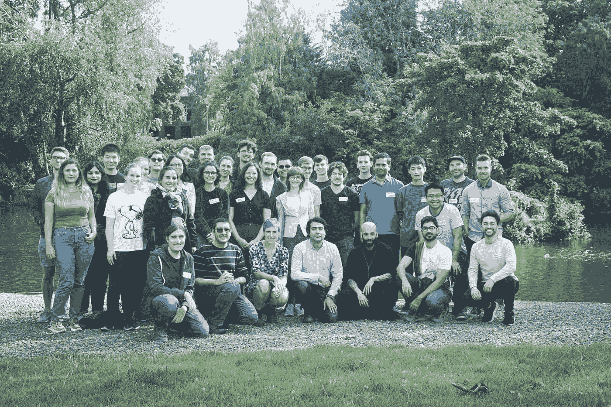

YRRSDS 2022 在苏格兰爱丁堡 Heriot-Watt 大学的合影(照片由 vojtch hude ek 拍摄)

所有与会者提交一份两页的立场文件，概述他们的研究，感兴趣的主题，他们建议的讨论领域，以及他们认为口语对话系统(SDS)研究在中期未来的发展方向。

如果你想了解更多关于参加 YRRSDS 的信息，请滚动到底部。也有很多来自 YRRSDS 的照片和一些来自 SIGdial 的照片。

感谢[阿拉娜·艾](https://alanaai.com/)、[亚马逊科学](https://www.amazon.science/)和[苏格兰 SICSA](https://www.sicsa.ac.uk/)

# 永恒的趋势

我将从过去五年中持续存在的热点话题开始。尽管这些话题依然不可动摇，但随着时间的推移，讨论的*内容*已经发生了变化(括号中的数字是讨论一个话题的年份)——让我们从大的话题开始探讨。

> *注意:整篇文章中的观点是 YRRSDS 参与者的集体观点，不一定是我个人的观点。*

## 道德和隐私(18、19、20、21、22)

几年前最大的伦理讨论是数据隐私，主要有两个原因。第一个是将于 2018 年年中实施的 GDPR。大学和他们的道德委员会必须非常小心，以确保他们理解和遵守它，以避免法律后果。这给 2018 年和 2019 年的早期研究人员带来了很大的压力，他们不知道如何与之合作。第二个原因是缺乏经济高效的设备上处理或安全的云解决方案——阻碍了研究。

> *数据隐私绝不是‘解决’了的问题，但 GDPR 意识的高涨和行业压力确实改善了这个问题。云平台提供了更多的安全选项，设备上的处理也更便宜。可悲的是，像《社会困境》和《伟大的黑客》这样的纪录片出现了，引起了人们的轻微关注，然后在没有真正改变行为的情况下从讨论中消失了。似乎社会愿意用隐私来换取便利，这也减少了考虑和讨论它的动力。*

我们开始考虑是不是应该把 SDSs 做得更**人性化**？一位参与者分享了一个故事，他的一个亲戚会给旧的“会说话的钟”打电话(人们会给 123 打电话，自动语音会告诉他当前时间)。尽管与今天的标准相比，时钟的声音听起来像机器人，但这个人认为在另一端是一个人。他们会感谢时钟，为打扰他们而道歉，并说“我现在得走了”之类的话。最近，商店员工认为 [Google Duplex](https://www.youtube.com/watch?v=D5VN56jQMWM) 是一个人——即使他们没有明确询问，这可以吗？

> *我们假设用户足够精通技术，能够将我们的系统与人类区分开来。上述例子表明，情况并非总是如此，随着语音助手专为老年人设计并应用于医疗保健领域，这个问题变得更加棘手*。

今年最热门的话题是偏见。**我们都有偏见**，在我们的语言模型中，我们的个人偏见被聚合成文化/社会偏见。一旦发现，我们可以在下游任务中减轻这些有问题的偏见——但是发现它们是困难的！这尤其困难，因为我们自己甚至没有意识到我们的大多数偏见，而且社会规范会随着时间而变化。

> *由于我们的语音助手存在偏见，媒体喜欢挑起“争议”,他们对创作者进行了大量负面报道。我们讨论过，这并不完全公平，因为它们只是反映了我们的社会——事实上，它们可能是我们揭示当今偏见的最佳工具之一。*

讨论的主要解决方案是**透明度**。我们必须强调:

*   数据是如何收集的？(当面还是网上？人们需要笔记本电脑或智能手机吗？该系列在哪里做广告？是从某个吸引某些用户群体的网络论坛上刮来的吗？).
*   数据是从谁那里收集的？(人口统计数据，如性别、年龄、居住地区的财富和出生国家，因为不同国家的口头反馈不同，学生通常是国际学生)。
*   谁给数据做了注解？(特定大学的学生？是一家公司吗？注释者的人口统计数据是什么？).
*   你的团队中有谁？(是否存在年龄、阶级或性别偏见？这在你的领域会是一个问题吗？你怎么知道是还是不是？也许你排除了某些残疾人，因为它没有被考虑？).

> 不可能有完全无偏见的数据集，因此透明度对于揭示偏见和促进进一步的科学研究至关重要。 ***大学和大型组织阻碍了 SDS 研究*** *在数据收集期间收集人口统计数据。大学应该停止专注于阻止关键研究，开始支持收集数据的安全传播(例如在* [*CHILDES 文集*](https://childes.talkbank.org/) *)。*

由于要赢得对话挑战和发表论文，有时道德讨论会被搁置，以便在特定指标上取得更快的进展。希望随着论文提交中包含伦理声明，以及更多有伦理意识的研究人员签署评论，这种发表或灭亡的文化将逐渐改变，以包括伦理考虑。

YRRSDS 2019 横幅

## 多模态(18、19、20、21、22)

五年前，“多模态”讨论包括语音+手势和/或凝视信息。2019 年有一个简短的讨论，内容是不仅要监控用户的目光，还要产生目光(在这个特定的对话中使用 Furhat 机器人)，但这发生了巨大的变化。在 2020 年，我们将**理解并生成**使用:

*   演讲
*   手势
*   情绪
*   凝视
*   副语言线索
*   韵律学
*   眼睛颜色(仅限一代，例如红色机器人眼睛显示愤怒)

后来这个列表扩展到包括:

*   文本
*   面部暗示(点头、困惑时皱眉等)
*   环境(例如物体检测)
*   更多手势(用手生成，用机器人生成全身)
*   触摸(按钮、双指滑动等)

随着所讨论模态的爆炸式增长，各种各样的问题出现在讨论中，比如**如何处理所有的输入数据**——只是把它们连接起来？也许加权某个模态更重要？有很多关于多模态融合的工作，因为这并不简单。每种模式都有自己的复杂性和挑战。例如，语音包含不流畅，沉默很重要，面部暗示依赖于文化，儿童产生不同的副语言暗示，ASR 错误仍然发生，物体检测错误也是如此，等等。然后，生成需要大量的数据，这些数据在所有语言和文化中都不可用。

> *我们不需要每个领域应用都有一个“超级模态”SDS。添加模态的额外计算成本通常是不必要的。像情绪识别这样的具体化代理和任务显然受益于多种形式(当它们被添加时，任务性能会有巨大的提升)，但考虑一下在你的领域中是否值得。*

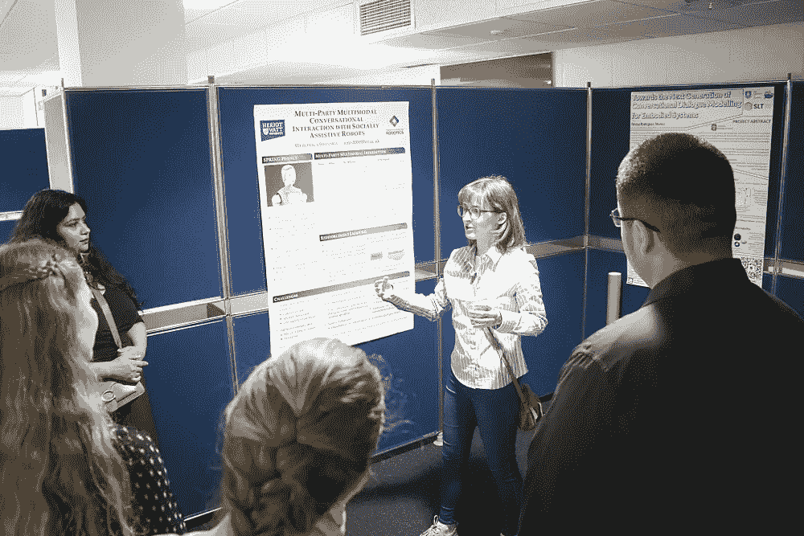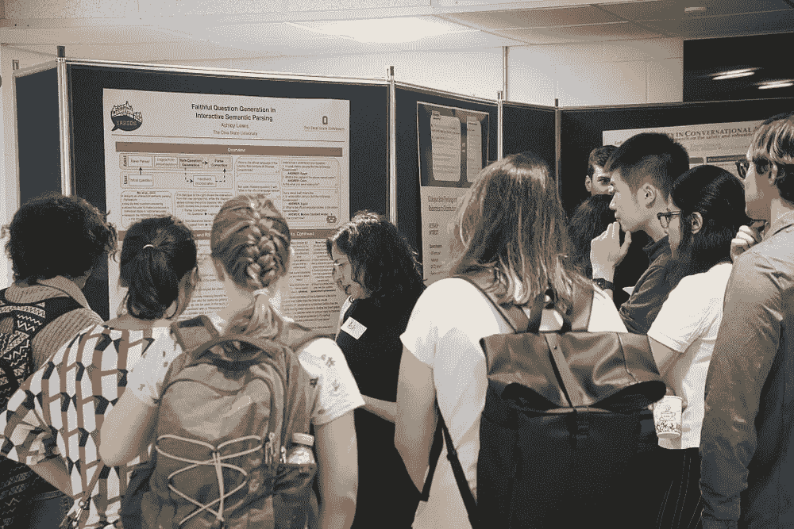

YRRSDS 2022 海报会议(照片由 vojtch hude ek 拍摄)

## 评价(18、19、20、21、22)

几年前的评估讨论集中在**开放域** SDSs 上，因为它们极难自动评估。在没有约束性任务的情况下，使用主观指标(感知的自然性、相关性、是否引发积极情绪等等)。所讨论的唯一客观指标是以圈数表示的参与度。这种指标组合很可能是受 2017 年 Alexa Prize 社交机器人挑战赛的启发。随着基于任务的 SDSs 越来越受欢迎，现在更多地讨论自动度量(参见“应用领域”一节)。

> *ConvAI challenge 表明，在这些自动指标上取得更高的分数并不一定会产生令用户满意的 SDS。获胜的系统并没有被人类首选，但是这些* ***人类评测*** *既昂贵又耗时。此外，我们甚至不能同意人类的判断是否是一个好的黄金标准！*

人类注释者往往不同意或不知道系统能做什么，这使得结果很难重现。人们还会受到外部因素的影响，这些因素可能对部署一个完成的系统之前的最终评估有用，但对一个实验却没用。人们会受到礼貌、事实正确性、道德反应(例如“我是否应该卖出我的股票”)、同理心、热情、凝视和面部表情等的影响...

> *一个* ***具体化的*** *智能体可能会进一步影响用户的意见(机器人可能小而可爱，也可能大而有权威)。这种主观性是混乱的，所以也许可以选择一组加权的自动评估指标来更好地反映真实世界的性能？这些可以包括像* [*USR*](https://aclanthology.org/2020.acl-main.64/) *、词汇多样性、* [*和中间假设的质量*](https://aclanthology.org/2020.coling-main.312.pdf) *这样的指标。*

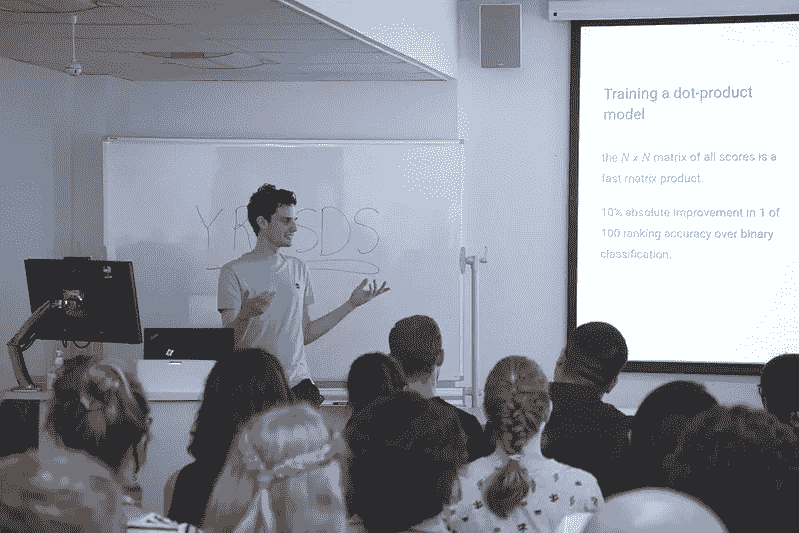

YRRSDS 2022 上苹果 Siri 的 Matt Henderson(照片由 vojtch hude ek 拍摄)

# 上升趋势

关于庞然大物的讨论已经过时了。在阅读 YRRSDS 会议录时，一些主题最近在早期 SDS 研究中变得流行。这些对于该领域来说并不是全新的话题，而是当前人们经常谈论的话题:

## **应用领域(21，22)**

更多的早期研究人员现在正致力于在非常特殊的环境中改进 SDSs。随着客户服务聊天机器人和开放域语音助手在行业中的应用越来越多，研究讨论也涉及到更多不同的应用——通常是**具体化**。例如:SDSs 帮助养老院中的老年人，与自主水下航行器互动，帮助残疾人，辅导非母语人士，就心理健康问题提供建议，教授儿童社交技能，心理治疗等…

这些领域有巨大的潜在利益。当人们与 SDS 互动，教他们一些东西或询问让他们担心的事情时，他们不会那么担心在父母、老师或同龄人面前“看起来很傻”。孤独感可以部分减少，有视觉障碍的人可以问一些关于他们周围环境的问题(例如[烹饪](https://dl.acm.org/doi/10.1145/3462244.3481000))。

当然也讨论了许多风险。如果代理人提供糟糕的建议，心理治疗是极其敏感和潜在有害的。

> *存在用于评估一般客户服务/开放领域 SDSs 的大量数据集，但这些数据集并不存在于每个特定领域。对于像今天正在研究的那些敏感的和私有的应用程序来说尤其如此。危险在于，研究人员将使用一般数据集来衡量在危险环境中部署的模型的改进。*

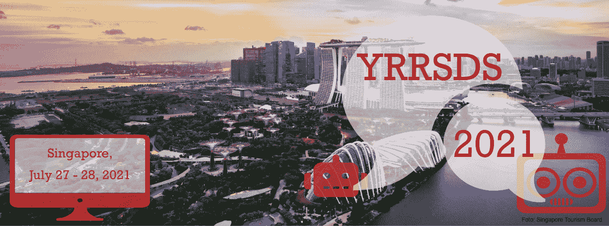

YRRSDS 2021 横幅

## 数据收集(21，22)

早期 SDS 研究人员工作的更广泛、更具体且通常更敏感的领域带来了一个巨大的挑战——由于现有资源有限，数据收集。请参见上面的“道德和隐私”部分，了解相关的道德批准、偏见和隐私挑战。

> ***人在不同的领域表现不同*** *。例如:当人们在讨论保险时使用与金融相关的术语时，词汇会发生变化，某些用户群体会产生不同于一般人群的言论(例如，儿童或有认知障碍的人***)。因此，大型通用数据集不适合评估在许多特定领域研究中使用的 SDSs。YRRSDS 2022 的大多数参与者都在构建自己的资源！**

*同意是一个有争议的话题。在获得弱势用户群体(例如[有认知障碍的人](http://www.lrec-conf.org/proceedings/lrec2020/workshops/LEGAL2020/pdf/2020.legal2020-1.4.pdf))的同意方面存在明显的问题，但由于同意，一些研究人员无法获得他们需要的数据。一些主题，如犯罪检测和减少滥用，要求人们非常公开地与 SDS 互动。获得同意的行为本身会改变用户的行为，因为他们知道人们会捕捉到他们的互动——他们会更少生气，更少辱骂，并且会避免咒骂或提出源于性别偏见的请求(例如，“叫我爸爸”)。道德委员会通常不允许你“欺骗”或“误导”人们，那么我们如何从同意的成年人那里收集这些数据呢？*

*多模态研究的增加再次增加了数据收集的复杂性。几个模态中的每一个中的数据必须被独立地注释，然后准确地对齐，这很难做到(拍板在电影制作中使用的一个原因)。匿名化也更加困难，模糊面部等简单技术往往会使收集的数据无法使用(例如情绪检测、视线跟踪、使用面部暗示等)。*

> **对于* ***多语言*** *低资源语言使用、* ***多方*** *SDSs、* ***增量*** *系统，以及上面讨论过的有问题的应用领域，数据集的获取极其困难。有时它们甚至存在，但创建者没有得到同意或批准与其他研究人员共享数据…这在一般情况下是至关重要的，但特别是在敏感领域。收集数据时，确保在伦理批准和同意书中包含* ***数据共享*** *(您可以通过 TalkBank、DementiaBank 等安全地共享数据……)。数据集管理通常需要数年时间，因此仅将它用于一两篇论文是一种耻辱。**

*由于所涉及的障碍、时间和成本，讨论通常会导致避免数据收集的潜在途径。**数据效率、**增强和引导正因为这个原因而成为越来越受欢迎的话题(我预测这些将很快成为他们自己的圆桌讨论)。*

> *为了衡量我们在某些领域的进展，必须更加重视数据收集，对其进行更多的规划，并在项目预算中加以说明。*

*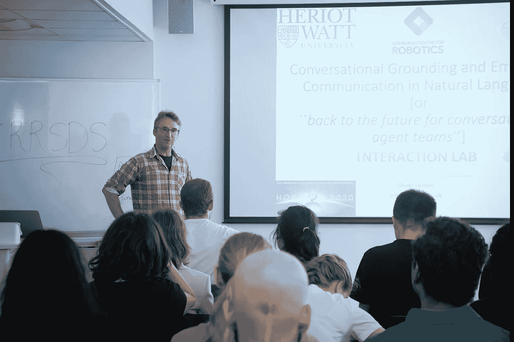*

*YRRSDS 2022 的 Heriot-Watt 大学的 Oliver Lemon(照片由 vojtch hude ek 拍摄)*

## *跨学科合作(21，22)*

*随着收集特定用户群数据的压力越来越大，协作成为项目成功的关键之一。许多 YRRSDS 2022 参与者甚至以前在另一个领域接受过培训，然后过渡到 SDSs 工作。许多其他人报告说，他们直接与团队和实验室中其他学科的顾问一起工作。*

> *如今，在攻读博士学位时，人际关系网被认为是一项重要的技能，它让寻找潜在的合作者变得更加容易。提高你自己的知名度甚至会增加别人联系你的机会！类似[*Twitter*](https://twitter.com/Addlesee_AI)*[*LinkedIn*](https://www.linkedin.com/in/angusaddlesee/)*，播客，以及* [*写作介质*](https://addlesee.medium.com/) *等渠道都有建议(提示提示，随意关注我)。你也可以尝试参加其他领域的会议，这对我个人很有效。***

**协作有明显的好处。例如，其他研究人员可以揭示你正在使用的任何过时的技术，但它并不都是黄金。可能存在资金目标冲突，并且“专家”必须接受他们并不了解每个主题的所有内容…与行业的合作也带来了新的挑战。企业希望专注于稳定产品的实现，而不是出版物。学术界通常更看重评估指标优化，而不是延迟和成本等业务指标**

**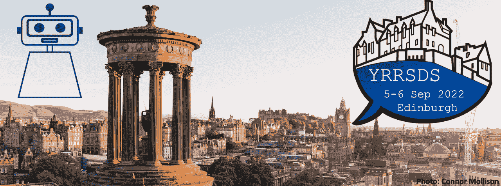**

**YRRSDS 2022 横幅**

## **上下文和知识表示(21，22)**

**越来越多的 YRRSDS 参与者发现，简单的对话表示(如填槽)不足以代表他们的现实世界应用。讨论了更多的层次和时间表示结构，但是这些复杂的结构当然更难学习。**

> *****知识图*** *在研究和行业中蓬勃发展，尤其是表示世界知识(讨论了类似*[*Wikidata*](https://www.wikidata.org/wiki/Wikidata:Main_Page)*和*[*DBpedia*](https://www.dbpedia.org/)*的资源)。挑战在于将“说了什么”映射到一个图的本体**——特别是对于词汇不同的面向任务的应用程序。***

**然而，吸收和巩固*内部*知识是一个非常不同的挑战。我们可以了解用户行为，从他们的故事中学习(有点像[黑镜集](https://en.wikipedia.org/wiki/Be_Right_Back))，或者从与用户的互动中学习关于世界的规则(这是受克里斯·霍维斯当天早些时候在 YRRSDS 2022 上的主题演讲的启发-见下文)。**

> *****对话语境*** *可以变得相当庞大，尤其是在多模态或多方域中。我们的模型目前将整个上下文作为输入，我们只是让注意力来处理它。为了在不牺牲性能的情况下降低计算成本，YRRSDS 的讨论指出，场景图在计算机视觉中用于“概括”模型的输入。对于语言来说这是可能的，但是要确定什么是“相关的”就更加困难了。***

****

**来自哥德堡大学的克里斯汀·霍维斯摄于 YRRSDS 2022**

## **澄清和修复(21，22)**

**澄清是用来建立共同基础的，例如:
- **A** :“想下周一见面吗？”
-**B**:“21 号对吗？”
- **A** :“不，就是*这个*周一，我们 28 号见”**

**但是它们也用来引出额外的信息，例如:
- **A** :“你能抓住红色夹克吗？”
- **B** :“左边那个？”
- **答**:“哦对不起，是的”**

> **传统上，SDSs 会反复向用户澄清他们的理解，以避免完成错误的操作。这使得 ***令人沮丧*** *然而，它基本上是鹦鹉学舌，每隔几圈就把用户说的话反馈给他们。在过去几年的 YRRSDSs 中，已经讨论了更智能的检测何时需要澄清或维修的方法。这将允许我们的 SDSs 以更加自然和流畅的方式启动澄清。***

**其中包括:**

*   **通过两三个稍微调整的模型从语义上解析用户的话语。当解析结构的一部分不同时，我们的系统可以启动对意义表示的特定部分的澄清。**
*   **训练我们的语义解析模型，如果它识别出话语未被指定(受机器人技术的启发)，则输出“未知”标签。**
*   **使用像眉头紧锁这样的面部暗示来表明用户感到困惑，需要修复。**
*   **结合 SDSs 理解使用知识图。如果理解与 Wikidata 的知识或**本体**不匹配(例如“巴黎的生日是什么时候？”)，需要澄清。**
*   **使用内部构建的知识图表检查用户是否有不寻常的要求(例如，要求比平时早 2 小时被叫醒——最好询问并确认)。**

> **当 SDS 理解他们时，人们会改变他们的讲话。他们清除自己说话中的不流利之处，并在某些地区(如苏格兰)软化他们的口音。然而，他们不是很有耐心，很快就会变得非常沮丧。人们通常会与其他人类澄清三次，然后礼貌地放弃或只是假装理解。对其他人的这种耐心可能是因为人们接受对困惑的共同责任。然而，当与 SDSs 交互时，人们把所有的责任都推给了系统——因为不理解它是愚蠢的。关于澄清和修复策略的进一步工作应该会减轻这种挫折感并提高可信度。**

**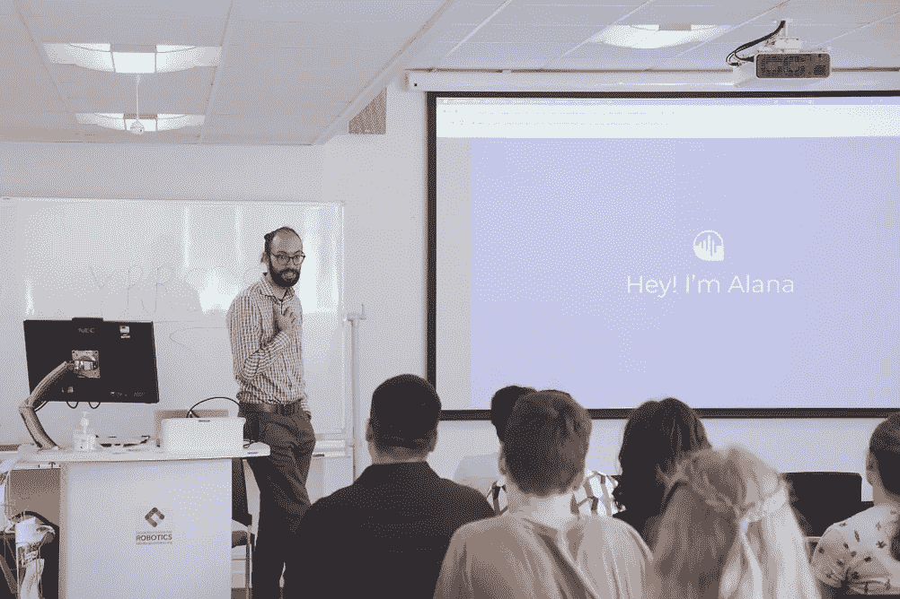******

**来自 Alana AI 的 Ioannis Konstas 和 Arash Eshghi 在 YRRSDS 2022(照片由 vojtch hude ek 拍摄)**

## **语言学理论(22)**

**我认为这是早期 SDS 研究人员中最令人惊讶的趋势之一，但我们在 YRRSDS 2022 上有一个完整的语言学理论圆桌会议。这是为什么呢？**

> **正确有效地传达“意思”很难——真的很难！例如，有关于不同笑的不同含义的完整的博士论文(见 Vladislav Maraev 或 Chiara Mazzocconi 的工作)。我们的言语是如此细致入微，我们的视觉交流也是如此，然后我们还会不流利地说出**并犯错误。* [*Google Duplex 向我们展示了*](https://www.youtube.com/watch?v=D5VN56jQMWM) *如何生成这些素材，使得 SDS 的输出更加真实。随着这种已被证实的使用优势以及多模态和医疗保健领域(人们说话更加不流利)的增加，我们看到人们对“在哪里”和“为什么”使用特定现象的研究兴趣增加。****

**有人指出**语言注释方案**非常复杂(比如[ISO 24617–2](https://www.iso.org/standard/76443.html))。这些方案涵盖了我们作为 SDS 研究人员想要的一切，但还不止这些。围绕我们是否应该为我们的领域创建一个稍微简单一点的版本，进行了长时间的讨论。**

**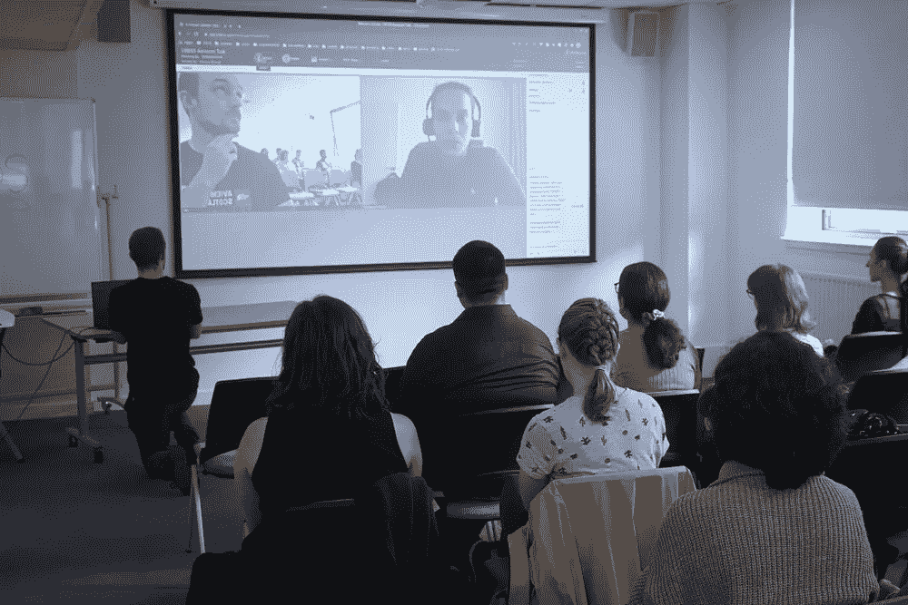******

**YRRSDS 2022 上亚马逊 Alexa 的 Saranya Govindan(照片由 vojtch hude ek 拍摄)**

## **大型语言模型(20，21，22)**

**虽然看到上面的语言学理论可能会令人惊讶，但在这里看到大型语言模型(LLM)绝对不会令人惊讶。当然，我们主要讨论了转换器模型，因为它们继续主导着从语义解析到 NLG 和语音合成的任务。**

> *****变形金刚*** *当然很出彩，但应用到对话中就不完美了。他们通常很难有效地利用对话历史，或者察觉到上下文的变化——但是还有一个更大的问题。虽然这些模型近似一个好的对话*看起来像*，但是它们不能帮助用户达到他们的* ***目标*** *！***

**变压器似乎也不能很好地概括 SDSs。对话数据在领域方面是有偏见的，所以 LLM 在通过对话预订东西方面工作得很好——但这不一定转移到处理关于管理焦虑的对话。例如，笑的含义在不同的上下文中可能有很大的不同。系统的反应好笑吗？用户是在讽刺吗？或者他们在谈论他们的担忧时会紧张地笑吗？**

> **如前所述，人们对系统错误非常敏感。这不利于用户是否乐于使用 SDS，以及他们是否信任它。 ***信任*** *如果 SDS 产生幻觉产生事实上不正确的反应，信任就被完全抹杀。这在医疗保健等更敏感的领域至关重要，在这些领域中，事实上不正确的响应可能会对用户造成伤害(例如，为视障用户设计的语音助手)。在这些领域中，更可控的基于规则的系统仍然是更可取的——至少对于响应生成来说是这样。***

**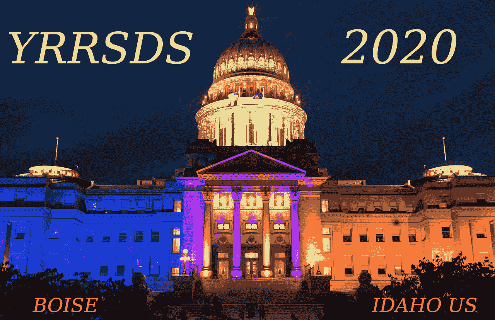**

**YRRSDS 2020 横幅**

## **个性化、个性和用户体验(20、21、22)**

**这些年来，我们似乎希望进一步为每个用户个性化我们的 SDS，并发展我们 SDS 的个性本身，以改善用户体验。**

**如上所述，大型语言模型是在通用数据集上训练的，这使得很难个性化。例如，这个模型知道美国和英国对“一楼”的理解不同吗？同样，在某些文化中，关于保险的对话也非常不同，SDS 为错误道歉可能是“承认有罪”,在美国可能会引发法律问题。这就需要大量的私人用户数据。**

> ***人们强调，随着个性化和个性的提高，未来(如果不是现在)社会发展战略的关键是将自己确定为非人类。* ***宠物化身*** *在这里可以有所帮助，因为它们不是人类，没有性别，并且被认为和人类化身的代理人一样有能力。***

**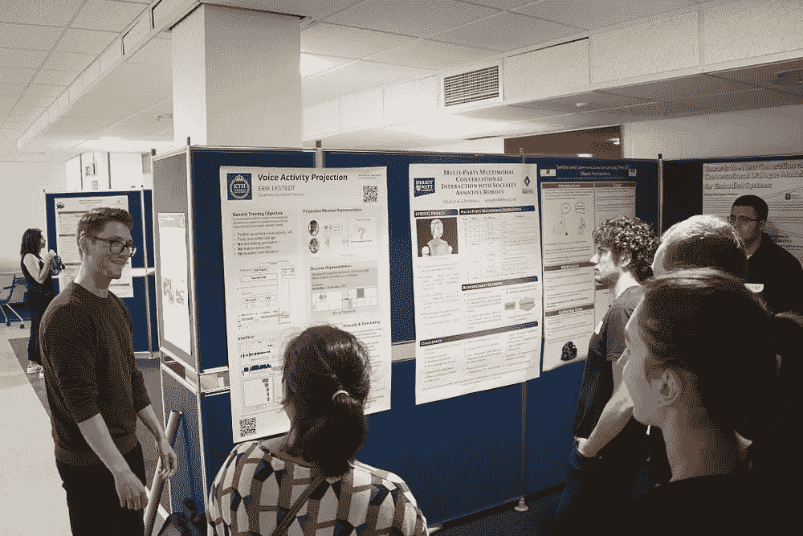****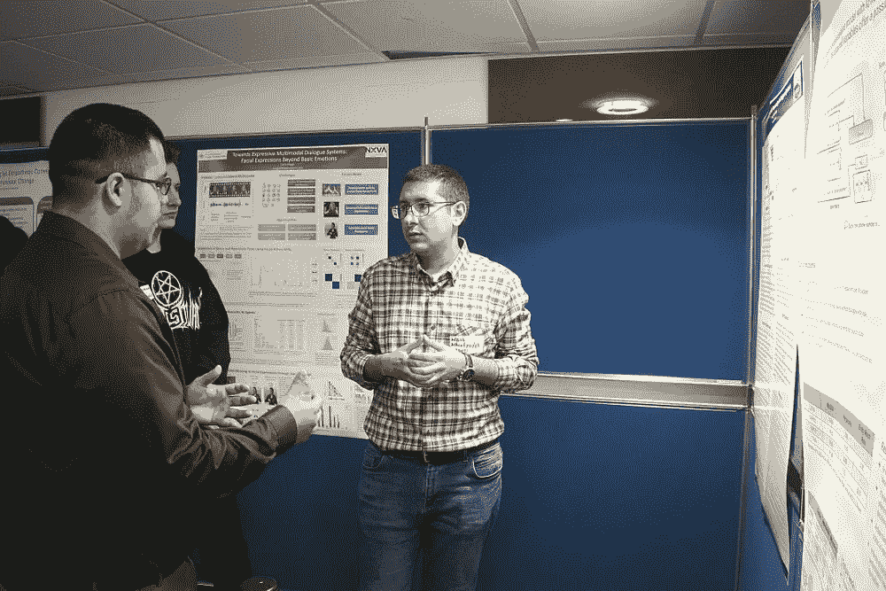**

**YRRSDS 2022 海报会议(照片由 vojtch hude ek 拍摄)**

## **可解释人工智能(21，22)**

**随着我们的模型变得更加复杂，我们描述他们为什么做出某个决定的能力变得更加困难。研究人员相信严格的评估，即使模型不能“解释”自己。例如，计算机视觉模型胜过训练有素的医生试图在扫描中发现癌症的早期迹象。然而，医生可以解释为什么他们认为你有或没有癌症，他们可以通过他们的推理和你交谈。**

> ***医疗、法律和金融领域的决策者不喜欢把钱和信任放在一些他们不了解的* ***黑箱*** *里。他们更喜欢依靠训练有素的人——即使他们确实犯了更多的错误。这主要推动了可解释的人工智能研究。***

**我们到底想解释什么呢？我们如何知道一个模型是否正确地解释了它自己？如果*我们*甚至不知道解释是否正确，决策者会怎么做？这有关系吗？真正好的对象检测模型可以在没有任何解释或说明的情况下运行，如果模型解释不正确，会有巨大的后果吗？**

> ***我们的结论简短而简单:如果一个模型有助于现实世界的决策，或者有* ***社会影响*** *，可解释的人工智能技术应该被应用。***

# **下降趋势**

**最后，我确定了几年前流行或大讨论的几个主题，但这些主题在最近几年已经消失了:**

## **订婚(19)**

**显然，今天的研究人员仍然希望他们的系统具有吸引力，但讨论已经转移到个性化和个性上。2019 年对参与进行了彻底的讨论，出人意料地包括了开放域和基于任务的系统。**

**旧系统依赖于更多基于规则的方法，这导致了重复的交互，甚至是对话循环。随着时间的推移，用户与系统的交流越来越多(例如:工作中或家中的助理)，他们将很快听到每个**试探性的**响应。“酷”的新语音助手变得陈旧和重复，无法维持用户的注意力或使用。这刺激了关于敬业度的讨论。**

**今天的系统经常使用**神经**反应生成模型，可以带着感情和细微差别说话，可以用无数种方式表达句子。因此，这个特殊的订婚问题不再是一个大问题。我们现在更担心这些模型的事实正确性，并赋予它们适合特定领域的个性(例如，移情治疗师)。**

> **在开发基于任务的系统时，我们也不用担心同样的敬业度。事实上， ***长期参与*** *如果交互能够保持短暂的话是有所改善的——允许用户高效地完成他们的* ***目标*** *。***

****

**YRRSDS 2018 横幅**

## **镜像和模仿用户(18，19)**

**最后，较老的 SDS 在交互时更像机器人。无论是对话的流程，还是合成语音本身。人们不喜欢机器人的声音、发错音或静态遵循固定路径的对话。这导致研究 SDS 模仿和镜像用户。**

> **模仿被用来增加用户对系统的共鸣。人们还努力模仿用户的词汇和口音来建立信任……今天，我们会认为这个 ***在伦理上涉及*** *(也很难评估)，这是在 2019 年提出的。研究人员问最终目标是什么——是建立虚假的信任和与用户的“纽带”吗？为什么？大概是为了卖东西或者说服用户。***

# **你想参加 YRRSDS 2023 吗？**

**如果你喜欢阅读这些讨论，我建议留意 YRRSDSs 的下一次论文征集(它通常与 SIGdial 搭配使用)。如果你愿意，你可以关注 YRRSDS 的推特账号。**

**然而在 YRRSDS 发生了什么？以下是一些进一步的信息:**

**人们提交 2 页的立场文件，描述他们的工作，他们的兴趣，建议的讨论主题，以及他们对 SDSs 未来的想法。每个与会者都可以展示一张海报，并参加圆桌讨论(关于立场文件中的热门话题)。**

****组织者**本身都是早期 SDS 研究人员！这是 2022 团队(他们都和其他人一起提交和展示了作品):**

****

**爱丁堡 YRRSDS 2022 组织者(照片由 vojtch hude ek 拍摄)**

**我们通常也会邀请一些主题演讲人。他们的谈话经常启发一些圆桌讨论的方向。今年我们有三位出色的演讲者和两次行业讲座！**

**最后，YRRSDS 与 SIGdial 配置在一起，所以一旦我们交了朋友并就我们的领域进行了令人兴奋的讨论，我们就可以享受会议了！**

******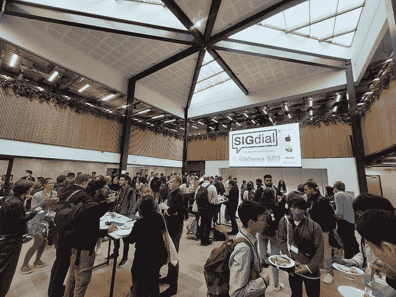****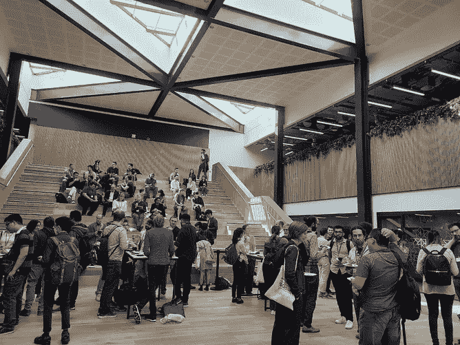**

**来自 SIGdial 2022 的照片-更多关于 SIGdial 的推特**