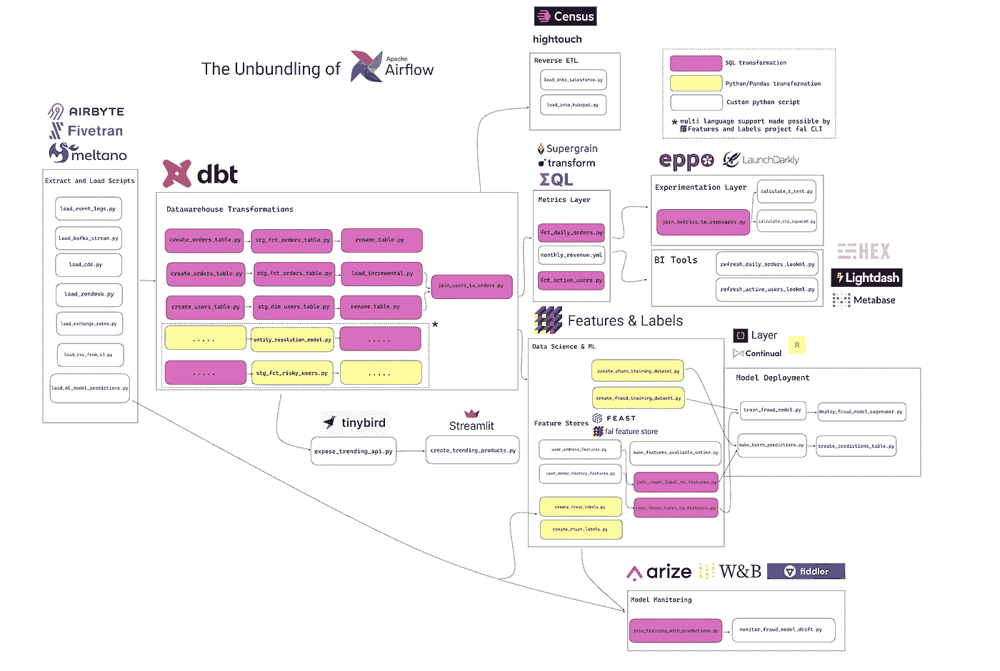
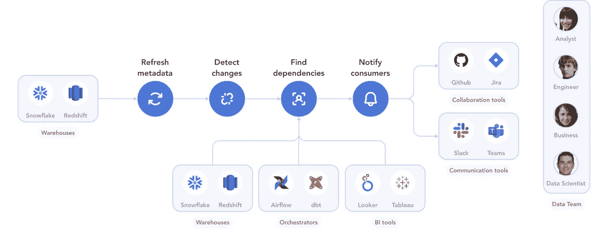

# 大数据辩论:分拆还是捆绑？

> 原文：<https://towardsdatascience.com/the-great-data-debate-unbundling-or-bundling-7d7721ee8514>

## 感谢“Bundlegate”，这是疯狂的几个星期。事情是这样的，我想我们要去哪里。

巴克罗姆·图尔萨诺夫在 [Unsplash](https://unsplash.com/?utm_source=unsplash&utm_medium=referral&utm_content=creditCopyText) 上拍摄的照片

在数据推特上，这是一个疯狂的几周，又一个新的热门辩论。

当我躺在床上辗转反侧，思考现代数据堆栈的未来时，我不禁感到了写另一篇观点文章的压力；)

# 到底发生了什么？

如果你是 MIA， **Gorkem Yurtseven** 以一篇名为 [**解开气流**](https://blog.fal.ai/the-unbundling-of-airflow-2/) 的文章引发了这场争论。

他解释说，一旦小产品成为大平台，它们就适合分拆，或者将其组件功能抽象为更小、更专注的产品。Craigslist 就是一个很好的例子——它的社区部分被 Nextdoor 接管，个人信息被 Tinder 接管，论坛被 Reddit 接管，出售被 OfferUp 接管，等等。

Gorkem 认为，在数据世界中，同样的事情正在气流中发生。

> *“在数据堆栈碎片化之前，创建带有气流的端到端管道并不罕见。组织过去几乎将整个数据工作流构建为由内部数据工程师开发的自定义脚本。更大的公司甚至在 Airflow 内部构建了自己的框架，例如，具有类似 dbt 的 SQL 转换功能的框架，以便让数据分析师更容易编写这些管道。*
> 
> *如今，数据从业者拥有许多工具，他们很少需要像气流这样的工具…如果气流的分解意味着所有繁重的工作都由单独的工具来完成，那么剩下的是什么？”*
> 
> *——戈尔凯姆·尤尔特塞文*

作为数据团队中的一员，我们最终为 R 和 Python 中的转换构建了类似 dbt 的功能，Gorkem 的话击中了要害。

Airflow 的目的已经内置于摄取工具(Airbyte、Fivetran 和 Meltano)、转换层(dbt)、反向 ETL (Hightouch 和 Census)等等。

气流的分解。图片由 Gorkem Yurtseven 提供；在他的允许下分享到这里。

不幸的是，这导致了数据堆栈中大量的碎片。我经常拿这个开玩笑，但老实说，我为现在购买数据技术的人感到难过。即使是像我这样的内部人士也很难完全理解这种分裂和重叠。

Elementl 的尼克·施勒克 在 Dagster 的博客上写了一篇题为“ [**重新绑定数据平台**](https://dagster.io/blog/rebundling-the-data-platform) ”的回应，再次打破了数据社区。他同意 Gorkem 的观点，即数据堆栈正在被拆分，并表示这种拆分正在产生自己的一系列问题。

> *“我想没有人相信这是一个理想的最终状态。邮报本身主张合并。拥有如此多的工具而没有一个一致的集中控制平台是疯狂的，对于数据从业者及其利益相关者来说是一个可怕的结局……然而，这就是我们在这个‘分散’的世界中懒散地走向的现实。”*
> 
> *—尼克·施勒克*

然后，在我写这篇文章的时候， **Ananth Packkildurai** 加入了这场辩论——先是发了一条推文，然后是他的最新一期 [**数据工程周刊**](https://www.dataengineeringweekly.com/p/bundling-vs-unbundling-the-tale-of) 。

Ananth 同意这一观点，即分拆已经发生，但将其与一个更大的问题联系起来。随着数据团队和公司的发展，数据变得越来越复杂，数据编排、质量、沿袭和模型管理已经成为重大问题。

为解决这些具体问题而拆分的数据堆栈，导致了孤立的“管道胶带系统”。

> *“数据社区经常将现代技术栈与* [*Unix 哲学*](https://en.wikipedia.org/wiki/Unix_philosophy) *相比较。然而，我们缺少数据的操作系统。我们需要将模型和任务执行单元合并成一个单元。否则，我们在没有统一的情况下构建的任何抽象都会进一步放大数据的无组织性。数据作为一种资产仍将是一个令人向往的目标。”*
> 
> *—阿南思·帕克尔杜赖*

# 那么…我该拿什么？我们要去哪里？

在数据世界里有两种人——一种相信捆绑销售，另一种认为非捆绑销售是未来。

我相信答案就在中间的某个地方。以下是我的一些预测和看法。

# 1.从我们当前版本的现代数据堆栈中，肯定会有更多的捆绑。

现代数据栈的当前版本是不可持续的，每 45 分钟就有一家新公司诞生。我们绝对处于 MDS 创新的黄金时代，由风险资本美元慷慨资助——都是为了寻找下一片雪花。我听说过 FAANG 公司中非常快乐的(数据)产品经理被授予数百万美元以“尝试任何想法”的故事。

这种兴奋有很大的好处。许多聪明人正在解决数据团队最大的工具挑战。他们的工作使现代数据堆栈成为现实。它使“数据功能”变得更加主流。最重要的是，它刺激了创新。

但是，说实话，这不会永远持续下去。现金会枯竭。合并、兼并和收购将会发生。(随着 dbt 进入度量层，以及 Hevo 在其数据摄取产品中引入反向 ETL，我们已经开始看到这一点。)最重要的是，客户在选择数据堆栈时，将开始要求更低的复杂性。这是捆绑销售开始胜出的地方。

[*来自 Reddit 上关于 Gorkem 博客的一段对话。*](https://www.reddit.com/r/dataengineering/comments/st8vow/the_unbundling_of_airflow/hx3n7pb/)*Atlan 截图。*

# 2.然而，我们永远不会(也不应该)有一个完全捆绑的数据堆栈。

信不信由你，数据世界是从完全捆绑的数据堆栈的愿景开始的。十年前，像 [RJ 度量](https://en.wikipedia.org/wiki/RJMetrics)和 [Domo](https://www.domo.com/) 这样的公司旨在创建他们自己的整体数据平台。

完全捆绑的堆栈面临的挑战是资源总是有限的，创新会停滞不前。这种差距将创造一个机会，因此我相信我们将经历捆绑和拆分的循环。也就是说，我认为数据空间尤其具有特殊性，这使得捆绑平台很难真正获胜。

我和我的联合创始人瓦伦花了大量时间思考公司或产品的 DNA。我们认为这很重要——也许是决定谁能在某一类产品中取得成功的最重要的因素。

让我们看看云之战。例如，AWS 一直很大程度上专注于规模——他们在这方面做得很好。另一方面，来自微软的 Azure 一直有一个更关注终端用户的 DNA，这源于它的 MS Office 时代。毫不奇怪，AWS 在创建世界级的、以用户体验为中心的应用程序方面不如 Azure，而 Azure 在扩展技术工作负载方面不如 AWS。

在我们谈论数据世界的 DNA 之前，我们必须承认它的多样性。数据人员包括数据工程师、分析师、分析工程师、科学家、产品经理、业务分析师、公民科学家等等。这些人中的每一个人都有自己最喜欢的、同样多样化的数据工具，从 SQL、Looker 和 Jupyter 到 Python、Tableau、dbt 和 r。数据项目有自己的技术要求和特点，有些需要实时处理，有些需要特定分析的速度，这导致了一整套数据基础设施技术(仓库、湖边小屋和介于两者之间的一切)。

由于这种多样性，每个不同角色和用例的技术都有非常不同的 DNA。例如，构建 BI 的公司应该关注最终用户体验，而构建数据仓库的公司应该关注可靠性和可伸缩性。

> 这就是为什么我认为虽然捆绑销售会发生，但它只会发生在产品基本 DNA 相似的领域。例如，我们可能会看到数据质量与数据转换的融合，以及潜在的数据摄取与反向 ETL 的融合。然而，我们可能不会看到数据质量与反向 ETL 捆绑在一起。

# 3.元数据是在多样化的数据堆栈中打开和谐之门的钥匙。

虽然我们会看到更多的整合，但数据和数据人的基本多样性永远不会消失。总会有 Python 比 SQL 好或者实时处理比批处理好的用例，反之亦然。

如果你理解这一基本事实，你就必须停止寻找一个适用于所有人的通用“捆绑数据平台”的未来，而是找到让我们的非捆绑数据堆栈的不同部分完美和谐地一起工作的方法。

> *数据混乱。这并不意味着工作需要。*

我相信帮助我们的数据堆栈协同工作的关键在于**激活元数据。**我们只是触及了元数据能为我们做的事情的表面，但是充分利用元数据的潜力可以从根本上改变我们数据系统的运行方式。

今天，元数据用于(相对)简单的用例，如数据发现和数据目录。我们从一堆工具中提取一堆元数据，并将其放入一个我们称之为数据目录或数据治理工具的工具中。这种方法的问题在于，它基本上是在已经孤立的数据堆栈上增加了一个孤立的工具。

相反，花一点时间想象一下，如果你可以在现代数据堆栈中获得分段或 Zapier 式的体验，世界会是什么样子——其中元数据可以在我们所有的工具之间创建和谐，并为完美的体验提供动力。

图片由 Atlan 提供，来自我在 Starburst Datanova 的演讲。

例如，元数据激活的一个用例可以简单到**通知下游消费者上游的变化**。

*图片由 Atlan 提供。*

这个简单过程的类似 Zap 的工作流可能是这样的:

当数据存储发生变化时…

1.  **刷新元数据**:抓取数据存储以检索其更新的元数据。
2.  **检测变化**:比较新的元数据和以前的元数据。确定任何可能造成影响的更改—例如，添加或删除列。
3.  **查找依赖关系**:使用沿袭来查找数据存储的用户。这些可能包括转换流程、其他数据存储、BI 仪表板等等。
4.  **通知消费者**:通过消费者偏好的沟通渠道——Slack、吉拉等通知每个消费者。

该工作流也可以作为更改数据存储的测试阶段的一部分。例如，更改数据存储的 CI/CD 流程也可以触发此工作流。然后，编排可以在生产系统改变之前通知消费者。

用斯蒂芬·贝利的话来说，“没有人知道十年后数据栈会是什么样子，但我可以向你保证:元数据将是粘合剂。”

我认为这场辩论远未结束，但它激起了如此多的见解和热门话题(就像这篇文章),令人惊讶。

**为了让讨论继续下去，我们刚刚邀请了戈尔凯姆·尤尔特塞文、尼克·施勒克和阿南特·帕克尔杜赖参加我们的大数据辩论。**

## [**查看这里的录音！**](https://atlan.com/great-data-debate/rebundling-vs-unbundling/)

**发现此内容有帮助？在我的时事通讯《元数据周刊》上，我每周都写关于活动元数据、数据操作、数据文化和我们的学习建设的文章** [**【亚特兰】**](https://atlan.com/) **。** [**在此订阅。**](https://metadataweekly.substack.com/)