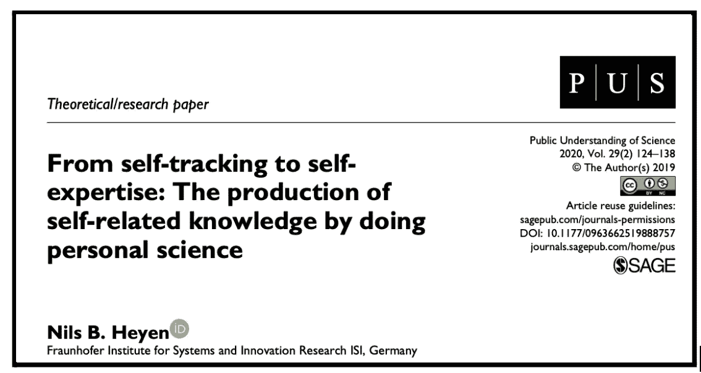
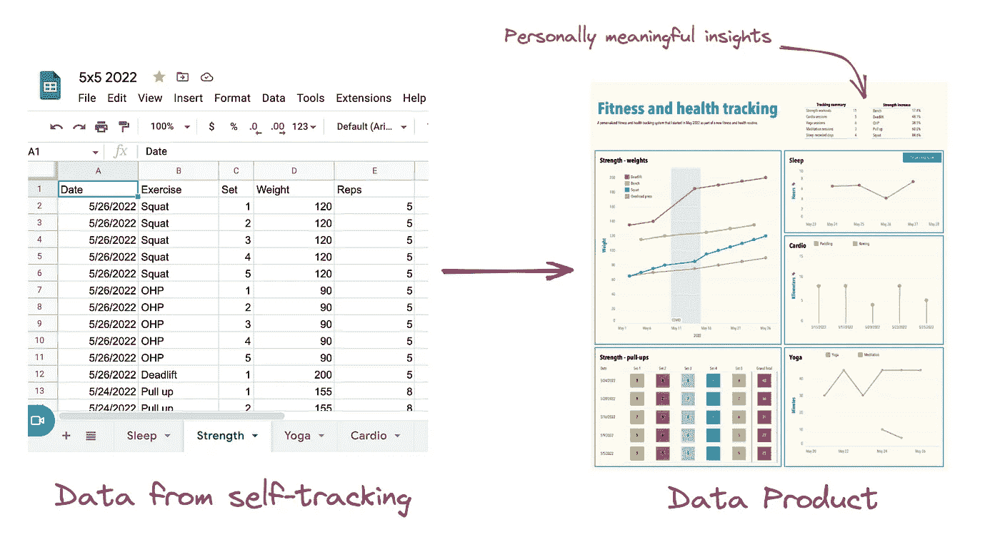

# 发展数据技能的理想数据源:你自己

> 原文：<https://towardsdatascience.com/the-ideal-data-source-and-activities-for-developing-data-skills-yourself-347e58a1567e>

## 自我追踪和个人科学导论

图片由作者提供。

我在一个研究生项目中教授数据入门课程，学生们以前没有处理数据的经验，也没有本科统计学或研究方法课程的痛苦记忆。我非常喜欢帮助学生建立解决现实世界问题的基本数据技能。我工作中最喜欢的部分是当学生们有一个*啊哈*的时刻，意识到他们不仅在处理数据方面有*的才能*和*的兴趣*。这是成功的三个关键因素中的两个——第三个是机会。最成功的学生是那些主动出击，寻找机会处理课堂活动和作业之外的数据的学生。

虽然使用数据的机会很多，但将现有项目与符合新学员技能的需求联系起来是一项挑战。学生还有许多与其他课程和实习竞争的需求，进一步限制了机会。我鼓励学生利用我认为最理想的数据源:你自己。这个建议实质上意味着捕捉和分析你自己生活中某个方面的数据。围绕这个概念存在着一个完整的社区，通常被称为*个人科学*和*量化自我*。发表在杂志*公众对科学的理解*上的以下文章提供了对该运动的详细描述，可在此处[访问](https://journals.sagepub.com/doi/full/10.1177/0963662519888757):

作者截图。

许多人已经用智能手表或移动设备跟踪行为和活动，监控步数、睡眠模式、心率等。许多应用程序让你可以访问你的数据，让你有机会重新分析数据。你可以用应用程序来验证你的结果，或者用一种对你更有意义的方式来展示结果。这些现有的数据源是极好的技能发展机会。但是，我鼓励你超越现有的应用程序，创建你的数据收集系统。我将首先描述为什么这些项目对新手来说是理想的，然后提供启动你的项目的技巧。

# 为什么自我跟踪项目是理想的？

## 暴露于完整的数据生命周期

自我跟踪项目向您展示了数据生命周期的一整套活动。即使是一个简单的项目，您也可以获得收集、管理、清理、管理、分析、可视化和呈现数据的宝贵经验。这些活动可以揭示你的强项和弱项，为你集中发展技能提供极好的见解。

## 技能发展的效率

将您的技能应用到真实世界的数据中是培养技能的最有效的方法之一。课堂活动和作业是技能发展的基础，但这些技能只有在你能应用到现实世界时才有意义。此外，当您加入一个数据项目时，您可能很难控制您能做的工作。启动你自己的项目是一个很好的方法，可以立即积累你的技能和经验。

## 有意义的数据和见解

学生可能理解给定程序的步骤或机制，但对数据的深刻理解对于产生有意义的见解是必不可少的。课堂活动和作业可以鼓励技能的死记硬背，特别是当学生专注于正确解决年级问题时。自我跟踪项目有助于克服这个问题，因为你对数据有深入的理解，特别是当你跟踪的行为或活动对个人有意义时。

我最近开始了一个新的健身和健康计划，将我的锻炼和睡眠记录到谷歌表格中。我使用 [Tableau](https://public.tableau.com/app/profile/beperron/viz/Book1_16529262824620/Fitness) 从一个简单的电子表格中创建了许多不同的数据视图。跟踪过程有助于显示我的进步和一致性，这有利于让我进一步参与和激励我的健身活动。从这个角度来看，这个项目的回报不仅仅是处理数据。

来自自我跟踪项目的作者自己的数据和仪表板。

## 概念化项目

概念化项目的能力是一项需要培养的重要且具有挑战性的技能。概念化项目的一部分是考虑项目范围、时间、资源、技能水平和评估成功的方法。自我跟踪项目让你立即接触到这一基本技能，当事情没有按计划进行时，允许你快速迭代。你最初的项目可能不会成功，但是你构思和实现的每个项目都会给你宝贵的经验。

# 自我跟踪的建议

## 保持你的项目简单

复杂的项目，尤其是那些涉及大量数据收集的项目，注定会失败。如果你是一个新的学习者，专注于一个单一的行为或活动是非常好的。记住，你可以用一个小而简单的数据集做很多事情。

## 追踪有可变性的东西

例如，如果你倾向于一天只喝一杯咖啡，跟踪你的咖啡因摄入量就不会令人兴奋。但是，对其他人来说，比如我自己，我的咖啡摄入量是相当可变的——包括时间和数量。这种可变性提供了更多的机会来练习你的分析技能和产生洞察力。不过，要小心。有时候太多的可变性会使你的项目更难维护。

## 追踪一些对个人有意义和有趣的事情

我认为与健康相关的行为是追踪的最佳起点之一。例如，睡眠跟踪是一个很好的起步项目，尤其是如果你对揭示可能影响你睡眠的趋势或模式感兴趣的话。事实上，你可能有一个应用程序为你做这些，但也许有一个睡眠的维度你的应用程序没有跟踪或以理想的格式为你提供数据。

我曾经和一些学生一起工作，他们创建了关于饮酒、跟踪学习一项新技能(例如，用 R 和 Python 编程)、训练小狗(例如，“事故”发生的时间和地点)、看电视和说脏话的项目。虽然许多自我跟踪项目关注与健康相关的行为，但这并不是必需的。我强烈推荐探索 Giorgia Lupi 和斯蒂芬妮·波萨维克的 [*【亲爱的数据】*](http://www.dear-data.com/theproject) 项目的工作。他们花了整整一年的时间收集和发送明信片上的个人数据手绘。每周都是不同的主题，为你的自我跟踪项目提供许多想法。他们追踪了所有的事情，从骂人、他们遇到的门的样式、赞美、犹豫不决、笑声和告别，等等。

作者截图来自[http://www.dear-data.com/theproject](http://www.dear-data.com/theproject)

## 关注客观的衡量标准

客观测量意味着获取可以直接测量或计算的数据。例如，你可以直接测量你上床睡觉的时间和起床的时间——那些是*客观*测量。这些测量比主观测量具有更大的有效性和可靠性，例如对你睡眠质量的感知或你感觉休息的程度。客观评估受偏见的影响较小，可以为您提供更好的见解，尤其是在初次接触数据时。

## 围绕你的项目建立时间界限

如果你在第一周取得了成功，你可以延长项目的时间范围。如果你失败了，你希望失败得更快。你可以重复你最初的想法或推出新的东西。只要记住，成功和不成功的项目都有必不可少的学习机会。

## 标准化您的数据收集

尝试创建一个系统来保持数据收集工作的一致性。确保你关注数据收集提供的学习体验。许多作为课堂活动或作业的一部分而被提供数据的新学习者并不完全理解创建和管理高质量数据集的复杂性。

## 专注于创建数据产品

试着用你的数据创造一些东西，尽可能地引导出有意义的见解。例如，您可以使用数据透视表或简单的数据可视化来汇总您的数据，这可以帮助您了解您正在跟踪的行为。

# 结论

将您的数据技能应用于真实世界的情况是培养真实世界数据技能的最高效和最有效的方法之一。创建您的自我跟踪项目提供了跨数据生命周期培养技能的绝佳机会。保持你的项目简单，并与你现有的技能相匹配。

我最近的大部分工作都集中在帮助新学习者发展实用的数据技能上。如果你对这个话题感兴趣，请随时关注我。