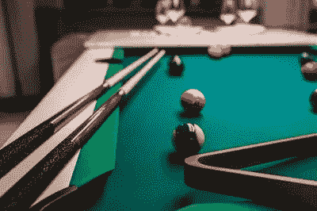
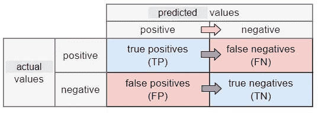

# ROC 情节背后的直觉

> 原文：<https://towardsdatascience.com/the-intuition-behind-roc-plots-614a6053af83>

## 揭开 ROC 或类似图如何用于评估二元分类器的神秘面纱

ROC 和台球有什么关系？继续阅读…照片来自 Unsplash

在[之前的一篇文章](/bias-and-variance-but-what-are-they-really-ac539817e171)中，我谈到了偏差-方差的权衡。在数据科学中有一些这样的权衡，了解它们很重要，这既是为了建立直觉，也是因为它们可能会产生重要的实际后果。所以在这篇文章中，我想谈谈数据科学中评估二元分类时面临的另一个常见权衡的例子。我将试着介绍一些基础知识，但是先熟悉一下这个主题会有所帮助。

假设我们训练一个二元分类器来预测一些数据是属于**正类还是负类**(或者你选择的两个类中的一个)。一旦模型被训练好，我们就可以给它传递新的数据来得到预测。大多数模型为我们提供了**软预测**，根据模型，我们可以粗略地将其视为预测为正的概率。为此，我们需要**校准**预测，所以让我们假设我们校准了我们的预测。下一步是将软预测转换为硬预测(正对负类)，为此，我们需要选择某个阈值(T10，T11)，使其上的所有软预测为正，其下的所有软预测为负。对于已校准的模型，接近 0 或 1 的软预测表示模型预测的可信度较高，而接近阈值的值表示可信度较低。因此，一个好的模型应该很好地将正面情况的软预测推向 1，而将负面情况的软预测推向 0。

左边是一个近乎完美的模型，右边是一个不那么完美的模型。作者图片

如果一个模型在这方面做得非常好，那么我们就不会对阈值的选择非常敏感。换句话说，预测的可分性给了我们一些“回旋余地”,以很小的代价改变阈值。另一方面，如果软预测混合了很多类别，那么选择正确的阈值可能是一个真正的平衡游戏:增加阈值意味着我们对什么被分类为阳性的问题更加保守，这意味着我们对给我们带来假阳性的模型有更低的 T2 容忍度。降低我们的阈值会产生相反的效果，结果是模型给出更少的**假阴性**。理解这是一种**权衡**真的很重要，这意味着通过改变阈值，我们表达了我们对更多假阳性与更多假阴性的偏好(或厌恶)。为了同时减少这两者，我们需要一个更好的模型。如何才能直观地理解这一点？首先让我们使用下表，也称为**混淆矩阵**:

混乱矩阵。作者图片

一旦选择了阈值，我们就可以计算上表中的计数。**真阳性率(TPR)** 和**真阴性率(TNR)** 的计算如上所示。唯一的目的是将**计数转化为百分比**。同样，我们可以推导出**假阳性率(FPR = 1-TNR)** 和**假阴性率(FNR = 1-TPR)** ，但它们实际上只是 TPR 和 TNR 的镜像，这意味着所有的变化都是我们的视角。换句话说，我可以说一个更好的模型是一个具有更高的 TPR 和 TNR 的模型，这就好比说它分别具有更低的 FNR 和 FPR。最后，为了绘制 ROC 曲线，我们将假阳性率放在 x 轴上，将真阳性率放在 y 轴上。这里有一个 ROC 图的例子:

ROC 图示例。来源[scikit-learn.org](https://scikit-learn.org/stable/auto_examples/model_selection/plot_roc.html#sphx-glr-auto-examples-model-selection-plot-roc-py)

但是等等，如果 TPR 和 FPR 只是两个数字，为什么 ROC 会呈现出*曲线*？答案是，对于阈值的不同值，我们得到不同的(FPR，TPR)对**，因此我们可以将阈值从 0 滑动到 1，并绘制所有这样的对，结果是您在上面看到的橙色曲线。得到的曲线说明了当我们调整阈值时，给定模型提供的**较高的 TPR** 与**较低的 FPR** (反之亦然)之间的权衡。完美的模型(类之间完全分离)应该从(0，0)开始，直接向上到(0，1)，再到(1，1)。一个不比随机猜测更好的模型应该遵循 45 度线。所以 ROC 曲线在某种程度上显示了我们的模型在 0 和 1 之间扫描阈值时向左上角移动的最佳状态。**

如果仍然不清楚为什么改变阈值会导致这种权衡，那么下面的视觉效果会有所帮助:假设你提高了阈值。因此，一些略高于旧阈值的数据点现在低于新阈值。这将这些点的预测从正变为负。这在下表中用黄色箭头表示。正如我们所看到的，这种变化会导致**负面影响**(TPs 下降，因为一些 TPs 现在被错误分类为 FPs，如红色箭头所示)和**正面影响**(TNs 增加，因为一些先前错误分类的 fn 现在被正确分类，如蓝色箭头所示)。所有这些变化反过来影响 TPR 和 FPR，使我们沿着 ROC 曲线移动到一个新的位置。

增加阈值对混淆矩阵的影响。作者图片

我们可以做一个类似的论证，当我们*降低*阈值时会发生什么，导致箭头指向相反的方向。那么我们应该选择什么样的阈值呢？如果我们不关心模型会产生什么样的错误(FP vs FN ),那就没什么关系了，但实际上我们远不是不关心，因为每种错误都有与之相关的**成本**,所以我们必须比较总成本来决定使用什么阈值。关于这个问题的详细讨论在[这里](http://nicolas.kruchten.com/content/2016/01/ml-meets-economics/)给出，我会在以后的某一天尝试解决这个话题。现在我们只能说 ROC 图本身不能帮助我们选择正确的阈值。

我希望你被这个解释说服了。如果没有，让我提供另一个我们都可以直观理解的替代性和非技术性的解释:假设一堆球散落在一张台球桌上:让我们将它们称为蓝色和红色的球，而不是条纹和实心球(所以请将它们视为我们的**标签**)。假设我们想通过将**球杆**以某个角度放在桌子上的某个地方，并将落到球杆一侧的所有球扫入一个“角落”，其余的球扫入另一个“角落”来分离球。为了方便起见，我将这两个角称为红色和蓝色角。课程的选择是任意的，就像之前对正反课的选择是任意的。这里有一个例子:

球杆的当前位置导致一个错误分类的红球和两个错误分类的蓝球。作者图片

你可以想象，除非我们运气好，否则我们无法用球杆完美地将蓝球和红球分开。这意味着一些球将不可避免地出现在错误的角落。事实上，即使我们放松对直(线性)球杆的假设，想象一个“弯曲”的球杆可以更好地分离球，这个类比仍然成立。将蓝色和红色的球分开的难易程度取决于(1)这些球混合在一起的程度(即数据有多“混乱)，(2)球杆的弯曲度与球的吻合程度(即模型有多“灵活”)，但在我们的类比中，我们假设这两者都是固定的，所以我们唯一能控制的是在清扫球之前如何放置球杆。并且该选择类似于选择使用哪个阈值。

最后一点:还有其他评估二元分类器的方法。当正类是数据的一个非常小的百分比*(我们称之为**类不平衡**)时，它可以帮助查看精度和召回:**精度**由 TP/(TP + FP)给出，而**召回**与 TPR 相同。因此，虽然 recall 只是 TPR 的另一个名称，但如果您检查 precision 的推导，您会注意到它在计算中没有使用真正的否定，因此 precision-recall 对是查看数据的一种不同方式，在某些设置中更有意义，如信息检索，其中真正的否定是不感兴趣的。通过绘制精度与回忆的对比图，我们最终得到了一个类似于 ROC 的图，但并不相同！*