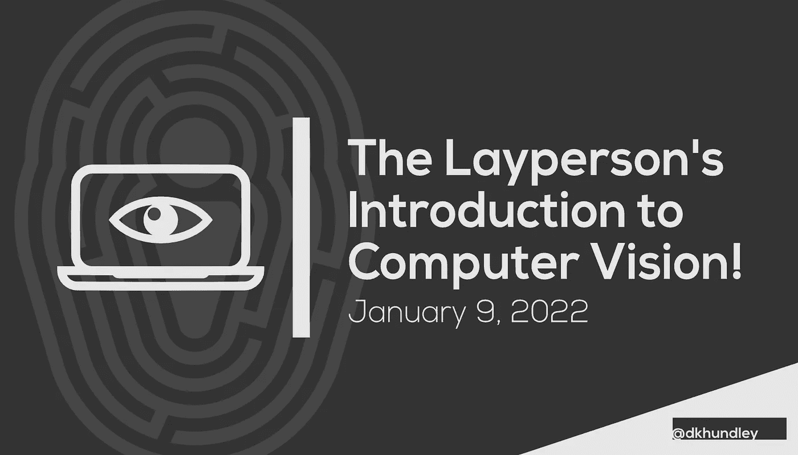
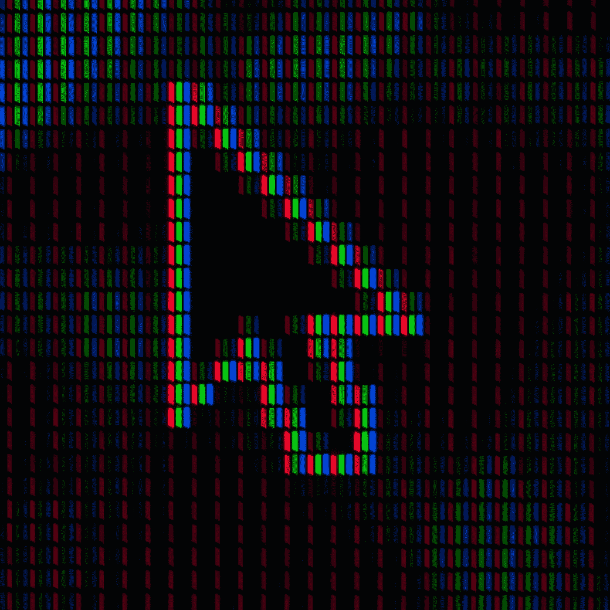

# 外行人对计算机视觉的介绍

> 原文：<https://towardsdatascience.com/the-laypersons-introduction-to-computer-vision-858f86bb10ba>

作者创建的标题图像

# 外行人对计算机视觉的介绍

## 对计算机视觉背后的概念的浅显介绍，便于任何观众理解

除了作为一名机器学习工程师，我还以许多不同的身份志愿促进数据科学和机器学习。我目前工作的公司(State Farm)与当地高中有合作关系，以推广他们的 STEM 项目。在我志愿服务的高中，学生有机会在整个高中四年中参加特殊课程，最终与当地社区大学合作获得计算机科学的副学士学位。非常酷！

从他们大一开始，我就和他们在一起，现在他们已经进入了大三的第二学期。因此，他们的老师要求学生想出潜在的计算机科学项目来造福他们的学校。我所在的小组有一个想法，用计算机视觉来帮助解决停车场交通的拥堵问题。为了简洁起见，我不会在这篇文章中谈论他们的项目，但不用说，我真的很欣赏这些学生的创造力！

现在，我将完全诚实:在承担通过他们的项目指导这些人的责任之前，我对计算机视觉的知识相当有限，但我接受了它，因为我不仅希望看到这些学生成功，而且我也认为这是我自己学习计算机视觉的一个很好的机会。绝对期待看到未来的博客帖子深入这个主题的技术细节！

不过现在，我认为就这个主题写一本介绍性的入门书是有益的，这样我的高中同学就可以在用代码执行它之前对计算机视觉空间有一个更好的概念性理解。虽然这显然是一群聪明的学生，但我以这样一种方式写了这篇文章，希望任何人都能对计算机视觉如何工作有一个概念性的理解。因此，即使你没有任何机器学习甚至计算机科学的经验，也不用担心！随着本文的深入，我们将介绍数据科学社区的常用术语，我将确保以任何人都可以轻松掌握的方式来定义这些术语。

事不宜迟，让我们从一般的机器学习谈起吧！

# 机器学习是如何工作的？

在我们开始讨论计算机视觉之前，最好先打好机器学习的基础，因为计算机视觉是机器学习的一个“子类”。(如果你想了解所有这些人工智能的子类别是如何相互关联的，我的私人朋友 Raj Ramesh 博士在 YouTube 上有一个精彩的视频，用不到五分钟的时间解释了这个问题。看看吧！)**机器学习(ML)通过执行复杂的数学算法/模型——或者我喜欢称之为“奇特的数学”——来寻找数据中的模式。**该模型从随机输入开始，随着模型继续梳理新数据，它会改变自己——或“学习”——以更好地概括该数据的模式。在 ML 社区中，我们将这个过程称为**将数据拟合到模型以训练模型，或者简称为**“模型训练”。

有许多不同的数学算法，我们可以用许多不同的方式使用这些算法来促进不同种类的用例。一种非常常见的通用用例被称为“监督机器学习”在有监督的机器学习中，计算机在大量数据中寻找与提供的目标相匹配的模式。例如，如果我想建立一个预测性的 ML 模型来预测明天的天气，我会根据过去几个月或几年的天气数据来训练模型。数据将包括气压、温度、风速等，目标将是“晴天”、“多云”或“下雪”。

根据这些历史数据对模型进行正式训练后，我们可以输入关于今天天气的新信息来推断新的结果。例如，如果我输入温度为 20 华氏度、降水几率为 80%的数据，模型可能会推断出今天的天气是“下雪”的结果请记住:这是一个推断的结果，或者换句话说，这只是一个猜测。当然，这些 ML 模型通常被训练得非常准确，所以推断(或者猜测，如果你愿意)比随机的掷硬币好得多。人们常常希望他们的 ML 模型在 99.99%的时间里正确地预测一个推论。很难有比这更准确的了！

随着 ML 算法变得越来越复杂，人们开始将这些特殊的复杂算法称为深度学习。**深度学习是一组计算复杂得多的标准 ML 算法版本**。深度学习有很多不同的应用。如果你熟悉 Siri 或 Alexa 等语音助手，它们都利用了一套称为自然语言处理(NLP)的深度学习算法。当然，计算机视觉也是深度学习的另一个应用。计算机视觉普遍存在于自动驾驶汽车、图像分类器等事物中。

接下来，让我们更具体地谈谈计算机视觉，以及它如何以神经网络的形式表现出来。

# 什么是神经网络？

为了在图像或通用语言等非常复杂的数据中找到模式，人们开发了这些计算、数学节点网络，通常称为神经网络。它们被称为神经网络的原因是这些节点被比作人脑中神经元之间的相互作用。如果你不熟悉大脑生理学，神经元与一个神经元“纠缠”在一起，并输出微小的电信号，这些电信号聚集在一起形成思想等东西。虽然这个类比可能有点天真，因为我们还没有完全理解大脑，但它仍然是一个公平的类比。下面是一张 GIF 图，说明了大脑中的神经元是如何工作的。

哈佛大学在 GIPHY 平台上以 GIF 格式维护的动画

开发这些神经网络的人认为，如果你通过这些节点层传递信息，你可以找到小的数据模式，这些模式最终聚集在一起形成越来越大的模式。看看下面的动画 GIF:

由 3Blue1Brown 制作并在 gfycat 上存储为 GIF 格式的动画

这里的动画是由 YouTube 的创作者 3Blue1Brown 创作的，他在他的频道上有[一系列精彩的视频解释神经网络。这个动画实际上是计算机视觉的一个应用，其中神经网络可以查看手写数字的图像，以确定哪个数字是实际书写的。我们将进一步讨论与计算机视觉相关的更具体的部分，但现在，请注意这个神经网络中圆圈的垂直列。每列圆圈代表一层节点，请注意，每个节点都与网络中上一层和下一层的所有其他节点相连。神经网络有多层这些节点的原因是，每一层都提供关于从前一层发现的模式的新信息。](https://youtube.com/playlist?list=PLZHQObOWTQDNU6R1_67000Dx_ZCJB-3pi)

由 3Blue1Brown 制作并在 gfycat 上存储为 GIF 格式的动画

考虑一下上面动画中的手写 9。你如何描述数字 9 的形状？我可能会说，你可以在顶部看到一种椭圆形或圆形，从圆形右侧向下伸出的通常是一条直线或一条有点像字母“J”的曲线。随着这个图像在整个神经网络中传递，计算机继续构建这些模式，最终组装成整数。举例来说，第一层可能只识别出构成数字 9 顶部的“圆”的一条小曲线。下一层可能会将“圆”的这些曲线放在一起形成整个圆，然后另一层可能会将“圆”与向下的“J”块配对，最终形成数字 9。(很难用文字来解释这一点，所以再次强调，如果你想从更直观的角度理解这一点，我肯定会推荐你观看 3Blue1Brown 的视频系列。)

还记得上一节的监督学习吗？这个特定网络的训练方式是，在训练期间，一组手写数字的图像与数字实际确定的目标标签一起被输入到神经网络中，因此这是监督深度学习模型的一个经典例子。显然，有很多非常复杂的数学东西我在这里没有谈到，但这里要记住的想法是**我们可以通过向深度学习模型提供图像以及它们的相关标签来训练计算机视觉模型**。

正如我在本节开始时提到的，有各种各样的神经网络，特别是，有一种非常特殊的神经网络用于计算机视觉应用。这些神经网络被称为卷积神经网络，所以我们在下一节中详细讨论这些！

# 我们如何将卷积神经网络用于计算机视觉

随着我们在这篇文章中的进展，你可能会想，“我们如何将图像转换成可以输入神经网络的东西？”考虑一下你阅读这篇文章的设备，不管是智能手机、平板电脑还是电脑。你的设备的屏幕是由所有这些被称为像素的超级小灯组成的。这是一张显微镜下屏幕上像素的图片:

[翁贝托](https://unsplash.com/@umby?utm_source=unsplash&utm_medium=referral&utm_content=creditCopyText)在 [Unsplash](https://unsplash.com/s/photos/pixels?utm_source=unsplash&utm_medium=referral&utm_content=creditCopyText) 上拍摄的照片

一个像素由三个颜色通道组成:红色、蓝色和绿色(RGB)，你可能会惊讶地发现，你可以产生几乎任何人眼可察觉的颜色。因此，正如我 5 岁的女儿会高兴地告诉你，红色和蓝色(而不是绿色)构成紫色。😂这些 RGB 通道中的每一个都表示为一个数字，所以你现在使用的设备中的 CPU 正在告诉你设备上的所有像素以某种方式点亮，以产生你现在正在阅读的文本。

这样，我们可以通过解析与每个像素相关的所有 RGB 颜色通道，将任何图像转换为数值。这里有一个问题:任何现代屏幕都有很多像素。例如，标准 4K 电视的分辨率为 3840 x 2160。将这两个数字相乘，那就超过了惊人的 800 万像素！因此，如果你试图向一个标准的神经网络输入这么多像素，大多数计算机都会在试图处理这么多信息时陷入停顿。

也就是说，人们已经开发了这种称为卷积神经网络的神经网络子类。**卷积神经网络通过减少在神经网络的每一层中寻找模式所需的信息量来寻找图像等事物中的模式**。我们减少信息量有两个原因。首先，它让计算机更容易处理这些信息，其次，研究人员发现，无论如何，没有必要拥有每一点点信息。考虑下面的动画:

丹尼尔·努里创作并存储在 GIPHY 上的动画([来源](http://danielnouri.org/notes/2014/12/17/using-convolutional-neural-nets-to-detect-facial-keypoints-tutorial/))

在卷积神经网络中，一个层应用各种“过滤器”(由移动的黄色框表示)来概括来自原始图像(用绿色表示)的信息位，以形成更简单的“卷积特征”(用粉色表示)。这些卷积滤波器被设计用来做各种事情，因此一些滤波器更擅长识别图像中的水平线，而其他滤波器更擅长识别垂直线。出于说明目的，我对其进行了简化，但显然有两种以上不同的卷积滤波器。

所以，让我们把所有的知识放在下图中:

作者创作的汽车和设计图像

在这个例子中，卷积神经网络被训练来识别汽车图像。请注意，当图像通过网络中的每一层时，信息是如何减少到更易于计算机计算的程度，同时保持信息的完整性几乎完好无损。同样，我们在这里保持事情简单，但是**这里的要点是，通过使用我们的“奇特的数学”算法跨越图像的像素值，我们可以在图像中找到模式，以形成我们试图推断的任何类型的目标**！

如果你想知道这如何适用于视频，请记住视频只是一系列快速有序显示的图像。如果你像我一样玩视频游戏，你可能会熟悉“每秒帧数(FPS)”的概念。在 PlayStation 4 / Xbox One 一代中开发的大多数游戏都以 30FPS(每秒 30 帧)的速度显示，因为较新的 PlayStation 5 / Xbox Series X 的计算效率要高得多，所以许多较新的游戏都提供了 60FPS(每秒 60 帧)的选项，许多游戏玩家都很欣赏这一点，因为它使视频看起来更流畅。(有趣的事实:大多数电影都是以 24FPS 拍摄的。)

# 包扎

我们可以用计算机视觉做很多很酷的事情。我们可以训练这些非常复杂的计算机视觉模型来识别图像中的许多对象。这是实现自动驾驶汽车等事物的基础，自动驾驶汽车可以识别如上图所示场景中的所有对象，以安全地驾驶汽车到达目的地。

正如我在介绍中提到的，我正在从事将利用计算机视觉的项目，所以如果你想学习更多关于实际创建计算机视觉模型的知识，请继续关注关于这方面的未来博客帖子！希望这篇文章对你有所帮助。我个人认为这太酷了，人类能够思考这些非常复杂的问题，并用复杂的数学来解决它们。感谢阅读，下一篇文章再见！