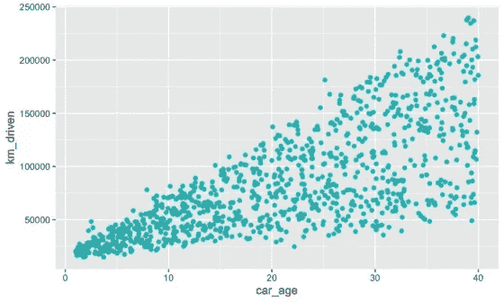
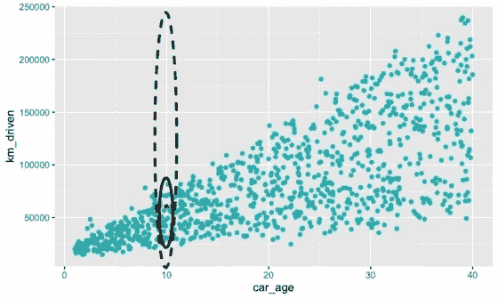

# SHAP 的局限性

> 原文：<https://towardsdatascience.com/the-limitations-of-shap-703f34061d86>

## 特征依赖、因果推理和人类偏见如何影响 SHAP

维基·西姆在 [Unsplash](https://unsplash.com?utm_source=medium&utm_medium=referral) 上的照片

SHAP 是最流行的 IML/XAI 方法。这是一种用来理解我们的模型如何做出预测的强大方法。

**但是不要让声望说服你。**

SHAP 仍然有局限性。使用这种方法做结论时，你需要记住它们。

我们将讨论 4 个重大限制:

*   第一个来自 SHAP 方案本身
*   第二个来源于 SHAP 值的计算方式——我们假设**特征独立**
*   第三个来自于我们如何使用它们——不是为了**因果推断**
*   最后一点来自于人类如何使用它们——我们**编造故事**

# 1)SHAP 一揽子计划

第一个与 SHAP 方案本身有关。内核 SHAP 在*理论*中是一种模型不可知的方法，但这并不意味着它在*实践*中是模型不可知的。为什么？嗯，因为它还没有在所有的包中实现。

就我个人而言，我用了 5 个建模包:Scikit learns，XGBoost，Catboost，PyTorch 和 Keras。记住，如果你正在使用一个不太流行的建模框架，你可能会有一些麻烦。即使是在深度学习方面，SHAP 也可能相当善变。我费了很大劲才让它和 PyTorch 一起工作

# 2)特征依赖性

特征依赖是指两个或多个模型特征相关联。也就是说，一个特性的值*取决于另一个特性的值*。SHAP 在两个方面受到特性依赖的影响。

首先是 SHAP 值的近似值。以 KernelSHAP 为例。这种方法的工作原理是置换特征值并对这些置换进行预测。一旦我们有足够的排列，Shapley 值使用线性回归估计。问题是，当置换特征时，我们假设它们是独立的。

> 像许多其他基于排列的解释方法一样，当特征相关时，Shapley 值方法受到包含不切实际的数据实例的影响。
> 
> 克里斯托弗·莫尔纳尔

这个假设并不总是正确的。取**图 1** 中**公里行驶**和**车龄**散点图。这些特征用于预测二手车的价格。有明显的相关性。汽车越旧，我们就有越多的时间来增加它的里程。

图 1:行驶里程与车龄的散点图(来源:作者)

现在拿**图 2** 中的红色观察来说。这辆车有 10 年历史了。这个时代的汽车将在实心椭圆内行驶一定距离。当模型被训练时，它只“看到”这些真实的观察结果。

图 2:随机抽样的问题(来源:作者)

然而，当计算 SHAP 值时，我们在它们的整个范围内置换特征。对于 **km_driven，**这包括虚线范围内不切实际的观察。我们希望模型能够根据这些观察结果做出预测。这可能导致不可靠的预测和 SHAP 值。

在解释 SHAP 图时，特征依赖性也会导致一些混乱。例如，一个模型可以使用原产国来预测患皮肤癌的几率。有些国家的人是不是先入为主？防晒霜更贵吗？不，是每个国家不同程度的日照。

原产国被称为代理变量。为什么一个模型会使用它们，这可能不是很明显。归根结底，这是因为机器学习只关心相关性，代理变量与事件的真正原因相关。这就引出了第二个限制。

# 3)因果推理

SHAP 值不能用于因果推断。这是找到事件/目标的真正原因的过程。SHAP 值告诉我们每个模型特征对预测的贡献。它们没有告诉我们这些特征是如何影响目标变量的。这是因为模型不一定能很好地代表现实。

> Shap 并不是衡量“一个给定的特性在现实世界中有多重要”的指标，它只是简单的“一个特性对模型有多重要”。—吉安卢卡·祖恩

预测可能不正确。在这种情况下，SHAP 值将对与真实目标不同的预测做出贡献。如上所述，即使模型是 100%准确的，它也可能使用代理变量。所有这些都意味着我们不应该做出超越模型的结论。即使这样做很诱人…

# 4)人为错误

从技术分析到占星术，人类喜欢寻找并不存在的模式。数据科学也不例外。

在分析 SHAP 价值观时，我们可能会编造虚假的故事。为什么模型预测癌症发病率高？肯定是帽子不流行了！

我们可以把这些故事强加到分析中，即使它们来自模型的怪癖。作为确认偏差的结果，我们可以无意识地这样做。它也可以被恶意地用来支持一个对某人有利的结论。这类似于 p 黑的过程。我们烧毁我们的数据和模型，直到它们给出我们想要的结果。

> 确认偏差——无意识地**偏向于确认你先前已有信念的信息**

最后，所有这些局限性应该会增加你对使用 SHAP 得出的结论的怀疑。该结论可能基于不正确的特征独立性假设。永远不要接受超出模型的结论——尤其是如果它支持一个不可告人的动机。

我们从总体上审视了 SHAP 的局限性。不同的近似方法有其特定的局限性。比如 KernelSHAP 就慢。TreeSHAP 更快，但它不是模型不可知的。我们将在下面的文章中讨论这些和其他考虑事项。

  

支持我成为我的 [**推荐会员**](https://conorosullyds.medium.com/membership) **:)**

  

|[Twitter](https://twitter.com/conorosullyDS)|[YouTube](https://www.youtube.com/channel/UChsoWqJbEjBwrn00Zvghi4w)|[时事通讯](https://mailchi.mp/aa82a5ce1dc0/signup) —注册免费参加 [Python SHAP 课程](https://adataodyssey.com/courses/shap-with-python/)

## 参考

南伦德伯格，**SHAP***【2021】*[https://github.com/slundberg/shap](https://github.com/slundberg/shap)**

**南 Lundberg & S. Lee，**解释模型预测的统一方法** (2017)，[https://arxiv.org/pdf/1705.07874.pdf](https://arxiv.org/pdf/1705.07874.pdf)**

**C.莫尔纳尔、**可解释机器学习** (2021)、[https://christophm.github.io/interpretable-ml-book/](https://christophm.github.io/interpretable-ml-book/)**

**南 Masís，**用 Python 进行可解释的机器学习** (2021)**

**[钱丹·杜吉亚](https://medium.com/u/25a92c29cc1?source=post_page-----703f34061d86--------------------------------) **利用 SHAP 进行可解释性——先了解这些限制**(2021)[https://towardsdatascience . com/Using-shap-for-explability-Understand-these-limits-First-1 bed 91 c9d 21](/using-shap-for-explainability-understand-these-limitations-first-1bed91c9d21)**