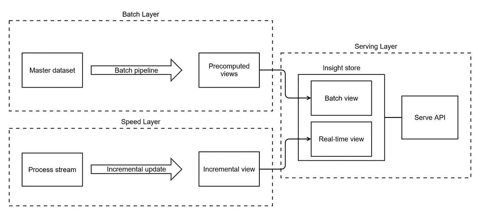
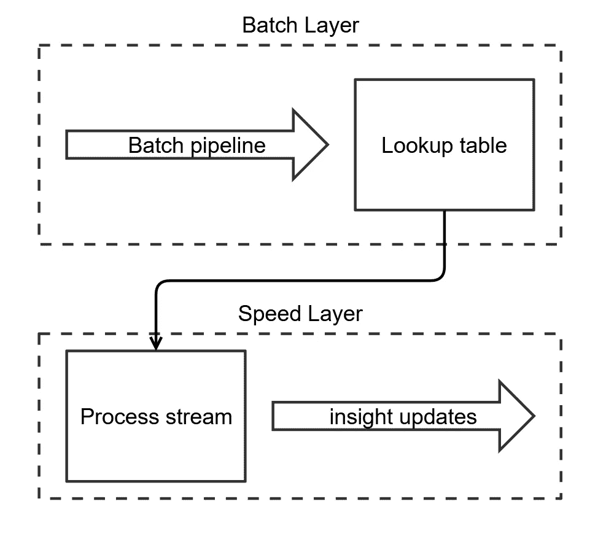
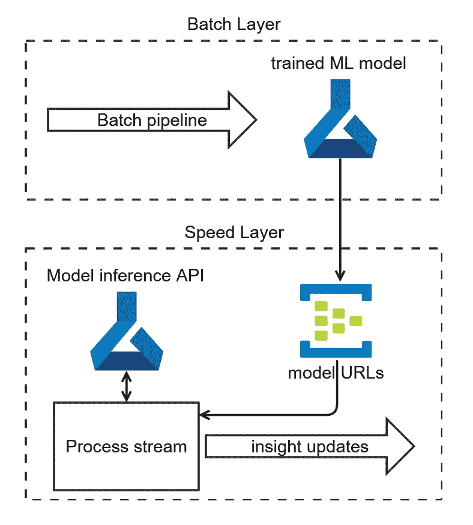
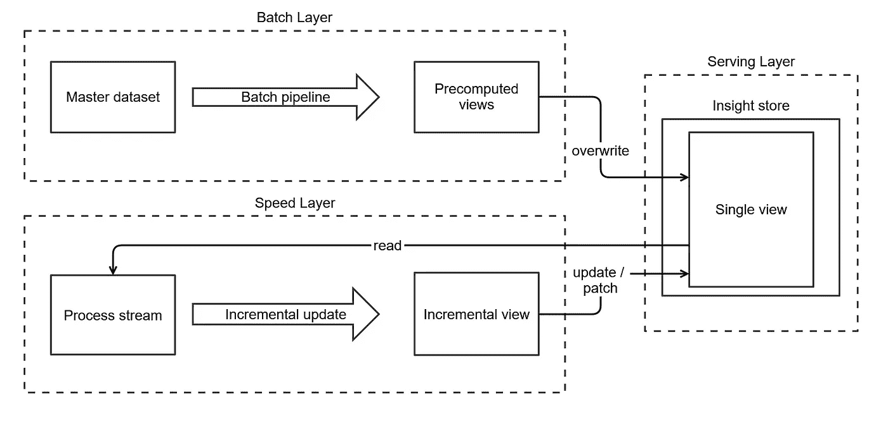
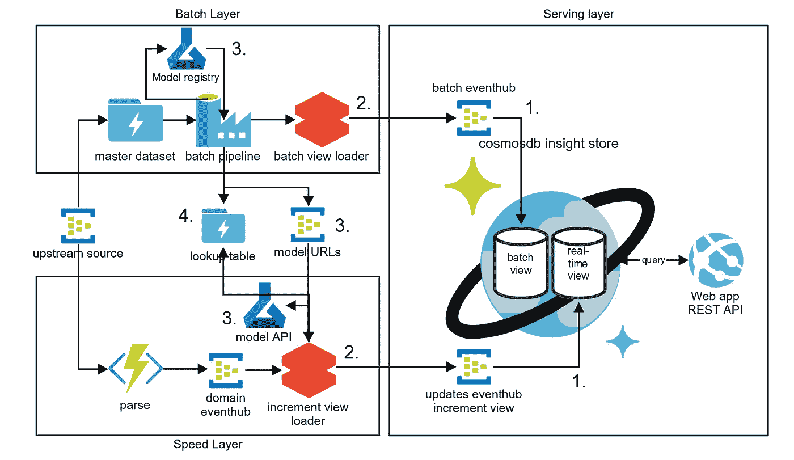

# 批处理和流式洞察的神奇融合

> 原文：<https://towardsdatascience.com/the-magical-fusion-between-batch-and-streaming-insights-8f1353bfe4a>

业务需要数据驱动的洞察力，以尽快到达利益相关方和客户，并具有明确定义的新鲜度要求。Lambda 架构(Marz，2015 年)通过将批处理和实时流中的洞察结合到最新的数据产品中，解决了这些需求。我们假设 Lambda 架构仍然是为工程能力有限的数据科学团队提供见解的相关方法。我们阐述了融合批处理和流洞察的创造性方法，并展示了我们的 Azure Lambda 实现来说明我们的想法。

照片由斯凯勒·尤因从佩克斯拍摄

# Lambda 架构概述

内森·马兹([书](https://www.manning.com/books/big-data)，2015)很好地阐述了 Lambda 架构。Lambda 架构由批处理层、速度层和服务层组成，旨在提供最新的更新见解。批处理层使用主数据集在每次运行时覆盖批处理视图。这些预先计算的批量洞察是我们的真理来源。在批处理流水线运行之间，来自速度层的流更新用于保持我们的洞察力新鲜。这是最大的努力，因为流更新积累的任何错误都会在下一次批处理管道运行时被丢弃。服务层将批处理和实时视图组合成最新的数据产品以响应查询。

图 1: Lambda 架构概述，作者图片

# 数据科学的 Lambda

Lambda 架构适合希望向企业和客户提供实时洞察的现代数据科学团队。通常已经存在一个批处理层，对更新的洞察力的需求是一个附加需求。批处理层的存在也可能有很好的理由，例如对历史数据进行机器学习模型的聚合或训练。拥有大约 30%数据工程能力的数据科学团队的构成非常适合 Lambda 架构的实用的自我修复能力。

## 为什么不是卡帕？

Kappa 架构涉及成熟的活动采购。事实的来源不是批处理管道(不存在)，而是过去流事件的累积状态。有博客(比如 [this](https://chriskiehl.com/article/event-sourcing-is-hard) )描述基于事件源的失败项目。更难管理的事情之一是错误恢复。假设您在流逻辑中犯了一个错误，并准备好了一个修补程序。在 Lambda 中，我们会将修复部署到速度层，批处理层的触发或预定运行会自我修复我们的 insight 存储。在 Kappa 中，我们可能需要在多个应用程序和 eventhubs(解析器、洞察生成器)上重放大量历史流事件，并根据我们的预期验证我们的新状态。这需要更多的工程设计，不太适合工程能力有限的数据科学团队。

# 批次层和速度层之间的神奇融合

批处理层和速度层之间的协同就是神奇之处。应用 Lambda 架构通常是一个创造性的过程。目标是通过批处理和实时视图的适当结构将服务层中的逻辑保持在最低限度。有三种通用方法来融合批处理和速度层，并且这些方法并不相互排斥，即:

1.  使用流式洞察更新预计算的批处理视图聚合
2.  在速度层中使用批量生成的查找表或 ML 模型
3.  业务实体状态更新(累积、完整或部分)

在本节中，我们将避免实现细节，每当我们提到 Kafka 主题时，我们指的是任何事件日志，如 Azure eventhub 或 Kafka 本身。

# 1 更新预计算聚合

Marz (2015)重点介绍了这种融合。批处理层预计算作为我们重现的真实来源的总量。流式更新与历史聚合相结合，以最新的聚合来响应查询。在网站访问者计数的经典示例中，在批处理视图中每小时划分一次聚合。实时站点访问与时间戳一起存储在实时视图中(最好是键值存储)。REST 调用触发一个函数，该函数接收每小时的历史总量和所有可用的实时访问。计算更新后的聚合，并作为我们的响应返回。请注意，返回的集合可以具有与存储在批处理视图中的集合不同的集合周期(即，天、月)。

## 1.1 查询优化

可以使用超过一小时的流式网站访问重新计算站点访问总量，并再次存储在批处理视图中。然后可以丢弃处理过的 speed layer 站点访问，这将缩短查询响应时间。

## 1.2 洞察聚合的变化

Lambda 架构的应用非常灵活。有各种各样的场景可能适合聚合融合，但是有一些变化。

1.  我们返回批处理和实时洞察的联合。
2.  我们希望用实时视图中不断变化的 salt 散列批处理视图中的标识符，以匿名化我们的响应
3.  通过实时证据对存储模型预测的贝叶斯修正

# 2 批量生成的查找表或 ML 模型

通常，我们需要来自批处理层的中间产品来在速度层产生洞察力。例如，在批处理层中创建的查找表和训练的 ML 模型用于丰富和分类速度层中的洞察。批处理管道每次运行时都会创建这些工件的新版本。通常，我们只想使用最新的版本，但是对于 ML 模型，只有当最新的模型比以前的版本更好时，才可以应用 MLOps 来决定使用最新的模型。

## 2.1 查找表

我们如何在批处理层和速度层之间共享一个查找表？一种基本方法是让批处理层将查找表写入存储。批处理流水线可以重启速度层中的流处理，以强制重新加载存储的查找表的最新版本，尽管这不是很优雅。更好的方法是以固定的时间间隔从磁盘重新加载查找表，而不中断我们的流处理(实现细节在后面)。另一种方法是将查找表及其版本写入 Kafka 主题，并在速度层中进行流-流连接。最后一种方法需要增加复杂性，以便只使用最新版本的查找表，例如[日志压缩](https://medium.com/swlh/introduction-to-topic-log-compaction-in-apache-kafka-3e4d4afd2262)。

图 2:流处理中使用的静态查找表，按作者排序的图像

## 2.2 训练好的 ML 模型

对于由批处理层创建的经过训练的 ML 模型，我们考虑存储在模型注册中心并部署在它自己的 REST API 后面的版本化模型(用 AzureML 推理部署来描述)。我们将模型版本的每个唯一 URL 流式传输到一个附加了元数据的 Kafka 主题中(用 Azure eventhub 描述)。元数据包含模型版本适用的预测日期范围。我们根据预测日期将速度层消息与模型 URLs eventhub 连接起来，并调用模型 API 来实现预测，这被合并到我们的流洞察中。

图 3:速度层中使用的批量训练的 ML 模型，图片由作者提供

# 3 个状态更新

融合批处理和流洞察的第三种方式是关注业务实体的状态管理，一些例子是:

*   每个客户实时生成的预测否决批处理视图预测
*   基于实时事务流将预测的事务标记为已处理的事务
*   根据各种模型的实时输出更新客户的信用评级

这种有状态融合不同于第 1 节中描述的融合，因为聚合提供了跨业务实体和时间的洞察力。在这里，我们希望在单个客户的级别上管理洞察状态，详细信息流经批处理和速度层。由于无法保证事件处理顺序、库限制、数据存储性能和逻辑复杂性，实时分析系统中的状态管理非常困难。

## 3.1 企业实体和对象恒常性

洞察力对商业实体做出陈述，例如客户的预测价值、特定列车的拥挤程度或论坛用户的情绪。自然，在 insight store 中为每个业务实体维护一个单独的状态。为了允许状态分离，我们需要在我们的系统中一致地识别业务实体，这构成了对象恒常性。有几种方法可以识别商业实体。

1.  唯一的数据产品关键字(字段值的唯一组合，如 customer_id、bank_account_number)
2.  匹配评分功能，将见解与存储的见解进行匹配
    -相似性度量
    -无监督聚类
    - MinHash 或其他分桶方法
    -自定义评分功能
3.  两者的结合

我们用银行交易来说明组合方法选项 3。每笔交易都有一个唯一的发送和接收银行账号，它们共同构成了唯一的数据产品密钥。这两个银行帐号组合在一起可以确定一种财务关系。例如，在学生和大学之间的财务关系中，我们可以看到不同主体的交易。例如，学生定期支付学费，偶尔支付课程材料费用。在我们的例子中，我们希望预测明年课程材料的成本。为了理清这两组交易，我们根据它们在交易信息和金额上的相似性对它们进行聚类。我们最终在一个财务关系下有两套交易。这两个集合都是业务实体，我们选择一个用于我们的洞察生成和状态管理。

## 3.2 完整状态更新

对于全状态更新，速度层洞察否决批处理层洞察。实时视图中的洞察有效地取代了批处理视图中的洞察。批处理视图中的细节不需要被覆盖，但是服务逻辑在响应查询时给予实时视图优先权。

## 3.3 部分状态更新

速度层可能无法生成完整的洞察，并且仅限于部分更新。例如，状态转换通常通过部分状态更新来传达，例如将预测转换为历史事实。这里，我们将记录的确定值和状态从预测更新为实际。对于部分更新，我们通常在服务层使用单一视图(图 4)。批处理层覆盖这个单一视图(处理记录删除),而速度层修补同一视图中的记录/文档。这使得架构能够自我修复，因为每次批处理管道运行都会完全覆盖 insight 存储。

图 4:单个服务视图中的部分和累积状态更新，图片由作者提供

## 3.4 累积状态更新

累积状态更新不是[等幂](https://www.baeldung.com/cs/idempotent-operations)，因为状态更新的结果取决于当前状态。这不同于完全或部分状态否决，并且在高吞吐量(>每秒 100 次更新)的流系统中变得更难维护。除了其他一般的流限制之外，当跨并发微批处理的更新以相同的状态为目标时，微批处理流框架遭受并发问题。因此，累积的状态更新可能需要连续的流处理。状态累积的一些例子是:

*   将具有实时交易的预测银行交易列表标记为“已处理”
*   基于不同时间不同模型的输入累积预测值

与部分更新一样，我们将批处理和速度层整合到一个 insight store 视图中。批处理层覆盖洞察状态以保持 Lambda 架构的自愈属性，速度层对其进行变异。累积更新读取当前的洞察状态，改变它，并覆盖它。为此，我们需要一个快速的键值存储来支持单个业务实体级别的快速操作，比如 HBase。

# Azure 数据科学 Lambda 架构

由于可用的技术和业务需求，Lambda 架构的每个实现都是不同的。我们作为高级分析部门的一部分提供人工智能数据产品。我们的语言是 Python，我们自始至终都在使用它。我们的人工智能团队致力于 Spark 和 Databricks 的批处理，这自然扩展到了 PySpark 结构化流和其他 azure 产品(eventhubs 和 Azure 函数)的流处理。Azure eventhubs 是流处理的核心，对于批处理结果也很有价值。

图 5:带有 REST API 服务层的 Azure 上的数据科学 Lambda 架构，图片由作者提供

# 批量层

批处理管道每天运行两次，一次在晚上，一次在中午。我们预测的一个重要来源是全天流动的，额外的中午运行大大提高了我们的预测。批处理管道结果由批处理视图加载器应用程序直接加载到 CosmosDB 批处理视图容器中。从批处理 eventhub 中构建 CosmosDB 中的状态是理想的，但目前性能似乎更倾向于使用 spark 连接器。这两次每日运行在 CosmosDB 中相互覆盖对方的结果，并且两次运行都将其结果写入 batch eventhub 供下游使用。eventhub 中的每条消息都是 CosmosDB 中的一个文档，是由我们的模型以标准化格式生成的一个预测。

# 速度层

速度层消耗上游源的子集，并在解析它们之后将它们写入我们的域内的 eventhubs。这种单源解析逻辑是在带有 eventhub 触发器和输出绑定的 azure 函数上执行的。域 eventhub 由我们的主要 PySpark 结构化流数据块应用程序使用，该应用程序生成增量更新并将其写入 updates eventhub，以供下游使用并加载到 CosmosDB 实时视图中。加载 CosmosDB 的 Azure 函数 eventhub 触发器是可行的，因为与批处理层相比，峰值流量更低。目前，我们完全否决了批处理视图中的状态，每个唯一数据产品关键字的实时视图中的预测为空。

# 查找表刷新

批处理层生成一个查找表，我们需要在速度层生成洞察。Spark 结构化流静态流连接允许我们在 Spark 结构化流中使用存储的数据帧查找表。在流处理期间，除了强制重启之外，没有对重新加载这个“静态”数据帧的直接支持。因此，我们使用“黑客”机制的组合。结合在处理每个微批处理之后调用的函数来设置“速率”读取流，以在外部作用域中重新加载静态数据帧。这有点像黑客，但似乎对存储在磁盘上的查找表有效(见 [1](https://docs.databricks.com/spark/latest/structured-streaming/examples.html#write-to-azure-synapse-analytics-using-foreachbatch-in-python) 和 [2](https://stackoverflow.com/questions/66154867/stream-static-join-how-to-refresh-unpersist-persist-static-dataframe-periodic) )。

# 服务层

我们的 AI 数据产品以两种方式公开，一个 REST API 和两个 eventhubs(批处理和更新)。批处理视图和实时视图之间的文档格式是相同的，可以立即作为 JSON 提供，这降低了我们的 web app 服务中服务逻辑的复杂性。响应于请求，向两个容器查询所有相关的预测。只有一个预测返回业务对象，实时视图优先。总的来说，我们的方法保持了事物的简单性。让我们希望我们能保持简单！

# 实施愿望清单

我们希望扩展我们当前的 Lambda 架构实现。这些被添加到图 6 中，即:

1.  我们希望将批处理和更新 eventhub 直接放入 CosmosDB
2.  抑制 Spark eventhub 连接以减少所需的最大 eventhub 吞吐量单位
3.  基于预训练的 ML 模型重新计算速度层预测的能力
4.  在流处理期间优雅地重新加载静态查找表的能力，这不依赖于日志压缩

图 Azure 上数据科学的愿望清单 Lambda 架构，图片由作者提供

愿望清单第 3 点可以按照第 2.2 节通过添加模型注册中心(AzureML)来注册在批处理管道中训练的模型来实现。如果 MLOps 认为最新的模型比以前的模型更好，我们将使用 AzureML 部署模型进行推理，并将模型 API URL 和预测日期范围一起发送到 eventhub。我们根据预测日期将模型 URLs eventhub 与速度层连接起来，并过滤对该日期有效的模型。我们可以使用 PySpark 结构化流式 Python UDF ( [示例 github](https://github.com/jamesshocking/Spark-REST-API-UDF) )并行处理流式消息对模型 API 的调用。如果一个新的模型 URL 被推送到 eventhub，它将为其日期范围生成新的 insight，这将覆盖 CosmosDB 中的 insight 存储状态。这种解析文档存储中“最新”状态的方法被称为日志投影，微软更倾向于使用日志压缩([日志投影](https://docs.microsoft.com/en-us/azure/event-hubs/event-hubs-federation-overview#log-projections))。其他两个愿望清单点依赖于微软和 Databricks 为我们提供正确的工具或选择不同的技术。例如，[阿帕奇德鲁伊](https://druid.apache.org/)可以成为 eventhubs 的汇聚点，也可能是 CosmosDB 的替代品。感谢您的关注！

*最初发布于*[*https://codebeez . nl*](https://codebeez.nl/blogs/the-magical-fusion-between-batch-and-streaming-insights/)*。*