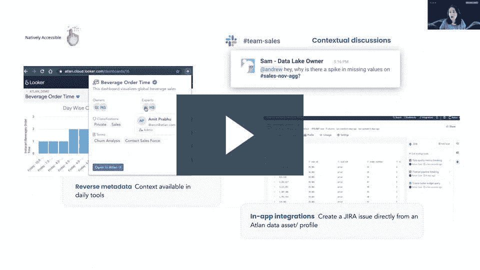
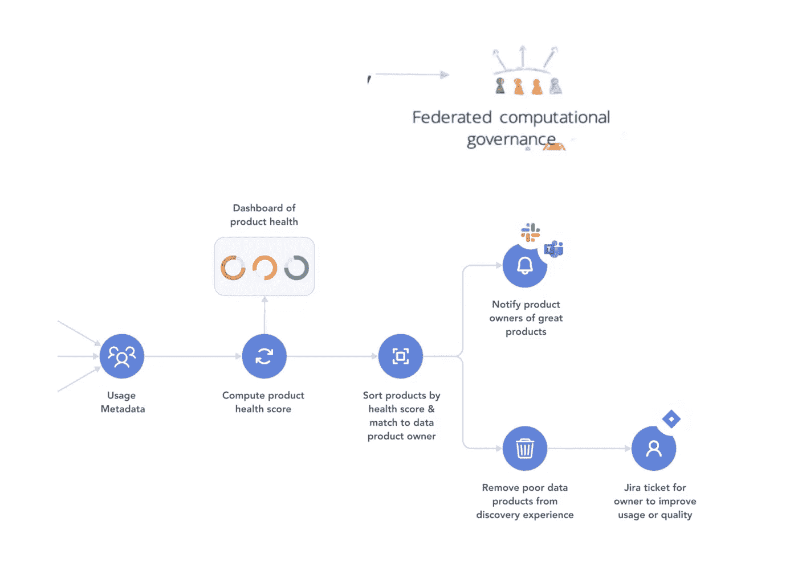
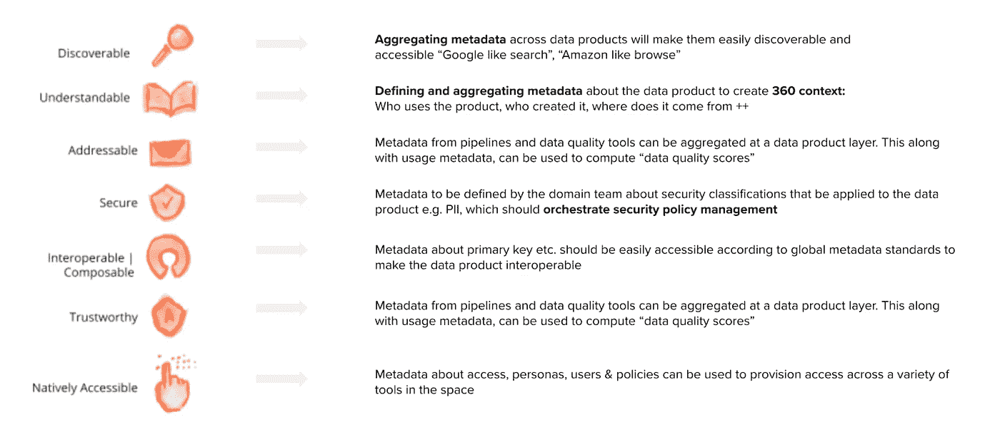

# 数据网格需要的元数据基础

> 原文：<https://towardsdatascience.com/the-metadata-foundation-that-your-data-mesh-needs-9a1be28c5da6>

## 激活你的元数据是如何驱动数据网格梦想的

*作者图片，来自我在 Datanova 2022:数据网格峰会上的演讲*

可发现的。可以理解。值得信赖。这些只是数据网格基础设施的一些关键思想。浏览它们，你会很快发现实现每一个目标的关键元素——元数据。

今天，元数据变成了大数据。现代数据堆栈的每个组件和其上的每个用户交互都会生成元数据。毫不夸张地说，元数据的潜力是巨大的。事实上，我认为这是开启数据网格真正价值的关键。

然而，元数据——就像数据网格一样——还需要成长。任何从业者都知道，元数据的大小和规模的爆炸使得数据团队很难实际使用它。很多时候，它在另一个孤立的工具中没有被使用。

我是一名终生的数据从业者，花了十年时间管理数据团队，建立了伟大的数据文化。我有过无数次失败，也有过一些成功，比如建立印度的国家数据平台。一路上，我处理了大量的混乱，这促使我的团队开发工具，使我们更加敏捷。四次尝试之后，我们构建了一个[**活动元数据平台**](https://atlan.com/) ，真正改变了我们的工作方式。

我有机会出席了 [Datanova 2022:数据网格峰会](https://www.starburst.io/learn/events-webinars/datanova/video/?wistia=c0d9ol4dmr)，这是 Starburst 的第二次年度会议。我分享了我对现代元数据的想法，它在我们的数据堆栈中的不足之处，以及我们如何使用它来推动数据网格梦想。我捕捉到了以下要点。

观看我在 *Datanova 2022:数据网格峰会上的演讲录音。(视频由* [*星爆*](https://www.starburst.io/) *)*

# **什么不起作用**

如今元数据的使用方式是完全错误的。我们从一堆独立的、孤立的工具中编译我们所有的元数据，并把它放在它自己的孤立的数据目录或治理工具中。我们希望数据从业者在需要上下文时切换回目录工具，但这并不可行。

> 当用户需要的时候，他们想要他们所在的地方的上下文。

当某人处于日常工作流程中时，例如查看 BI 工具上的仪表板，他们需要知道是否可以信任该仪表板，就在此时此地，而不是在切换并登录到他们的数据目录、搜索相关数据资产并找出它们上次更新的时间之后。

我们当前元数据方法的另一个问题是，它对每个数据人一视同仁。我们都习惯了日常生活中难以置信的个性化体验——想想网飞的策展或亚马逊的推荐就知道了。今天的数据平台拥有大量关于用户的数据，比如首席技术官在周一早上运行的搜索，或者数据工程师在他们的管道中最常用的资产。为什么我们不利用这些数据为不同领域的不同人提供个性化的数据体验呢？

最后，今天的元数据大多存在于自顶向下的治理模型中。大多数数据治理工具都是为集中式治理结构构建的，由“委员会”制定规则和政策。这与自下而上、民主化的数据网格世界相反。

# **元数据的未来**

花点时间想象一下你日常生活中的经历。您可以使用 Segment 来完成过去需要大量人工完成的工作，从数十个网站、应用程序和工具中获取客户数据。然后 Zapier 采取行动，使这些信息具有可操作性——如果一个工具发生了什么，它会触发其他工具的一系列操作。当你退出这些工具回家后，你打开网飞，在那里他们策划了最新的节目，甚至根据你想看的内容创造了一些新的节目。

> 为什么我们不能在我们的数据平台上实现这一点呢？

真正智能的数据管理系统应该考虑最终用户及其需求。**它将使用元数据自然地联合和管理我们的数据系统——为围绕当今多样化数据用户构建的自动化、个性化体验提供动力。**

它应该围绕诸如“数据分析师的体验是什么样的？营销或销售的数据分析师怎么样？这与数据工程师或业务用户的体验有何不同？”然后，我们可以将这种个性化和知识反馈到数据人员每天使用的工具和体验中，如吉拉、Slack 和微软团队。

**例如，想象你在你的 Looker 仪表盘中，在那里你可以看到来自你的数据生态系统中的其他工具的所有上下文。您可以立即了解谁是所有者和专家，您是否可以信任仪表板，以及驱动它的管道是否已更新。**这是数据变得“本机可访问”的时候，这是数据网格最重要的目标之一。

# **元数据和数据网格**

数据网格背后的一个关键概念是[联合计算治理](https://blog.starburst.io/data-mesh-federated-computational-governance)，或者是一个使用反馈循环和来自整个组织的自下而上的输入来自然地联合和治理数据产品的系统。元数据使这成为可能。

*用于发现和管理数据产品健康的自动化工作流(图片由作者提供，来自我在 Datanova 2022:数据网格峰会上的演讲)*

例如，考虑上面的自动化元数据工作流。有了关于人们实际使用什么资产的使用元数据，我们就可以创建一个关于每个数据产品被使用和更新了多少的产品健康得分。然后，我们可以根据健康得分对产品进行分类，并将每个产品与其数据产品所有者进行匹配。对于伟大的产品，产品负责人可以得到一条 Slack 消息:“恭喜！你的数据产品做得很好。”低质量或过时的产品可以自动从发现体验中删除或弃用，并且可以在吉拉上为相关所有者添加改进产品的标签。

> 这就是我所看到的数据网格的未来— **使用元数据创建一个真正的动作层，为数据网格背后的基本概念提供动力。**

通过从许多不同的地方引入元数据，我们可以自动化和编排数据网格背后的基本概念，如民主化、可发现性、信任、安全性和可访问性。

# **实践中的元数据**

到目前为止，我相信您会问，“在数据网格中真正实现主动元数据实践意味着什么？”

元数据允许您从孤立的环境转变为嵌入的环境(域)，从一般化的体验转变为个性化的体验(数据产品)，从最小的自动化转变为真正的自治(自助服务基础设施)，从自顶向下的治理转变为民主化的治理(联合计算治理)。

但是从理论到实践的第一步是什么呢？创建数据产品运输标准。我已经谈到了“数据作为产品”的特征，这是数据网格背后的一个关键概念。其中的每一项都可以在组织或网格级别上编入运输标准。

*数据网格背后的关键概念“数据作为产品”的特征(图片由作者提供，来自我在 Datanova 2022:数据网格峰会上的演讲)*

例如，对于“可理解的”，我已经看到很多使用 [5W1H 框架](/data-documentation-woes-heres-a-framework-6aba8f20626c)来定义什么使得数据产品可理解的成功案例。作为一个组织，您可以选择框架中最重要的元素并关注它们。

下一步是完全自动化这些过程。这使得基础设施成为真正的自助服务，这是数据网格范式的重要组成部分。例如，为了使数据产品易于理解，您可以从整个数据堆栈中引入上下文。解析 SQL 日志可用于在列级别自动对每个数据产品的流行度进行排名。来自数据管道的上下文可用于根据数据产品的来源创建列描述。

这一步可能需要实现新的工具来促进它，但归根结底，数据网格是一种文化和思维方式的转变。这就是为什么最后一个重要步骤是将人为驱动的标准和仪式纳入产品运输流程。

> 在一天结束的时候，你要求你的工程师和开发人员开始以不同的方式思考他们的角色，这并不容易。

这关乎文化变革，而不仅仅是科技。设定您的数据团队的价值观(例如可重用性)，创建仪式来帮助每个人实现它们(例如文档小时)，您最终会看到人们的心态和生产力的真正转变。

总而言之，很明显，数据网格的未来是光明的。关于这个主题的更多想法，请查看我在 Datanova 2022:数据网格峰会上的演讲全文。

**本博客最初发表在** [**星爆的博客**](https://bit.ly/3xNJMS6) **上，经许可在此转载。**

**觉得这个内容有帮助？在我的时事通讯《元数据周刊》上，我每周都写关于活动元数据、数据操作、数据文化和我们的学习建设的文章。** [**在此订阅。**](https://metadataweekly.substack.com/)